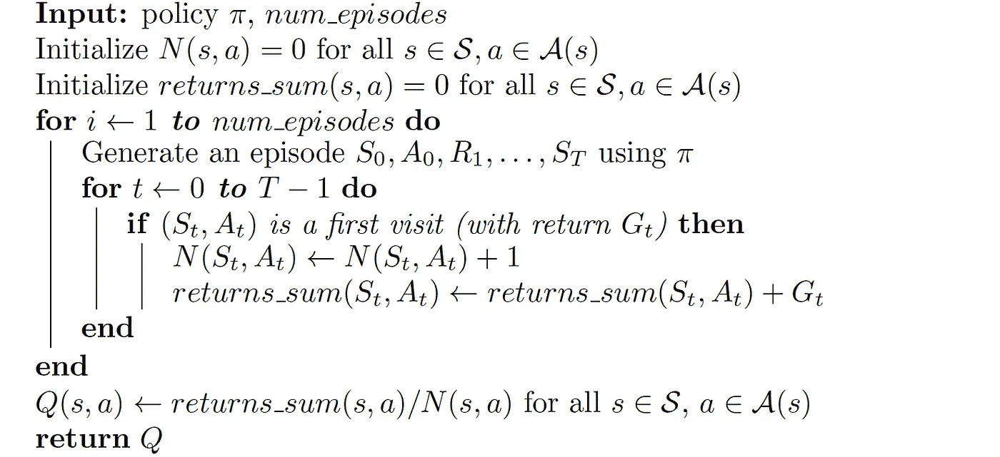
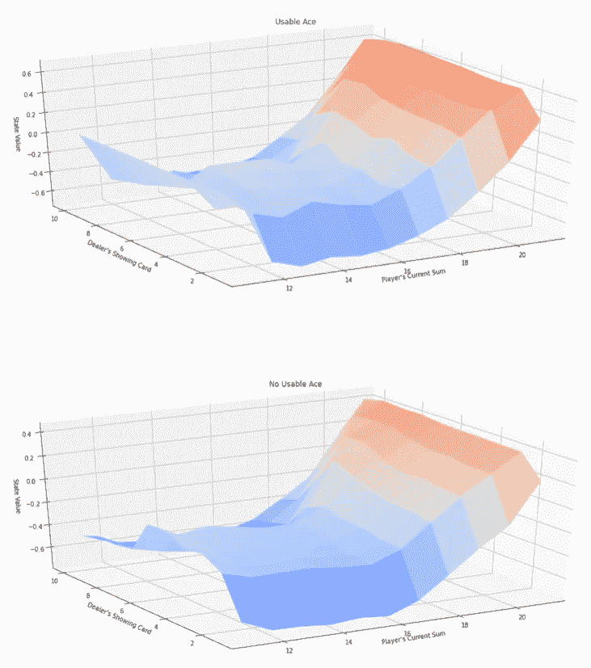
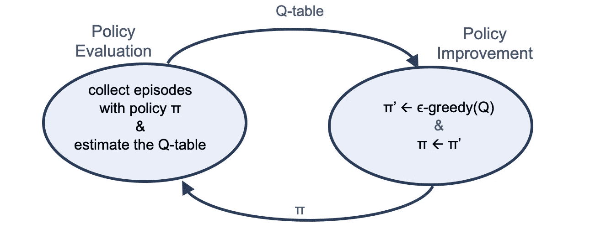
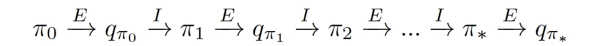

# 蒙特卡罗方法

> 原文：<https://towardsdatascience.com/monte-carlo-methods-9b289f030c2e?source=collection_archive---------13----------------------->

## [深度强化学习讲解— 13](https://towardsdatascience.com/tagged/deep-r-l-explained)

## 探索-解释困境


在*[*深度强化学习讲解*](/value-iteration-for-q-function-ac9e508d85bd)*系列的这篇新帖中，我们将介绍另一种经典的强化学习方法来估计一个策略π的值。最直接的方法是运行几集，收集数百条轨迹，然后计算每个州的平均值。这种估计价值函数的方法叫做**蒙特卡罗预测** (MC)。**

**在本帖中，我们还将介绍如何评估最优策略和**勘探-开采困境**。**

> **[本出版物的西班牙语版本](https://medium.com/aprendizaje-por-refuerzo/5-evaluaci%C3%B3n-de-pol%C3%ADticas-con-monte-carlo-a6d70d1db7d4)**

**[](https://medium.com/aprendizaje-por-refuerzo/5-evaluaci%C3%B3n-de-pol%C3%ADticas-con-monte-carlo-a6d70d1db7d4) [## 5.蒙特卡洛政治评估

### 请访问第 5 页的自由介绍

medium.com](https://medium.com/aprendizaje-por-refuerzo/5-evaluaci%C3%B3n-de-pol%C3%ADticas-con-monte-carlo-a6d70d1db7d4) 

# 蒙特卡洛与动态规划

在本系列的第 1 部分中，我们介绍了一种 MDP 的解决方案，称为动态编程，由理查德·贝尔曼首创。记住，贝尔曼方程允许我们递归地定义值函数，并且可以用值迭代算法求解。总而言之，动态编程为强化学习提供了基础，但我们需要在每次迭代中循环遍历所有状态(它们的大小可以呈指数级增长，状态空间可以非常大，也可以无限大)。动态编程还需要环境的模型，特别是知道状态转移概率*p(s′，r|s，a)* 。

相比之下，蒙特卡罗方法都是从经验中学习。任何期望值都可以通过样本均值来近似——换句话说，我们需要做的就是播放一堆剧集，收集回报，然后取平均值。蒙特卡罗方法实际上是基本算法的一组替代方案。这些仅适用于偶发任务，当代理遇到终止状态时，交互停止。也就是说，我们假设体验被分成几集，并且不管选择什么动作，所有的集最终都会终止。

> 重要的是要注意，蒙特卡罗方法只给我们遇到的状态和动作一个值，如果我们从未遇到一个状态，它的值是未知的。

# 蒙特卡罗方法

> 这篇文章将提供一个用于强化学习的蒙特卡罗的实用方法。关于这些方法的更正式的解释，我邀请读者阅读理查德·萨顿和安德鲁·巴尔托的教科书 [**强化学习:简介**](http://www.incompleteideas.net/book/the-book-2nd.html) 的第五章。

回想一下，**最优策略****【π∫**规定了，对于每个环境状态*，代理应该如何选择一个行动*来实现其最大化报酬*的目标。我们还了解到，代理可以通过首先估计**最优行动值函数***q*∑来构建对最优策略的搜索；那么一旦*q*∫已知，就很快得到*π*∫。***

**代理开始采取一个基本策略，像等概率随机策略**，**一个随机策略，代理从每个状态中随机选择一组可用的动作，每个动作以等概率被选择。代理使用当前策略π将与环境交互以收集一些情节，然后合并结果以得出更好的策略。**

**方法是用一个我们称之为 **Q 表**的表来估算动作值函数。蒙特卡罗方法中的这个核心表为每个状态提供了一行，为每个动作提供了一列。对应于状态 *s* 和动作 *a* 的条目表示为 *Q* ( *s* ， *a* )。**

**我们称之为预测问题:*给定一个策略，代理如何估计该策略的价值函数？*。我们将预测问题的蒙特卡罗(MC)方法称为 **MC 预测方法**。**

> **我们将把我们的解释集中于动作值函数 Q，但是 MC 也可以用于估计状态值函数 v。**

**在用于 MC 预测的算法中，我们通过收集策略的许多片段开始。然后，我们注意到 Q 表中的每个条目对应于一个特定的状态和动作。为了填充 Q-table 的一个条目，我们使用当代理处于那个状态并选择动作时跟随的返回。**

**我们将一集中状态的每次出现定义为对该状态-动作对的**访问**。在一集里，一个状态-动作对可能被访问不止一次。这导致我们有两个版本的 MC 预测算法:**

*   ****每次访问 MC 预测**:在所有事件中，对每个状态-动作对的所有访问后的回报进行平均。**
*   ****初访 MC 预测**:每一集，我们只考虑初访状态-动作对。**

**首次访问方法和每次访问都被认为是保证收敛到真正的行动价值函数。**

**在本帖中，我们将对 OpenAI 健身房的工作示例进行首次访问:[21 点环境](https://github.com/openai/gym/blob/master/gym/envs/toy_text/blackjack.py)。但是实际上，在这个例子中，首次访问和每次访问 MC 返回相同的结果。注意，同一个状态不会在一个情节中重复出现，所以在首次访问和每次访问 MC 方法之间没有区别。首次就诊 MC 预测的伪代码如下:**

****

**在这个伪代码中，变量 *num* _ *剧集*表示代理收集的剧集数，有三个相关的表格:**

*   ***Q* :一个 Q 表，每个状态一行，每个动作一列。**
*   ***N* :记录我们对每个状态-动作对的第一次访问次数的表格。**
*   ***returns* _ *sum:一个*表，记录第一次访问每个状态-动作对后获得的奖励的总和。**

**在每一集之后， *N* 和*返回* _ *sum* 表被更新以存储该集包含的信息。在收集了所有剧集之后，完成对*Q(**Q 表)的最终估计。***

# ***案例研究:21 点***

***为了更好地理解蒙特卡罗在实践中是如何工作的，让我们使用 OpenAI 的健身房环境`Blackjack-v0`对 21 点游戏执行一步一步的编码。***

## ***二十一点规则***

***首先，让我们定义游戏的规则和条件:***

*   ***流行的赌场纸牌游戏 21 点的目标是获得数值总和尽可能大而不超过 21 的纸牌。超过 21 导致破产，而双方都有 21 导致平局。***
*   ***我们考虑一个简化的版本，其中每个玩家独立地与庄家竞争。这意味着我们将只和庄家对打，没有其他玩家参与。***
*   ***数字卡的价值是按面值计算的。牌 J、K 和 Q 的值是 10。ace 的值可以是 1 或 11，取决于玩家的选择。***
*   ***双方，玩家和庄家，都有两张牌。玩家的两张牌面朝上，而庄家的一张牌面朝上。在玩家看到他们的牌和庄家的第一张牌后，玩家可以选择击打或站立，直到他对自己的总和感到满意，之后他将站立。***
*   ***然后，发牌者展示他们的第二张牌——如果总数小于 17，他们将继续抽牌，直到达到 17，之后他们将站着。***

## ***开放式健身房:21 点环境***

***我们将使用 OpenAI 的健身房环境`[Blackjack-v0](https://github.com/openai/gym/blob/master/gym/envs/toy_text/blackjack.py)`。每个状态是一个三元组:***

*   ***玩家目前的总和∈{0，1，…，31}***
*   ***庄家的面朝上的牌∈{1，…，10}***
*   ***无论玩家是否有可用的 a。***

***代理有两个潜在的操作:***

*   ****棍*(动作`0`):不再取牌(也称“立”或“留”)。***
*   ***击*(动作`1`):从庄家那里再拿一张牌。**

**21 点的每一局都是一集。赢、输和抽牌的奖励分别为+1、1 和 0。一个游戏内所有奖励都是 0，我们不打折(gamma = 1)；因此，这些最终的回报也是回报。**

> **这篇文章的全部代码可以在 GitHub 上找到，而[可以通过这个链接作为一个谷歌笔记本来运行。](https://colab.research.google.com/github/jorditorresBCN/Deep-Reinforcement-Learning-Explained/blob/master/DRL_13_Monte_Carlo.ipynb)**

**我们从导入必要的包开始:**

```
**import sys
import gym
import numpy as np
from collections import defaultdictenv = gym.make('Blackjack-v0')
print(env.observation_space)
print(env.action_space)**
```

**我们可以看到，在环境中有 704 种不同的状态，对应于 32 乘以 11 乘以 2，并且有两种可能的动作对应于选择坚持或击打:**

```
**Tuple(Discrete(32), Discrete(11), Discrete(2)) 
Discrete(2)**
```

**为了在每集的每个时间步骤中查看示例游戏，代理与环境进行交互，我们可以运行以下代码(多次):**

```
**state = env.reset()
while True:
       print(state)
       action = env.action_space.sample()
       state, reward, done, info = env.step(action)
       if done:
          if reward > 0: 
             print('Reward: ', reward, '(Player won)\n')
          else: 
             print('Reward: ', reward, '(Player lost)\n')
          break**
```

**示例游戏的一个例子是:**

```
**(21, 4, True) 
(13, 4, False) 
(14, 4, False) 
Reward:  -1.0**
```

**经纪人输掉比赛的地方。我建议读者运行这段代码几次，看看不同的剧本。**

# **一种简单的 MC 预测方法实现**

**考虑这样一个策略，玩家只根据她/他当前的分数来决定一个动作。例如，如果我们拥有的卡的总数是 18 或更少，我们认为如果我们要求一辆新的汽车可能是没问题的。我们有 75%的可能性做到这一点。如果卡的总数大于 18，我们认为接受一张新卡太危险了，我们不会以 75%的概率这样做。**

**总之，如果总和大于 18，我们以 75%的概率选择动作*棒*;并且，如果总和等于或小于 18，我们选择动作*以 75%的概率命中*。**

**请注意，在第一种策略中，我们忽略了状态中的一些信息，例如，庄家的面朝上的牌或我们是否有可用的 a。这是为了简化示例中一段重点代码的解释。以下函数`generate_episode`使用该策略对情节进行采样:**

```
**def generate_episode(env):
    episode = []
    state = env.reset() 
    while True:
        probs = [0.75, 0.25] if state[0] > 18 else [0.25, 0.75]
        action = np.random.choice(np.arange(2), p=probs)
        next_state, reward, done, info = env.step(action)
        episode.append((state, action, reward))
        state = next_state
        if done:
           break
        return episode**
```

**这段代码返回一个`episode`(使用策略 **π** 决定)作为元组的(状态、动作、回报)元组列表。`episode[i][0]`、`episode[i][1]`、`episode[i][2]`分别对应时步𝑖的状态、时步 *i* 的动作、时步 *𝑖+1* 的奖励。**

**为了玩(10 个游戏)，我们可以如下执行前面的功能:**

```
**for i in range(10):
    print(generate_episode(env))**
```

**输出将是(在我的运行中):**

```
**[((19, 3, True), 1, 0.0), ((19, 3, False), 0, 1.0)] 
[((14, 5, False), 1, -1.0)] 
[((15, 10, False), 0, -1.0)] 
[((15, 10, False), 1, 0.0), ((17, 10, False), 1, -1.0)] 
[((13, 2, False), 1, -1.0)] 
[((13, 4, False), 1, 0.0), ((14, 4, False), 0, -1.0)] 
[((11, 10, False), 1, 0.0), ((21, 10, False), 0, 0.0)] 
[((15, 10, False), 1, -1.0)] 
[((9, 9, False), 1, 0.0), ((16, 9, False), 0, 1.0)] 
[((13, 7, False), 1, 0.0), ((18, 7, False), 1, 0.0), ((21, 7, False), 1, -1.0)]**
```

**奖励只有在游戏结束时才会收到，如果我们赢了就是`1.0`，如果我们输了就是`-1.0`。我们看到有时我们赢了，有时我们输了。**

**让我们开始根据前面的伪代码编写一个代码。首先，我们需要初始化字典`N`、`return_sum`和`Q`:**

```
**N = defaultdict(lambda: np.zeros(env.action_space.n))
returns_sum = defaultdict(lambda: np.zeros(env.action_space.n))
Q = defaultdict(lambda: np.zeros(env.action_space.n))**
```

**接下来，该算法在使用所提供的使用该策略的函数`generate_episode`生成的剧集上循环。每一集都将是状态、动作和奖励元组的列表。然后，我们使用 zip 命令将状态、动作和奖励分成不同的量:**

```
**episode = generate_episode(env)
states, actions, rewards = zip(*episode)**
```

**让我们回到 de 伪代码，看看我们在时间步长上循环，查看每个时间步长对应的状态动作对。如果这是我们第一次访问该对，我们将表`N`的相应位置增加 1，并将此时步的返回添加到表`return_sum`的相应条目中。**

**请记住，在这个 21 点的例子中，第一次访问和每次访问 MC 预测是等效的，因此我们将对每个时间步长进行更新。然后，一旦我们有了`return_sum`和`N`的相应更新值，我们就可以用它们来更新我们的`Q`估算表。这部分的代码如下:**

```
**discounts = np.array([gamma**i for i in range(len(rewards)+1)])for i, state in enumerate(states):
    returns_sum[state][actions[i]] += 
               sum(rewards[i:]*discounts[:-(1+i)])
    N[state][actions[i]] += 1.0
    Q[state][actions[i]] = returns_sum[state][actions[i]] 
               / N[state][actions[i]]**
```

**我们的 MC 预测方法的完整代码如下:**

```
**def mc_prediction(env, num_episodes, generate_episode, gamma=1.0):

   returns_sum = defaultdict(lambda: np.zeros(env.action_space.n))
   N = defaultdict(lambda: np.zeros(env.action_space.n))
   Q = defaultdict(lambda: np.zeros(env.action_space.n))for episode in range(1, num_episodes+1):
      episode = generate_episode(env)
      states, actions, rewards = zip(*episode)discounts = np.array([gamma**i for i in 
                           range(len(rewards)+1)])for i, state in enumerate(states):
             returns_sum[state][actions[i]] += 
                        sum(rewards[i:]*discounts[:-(1+i)])
             N[state][actions[i]] += 1.0
             Q[state][actions[i]] = returns_sum[state][actions[i]] 
                      / N[state][actions[i]]
   return Q**
```

**该算法将 OpenAI 健身房环境的实例、生成的剧集数量以及折扣率(默认值`1`)作为参数。该算法返回作为输出的 Q 表(动作值函数的估计)，一个字典(一维数组)。**

**绘制相应的状态值函数，看看哪些状态值更大，会很有意思。我们可以使用这个简单的代码从 Q-table 中完成，它通过根据我们如何定义问题来加权每个动作的值来获得状态的值:**

```
**num_episodes=1000000Q = mc_prediction(env, num_episodes, generate_episode)State_Value_table={}
for state, actions in Q.items():
           State_Value_table[state]= 
                 (state[0]>18)*(np.dot([0.75, 0.25],actions)) +
                 (state[0]<=18)*(np.dot([0.75, 0.25],actions))**
```

**我们可以用从 Udacity 借来的代码[来绘制这个图。有两个图对应于我们是否有可用的 a 或者我们没有可用的 a。但是在这两种情况下，我们看到最高的状态值对应于当玩家和是 20 或 21 的时候，这看起来很明显，因为在这种情况下我们最有可能赢得游戏。](https://github.com/udacity/deep-reinforcement-learning/blob/master/monte-carlo/plot_utils.py)**

****

**(来源:作者)**

# **探索与开发**

**到目前为止，我们已经了解了一个代理如何采用一个像等概率随机策略这样的策略，使用它来与环境交互，然后使用该经验来填充相应的 Q 表，该 Q 表成为该策略的动作值函数的估计。所以，现在的问题是，我们如何利用这一点来寻找最优策略？**

## **贪婪的政策**

**为了得到一个更好的政策，不一定是最优的，我们只需要为每个状态选择最大化 Q 表的行动。让我们称这个新政策为**【π】**。当我们拿一个 Q 表，并使用最大化每一行 **的动作**来提出策略**时，我们说我们正在构建关于 Q 表的**贪婪**的策略。****

**通常将所选动作称为**贪婪动作**。在有限 MDP 的情况下，作用值函数估计用 Q 表表示。然后，为了得到贪婪动作，对于表中的每一行，我们只需要选择对应于最大化该行的列的动作。**

## **ε-贪婪政策**

**然而，不是总是构造一个贪婪策略(总是选择贪婪动作),而是构造一个所谓的**ε贪婪策略**,它最有可能选择贪婪动作，但也有很小但非零的概率选择其他动作。在这种情况下，使用一定在零和一之间的某个小正数ε*ϵ*。这是有动机的，正如我们将在后面更详细地解释的那样，由于代理必须找到一种方法来平衡基于他们当前知识的最佳行为的驱动和获取知识以获得更好的未来行为的需要。**

## **蒙特卡洛控制**

**我们已经了解了代理如何采用策略 *π* ，使用它与环境进行多次交互，然后使用结果通过 Q 表来估计动作值函数。一旦 q 表非常接近动作值函数，代理就可以构造策略 *π* ，即*ϵ*——相对于 q 表是贪婪的，这将产生比原始策略 *π* 更好的策略。然后我们可以改进这个策略，把它变成ϵ的贪婪策略。**

**因此，如果代理人在这两个步骤之间反复交替，直到我们得到越来越好的策略，希望我们收敛到最优策略，我们最终会得到最优策略*π*∫:**

*   ****步骤 1** :使用策略 *π* 构建 Q 表，以及**
*   ****第二步**:将策略修改为*ϵ*——贪婪关于 q 表(标注为*)。***

***只要我们运行足够长的时间，这个被提议的算法是如此接近给我们最优策略。***

***我们把这种算法称为**蒙特卡罗控制方法**，用来估计最优策略。通常将**步骤 1** 称为**策略评估**，因为它用于确定策略的动作**值**函数。同样，由于**步骤 2** 用于**改进**策略，我们也将其称为**策略改进**步骤。示意性地，我们可以将其表示为:***

******

***因此，使用这个新术语，我们可以总结出，我们的**蒙特卡罗控制方法**在**策略评估**和**策略改进**步骤之间交替进行，以找到最优策略π∫:***

******

***其中箭头中的“E”表示完整的政策评估,“I”表示完整的政策改进。在下一篇文章中，我们将展示蒙特卡罗控制算法的实现。***

***然而，一些问题出现了，在构造 *ϵ* 贪婪策略时，如何设置 *ϵ* 的值？在下一节中，我们将看到如何实现。***

# **勘探开发困境**

**回想一下，我们的代理最初不知道环境的动态，由于目标是最大化回报，代理必须通过交互来了解环境。然后，在每一个时间步，当代理选择一个动作时，它根据过去对环境的经验作出决定。而且，本能可能是选择基于过去经验的**的行动，将获得最大回报。正如我们在上一节中所讨论的，这种对动作值函数估计贪婪的策略很容易导致收敛到次优策略。****

## ***平衡开发与勘探***

***这可能会发生，因为在早期，代理人的知识非常有限，并拒绝考虑就未来回报而言比已知行为更好的非贪婪行为。这意味着一个成功的代理人不可能在每个时间点都贪婪地行动；相反，为了发现最优策略，它必须继续改进所有状态-动作对的估计回报。但同时保持一定程度的贪婪行动，以尽快维持回报最大化的目标。这激发了我们之前提出的ϵ贪婪政策的想法。***

***我们将平衡这两个竞争需求的需求称为**探索-开发困境**，其中代理必须找到一种方法来平衡基于其当前知识的最佳行为驱动(**开发**)和获取知识以获得更好判断的需求(**探索**)。***

## ***设置ε的值***

***这种困境的一个潜在解决方案是通过在构建 *ϵ* 贪婪策略时逐渐修改 *ϵ* 的值来实现的。对于代理人来说，通过选择**探索**而不是**开发**尝试各种策略来最大化回报，开始与环境的互动是有意义的。考虑到这一点，最好的开始策略是等概率随机策略，因为它同样有可能探索每个状态的所有可能行为。设置 *ϵ* =1 产生一个*ϵ*-贪婪策略，它等价于等概率随机策略。***

**在随后的时间步骤中，促进**开发**而不是**勘探**是有意义的，在这种情况下，政策相对于行动价值函数估计逐渐变得更加贪婪。设置 *ϵ* =0 产生贪婪策略。已经表明，最初倾向于通过开发进行勘探，并逐渐倾向于开发而不是勘探是一种最佳策略。**

**为了保证 MC 控制收敛到最优策略*π*∑，我们需要保证满足两个条件:每个状态-动作对被访问无限多次，并且该策略收敛到关于动作-值函数估计 *Q 的贪婪策略*我们将这些条件称为**无限探索极限中的贪婪**以确保代理在所有时间步继续探索，并且代理逐渐探索更多和探索更少。**

**满足这些条件的一种方法是修改 *ϵ* 的值，当指定 *ϵ* 贪婪策略时，使其逐渐衰减。然而，在设定 *ϵ.的衰减率时必须非常小心*确定最佳衰变不是小事，需要一点炼金术，也就是经验。我们将在下一篇文章中看到实现的例子。**

# **下一步是什么？**

**到目前为止，在我们当前的蒙特卡罗控制算法中，我们收集了大量的片段来构建 Q 表。然后，在 Q 表中的值收敛之后，我们使用该表来提出改进的策略。然而，蒙特卡罗预测方法**可以在逐集的基础上逐步实施**。[在下一篇文章](/mc-control-methods-50c018271553)中，我们将介绍如何按照这个想法构建更好的 MC 控制算法。下期帖子再见！**** 

# **深度强化学习讲解系列**

****由** [**UPC 巴塞罗那理工大学**](https://www.upc.edu/en) **和** [**巴塞罗那超级计算中心**](https://www.bsc.es/)**

**一个轻松的介绍性[系列](https://torres.ai/deep-reinforcement-learning-explained-series/)以一种实用的方式逐渐向读者介绍这项令人兴奋的技术，它是人工智能领域最新突破性进展的真正推动者。**

**[](https://torres.ai/deep-reinforcement-learning-explained-series/) [## 深度强化学习解释-乔迪托雷斯。人工智能

### 本系列的内容](https://torres.ai/deep-reinforcement-learning-explained-series/) 

# 关于这个系列

我在五月开始写这个系列，在巴塞罗那的**封锁期。**老实说，由于封锁，在业余时间写这些帖子帮助了我 [**#StayAtHome**](https://twitter.com/hashtag/StayAtHome?src=hashtag_click) 。感谢您当年阅读这份刊物；它证明了我所做的努力。

**免责声明** —这些帖子是在巴塞罗纳封锁期间写的，目的是分散个人注意力和传播科学知识，以防对某人有所帮助，但不是为了成为 DRL 地区的学术参考文献。如果读者需要更严谨的文档，本系列的最后一篇文章提供了大量的学术资源和书籍供读者参考。作者意识到这一系列的帖子可能包含一些错误，如果目的是一个学术文件，则需要对英文文本进行修订以改进它。但是，尽管作者想提高内容的数量和质量，他的职业承诺并没有留给他这样做的自由时间。然而，作者同意提炼所有那些读者可以尽快报告的错误。**