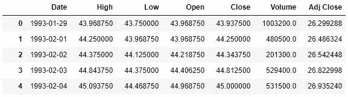
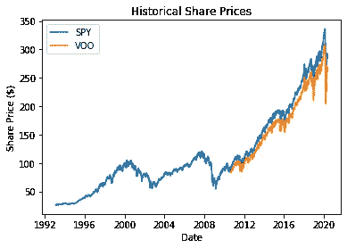
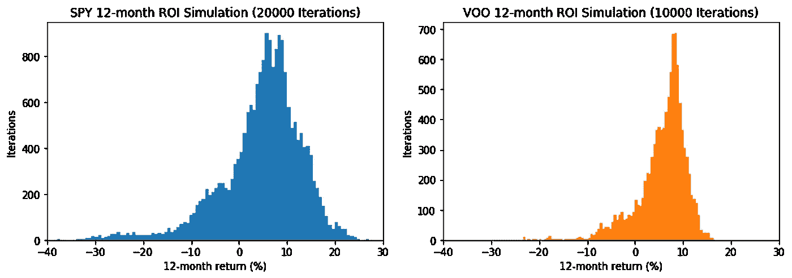
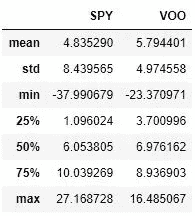
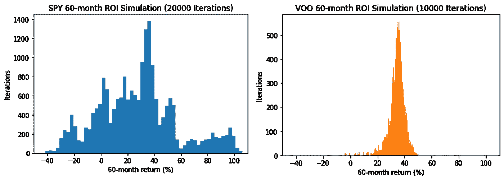
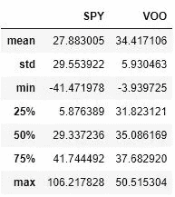

# 采用美元成本平均法的蒙特卡罗模拟

> 原文：<https://towardsdatascience.com/monte-carlo-simulation-with-dollar-cost-averaging-653ae47ec7d5?source=collection_archive---------26----------------------->

艾萨克·史密斯在 [Unsplash](https://unsplash.com?utm_source=medium&utm_medium=referral) 上拍摄的照片

## 利用 Python 中的蒙特卡罗模拟分析标准普尔 500 ROI

*声明:我不是金融专业人士。此处提供的内容仅用于信息、教育和娱乐目的，不应被解释为专业的财务建议。*

从我完成研究生学业开始我在分析领域的新事业已经有几个月了。在我拿到最初的几份工资后，我开始思考如何更明智地使用每月支付费用后剩余的现金，因为把它留在利息为 0.01%的支票账户上似乎有点乏味。经过一番研究后，我决定为什么不把它投入股市，至少可以跟上通货膨胀，这样我就可以将美元成本平均到标准普尔 500 交易所交易基金(ETF)中了。

美元成本平均法(DCA)是一种常见的投资策略，其中固定金额的资本定期投资于某项资产，以减少市场波动的影响。这种策略与 ETF 完美契合了我的需求，因为它是自动多样化的，不需要多少市场知识。

在我把辛苦赚来的钱投入股市之前，我想我应该好好利用我的分析学位所获得的新知识。我决定在 ETF 上用 Python 实现一个简单的蒙特卡罗(MC)模拟，看看 DCA 的表现如何。通过 MC 模拟，我可以在对历史数据进行重复随机采样后，获得预期投资回报(ROI)的分布。

# 数据

为了做到这一点，我研究了两个最受欢迎的基金，SPDR 标准普尔 500 ETF 信托基金(SPY)和先锋标准普尔 500 ETF (VOO)。我从雅虎上下载了这些数据。财务，从开始日期到当前日期的所有日期。模拟中使用的两个关键变量是交易日和每个交易日结束时的调整收盘价(因为收盘价不包括股息)。没有考虑成交量和日内价格。

间谍数据帧的前五行

通过快速绘制数据，我注意到曲线的形状几乎相同(这是意料之中的，因为它们跟踪的是相同的股票)。间谍存在的时间也是 VOO 的两倍多，在过去的三月里，大概是由于新冠肺炎·疫情的原因，它的大量减少非常明显。

幸运的是，我不必为这个简单的时间序列做任何数据清理，所以我们可以直接进行模拟。

# 仿真法

构成 MC 模拟的主要组件是过程、常量变量、随机变量和样本大小。在这种情况下:

*   **流程:** DCA 在 12 个月内每个日历月进行一次间谍和 VOO
*   **恒定变量:**每月 1000 美元投资
*   **随机变量:**选择一个连续 12 个月的时间段和每个日历月一次的购买日期
*   **样本量:** 20，000 次(间谍)和 10，000 次(VOO)迭代

模拟开始时，银行里有 1000 美元作为第一个月的购买力，在股票存在的范围内随机选择 12 个月的时间，间谍从 1993 年到 2020 年，VOO 从 2010 年到 2020 年。在随机过程生成器中，允许 12 个月的周期从一年开始，到下一年结束。所有随机过程发生器都运行在均匀分布上。

对于所选日期范围内的每个月，从历史数据中随机选择该月的一个日期作为购买日期。日期随股价而定，用可获得的购买力购买最大数量的股票。除了每月 1000 美元的新收入外，剩余的购买力会滚动到下个月。

在 12 个月的期间内，每个月都重复该过程的这一阶段，以创建一个样本。整个过程对于 SPY 重复 20，000 次，对于 VOO 重复 10，000 次。

每个数据点都在一个循环函数中计算并存储在 Python 中。请查看我在 [GitHub](https://github.com/matchin/monte_carlo_dca) 上的代码了解更多细节。

注意:SPY 中的额外迭代是为了说明其更长的存在时间(需要更多的样本来收敛到总体均值)。

# 结果

在对间谍和 VOO 进行模拟后，可以计算出每个样本从第 1 个月到第 12 个月的年投资回报率，从而得出样本分布。当我们可视化结果时，我们看到一致的分布，稍微偏向负回报，中心在 6–7%的年回报。SPY 中的分布更加广泛，偏离平均值更多，这可能来自 VOO 没有的 1993 年至 2010 年间的额外数据。

间谍和 12 个月投资回报样本分布

12 个月回报统计

无论某人投资哪只 ETF，都有 75%的机会获得至少 1%的回报，这已经是 0.01%利息支票账户的 100 倍。更妙的是，SPY 的最高回报是 27%(虽然概率很低)！

出于好奇，我还对输入进行了一些调整，并模拟了 60 个月的 ROI，以观察它的表现。间谍变得不那么一致，变得更加多变，而 VOO 没有太大变化。

间谍和 VOO 的 60 个月投资回报样本分布

60 个月退货统计

在 5 年的时间里，投资者可以预期获得 30%左右的平均回报。最好的情况是，一项投资可能会因为间谍而翻倍，或者在最坏的情况下损失 40%。

# 结论

根据这一分析，每月随机选择一天用 DCA 将钱投入标准普尔 500 ETF，几乎肯定比把钱留在支票账户要好。与任何投资一样，风险越高，回报也越高。正如我们在这里看到的，平均 12 个月的投资回报率为 6–7%也有可能出现负投资回报率。SPY 提供了一个略有不同(也许更好？)由于起步较早，对市场的估计比 VOO 大。周期性将是一个有趣的分析点，可以看出每月分期付款与每季度、每两个月分期付款相比如何。最后，这只是一个有趣的项目，给了我一个练习分析技能的借口，并希望获得一些对我个人财务有用的见解。

如果你有兴趣查看我的代码，请查看我的 [Github](https://github.com/matchin/monte_carlo_dca) ！