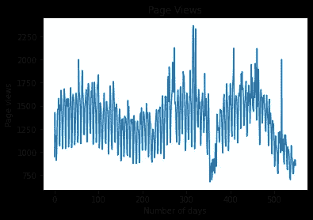
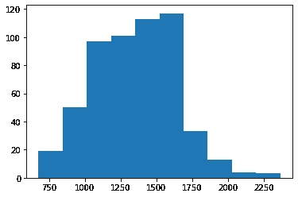
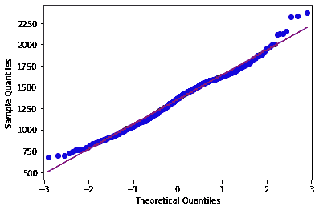
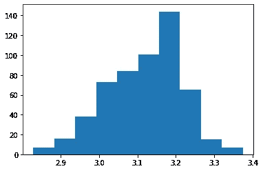
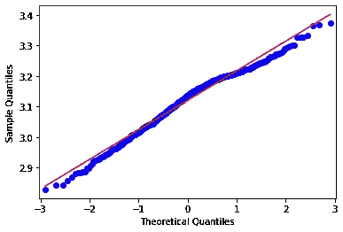
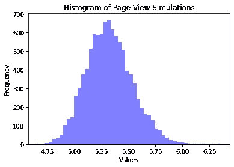

# Python 中的蒙特卡罗模拟:分析网页浏览

> 原文：<https://towardsdatascience.com/monte-carlo-simulations-in-python-analysing-web-page-views-b6dbec2ba683?source=collection_archive---------32----------------------->

## 蒙特卡罗模拟使用随机抽样来生成概率分布，模拟感兴趣变量的潜在结果。

这种方法在金融等领域被广泛使用，以模拟各种风险情景。

然而，该方法在时间序列分析的其他方面也有重要的应用。在这个特定的例子中，让我们看看如何使用蒙特卡罗模拟来模拟网页浏览。



来源:维基媒体工具锻造

以上时间序列来源于 [Wikimedia Toolforge](https://pageviews.toolforge.org/?project=en.wikipedia.org&platform=all-access&agent=user&redirects=0&start=2019-01-01&end=2020-07-03&pages=Health_care) ，是 2019 年 1 月—2020 年 7 月维基百科上“医疗保健”一词的网页浏览量时间序列。所有数据都是每日格式。

我们可以看到，时间序列显示了每天的显著波动性，并显示了数据中一些奇怪“峰值”的典型轮廓，或者是搜索该术语的频率特别高的日子。

试图对这样的时间序列进行直接预测通常是徒劳的。这是因为不可能从统计上预测搜索词何时会出现峰值，因为这会受到与过去数据无关的影响，例如，与健康相关的重大新闻事件会导致该词的搜索出现峰值。

然而，人们可能特别感兴趣的是创建一个模拟来分析网页统计的许多潜在场景，并估计在异常场景下该搜索词**的页面浏览量**多高**或**多低**。**

# 概率分布

当运行蒙特卡罗模拟时，注意正在使用的分布类型是很重要的。

鉴于页面浏览量不可能是负数，我们假设分布是正偏的。

这是数据的直方图:



来源:Jupyter 笔记本

我们可以看到，分布显示出正的[偏斜](https://pythontic.com/pandas/series-computations/skewness)，其中一些异常值使分布尾部向右偏斜。

```
>>> series = value;
>>> skewness = series.skew();
>>> print("Skewness:");
>>> print(round(skewness,2));Skewness:
0.17
```

该分布的偏斜计算为 **0.17** 。

QQ 图表明，除了异常值之外，大多数值的分布呈正态分布。



来源:Jupyter 笔记本

然而，更有可能的是，由于正偏斜，该数据表示对数正态分布-将数据转换为对数格式将导致分布的正态性。

```
>>> mu=np.mean(logvalue)
>>> sigma=np.std(logvalue)
>>> x = mu + sigma * np.random.lognormal(mu, sigma, 10000)
>>> num_bins = 50
```

这是对数数据的分布，更能代表正态分布。



来源:Jupyter 笔记本

此外，该分布的偏斜现在为 **-0.41** 。

```
>>> logvalue=pd.Series(logvalue)
>>> logseries = logvalue;
>>> skewness = logseries.skew();
>>> print("Skewness:");
>>> print(round(skewness,2));Skewness:
-0.41
```

这表示轻微负偏，但 QQ 图仍然表示正常。



来源:Jupyter 笔记本

# 蒙特 卡罗模拟

既然数据已经被适当地转换，蒙特卡罗模拟被生成来分析页面视图统计的潜在结果范围。根据所选择的分布，页面浏览量以对数格式表示。

首先，计算时间序列的平均值和波动性(用标准差衡量)。

```
>>> mu=np.mean(logvalue)
>>> sigma=np.std(logvalue)
>>> x = mu + sigma * np.random.lognormal(mu, sigma, 10000)
>>> num_bins = 50
```

然后，相关数组由 **x** 定义，其中 mu 和 sigma 相加，然后乘以 10，000 个随机数，这些随机数按照定义的平均值和标准偏差遵循对数正态分布。

```
array([5.21777304, 5.58552424, 5.39748092, ..., 5.27737933, 5.42742056, 5.52693816])
```

现在，让我们绘制直方图。



来源:Jupyter 笔记本

同样，这些值以对数格式表示。我们看到这个形状代表了正态分布。如上所述，蒙特卡罗模拟的思想不是预测网页浏览本身，而是提供对许多不同模拟的网页浏览的估计，以便识别 1)大多数网页浏览的范围和 2)分布中的极值范围。

# 结论

在本文中，您已经看到:

*   蒙特卡洛模拟的使用
*   偏斜在定义分布中的作用
*   如何实现模拟来识别获得极值的概率

非常感谢您的参与，您也可以在 michael-grogan.com[的](https://www.michael-grogan.com/)找到我更多的数据科学内容。

*免责声明:本文是在“原样”的基础上编写的，没有任何担保。本文旨在提供数据科学概念的概述，不应以任何方式解释为专业建议。*