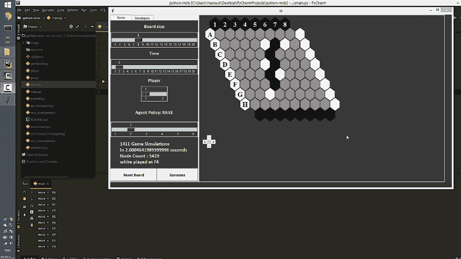
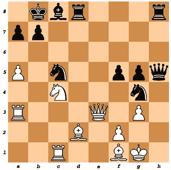
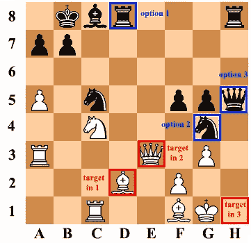
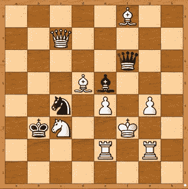
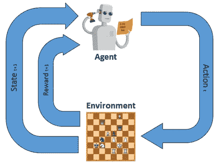

# 蒙特卡罗树搜索:在实时游戏玩家中实现强化学习

> 原文：<https://towardsdatascience.com/monte-carlo-tree-search-a-case-study-along-with-implementation-part-1-ebc7753a5a3b?source=collection_archive---------21----------------------->

## 第 1 部分—强化学习的基本概念

[梁杰森](https://unsplash.com/@ninjason?utm_source=unsplash&utm_medium=referral&utm_content=creditCopyText)在 [Unsplash](https://unsplash.com/s/photos/robot?utm_source=unsplash&utm_medium=referral&utm_content=creditCopyText) 上的照片

# **简介**

增强学习是一种机器学习技术，我们可以设计一个代理，它可以通过与环境交互来获得经验，当它犯更多错误时，它会学习如何修改行为以避免惩罚并获得更多奖励。

你将要读到的将是一系列文章的一部分，我们正在经历一个普通游戏玩家在一个棋盘游戏上的实现的起起落落。如果你很急，你可以在这里找到纯 python 代码:

 [## 马苏杜特 94/MCTS-代理-python

### 蒙特卡罗树搜索(MCTS)是一种在给定领域通过随机抽样寻找最优决策的方法

github.com](https://github.com/masouduut94/MCTS-agent-python) 

还有一个更新的版本，使用 cython 来加速这里的模拟:

 [## 马苏杜特 94/MCTS-代理-cytonized

### 蒙特卡罗树搜索(MCTS)是一种在给定领域通过随机抽样寻找最优决策的方法

github.com](https://github.com/masouduut94/MCTS-agent-cythonized) 

这是最终产品的演示。看看这个:

图 1:这张 gif 展示了最终软件的简单演示。如你所见，黑棋和白棋玩家在棋盘上互相竞争选择战略棋步。

因为在开始实现之前，我必须用理论概念来温暖你的视野，所以在这篇最开始的文章中，我想把你的注意力吸引到游戏环境(比如象棋)如何被建模为强化学习问题上。通过这种方式，我试图保持内容简单(少一些数学和公式)和更具体。该系列的整体重点是蒙特卡罗树搜索算法，以及如何在一个简单的棋盘游戏上实现它，即作为十六进制。

# **概要**

*   问题描述
*   什么是强化学习
*   q 学习
*   结论

# **问题描述**

让我们假设你是一名棋手，把这块棋盘看作游戏的当前状态:

图 1:当前游戏状态。

在这个图像中，有一个属于象棋游戏的**环境**。游戏由各种情况(**状态**)组成，在这些情况下，我们必须决定在其他行动中选择最佳**行动**。我们选择的行动取决于状态，每个行动都会引起环境的变化，而这些变化可能会带来影响未来决策的后果。

例如，在图 1 的当前情况下， **G5** 中的*黑棋兵*不能在棋盘上采取任何行动(根据国际象棋规则)。

现在的问题是，在上图中(假设轮到黑棋)，我们如何确定某个玩家选择了**最好的** **棋步**(代表黑棋)？

图 2:图 1 中有 3 个突出显示的选项供黑人玩家选择

以下是一些黑人玩家选项:

*   移动 ***D8*** 中的*黑车，取出 **D2** 中的*白主教*。*
*   移动 **G4** 中的*黑骑士*，取出 **E3** 中的*白皇后*。
*   移动 **H5** 中的*黑皇后*并将其放置在 **H1** 、**将死** **并赢得游戏**。

显然最后一步是最好的一步，因为赢得比赛是每个棋手的最终目标。在国际象棋中，除掉对手的棋子可能会增加获胜的机会，但这不是最终目的。即使你的棋子比棋盘上对手的多，你也可能不是赢家(例如，查看下图)。

图 2:游戏状态示例#2

在此图中，黑人玩家是赢家，尽管白人玩家的棋子数量超过了黑人玩家。

换句话说，有一个**即时奖励**(取出对手棋子)和**长期奖励**(赢得比赛)而后者是玩家更想要的。

让我们总结一下到目前为止我们所讨论的内容:

> 游戏是一个由**状态**组成的**环境**。在每个状态下，玩家可以选择特定的**动作**。每个动作都会引起状态转换。这种状态转换可能对玩家有利/不利。
> 最佳玩家(赢家)是拥有更好的**计划** **(策略)**以最大化**长期回报**的人。

这听起来不像人类实现目标的方式吗？
拥有**更好感知**(更好规划)的人类往往**牺牲自己的短期回报**(比如吃快餐)来**最大化长期回报**(塑形)。**强化学习**专门致力于设计能够通过与环境互动来学习最大化长期回报的代理。

好的。现在我们已经对这个主题有了一些背景知识，让我们回顾一下强化学习的基础知识，并学习我们如何利用它来模拟一般的游戏。

# **什么是强化学习？**

R.Sutton 等人[1]很好地描述了 RL:

> 强化学习是学习做什么——如何将情况映射到行动——以便最大化数字奖励信号。学习者没有被告知要采取哪些行动，而是必须通过尝试来发现哪些行动会产生最大的回报。

强化学习代理在环境中采取行动，观察状态并接受奖励。它根据累积的奖励开始计划。

RL 的关键要素包括:

1.  **代理人。**在这里，它是一个通过反复试验来学习如何玩游戏的程序
2.  **环境(州)。**代理执行动作的世界(这里是国际象棋游戏)。
3.  **行动。**代理进行的移动，将环境状态更改为新状态。
4.  **奖励。**对行动的评估，可以是积极的或消极的，也可以是延迟的。

正如[1]断言的**RL 与其他技术的关键区别**在于**其试错性质和延迟回报**。我发现[【2】](https://medium.com/ai%C2%B3-theory-practice-business/reinforcement-learning-part-1-a-brief-introduction-a53a849771cf)和[【3】](https://hackernoon.com/reinforcement-learning-and-supervised-learning-a-brief-comparison-1b6d68c45ffa)最能理解 RL 和其他技术的区别。

> 强化学习环境可以用**马尔可夫决策过程(MDP)** 来建模。
> MDP 提供了一个数学框架，用于模拟**在结果**部分随机、部分受决策者控制**的情况下的顺序决策**(就像游戏一样，我们只能控制自己的行动，但无法控制对手的行动)。
> 在 MDP 环境中，代理人需要找到一个 ***最优策略*** 来最大化报酬。

我推荐你看这个视频，它总结了我到目前为止的所有解释，并且最好地解释了数学符号:

# **问—学习**

现在我们需要找出一种方法来确定最优策略。
当人类想要找到游戏状态的最佳可能解决方案时，他的方法是什么？

他/她保持**估计**(*的质量)他当前状态下的行动，同时(在他的想象中)思考对手对他/她的行动的最佳策略是什么。通过这种方式，她/他会选择最有可能获得回报的行动(当然，人类不可能想象所有的场景并记住所有的结果！).*

*为了将上述陈述与我们的项目相关联，我们需要设计一个代理，该代理能够通过试错法**探索环境**，并通过**理解** **其在状态**中的动作质量来对其建模。但是这种试错可以发生在它的大脑中，而不是在它与之交互的环境中(就像人类如何在大脑中模拟游戏一样)。*

*我推荐 Udacity 团队提供的这个短视频，它澄清了由代理建模的**环境和代理** **与**交互的**环境的区别:***

*这就是 q 学习方法的用武之地。Q learning 是一种 RL 算法，它从当前状态(规划)开始，针对任何和所有连续状态，在最大化长期回报的**上学习**最优策略**。如果给**无限的探索时间**和部分随机策略 [4](http://www.leemon.com/papers/1995b.pdf) ，Q-learning 可以学习到最佳策略。查看这篇文章，了解上下文中的更多细节。***

# *结论*

*好的。我们了解到基于 RL 的智能体是一种通过选择状态中的动作来与环境交互的智能体。通过这样做，它改变了环境状态并转换到其他状态。这种转变可能伴随着作为其行为结果的奖励/惩罚(并且这种结果可能不是直接的)。代理的目标是找到最佳策略来选择最大化回报的行动。最后，我用一些问题来结束这篇文章，这些问题将在下一篇文章中回答。*

*1 —如果在其他步骤之间只有一个最佳步骤，如果由于时间有限，我们无法逐一处理所有连续的状态，我们如何找到它？
2 —如果我们在计算资源和时间方面受到限制，我们如何将寻找最佳方案转化为长期回报？*

*为了解决这些问题，我们将在下一篇文章的[中挖掘蒙特卡洛树搜索概念及其解决方案。](/monte-carlo-tree-search-implementing-reinforcement-learning-in-real-time-game-player-25b6f6ac3b43)*

# *参考*

*1—[https://hacker noon . com/reinforcement-learning-and-supervised-learning-a-brief-comparison-1 b 6d 68 c 45 FFA](https://hackernoon.com/reinforcement-learning-and-supervised-learning-a-brief-comparison-1b6d68c45ffa)*

*2—[https://medium . com/ai % C2 % B3-理论-实践-商业/强化-学习-第二部分-介绍-马尔可夫-过程-d3586d4003e0](https://medium.com/ai%C2%B3-theory-practice-business/reinforcement-learning-part-2-introducing-markov-process-d3586d4003e0)*

*3—[https://medium . com/ai % C2 % B3-理论-实践-商业/强化-学习-第三部分-马尔可夫-决策-过程-9f5066e073a2](https://medium.com/ai%C2%B3-theory-practice-business/reinforcement-learning-part-3-the-markov-decision-process-9f5066e073a2)*

*4—[http://www.leemon.com/papers/1995b.pdf](http://www.leemon.com/papers/1995b.pdf)*

*5—[https://towards data science . com/explaining-reinforcement-learning-active-vs-passive-a 389 f 41 e 7195](/explaining-reinforcement-learning-active-vs-passive-a389f41e7195)*