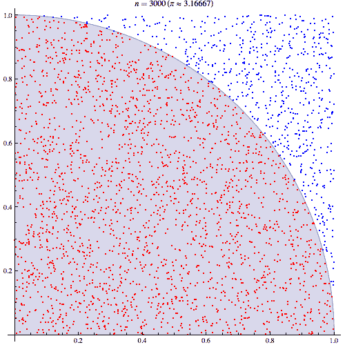
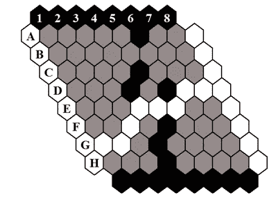
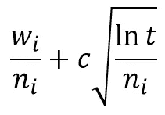
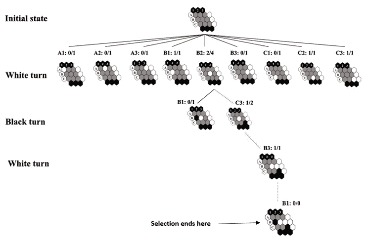
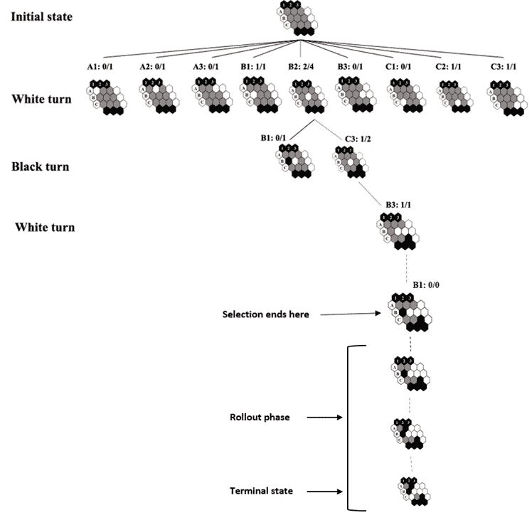
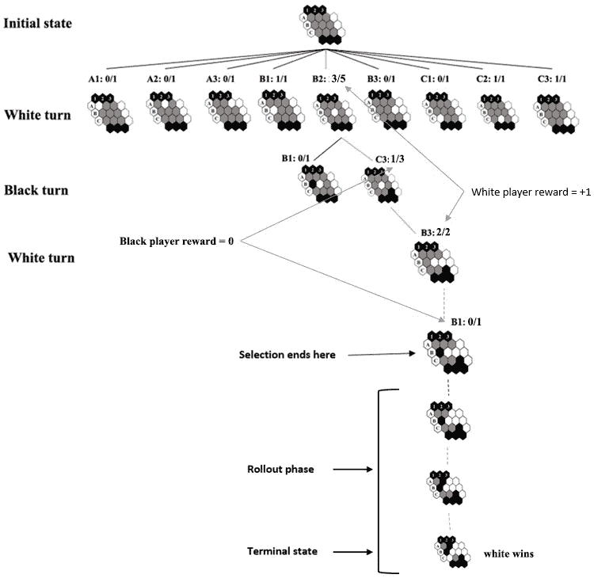

# 蒙特卡罗树搜索:在实时游戏玩家中实现强化学习|第 2 部分

> 原文：<https://towardsdatascience.com/monte-carlo-tree-search-implementing-reinforcement-learning-in-real-time-game-player-25b6f6ac3b43?source=collection_archive---------10----------------------->

## **第 2 部分—蒙特卡罗树搜索基本概念**

安妮·尼加德在 [Unsplash](https://unsplash.com/?utm_source=unsplash&utm_medium=referral&utm_content=creditCopyText) 拍摄的照片

在[上一篇文章](/monte-carlo-tree-search-a-case-study-along-with-implementation-part-1-ebc7753a5a3b)中，我们介绍了强化学习的基本概念，并以这两个关键问题结束了这篇文章:

> 1 —如果由于时间有限，我们无法逐一处理所有连续的状态，我们如何才能找到最佳方案？
> 
> 2 —如果我们在计算资源和时间方面受到限制，我们如何将寻找最佳行动的任务映射到长期回报？

在本文中，为了回答这些问题，我们通过蒙特卡洛树搜索基础。因为在接下来的文章中，我们将在“HEX”棋盘游戏中实现这个算法，所以我尝试在这个棋盘游戏环境中通过例子来解释这个概念。
如果您对代码更感兴趣，请在此[链接](https://github.com/masouduut94/MCTS-agent-python)中找到它。由于使用了`cython`，还有一个更优化的版本适用于 linux，你可以在[这里](https://github.com/masouduut94/MCTS-agent-cythonized)找到它。

以下是概要:

**1 —概述**

**2 —勘探与开采的权衡**

经典棋盘游戏

**4 —算法结构:选择和扩展**

**5 —算法结构:卷展栏**

**6 —算法结构:反向传播**

**7 —优点和缺点**

# **概述**

蒙特卡洛方法是 Stanislaw Ulam 在应用统计方法“蒙特卡洛方法”后首次提出的。概念很简单。利用**随机性**解决原则上可能是确定性的问题。例如，在数学中，当我们不能直接计算积分时，它用于估计积分。同样在这张图中，你可以看到我们如何基于蒙特卡罗模拟来计算圆周率。

图 1:借助蒙特卡罗模拟计算圆周率([来源](https://math.stackexchange.com/questions/515302/please-explain-monte-carlo-method))。

上图表明，在蒙特卡罗方法中，我们收集的样本越多，对目标值的估计就越准确。

*   但是蒙特卡罗方法是如何在一般游戏中派上用场的呢？

当我们无法处理所有状态时，我们使用蒙特卡罗方法**基于模拟随机估计状态** **的质量。每个模拟都是一个**自我游戏**，从当前状态开始遍历游戏树，直到到达叶子状态(游戏结束)。**

> 所以这个算法对我们的问题来说是完美的。
> 
> -因为它对未来状态-动作空间进行采样，所以它可以通过保持低计算量来估计当前状态下的接近最优的动作(这解决了第一个问题)。
> 
> -此外，它根据长期回报(根据树叶的结果进行奖励)选择最佳行动的事实回答了第二个问题。

这个过程就像当一个人想要估计未来的行动，以在国际象棋比赛中提出最好的行动。他会根据自己的想法模拟各种游戏(从当前状态到未来最后可能的状态),并选择整体效果最好的游戏。

**蒙特卡洛树搜索(MCTS)** 将蒙特卡洛方法与树搜索结合起来，是一种通过**在决策空间**中随机取样并根据结果构建搜索树，在给定域中寻找**最优决策**的方法。

在解释算法结构之前，我们应该先讨论一下**探索和开发的权衡。**

# **勘探与开采的权衡**

如前所述，在强化学习中，一个智能体总是**通过重复使用在该问题中找到的最佳行动**来实现最优策略(还记得上一篇文章中的象棋例子)。然而，有可能当前的最佳行动实际上并不是最佳的。因此，它将在学习阶段通过执行替代方案而不是感知的最优方案来继续定期评估替代方案。在 RL 术语中，这被称为**勘探开发权衡**。RL 中的所有算法(MCTS 也是)都试图平衡探索-开发的权衡。

我认为这个视频最好地解释了探索-开发的概念:

# **HEX:经典桌游**

现在是时候了解一下 Hex 游戏了。它有简单的规则:

图 2:六角板。赢家是白玩家，因为它用链石连接了白双方。

*   黑白相间。
*   每回合一名玩家在任何未被占据的格子上放置一块与其颜色相同的石头。
*   获胜者是将他们的石头形成一串连接他们两个相对的棋盘边的玩家。
*   Hex 永远不能以和局结束，可以在任何 n × n 棋盘上玩[【1】](https://ieeexplore.ieee.org/abstract/document/5551182)。

现在让我们来看一下算法结构。

# **算法结构**

## **1 —选择和扩展**

在这一步中，agent **获取游戏的当前状态**并在树中选择一个节点(每个节点代表选择一个动作所产生的状态)并遍历该树。每个状态中的每个移动都分配有两个参数，即总展开和每次展开的胜率(它们将在“展开”一节中介绍)。

在其他节点中选择最佳节点的策略非常重要。应用于树的置信上限(UCT)是选择最优节点的最简单而有效的策略。这一战略旨在平衡开采-勘探之间的权衡。这是 UCT 公式:

图 3: UCT 公式。第一项(w/n)表示开采，第二项计算勘探项(c * sqrt(log t / n))

在此公式中,`i`表示子节点中的第 I 个节点。`W`是每次推广的获胜次数，`n`是所有推广的次数。公式的这一部分代表剥削。
`C`为勘探系数，在[0，1]范围内为常数。此参数指示代理必须在多大程度上支持未探索的节点。
`t`是父节点中转出的数量。第二个术语代表探索术语。

让我们看一个例子，以便理解提供的所有信息。请看下图:

图 4:选择阶段

考虑深度 2 中的动作 C3(黑色转弯)。总模拟次数(公式中的 *n _i* )为 2，成功的推广次数(公式中的 *w_i* )为 1。在公式*中，t* 将是深度为 1 的父节点的转出数(在这里表示在白色转弯中移动 B2 ),即 4。正如你所看到的，选择阶段在我们有一个未访问节点的深度停止。然后在扩展阶段，当我们在深度 4 中访问 B1 时，我们将它添加到树中。

## **2 —首次展示(也称为模拟、播出)**

在这一步中，基于预定义的策略(比如完全随机选择)，我们选择动作，直到到达一个终止状态。在终端状态下，当前玩家的游戏结果要么是 ***0*** (如果输了游戏)要么是 ***1*** (如果赢了游戏)。在十六进制游戏中，终端状态总是可达的，游戏的结果是输或赢(没有平局)。但是在像象棋这样的游戏中，由于象棋分支因子的可扩展性和搜索树的深度，我们可能会陷入无限循环。

图 5:展示了前面步骤(选择和扩展)之后的展示阶段

在上面的图像中，当那个黑人玩家在扩展步骤中选择了 B1 之后，在模拟步骤中，一个卷展栏被启动到游戏的终端状态。

在这里，我们选择随机行动来达到游戏的最终状态。如你所见，在终端状态下，白玩家通过用石头将左右连接起来赢得了游戏。现在是在反向传播部分使用这些信息的时候了。

## **3 —反向传播**

在这一部分中，我们更新了在选择和扩展部分的树中遍历的节点中的统计数据(首次展示数量和每次总首次展示的成功数量)。

在反向传播过程中，我们需要更新节点的首次展示数量和成功/失败统计。我们唯一需要的是找出在 rollout 中赢得游戏的玩家(例如图 4 中的白人玩家)。

对于图 4，由于黑人玩家是赢家(他选择了终止状态中的动作)，所有由黑人玩家动作导致的状态都被奖励 1，而由白人玩家动作导致的状态被给予 0 奖励(我们可以通过将它设置为-1 来选择惩罚)。

对于所有状态(通过步骤 1 选择的树节点)，如图 6 所示，总展开数增加 1。

图 6:通过树搜索更新节点的赢(对于黑人玩家)、输(对于白人玩家)和转出总数。

这些步骤不断重复，直到一个预定义的条件结束循环(如时间限制)。

## **优缺点**

**优点:**

1 — MCTS 是一种易于实现的算法。

2-蒙特卡罗树搜索是一种启发式算法。除了规则和结束条件之外，MCTS 可以在没有任何特定领域知识的情况下有效地操作，并可以通过随机播放来找到自己的移动并从中学习。

3-MCTS 可以保存在任何中间状态，并且该状态可以在将来任何需要的时候用于用例。

4-MCTS 支持基于搜索树运行环境的不对称扩展。

**缺点:**

1-随着树在几次迭代后变得快速增长，它可能需要大量的内存。

2-蒙特卡罗树搜索有一点可靠性问题。在某些情况下，可能会有一个单独的分支或路径，这可能会导致在实施回合制游戏时输给对手。这主要是由于大量的组合，并且每个节点可能没有被访问足够的次数来理解其结果或长期结果。

3-MCTS 算法需要大量的迭代才能有效地决定最有效的路径。所以，这里有一点速度问题。

games 可以随时返回建议的移动，因为关于模拟游戏的统计数据会不断更新。当算法开始时，推荐的移动不是很好，但是它们随着算法的运行而不断改进。

# **结论**

现在，我们弄清楚了 MCTS 算法如何有效地利用随机性对所有可能的场景进行采样，并通过模拟得出最佳行动。MCTS 在每个时期所选择的行动的质量取决于它如何处理环境中的勘探和开发。

好了，到目前为止，我们已经讨论了必要的理论概念，我们可以进入下一个层次，用代码来弄脏我们的手。在下一篇文章中，首先，我们将描述整个框架和需要实现的模块，然后我们将实现 UCT 的基本 MCTS。之后，我们将通过向代码中添加更多功能来改进框架。

如果你对话题感兴趣，有问题，我随时恭候，乐意倾听。在 [linkedin](https://www.linkedin.com/in/masoud-masoumi-moghadam/) 和 [StackoverFlow](https://stackoverflow.com/users/6118987/masoud-masoumi-moghadam) 找到我。