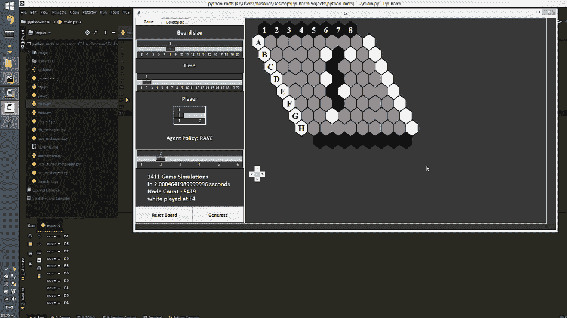
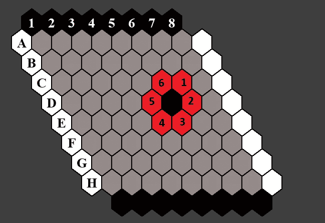
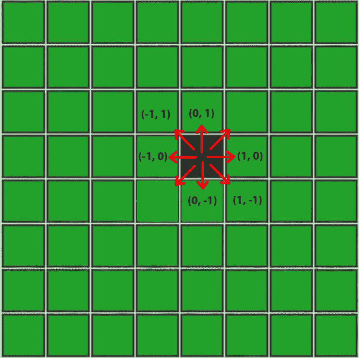
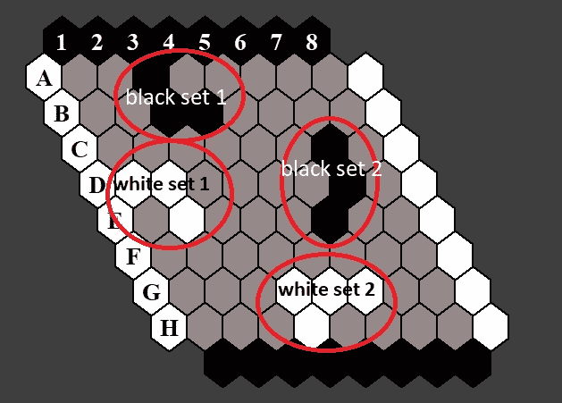
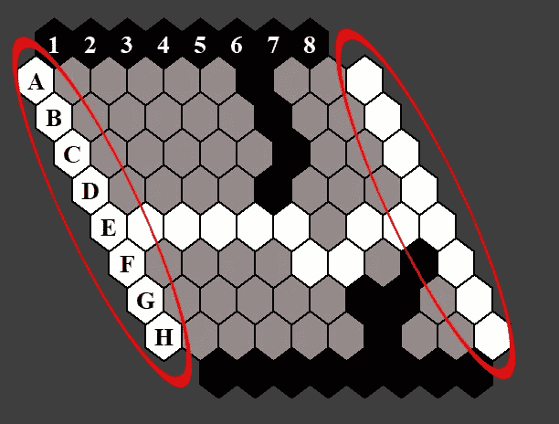

# 蒙特卡罗树搜索:在实时游戏玩家中实现强化学习|第 3 部分

> 原文：<https://towardsdatascience.com/monte-carlo-tree-search-implementing-reinforcement-learning-in-real-time-game-player-a9c412ebeff5?source=collection_archive---------16----------------------->

## 第 3 部分—MCTS 算法的实现，该算法可以在有限的时间内处理实时游戏“HEX”中的决策。

由[岩田良治](https://unsplash.com/@ryoji__iwata?utm_source=unsplash&utm_medium=referral&utm_content=creditCopyText)在 [Unsplash](https://unsplash.com/?utm_source=unsplash&utm_medium=referral&utm_content=creditCopyText) 上拍摄的照片

# 介绍

在之前的文章中，我们学习了[强化学习基础](/monte-carlo-tree-search-a-case-study-along-with-implementation-part-1-ebc7753a5a3b)和[蒙特卡罗树搜索](/monte-carlo-tree-search-implementing-reinforcement-learning-in-real-time-game-player-25b6f6ac3b43)基础。我们介绍了 MCTS 如何搜索所有的状态动作空间，并根据对搜索空间进行采样后收集的统计数据得出一个好的动作。

对于那些着急的人，这是该项目的完整代码:

 [## 马苏杜特 94/MCTS-代理-python

### 蒙特卡罗树搜索(MCTS)是一种在给定领域通过随机抽样寻找最优决策的方法

github.com](https://github.com/masouduut94/MCTS-agent-python) 

图 1:游戏的演示。作者在 [Github](https://github.com/masouduut94/MCTS-agent-python) 上的图片。

这张 gif 展示了最终产品的演示。正如您在 GUI 中点击*生成按钮*所看到的，MCTS 代理选择了最佳可能的移动。黑人和白人玩家之间的竞争欲望真的很有趣，因为对我们人类来说，游戏棋盘上的移动选择听起来很有战略意义。

我必须感谢肯尼·杨，他出色地实现了 mopyhex，这对我的项目帮助很大。这篇文章主要包括解释他的代码。在接下来的文章中，我们将进一步为这个项目添加一些贡献，以便在状态-动作空间中进行更健壮的搜索，并使用`cython`工具优化 C 级速度的代码。

# 模块概述

在接触代码之前，为了给出项目的概述，让我描述一下每个模块的功能。基本上，初始框架需要实现 6 个类:

*   `GameState`:这个模块简单的提供了树的每个节点中关于游戏状态的每一个基本信息。
*   `UnionFind`:该模块是帮助`GameState`检查两侧是否连接的实用模块。换句话说，在这个模块的帮助下，我们可以在游戏的任何状态下检测出赢家，如果有的话。
*   `Node`:这个实现了指示每个游戏状态的树的每个节点。每个节点都有一个基于 UCT 算法的评估函数。
*   `UctMctsAgent`:这个处理蒙特卡罗树搜索算法的树结构。
*   `Gui`:这个模块使用`Tkinter`模块实现了一个简单的图形用户界面，使游戏中的人机交互成为可能。
*   `MCTSMeta`和`GameMeta`:这些模块只是存储一些常量。

我已经实现了一些算法，这些算法使用了快速动作评估的概念，并且在短期搜索中比 UCT 算法更强。让它变得更加强大。我将在后面讲述这些算法的概念。

# 游戏状态模块:

在每个游戏状态树中，搜索代理需要知道三件事才能从一个状态转换到另一个状态:

*   轮到哪个玩家了。
*   未被占用的棋盘单元格(可供选择的棋步)。
*   能够为黑人和白人玩家检测双方之间的连接。

后一种实现起来相当棘手。因为要检测连接，我们必须跟踪不相交的细胞群。因此，我们必须利用数据结构，即不相交集(也称为联合查找)。但是 HEX 游戏板单元从 6 个侧面连接到它的邻居的事实，使得它更难实现。看看下面的图片:

图 2:一个黑色单元从 6 个侧面连接到其相邻单元。作者图片

那么我们如何处理这个难题呢？

首先，我使用 NumPy 数组来保存游戏板的值。未被占用的像元值为 0，相应地，白色像元和黑色像元值为 1 和 2。此图以阵列形式展示了一个 8X8 游戏板:

图 3:阵列状单元上的游戏棋盘表示。作者图片

每个单元有 8 个相邻单元。您在这里看到的值是在每个单元格上的坐标，这些单元格在`GameMeta`中被定义为邻域，以将相邻单元格限制为 6:

`NEIGHBOR_PATTERNS = ((-1, 0),(0, -1),(-1, 1),(0, 1),(1, 0),(1, -1))`

图 2 中单元的邻域现在可以表示如下:

图 4:新的邻居小区被限制为 6 个(适用于六边形小区)。作者图片

最终在我们的游戏 GUI 中，它变成了类似图 1 的六边形。

## UnionFind 类:

现在是时候调整这个游戏的不相交集数据结构了。根据[维基百科](https://en.wikipedia.org/wiki/Disjoint-set_data_structure):

> 在计算机科学中，不相交集数据结构(也称为 union-find)是一种跟踪被划分成几个不相交(非重叠)子集的一组元素的数据结构。

图 5:白色和黑色不相交的集合。作者图片

上图显示了这些不相交的集合，它们是游戏环境的例子。如果你想知道更多关于不相交集合数据结构的概念，你可能想在这里检查这个链接[。这是我想出的`unionfind.py`的代码:](https://medium.com/better-programming/using-disjoint-set-union-find-to-build-a-maze-generator-7462ea3b8632)

方法:

*   `join`:如果输入板单元格不在同一个组中，则将其加入到单元格组中。
*   `find`:查找给定单元的代表元素(可能是一个集合)。
*   `connected`:检查两个元素是否在同一组。该功能用于检查电路板的两侧是否连接，这意味着它有助于我们检测获胜者。看看图 3。
*   `set_ignored_elements` :在不相交的集合中，必须忽略边缘。
*   `get_groups`:返回游戏状态下的各组单元格。

图 6:白边连接。这个连接将被 connected 方法检测到。作者图片

现在让我们定义游戏状态模块。这是`GameState`类的代码:

这就是考虑属性的原因:

*   `size`:表示板的尺寸(尺寸 X 尺寸)
*   `to_play`:表示该轮是黑棋还是白棋。
*   `board`:2d NumPy 数组，保存板单元值(无论每个单元是黑、白还是空)。
*   `White_played`和`black_played`:游戏过程中每个玩家选择的移动次数。(这些值的用法将在本系列的下一集解释)。
*   `white_groups`和`black_groups`:为了使用`UnionFind`类，我们通过给模块分配这些变量来创建模块的实例。

让我们来描述一下这些功能:

*   `play`:轮到的玩家拥有作为输入传递的单元格。
*   `get_num_played`:返回每个玩家出招次数的字典。
*   `get_white_groups` 和 get_black_groups:返回每个玩家组。
*   `place_white` 和`place_black`:将石头放在棋盘上，然后如果石头是边的邻居，它们通过‘union find . join’函数连接。那么与该小区具有相同值的所有相邻小区也加入该组。
*   `turn`:这是一个简单返回`turn` 属性的方法。
*   `set_turn`:要改变转弯，我们使用此功能。
*   `winner`:这个属性检查两边之间是否有连接，如果有就返回胜者。否则不返回任何内容。
*   `neighbors`:返回所有邻居单元格。
*   `moves`:返回当前棋盘状态下所有可能走法的列表。

这是`meta.py`中的`GameMeta`:

# 节点模块:

现在我们已经实现了游戏状态，是时候定义蒙特卡罗树搜索代理了。首先，我们必须为树的节点定义一个好的结构。这是定义`Node` 模块的代码:

每个节点都具有以下属性:

*   `move`:树中的每个节点表示棋盘中的单元格，我们将其定义为每个状态下的潜在动作。
*   `parent`:指向父节点。
*   `N`:这是在选择阶段该节点被访问的次数。
*   `Q`:这是从模拟中的失败次数中减去的成功次数。
*   `N_RAVE`和`Q_RAVE`:这些项目属于 RAVE(快速动作评估)算法，将在即将到来的未来文章中解释。
*   `children`:由此节点产生的下一个状态。
*   如果节点是一片叶子，那么结果将显示获胜者。否则没有。

## 方法

*   `add_children:`它得到一个移动字典，并把它们存储在`children` 属性中。
*   `value`:该属性根据本节点的`N`和`Q`属性以及父属性`N`计算 UCT 公式。UCT 公式中使用的`explore`常数是 UCT 的探索项，在`MCTSMeta.EXPLORATION`中有定义。
    请注意，当某个节点没有`N`时，我们必须将该节点的值设置为无穷大，因为必须首先选择该节点。并且下一次基于`N`和`Q`，代理可以将其与其兄弟进行比较。

让我们一步一步地编写`MCTSAgent`代码。首先，让我们开始上课:

如果你熟悉树数据结构的概念，你就知道如果你有了**树节点**并且遍历到你想去的任何地方，树中的所有节点都是可达的。
所以我们定义`root`为树根节点，`rootstate`为树的根状态。然后，当我们遇到每一步棋时，我们在`rootstate`中进行游戏，然后将状态转换为新的状态(交替玩家回合，检查黑组和白组是否有任何联系，…).
属性`run_time`、`node_count`和`num_rollouts` 仅用于跟踪一些统计数据。

## 选择和扩展阶段

现在我们定义选择和扩展阶段:

正如代码所暗示的，以及我之前提到的关于树遍历，我们首先复制游戏的`root` 和`root_state` (第 6 行和第 7 行)。然后，直到我们没有遇到任何叶子(这意味着游戏没有结束或者代理仍然没有探索树)，我们继续选择具有最大 UCT 值的节点(在第 13 行和第 14 行中计算)，然后通过进行实际移动来转换状态(第 17 行)。如果我们到达某个`N`等于`0`的节点，我们选择它。在我们返回`node`和`state`之前，我们必须确定节点是否可扩展。所以在`expand`方法中，首先我们确定游戏没有赢家，如果没有，我们给展开的节点添加子节点。因此节点及其状态随后被返回。

## 模拟阶段

对于模拟部分，我们得到了以下代码:

代理简单地获得游戏的状态，它继续玩随机移动，这是默认策略(在下一篇文章中，我将包括更多令人敬畏的策略),并转换`state`,直到我们到达一个终端状态，在该状态中检测到游戏获胜者。

## 反向传播

这是该步骤的代码:

在这段代码中，我们有三个输入:

*   node:是我们从`select_node`方法的输出中得到的节点。
*   转弯:这表示玩家进入了`select_node`方法的第二个输出状态。
*   结果:这是模拟阶段的输出，是模拟的赢家

我们在反向传播部分要做的是(如这里讨论的，看一下图 6)从`node`开始，向后遍历选择的节点(第 23 行)并更新统计(第 21 行，第 22 行)，直到我们到达根节点(第 20 行，因为树节点没有父节点)。
我们在输家玩家选择的节点和赢家玩家选择的节点之间交替，所以我们必须给赢家节点+1 奖励，给输家节点 0 奖励(第 24 行)。
另外，请注意，第 18 行表示，如果选择了该移动并到达`node`状态的玩家获胜，我们必须给予他+1 奖励。如果不是这样，玩家将被罚以`0`奖励。

现在我们必须定义一个循环，在这个循环中，我们应该完成选择、扩展、模拟和反向传播的整个过程，这里提供了:

在我实现这段代码的时候，python 3.4 是最新的版本。由于在第 7 行中，我使用了`clock`函数，而在 python 3.8 中`clock`函数在`time`库中被弃用，所以我将`from time import clock`修改为`from time import time as clock`(很酷的把戏，对吧！？).

在这段代码中，`time_budget`(顾名思义)是我们可以进行尽可能多的 MCTS 模拟的时间(第 11 行)。选择和扩展在第 12 行完成，变量`turn`保持当前玩家回合，然后相应地在第 14 行和第 15 行完成卷展和反向传播。

在第 18 行，我们对树中的节点进行计数，并使用方法`tree_size`将它们存储在变量`node_count`中，我马上会添加这个方法。

这是整个`MCTSAgent` 类的代码:

正如您在代码中看到的，有一些实用函数。`best_move`方法(第 140 行)返回基于`N` 值的最佳移动(模拟次数最多的节点。模拟越多，其探索的路径越好)。

`move`方法用于在实际的游戏环境中走棋。这样，我们必须更新树`root`和`rootstate`。新的根将是当前根的子根，带有`root.children`字典的`move`键。新的`rootstate`将是游戏中已经使用过的`move`转换而来的`state`。

因此，当我们在游戏环境中转换到一个新状态时，我们必须移除到其父状态的连接(第 165 行)，我们还更改了`rootstate`(第 167 行)。

请注意，我插入第 172 行和第 173 行的原因是，在游戏 GUI 中，可以选择不考虑回合的移动(就像黑人玩家连续选择 2 个单元格，而不让白人玩家在其回合中选择移动)。因此，为了在代码中实现这种灵活性，我们必须重置整个树(丢弃当前树)并重新开始 MCTS 过程。

方法`set_gamestate`给了我们重置游戏状态的能力。所以我们可以改变棋盘的大小，重新开始。方法`tree_size`在`Queue`库的帮助下对树节点进行计数。
我们还需要在`meta.py`中定义这个:

# Gui 模块:

最后，我们为框架设计图形用户界面。`Gui`类是在`tkinter` 模块的帮助下开发的。这个模块很容易理解，所以我只解释一些重要的部分。这是 500 行代码！

重要方法:

*   `top_left_hexagon`:该方法在该函数中返回环境中左上角六边形单元格的坐标。
*   `hexagon`:这个用`tkinter.Canvas.create_polygon`画一个六边形并返回。
*   `generate_row`:在这个方法中，根据它的颜色生成一行六边形:这个函数获取 gameboard 数组，绘制整个游戏板。
*   `generate_white_edge` 和`generate_black_edge`:这些函数生成板的边缘，在那里单元格都是黑色或白色的。
*   这个功能可以让玩家与游戏互动。当在 GUI 中单击一个单元格时，它会用指向 MCTS 代理的`self.agent`播放。
*   `set_size`:该方法检测 self.game_size 按钮的事件，用新的尺寸重置整个棋盘。它还会重置代理树。
*   `set_time`:通过此功能调整 MCTS 搜索的时间预算。
*   `Set_agent`:在我解释了 RAVE 算法之后，这个函数将在 UCT 和 RAVE 代理之间切换。
*   `click_to_bot_play`:这个设计是让代理玩家根据我们之前讨论的`MCTSAgent.best_move`方法选择移动。

现在我们必须定义一个循环，在这个循环中，我们应该完成选择、扩展、模拟和反向传播的整个过程，这里提供了:

在我实现这段代码的时候，python 3.4 是最新的版本。由于在第 7 行中，我使用了`clock`函数，而在 python 3.8 中`clock`函数在`time`库中被弃用，所以我将`from time import clock`修改为`from time import time as clock`(很酷的把戏，对吧！？).

在这段代码中，`time_budget`(顾名思义)是我们可以尽可能多地进行 MCTS 模拟的时间(第 11 行)。选择和扩展在第 12 行完成，`turn`变量保持当前玩家回合，然后相应地在第 14 行和第 15 行完成展示和反向传播。

在第 18 行，我们对树中的节点进行计数，并使用`tree_size`方法将其保存在`node_count`变量中，我马上会添加这个方法。

这是整个`MCTSAgent` 类的代码:

正如您在代码中看到的，有一些实用函数。`best_move`方法(第 140 行)返回基于`N` 值的最佳移动(模拟次数最多的节点。模拟越多，其探索的路径越好)。

`move`方法用于在实际游戏环境中进行移动。这样，我们必须更新树`root`和`rootstate`。新的根将是当前根的孩子，带有`root.children`字典的`move`键。新的`rootstate`将会是游戏中已经使用过的`move`转换后的`state`。

因此，当我们在游戏环境中转换到一个新状态时，我们必须移除与其父状态的连接(第 165 行)，我们还更改了`rootstate`(第 167 行)。

请注意，我插入第 172 行和第 173 行的原因是，在游戏 GUI 中，可以选择不考虑回合的移动(就像黑人玩家连续选择 2 个单元格，而不让白人玩家在其回合中选择移动)。因此，为了在代码中实现这种灵活性，我们必须重置整个树(丢弃当前树)并重新开始 MCTS 过程。

方法`set_gamestate`给了我们重置游戏状态的能力。所以我们可以改变棋盘的大小，重新开始。方法`tree_size`在`Queue`库的帮助下对树节点进行计数。
我们还需要在`meta.py`中定义这个:

# Gui 模块:

最后，我们为框架设计图形用户界面。`Gui`类是在`tkinter` 模块的帮助下开发的。这个模块很容易理解，所以我只解释一些重要的部分。这是 500 行代码！

重要方法:

*   `top_left_hexagon`:该方法在该函数中返回环境中左上角六边形单元格的坐标。
*   `hexagon`:这个用`tkinter.Canvas.create_polygon`画一个六边形并返回。
*   `generate_row`:在该方法中，根据颜色生成一行六边形
*   `gameboard2hexagons`:该函数获取游戏板数组，绘制整个游戏板。
*   `generate_white_edge` 和`generate_black_edge`:这些函数生成板的边缘，其中的单元格全部为黑色或白色。
*   `click2play`:这个功能可以实现人与游戏的互动。当在游戏环境中选择一步棋时，它会用指向代理的`self.agent`来玩。
*   `set_size`:该方法检测 self.game_size 按钮的事件，用新的尺寸重置整个棋盘。它还会重置代理树。
*   `set_time`:mcts 搜索的时间预算由该功能调整。
*   `Set_agent`:在我在下一篇文章中解释了 RAVE 算法之后，你会看到这个函数会在 UCT 和 RAVE 代理之间转换代理。
*   `click_to_bot_play`:这个设计是让代理玩家根据我们之前讨论的“MCTSAgent.best_move”方法选择移动。

现在是运行代码的时候了:
添加`main.py`并将这段代码复制粘贴到那里:

# **结论**

在本文中，我们用纯 python 实现了一个蒙特卡罗树搜索算法，包含了尽可能少的外部库。该项目的完整代码可以在[这里](https://github.com/masouduut94/MCTS-agent-python)找到。这个项目是一个简单的 UCT**算法的实现。
虽然 UCT 算法是精确的**，但是它需要大量的模拟来收敛到可用的最优解**。为了提高算法性能，有很多选项，如 RAVE，果断行动，最后一次良好的答复，和 PoolRAVE，…算法。这些算法将在接下来的文章中进一步解释。**

顺便说一下，如果你想找一个有经验的研究员加入你的团队，我完全可以。我在强化学习、计算机视觉和数据科学方面有一些经验。你可以在 LinkedIn 上找到我。