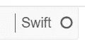
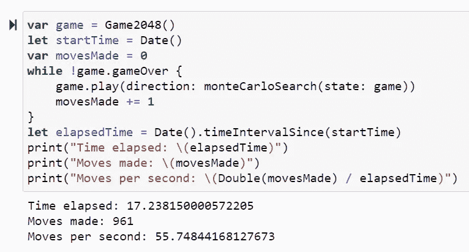

# Swift 中的蒙特卡罗树搜索(MCTS)人工智能游戏

> 原文：<https://towardsdatascience.com/monte-carlo-tree-search-mcts-ai-gameplay-in-swift-891745d764d6?source=collection_archive---------36----------------------->


尼克·卡沃尼斯在 [Unsplash](https://unsplash.com/s/photos/monte-carlo-tree?utm_source=unsplash&utm_medium=referral&utm_content=creditCopyText) 上的照片

## 再加上在 Jupyter 笔记本里设置 S4TF！

1.  **Swift 不只是苹果的**
2.  玩游戏的人工智能很棒
3.  **Swift 是*不是*只为苹果！**

在这篇文章中，我将解释我如何在 Jupyter 笔记本中设置 Swift，然后我如何使用 Swift 创建一个有时间限制的蒙特卡罗树搜索算法代理，它可以在 17 秒内玩 2048。*整齐！*

《2048》之所以是一个测试人工智能代理的有趣游戏，是因为它不是确定性的:它是随机的。因此——不像其他一些用于测试人工智能的传统游戏，如 CartPole 和 noughts & crosses——这不是一个神经网络适合的问题。相反，我们可以使用随机算法，询问“哪一步造成的伤害最小？”一遍又一遍，并能快速浏览场景。

你说速度？是的——使用 Swift 可以让我们创建一个每秒能运行 55 步的代理，这是相当快的速度。

## 2048 年的游戏

由意大利网络开发商 Gabriele Cirulli 设计，2048 在 4x4 的棋盘上玩，初始化时你有两个随机的瓷砖，上面有“2”或“4”。通过向左、向右、向上或向下滑动，您可以将接触到的匹配值牌相加(例如，“2”和“2”变成“4”)，以便通过将所有牌相加得到数字“2048”来获胜。每一回合，新的牌上都会生成“2”或“4 ”,这意味着在您到达目标之前，棋盘很容易填满并被阻挡！

2048 年很复杂，因为你玩得越多，每一步棋对最终棋盘状态的影响就越深远。我们不想让我们的人工智能太容易。

## 限时蒙特卡罗树搜索(T-B MCTS)

MCTS 是一种与人工智能一起使用的搜索技术，它是概率性的和启发式的，将经典的树搜索与强化学习的机器学习(ML)原则结合在一起。作为一种算法，它于 2006 年推出，并已被广泛应用于许多游戏实例中，包括国际象棋、扑克，甚至是战役。

它利用探索和定期评估，处理当前最佳行动实际上可能不是最佳行动的可能性(这是扩展树的*宽度*并使用随机化)。这通过利用方法来平衡，通过坚持具有最大估计值的路径来避免低效率(这是扩展树的*深度*)。

为什么有时间限制？当使用一个详细的算法时，定义一个做出决定的最大时间是很重要的。事实上，你分配给这个过程的时间(资源)越多越好，这是一个权衡。在这个例子中，我给每个决定分配了 0.015 秒。

*要想全面详细地了解 MCTS，我推荐看看 GeeksforGeeks* *上这篇* [*有用的文章。*](https://www.geeksforgeeks.org/ml-monte-carlo-tree-search-mcts/)

首先，让我们把一切都准备好。

*请注意:我将介绍我在课程中使用的设置，其中包括用于 TensorFlow 的 Swift(S4TF ),但它肯定不是创建 MCTS 代理的唯一可能设置。*

## **设置**

1.  除非你使用 Linux 或 Mac，否则你需要一个 Linux 的 Windows 子系统(WSL)。我使用 Ubuntu 18.04(在微软商店免费获得)
2.  为 TensorFlow 安装[Swift](https://github.com/tensorflow/swift/blob/master/Installation.md)

## Swift Jupyter 内核的可选设置

这花费了我比预期更长的时间，但是如果你想以一种干净和可共享的格式展示你的 Swift 作品(就像使用 Jupyter 一样),这是值得的。)

我找到的最有价值的指南是在 Swift-Jupyter repo。有几个选项可供设置，包括 conda 和 Docker 选项，但我发现使用 Swift for TensorFlow toolchain 和 virtualenv 效果很好(最终)。

**提示**:我花了*这么长时间*试图在 LLDB Python3 支持下设计出 Swift 工具链。我最终在 Ubuntu 中使用了 curl:

```
$ curl -O [https://storage.googleapis.com/swift-tensorfl](https://storage.googleapis.com/swift-tensorfl)ow-artifacts/nightlies/latest/swift-tensorflow-DEVELOPMENT-ubuntu18.04.tar.gz
```

如果你不打算偏离标准，那么一旦你在 Ubuntu 中有了 Swift 工具链，你需要做的就是运行这个:

```
$ git clone https://github.com/google/swift-jupyter.git
cd swift-jupyter
python3 -m venv venv
. venv/bin/activate
pip install -r requirements.txt
python register.py --sys-prefix --swift-toolchain ~/swift-jupyter
```

最后，Jupyter 笔记本可以使用 Swift 内核发布。



漂亮！

## 玩游戏

使用 Swift(无论是在上述 Jupyter 笔记本中，还是在您偏好的其他环境中)，您需要导入提供基础层功能的基础框架:

```
import Foundation
```

我们使用一个大的坏代码块来管理 2048 游戏，并确保它快速工作。这是一个位板实现:

太棒了。现在我们需要代理自动游戏，这意味着一个函数，它接受一个游戏状态，返回移动的方向，然后执行随机移动。它还应该返回棋盘的分数。

重要的是，这是我们定义算法做出决定所需要的最大时间量的地方(假设 maxTime = 0.015)。

它还创建了一个保存所选方向和相关分数的字典，返回平均分数最高的方向:

最后，我们有了一个可以工作的 2048 机器人，哇哦！现在我们需要初始化一个新的游戏实例，运行一个 while 循环，重复直到游戏结束。在这个循环中，它将决定最好的走法，玩它，并打印新的棋盘状态:



真快！

正如你所看到的，人工智能仅用了 17 秒就走了 961 步，速度接近每秒 56 步。这还不包括优化，所以你当然可以运行得更快更好！

**你可以在我的** [**Github 这里**](https://github.com/kingnif/legendary-S4TF/blob/master/SWIFT_TB-MCTS.ipynb) **找到完整的笔记本和所有代码，并查看我之前为*迈向数据科学*所做的工作！**

[](/chaos-in-the-calm-what-is-chaos-engineering-5311c27b2c7e) [## 平静中的混沌:什么是混沌工程？

### 是时候主动出击而不是被动应对了

towardsdatascience.com](/chaos-in-the-calm-what-is-chaos-engineering-5311c27b2c7e) [](/how-i-used-python-code-to-improve-my-korean-2f3ae09a9773) [## 我如何使用 Python 代码来提高我的韩语水平

### “你好世界！”/ "안녕하세요 세계!"

towardsdatascience.com](/how-i-used-python-code-to-improve-my-korean-2f3ae09a9773) 

*这是基于 IBM 开发人员技能网络在*[*cognitive class . AI*](https://cognitiveclass.ai/courses)*上提供的令人敬畏的“使用 Swift 进行 TensorFlow (S4TF)的人工智能游戏”课程，我强烈建议您查看他们的学习路径。*