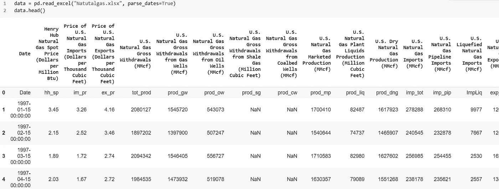
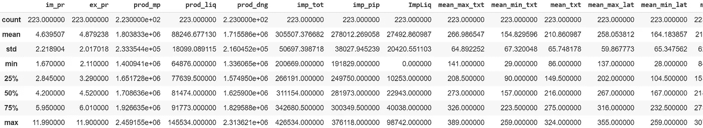
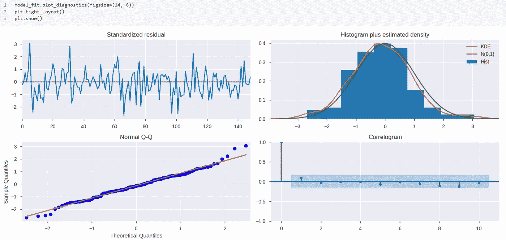
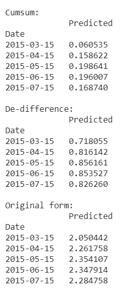

# 月度现货价格预测——状态空间法的时间序列分析

> 原文：<https://towardsdatascience.com/monthly-spot-price-prediction-time-series-analysis-by-state-space-method-34aedf6ba294?source=collection_archive---------26----------------------->

## SARIMAX 预测 Henry Hub 现货价格

## 递归特征消除& SARIMAX 状态空间建模方法


作者图片

[https://sarit-maitra.medium.com/membership](https://sarit-maitra.medium.com/membership)

S ARIMAX 应用于原始序列具有模型参数解释能力等优点。这里的目标是开发一个带有外部变量的季节性自回归综合移动平均(SARIMAX)模型，该模型试图考虑价格影响因素的所有影响，以预测 Henry Hub 的月度现货价格。天然气价格是一个随机变量，遵循具有随机趋势的随机过程。

在像股票市场这样的复杂系统中，预测趋势的能力比点预测更有用。我们可以更有信心和更可靠地预测趋势，而不是这些量的值或水平。

## 为什么是萨里麦克斯？

这里，我们的时间序列预测模型将使用过去的价格和其他变量，如气候、存储等。来预测天然气未来价值。我们的时间序列受许多外部因素的影响。SARIMAX 能够将季节性和非季节性因素纳入一个乘法模型。因此，当时间序列呈现季节性变化时，通常应用 SARIMAX 模型。

SARIMAX 模型是一个带有外部变量的 SARIMA 模型，称为 SARIMAX (p，D，q) (P，D，Q)S (X)，其中 X 是外部变量的向量。



与价格、消费、储备、存储、生产、管道等相关的数据。和气候数据，包括路易斯安那州新奥尔良的冷却/加热度天数、极端最高/最低温度、平均温度和平均最高/最低温度。所有这些数据被组合在一个文件中作为输入数据文件。


我们可以看到，我们的时间序列有一个以上的时间相关变量。每个变量都依赖于它过去的值，并且还依赖于其他变量。我们将在这里使用这种依赖性来预测未来的值。


## 带有外生回归量的季节性自回归综合移动平均(SARIMAX):

SARIMAX 是一个完全成熟的模型，使用状态空间后端进行估计。SARIMAX 模型由五个迭代步骤组成-

1.  模型识别，其中我们识别差分顺序(D)、季节差分顺序(D)、季节长度(S)、非季节自回归顺序(P)、季节自回归顺序(P)、非季节移动平均顺序(Q)和季节移动平均顺序(Q)。
2.  参数估计，其中估计来自步骤 1 的已识别模型的参数。
3.  模型的适合度是用 l-jung-Box Q 统计量来检验的。如果残差不是正态分布，我们需要进行第 4 步。否则，继续执行步骤 5。
4.  纳入外部变量:使用线性回归将相关外部变量纳入 SARIMA 模型。
5.  使用样本外验证诊断模型。经验证的模型用于预测未来值。

## ACF 和 PACF 图:

```
plt.figure()
plt.subplot(211)
plot_acf(df['hh_sp'], ax=plt.gca())
plt.subplot(212)
plot_pacf(df['hh_sp'], ax=plt.gca())
plt.xlabel('Lag')
plt.tight_layout()
plt.show()
```


## 季节性分解:

```
df = data.copy()
df.set_index('Date', inplace=True)
print(df.info())
df = df.astype(float)res = sm.tsa.seasonal_decompose(df['hh_sp'],freq=12)
fig = res.plot()
fig.set_figheight(8)
fig.set_figwidth(15)
plt.show()
```


从趋势图中，我们没有观察到任何明显的趋势，这种趋势遵循某种程度上的随机运动(随机漂移)。


我们在这里可以看到，仅仅求差异无助于数据集的标准化。

```
df.isnull().sum()
def fill_missing(df):
for row in range(df.shape[0]):
for col in range(df.shape[1]):
if np.isnan(df[row,col]):
df[row,col]= df[row-1, col]
fill_missing(df.values)
np.isnan(df).sum()
fill_missing(df.values)
np.isnan(df).sum()
```

## 递归特征消除:

我们使用递归特征消除的特征排序和使用线性回归作为模型的最佳特征数量的交叉验证选择。

特征排序，使得 ranking_[i]对应于第 I 个特征的排序位置。选定的(即，估计最佳的)特征被分配等级 1。

```
y = df['hh_sp']
X = df.drop(['hh_sp'], axis=1)
names=pd.DataFrame(X.columns)lin_reg = LinearRegression()
mod =  RFECV(lin_reg, step=1, cv=20) 
mod_fit = mod.fit(X,y) 
rankings=pd.DataFrame(mod_fit.ranking_, index=names) #Make it into data frame
rankings.rename(columns ={0: 'Rank'}, inplace=True)
rankings.transpose()
```


模型中选择了 14 个特征


让我们确定我们的目标；我们将预测未来 5 个月的现货价格。

## 目标变量:

```
df['target'] = df['hh_sp'].shift(-5)
df.dropna(inplace=True)
n = df.drop(['target'], axis=1) # storing in a dataframe for future use
dataset = df[['im_pr','ex_pr','prod_mp','prod_liq','prod_dng','imp_tot','imp_pip','ImpLiq', 'mean_max_txt', 'mean_min_txt', 'mean_txt', 'mean_max_lat', 'mean_min_lat','mean_lat', 'target' ]]
dataset.describe()
```



## 时间序列交叉验证和分割:

```
X = np.array(dataset.drop(['target'], 1))
y = np.array(dataset['target'])
tscv = TimeSeriesSplit(max_train_size=None, n_splits=5)
for train_samples, test_samples in tscv.split(X):
#print("TRAIN:", train_samples, "TEST:", test_samples)
X_train, X_test = X[train_samples], X[test_samples]
y_train, y_test = y[train_samples], y[test_samples]
print(X_train.shape, y_train.shape, X_test.shape, y_test.shape)feature_names = ['im_pr','ex_pr','prod_mp','prod_liq','prod_dng','imp_tot','imp_pip','ImpLiq','mean_max_tx', 'mean_min_txt', 'mean_txt', 'mean_max_lat', 'mean_min_lat','mean_lat' ]X_train = pd.DataFrame(data=X_train, columns=feature_names)
X_train.index = dataset[:186].index
y_train = pd.DataFrame(y_train, columns = ['target'])
y_train.index = X_train.index
X_test = pd.DataFrame(data=X_test, columns=feature_names)
X_test.index = dataset[186:].index
y_test = pd.DataFrame(y_test, columns = ['target'])
y_test.index = X_test.index
```

## 数据转换:

众所周知，股票价格一般遵循随机游走；第一阶段是为每个变量生成一组变化或差异，因为现货价格可以通过参考所选变量组中的意外变化而不是它们的水平来解释。变量的意外值可以定义为变量的实际值与其期望值之间的差值。从一个时期到下一个时期，变量的整个变化就是意外变化


## 稳定性检查:


与冲击效应是永久性的非平稳系统相比，平稳系统的优点是，冲击效应将逐渐减弱。

## 均值回复系列:


是否使用差分部分条件最大似然估计。如果为真，则在估计之前执行差分，这将丢弃前 sD+d 个初始行，但会产生更小的状态空间公式。有关使用此选项时解释结果的重要详细信息，请参见注释部分。如果为 False，则完整的 SARIMAX 模型以状态空间的形式出现，以便所有数据点都可以用于估计。默认值为 False。

## 确定顺序:

正如我们所知，SARIMAX 将 ARIMA 模型与在季节性水平上执行相同的自动回归、差异和移动平均建模的能力相结合。让我们用最大似然法估计参数。

```
# Fit auto_arima function
stepwise_fit = auto_arima(y_train_tran, X_train_tran, start_p = 1,
                          start_q = 1, max_p = 7, max_q = 7, m = 12,
                          start_P = 0, seasonal = True,d = None, 
                          D = 1, trace = True, 
                          error_action ='ignore',   
                          suppress_warnings = True,  
                          stepwise = True) # To print the summary
stepwise_fit.summary()
```


模型参数的 p 值表明，季节性和非季节性 AR 和 MA 值在 5%水平上不显著。


# 模型拟合:

在这里，外生变量是作为平行输入序列给出的，这些序列在与内生序列相同的时间步长上具有观测值。

```
# fit model
model = sm.tsa.statespace.SARIMAX(
                     endog = y_train_tran,
                     exog = X_train_tran, order = (0, 0, 0),  
                     seasonal_order = (2, 1, 1, 12), 
                     enforce_invertibility = False,
                     enforce_stationarity = False)
model_fit = model.fit(disp = False)
model_fit.summary()
```


这测试了所有斜率参数共同为零的零假设。附在检验统计量上的 p 值为 0 表明这个零假设应该被拒绝。这里，我们所有的参数都具有 p> 0.05，因此不能拒绝零假设。

使用指示残差不是白噪声的 Ljung-Box Q 统计量来诊断模型。H0 的 Box Ljung 检验的无效假设是，我们的模型不显示缺乏拟合。

## 诊断图:

诊断图帮助我们直观地确定我们的模型如何拟合数据，以及是否违反了 SARIMAX 模型的任何基本假设。



我们可以看到，潜在的误差分布是具有常数均值和标准差的参数假设的高斯分布。

```
# Fit a local level model
endog = ytest_tran
local_model = sm.tsa.UnobservedComponents(endog, 'local level')
# Fit the model via maximum likelihood
result = local_model.fit()
# result is an instance of the Unobserved Components Results class
print(result.summary())
# Show a plot of the estimated level and trend component series
fig = result.plot_components()
plt.tight_layout()
```


## 测试集数据转换:

```
X_test_tran = np.log(X_test).diff()
Xtest_tran = X_test_tran.copy()
Xtest_tran = Xtest_tran[~Xtest_tran.isin([np.nan, np.inf, -np.inf]).any(1)]
Xtest_tran.describe()
y_test_log = np.log(y_test['target']).dropna()
y_test_tran = y_test_log.diff().dropna()
ytest_tran = y_test_tran.copy()
#ytest_tran = ytest_tran[~ytest_tran.isin([np.nan, np.inf, -np.inf]).any(1)]
ytest_tran.describe()
```


## 模型评估和预测:


## 逆变换数据:

```
rebuilt = pred.cumsum().fillna(0)
print('\nCumsum:\n', rebuilt.tail())
rebuilt_further = rebuilt + y_test_log[-1:] # last value of test set
print('\nDe-difference:\n',rebuilt_further.tail())
original = np.exp(rebuilt_further)
print('\nOriginal form:\n',original.tail())
```



我们已经将目标变量转移到 5 个周期(月)；因此，以上应该是未来 5 个月的预测。让我们做一些数据操作来获得未来的日期，如下所示。


可以注意到，按故障设置月频率显示未来所有日期是月末，而不是原始数据集的 15。嗯，这个也可以修复，以同步与原始数据。

## 可视化:

```
# Graph
fig, ax = plt.subplots(figsize=(10,5))
ax.set(title='Henry Hub Spot price', xlabel='Date', ylabel='USD / Mbtu')
# Plot data points
y_test.plot(ax=ax, label='Observed')
# Plot predictions
original.plot(ax=ax, style='r--', label='One-step-ahead forecast')
legend = ax.legend(loc='best')
```


此外，还可以得到预测价格上下水平之间的置信区间，并绘制置信区间图。

从一个简单的模型开始，并测试它是否足够好，这总是一个好主意。应用迭代建模方法，我们可以逐渐增加功能。比较连续模型的结果提供了一种内部验证的形式，因此我们可以捕捉概念、数学和软件错误。通过添加和删除特征，我们可以知道哪些特征对结果的影响最大，哪些特征可以忽略。

# 关键要点:

时间序列预测的重要假设是当前价格是需求和过去价格的函数。然而，这种关系不仅仅是直接的；需求还取决于气候条件、进出口价格等。通过递归特征消除方法找到一组 14 个变量。发现这些变量对于确定每月的天然气现货价格是重要的。SARIMAX 模型用于价格预测，它在解释异常数据方面有明显的优势。根据预测，我们可以看到 SARIMAX 预测可以平稳地遵循实际数据的模式。

***我这里可以到达***[](https://www.linkedin.com/in/saritmaitra/)*。*