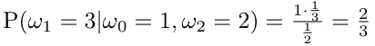

# 利用贝叶斯定理解决 Monty Hall 问题

> 原文：<https://towardsdatascience.com/monty-hall-problem-solution-using-bayes-theorem-cb1d6fbc0c9e?source=collection_archive---------18----------------------->

照片由[莫仁·许](https://unsplash.com/@moren?utm_source=medium&utm_medium=referral)在 [Unsplash](https://unsplash.com?utm_source=medium&utm_medium=referral) 上拍摄

# 介绍

几天前，我决定更新我的概率论知识，所以拉里·瓦色尔曼的书《所有统计学》在这一点上派上了用场。在这本书的前几章中，引人注目的蒙蒂·霍尔问题引起了我的注意。事实上，我之前已经知道这个问题，甚至认为我理解解决方案，但随着时间的推移，不太多的知识片段消失了，蒙蒂霍尔问题的解决方案，不幸的是，没有逃脱这个厄运。幸运的是，上周末的空闲时间和我最近在 Medium 上写博客的热情相结合，我想把它作为我自己的哈利波特传奇的冥想盆，产生了这篇文章。

也就是说，我想用贝叶斯定理详细解释蒙蒂霍尔问题的解决方案。剧透:它更多的是为了理解贝叶斯定理，而不是用简单的术语掌握问题的解决方案。

# “所有统计”中的问题陈述

> 奖品随机放在三扇门中的一扇门之间。你选一扇门。具体来说，你总是选择 1 号门。现在蒙蒂·霍尔选择另外两扇门中的一扇门，打开它，向你展示它是空的。然后他给你机会保留你的门或者换到另一扇没打开的门。应该留下还是换？直觉表明这无关紧要。正确答案是你应该换。证明一下。这将有助于详细说明样本空间和相关事件。这样写

> ω₁是奖励所在，ω₂是蒙蒂打开的大门。

此外，我还添加了事件 *ω₀* 来描述我们最初选择的门。

# 贝叶斯定理

让我们先简单地修改一下贝叶斯定理的概念，这是我用来解决问题的主要工具。

在事件 B 发生的情况下，事件 A 的概率等于两个事件的联合概率除以事件 B 的概率。

由于联合概率的对称计算，给定事件 B 的事件 A 的条件概率可以进一步展开:

最后，如果我们还有一个条件事件 C，那么它作为一个条件传播到所有构成概率:

# 解决办法

现在，我们到底要如何解决这个问题*“你应该留下还是离开？”*用概率来说？

首先，让我们注意到，如果天魔厅不会打开任何一扇门，这是直截了当的。在我们选择门 1 后，每扇门后的中奖概率是一样的:

1.  p(1 号门后的奖品|我们选择了 1 号门)=1/3
2.  p(门 2 后面的奖品|我们选了门 1)=1/3
3.  p(3 号门后的奖品|我们选择了 1 号门)=1/3

> 请注意，我使用条件概率来表明我们之前选择了门 1，尽管这一事实无论如何不会改变结果。尽管如此，我发现保留这个条件很重要，因为它有助于以后理解蒙蒂打开另一扇门时概率测度的赋值。

但我们知道蒙蒂·霍尔打开了另一扇门。

它改变了什么？显然，在条件概率中“|”符号的右边，应该有一些更早发生的事件。在我看来，在我们屈服于宇宙的力量之前有两个事件:1)我们选择了一扇门，2)蒙蒂·霍尔打开了另一扇门。“|”符号的左边应该是一个事件，让我们感兴趣。特别是，我们对奖品在我们选择的门后面的事件和奖品在另一扇门后面的事件非常感兴趣，那扇门是关着的。因此，在我的逻辑中，所有相关的条件概率应该是这样的:

1.  p(1 号门背后的奖品|我们选了 1 号门，蒙蒂厅开了 2 号门)=？
2.  p(2 号门背后的奖品|我们选了 1 号门，蒙蒂厅开了 2 号门) **= 0**
3.  p(3 号门背后的奖品|我们选了 1 号门，蒙蒂厅开了 2 号门)=？
4.  p(1 号门背后的奖品|我们选了 1 号门，蒙蒂厅开了 3 号门)=？
5.  p(2 号门背后的奖品|我们选了 1 号门，蒙蒂厅开了 3 号门)=？
6.  p(门后奖 3 |我们选了门 1，天魔堂开了门 3) **= 0**

然而，正如我提到的，根据问题陈述，一些概率是已知的，因为有一个约束，蒙蒂大厅只打开空的门。因此，我将概率 2 归零。和 6。，奖品是在同一扇门后，蒙蒂大厅打开。

而且对于我们来说，选择了 1 号门之后，2 号门和 3 号门没有太大的区别，那些天魔会开哪一个。最后，我们只想知道，在同样的情况下，当初选择的成功是否和另一扇门的选择一样。所以在我们选了 1 号门，蒙提·霍尔打开 2 号门后，奖品在 1 号门后的概率，和我们选了 1 号门，蒙提·霍尔打开 3 号门后，奖品在 1 号门后的概率完全一样。也就是概率 1。等于概率 4..同理，概率 3。等于概率 5..所以我假设蒙蒂·霍尔打开了 2 号门，那么我们只剩下两种可能性:

1.  p(1 号门背后的奖品|我们选了 1 号门，蒙蒂厅开了 2 号门)=？
2.  p(3 号门背后的奖品|我们选了 1 号门，蒙蒂厅开了 2 号门)=？

用数学术语来说，它会是这样的:

让我们依次讨论每一种可能性。

## 1.看到门 2 是空的后，奖品在我们的门(门 1)后面的概率

正如我前面提到的，我决定引入我们选择的门 1 的事件，尽管它随后作为一个条件传播到所有考虑的概率。然而，我认为这样我们可以更全面地了解以前的事件。

因此，根据贝叶斯定理，概率展开如下:

在哪里

*   蒙蒂·霍尔打开 2 号门的概率等于 1/2，因为我们选了 1 号门，而奖品也在 1 号门后面。这是因为对他来说，他是打开 2 号门还是 3 号门并不重要，因为我们已经挡住了 1 号门，奖品也在 1 号门后面。

*   假设我们选了 1 号门，蒙蒂·霍尔打开 2 号门的概率等于 1/2。这有点类似于前面的概率，但不知道奖金在哪里。我们封锁了 1 号门，因此他有 50%的几率打开 2 号门(或 3 号门)。

*   假设我们也选了门 1，奖品在门 1 后面的概率等于 1/3。这是合乎逻辑的，因为我们对门的选择不会影响门后(或任何门)奖品的外观。这是一个独立事件。

现在让我们来计算这个概率:

## 2.看到门 2 是空的后，奖品在门 3 后面的概率

该概率的公式如下所示:

在哪里

*   蒙蒂·霍尔打开 2 号门的概率，假设我们选了 1 号门，奖品在 3 号门后面，**注意**，等于 1！这是因为他没有别的选择:我们堵住了 1 号门，他不能用奖品开门。

*   假设我们选了 1 号门，蒙蒂·霍尔打开 2 号门的概率等于 1/2。这有点类似于前面的概率，但不知道奖金在哪里。不知道奖品在哪里至关重要——对他来说，2 号门和 3 号门没有区别。

*   假设我们选了 1 号门，奖品在 3 号门后面的概率等于 1/3。如前所述，我们选择 1 号门是独立事件，因为奖品在 3 号门后面。

让我们最后计算一下最终概率是多少:

## 结论

我们看到，确实更好地改变到门 3，因为在这种情况下，我们利用了蒙蒂霍尔的知识，实际上奖金在哪里。

其实我不了解你，但是即使解决了问题，还是显得有点神秘。对我来说，改变门的选择的机会看起来就像一个将你带到更好的平行宇宙的入口，在那里你有更高的获胜机会。