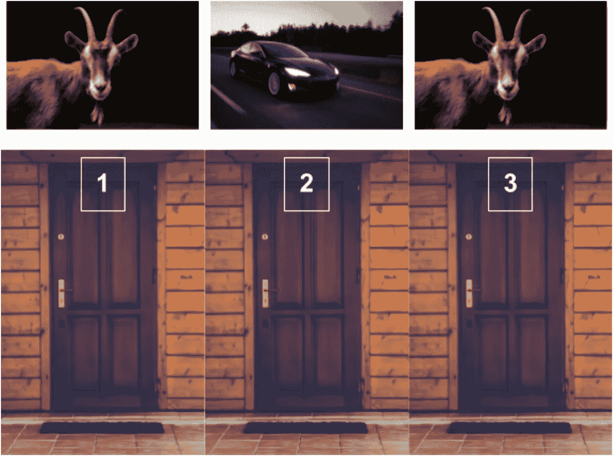
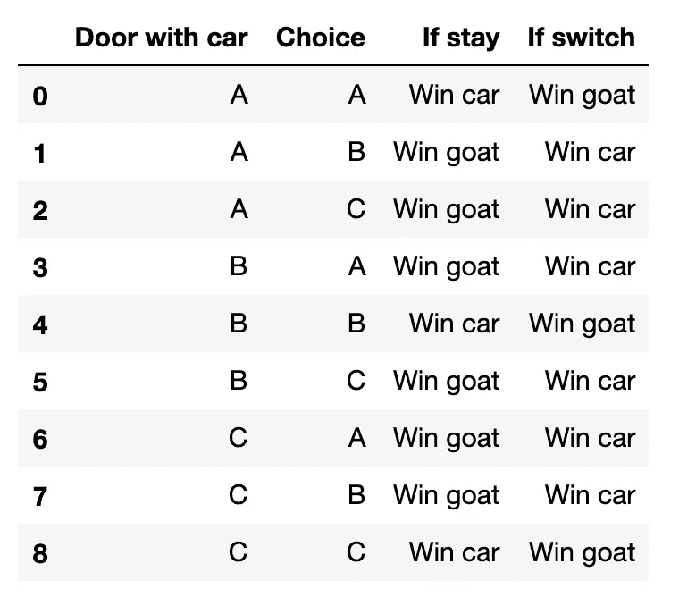
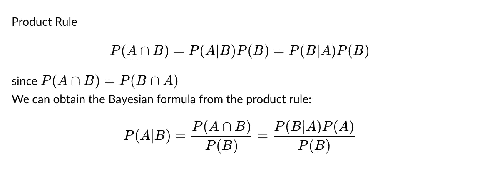
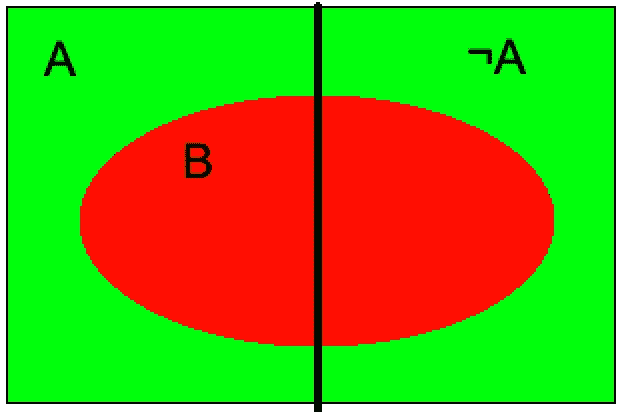
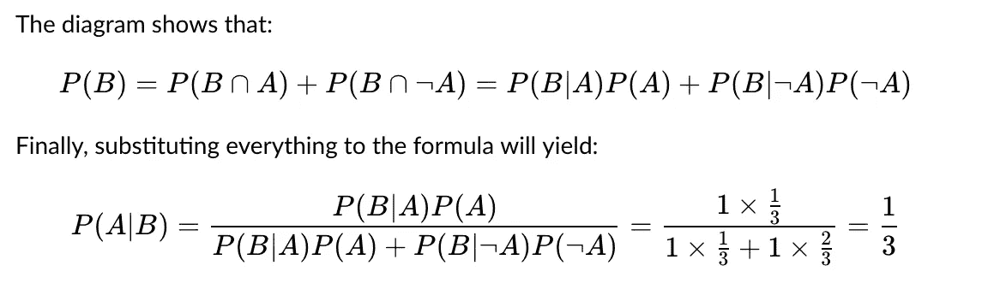
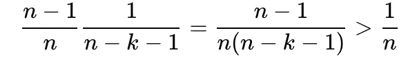
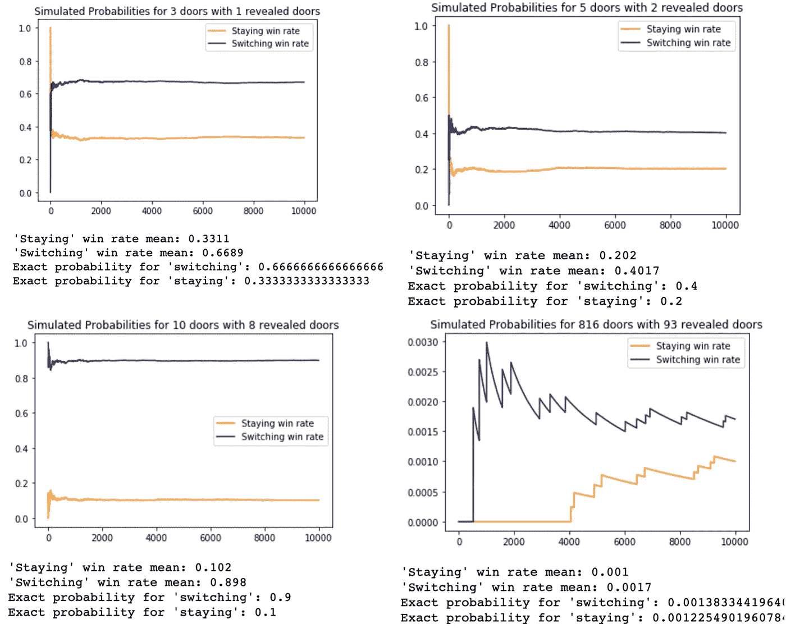

# 蒙蒂·霍尔的问题会让你发疯的

> 原文：<https://towardsdatascience.com/monty-hall-problem-will-drive-you-crazy-5bfeee84209e?source=collection_archive---------43----------------------->

## 用数学、统计学和蒙特卡罗方法解决著名的脑筋急转弯

门由[索菲·戴尔](https://unsplash.com/@allthestars?utm_source=unsplash&utm_medium=referral&utm_content=creditCopyText)创作，山羊由[彼得·诺伊曼](https://unsplash.com/@peterneumann?utm_source=unsplash&utm_medium=referral&utm_content=creditCopyText)创作，汽车由[Jp·瓦列里](https://unsplash.com/@jpvalery?utm_source=unsplash&utm_medium=referral&utm_content=creditCopyText)在 [Unsplash](http://Unsplash.com) 上创作，并由我剪辑

蒙蒂霍尔问题是统计学中一个著名的概率难题。它是以电视游戏节目《让我们做笔交易》的主持人蒙蒂的名字命名的。脑筋急转弯松散地复制了游戏节目的概念，它是这样的:

> 有三扇门。你将不得不选择一扇门，你将赢得门后的一切。有一扇门有一辆车。剩下的每扇门都有一只山羊。首先，你被要求选择一扇门。接下来，蒙蒂知道每扇门后有什么，他打开了两扇门中的一扇门，展示了一只山羊。最后，你有机会要么“留”在你原来的选择，要么“切换”到剩下的门。赢车的最佳策略是什么？

我第一次遇到这个问题是在几年前的统计课上。这太难了，我花了一整天的时间来思考这个问题，并且仍然坚持使用两种策略中的`1/2`。我的解释是:有`3`门，`1`门有车。如果主人打开有山羊的一扇门，剩下的两扇门中必须有一扇门有汽车。所以不管“换”还是“留”，概率应该是`1/2`！

我错了。这个问题的棘手之处在于，蒙蒂知道这些门后面是什么，所以他的决定对结果有影响。花一分钟时间让自己想想这是不是真的。

# 1)直观回答

假设这三门是:`1`、`2`、`3`、T17 既然`probability = Event/Sample`空间我们只需要找到这些变量，代入方程。
这里的样本空间是我们选择车门和汽车实际位置的不同方式的总和。下表说明了 6 种可能性:

注意，这一桌，蒙蒂已经淘汰了带山羊的门。
如你所见，“停留”策略的获胜概率为`1/3`，而“转换”策略的获胜概率为`2/3`。

蒂姆·埃里克头脑爆炸

# 2)贝叶斯公式法

这是热爱贝叶斯的人的另一种做法！
让`P(A|B)`表示事件`A`的概率，假设事件`B`已经发生

贝叶斯公式

如果我们知道如何将问题转化为事件，那么一切都变得简单明了。让:

*   第一选择是以车为门的事件。
*   b 是蒙蒂消灭一个有山羊的门的事件。因此，我们正在寻找“留下来”的策略。

让我们写下我们知道的事情:

*   因为蒙蒂总是选择正确的门而不管任何给定的条件
*   `P(A)=1/3`，有一个`1/3`打开车门的几率，什么都不知道。

为了理解如何找到`P(B)`，让我们看一下图表:

文氏图

只有`2`种可能的策略，要么留下，要么换。于是，“切换”概率就是停留的补数，也就是`1–1/3=2/3`。

**如果蒙蒂不知道**哪扇门有山羊。这相当于`P(B|A)=1 and P(B|¬A)=1/2`。将它们插回到等式中，它返回`P(B|A)=1/2`。这是我感到困惑的部分。

# 3)更简单的答案

用“留”的策略，一开始选择有车的门才能赢。既然有`3`门，那么有车选门的概率就是`1/3`。所以“切换”策略是`2/3`。这为我们提供了一个对超过`3`门天魔堂问题的一般观察。

# 4)如果呢？

如果 Monty Hall 决定在最大数量`k`为`n-2`的 n 个门中揭示 k 个门，会不会对策略有丝毫影响？

门乘[苏菲·戴尔](https://unsplash.com/@allthestars?utm_source=unsplash&utm_medium=referral&utm_content=creditCopyText)再乘上我

此例中的“切换”是指不保持原选择
**例 A:** `k=n-2`
此例与原问题类似。请注意，您不能切换到您选择的门。因此,“停留”胜率始终是`1/n`,在这种情况下，转换胜率是`(n-1)/n`

**案例 B:** `k<n-2`
一开始选门带车的概率还是`1/n`。从而“呆住”= `1/n`。
在“转换”策略中，你的最终选择不可能是你的首选。因此，你不会想选择第一个有车的门。不选的概率是`(n-1)/n`。`k-th`开关也是当你选择时，还有`n-k`扇门，但你必须排除你的第一扇门。这样，最后一步中撬开被撬门的概率就是`1/(n-k-1)`。我们共同拥有:

它表明“转换”策略总是优于“停留”策略。

# 5)模拟

让我们在 python 上运行它，看看我们公式是否有效。设`n`是门的数量，而`r`是蒙蒂想要显示的门的数量

蒙特 卡罗模拟

图表显示，随着迭代次数的增加，统计结果越来越接近我们的实际答案。

所以，你知道下次再玩类似这样的游戏应该怎么做。

关于代码的更多信息，请访问我的 [GitHub 库](https://github.com/williamhuybui/Monty_Hall_problem)。