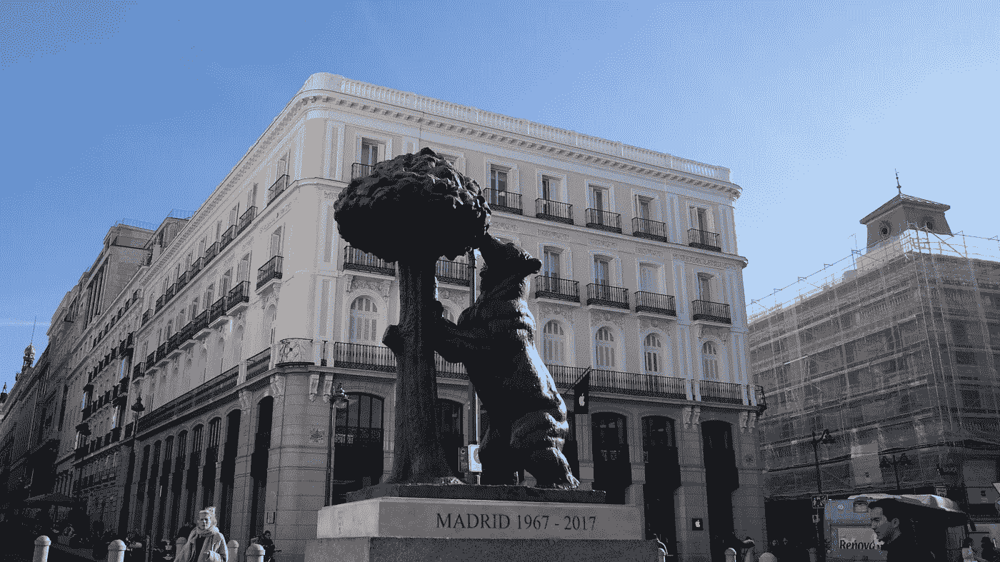
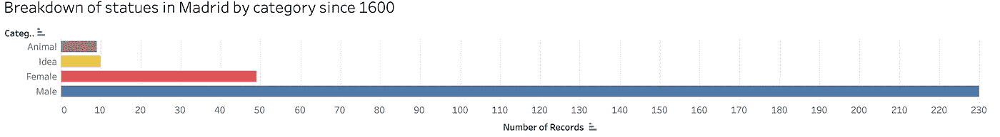
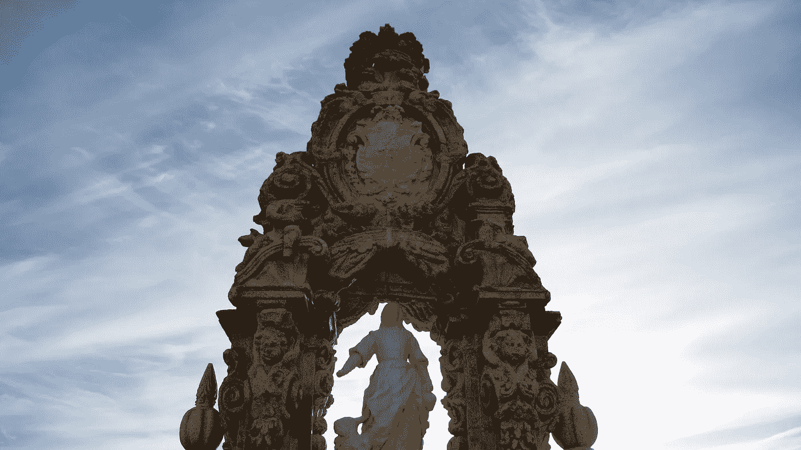
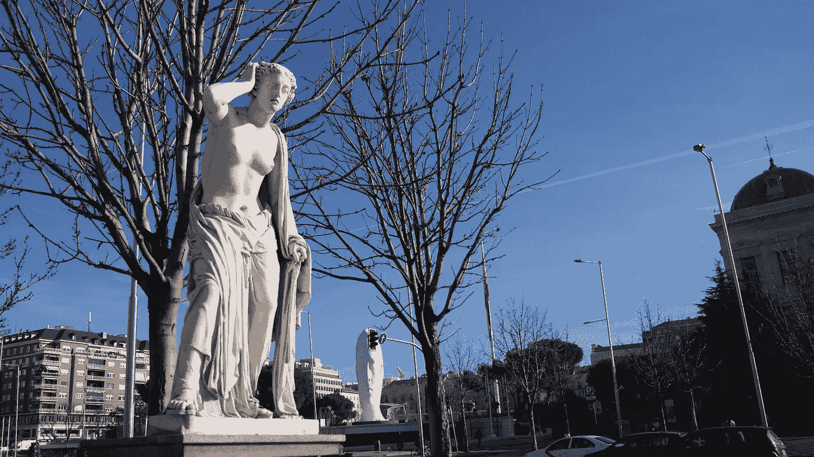
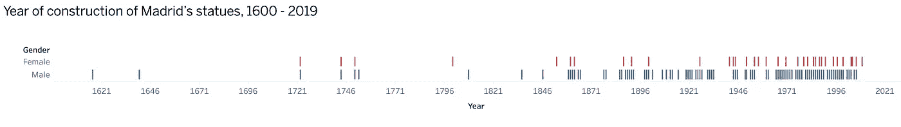

# 纪念性偏见:马德里为每一个女人树立了四个男人的雕像

> 原文：<https://towardsdatascience.com/monumental-bias-madrid-puts-up-four-statues-of-a-man-for-every-statue-of-a-woman-1e978030b633?source=collection_archive---------37----------------------->

## 自 1600 年以来，这座城市已经竖立了 298 座雕像，其中 49 座是献给女性的。其中，只有一小部分描绘了女性历史人物。

在马德里的主要公共广场太阳门广场，游客们会遇到西班牙首都最受关注的照片之一:熊和草莓树的雕像*。这幅关于一只熊在树上吃东西的坦率而受欢迎的描绘代表了这座城市的盾形纹章，也是对新来者的欢迎。*

**

*马德里最著名的雕像“熊和草莓树”*

*尽管马德里在过去几十年里对基础设施进行了现代化改造，但这座城市仍然保留了其历史街区和街道的风貌。证明这一点的是散布在这个大都市的近 300 座雕像。描绘前国王的好战姿态，基督教符号，希腊和罗马的数字，这些雕像大多有一个共同点:他们的性别。*

*根据[马德里市议会](https://datos.madrid.es/portal/site/egob/menuitem.c05c1f754a33a9fbe4b2e4b284f1a5a0/?vgnextoid=eb8e993ae322b610VgnVCM1000001d4a900aRCRD&vgnextchannel=374512b9ace9f310VgnVCM100000171f5a0aRCRD&vgnextfmt=default)发布的一个数据库，虽然这些纪念碑中有 77 %代表男性历史人物，但只有 16 %多一点显示女性历史人物。这意味着这座城市为每一座女性雕像树立了四座男性雕像。然而，这一比例也包括圣母玛利亚、希腊女神和没有名字或姓氏的女性形象。其余的雕像描绘想法和概念(3 %)，或动物(3 %)。*

**

*数据来源:马德里市议会| *Medium 不支持 Tableau 嵌入，如果要查图:[https://tabsoft.co/39VXsfk](https://tabsoft.co/39VXsfk)*

*“这些数字很可怕，但它们只不过是我们生活的社会的反映，”艺术集体 *Mujeres Mirando Mujeres (MMM)的负责人米拉·阿巴迪亚说。**

*“我们需要重写所有领域的历史，女性历史人物通过艺术的出现是重塑女性角色和她们的作品所代表的社会价值的另一种方式”，她解释道。*

*结合艺术和女权主义的"妇女看妇女"的工作始于 2015 年，面向专门从事艺术的博客作者和记者，以及策展人、艺术经理、画廊老板和博物馆馆长，就艺术领域的性别问题提出倡议。“我们意识到新技术给我们带来的机遇，于是 MMM 应运而生。我们不能也不可能对正在发生的所有运动视而不见”，Abadía 说。*

**

*Saint María de la Cabeza (1722 年)，第一座竖立在马德里的女性雕像|摄影:Edurne Morillo*

*但是她不是唯一一个关注西班牙纪念碑偏见的人。历史学家玛丽亚·伊莎贝尔·加森(María Isabel Gascón)是一个女性历史学家团体的主席，她谴责巴塞罗纳的雕像中缺少女性的存在。她的组织致力于拯救被历史掩盖的西班牙重要女性的传记。*

*在马德里，如果我们看看通过雕像纪念的是什么样的人，这一点尤其重要。就女性而言，只有三分之一代表真实的历史人物，而其余的要么是宗教代表(28 %)，要么是神话生物(12 %)，要么是作为职业或抽象人物的女性角色(24 %)。*

**

*哥伦布广场附近的女性雕像。背景是 Jaume Plensa 的《Julia》|摄影:Edurne Morillo*

*就男性而言，7 %的雕像涉及宗教表现，而神话生物和概念分别占 2 %和 4 %。男性最常见的类别是国王(23 %)、作家(13 %)和军事人物(9 %)。其他受欢迎的类别有政治家、医生、画家、植物学家和科学家。*

*对阿巴迪亚来说，我们“有义务重写历史，给那些被遗忘的伟大女性发言权和一席之地，她们一直被排除在创造性天才模式之外”。她认为，有许多女性人物可以在西班牙的街头占据一席之地，比如费德里卡·蒙塞尼·马涅(Federica Montseny Ma)，一位政治家，也是 20 世纪 30 年代西班牙第二共和国时期的一名部长。她是西班牙第一位担任部长职务的女性，也是西欧第一批担任部长职务的女性之一。*

*其他候选人可能是第一位正式学医的西班牙女性多洛丝·阿留申·里埃拉，或者是作家、艺术评论家、政治家、西班牙主要女权主义者玛格丽塔·内尔肯·曼斯伯格。“我们可以持续几个小时”，艺术专家和策展人争辩道。*

*年表也没有善待女性历史人物。在第一个男人的雕像竖立起来之后，女人们要等一百多年才能得到一个雕像。一座西班牙腓力三世的雕像于 1616 年竖立起来，但直到 1722 年才建成第一座女性雕像，献给圣玛丽亚·德拉·卡韦萨。*

**

*数据来源:马德里市议会| *Medium 不支持 Tableau 嵌入，如果要查图:[https://tabsoft.co/2tHjmm3](https://tabsoft.co/2tHjmm3)*

*“大多数艺术手册都把创作者排除在外，即使有宫廷肖像画家、雕塑家或宗教画家。十九世纪的资产阶级习俗将女性置于家庭中。当第一批欧洲博物馆建立时，这种歧视加深了”。*

*走在马德里的街道上意味着会遇到戈雅和委拉斯开兹的身影，或者像哈辛托·贝纳本特、文森特·阿莱克桑德雷和卡米洛·何塞·塞拉这样的诺贝尔文学奖得主。然而，游客不会发现任何关于最近去世的科学家玛格丽塔·萨拉斯或弗拉门戈舞蹈家卡门·阿马亚的参考资料。*

*马德里最著名的 10 座雕像的历史*

*“有必要回顾我们的过去，因为历史不是绝对的真理，它是流传下来的故事，尽管不一定是真实的”，阿巴迪亚总结道。“有许多被历史吞噬的被遗忘和沉默的女性”。*

*如果你想仔细看看所有的马德里雕像，[这张地图](https://drive.google.com/open?id=10tUhgxW1pfT0zbS1VztCY5JuoLQAzO04&usp=sharing)显示了它们，按性别分类。*