# 语气和情态与对话情感

> 原文：<https://towardsdatascience.com/mood-modality-and-dialogue-sentiment-b06cd36eca88?source=collection_archive---------33----------------------->

## 言语特征与对话情感的空间性

在本文中，我们将看到动词功能范畴如何在客户对话文本中使用，以及这些范畴如何有助于语义，尤其是文本情感。

句子中的动词短语有时可以承载巨大的语义，有时即使看不到其余的上下文单词，也仅通过其自身暗示情感，因此作为重要特征有助于情感分析模型。例如，从以下客户评论中划掉所有未包含在任何 VP 中的词语:

```
The product isn't working properly. 
I didn't like this product.
I'm not satisfied with the product quality at all.
```

为了赋予句子意义，许多语言喜欢用动词来表示不同的屈折变化，如时态和人称。此外，大多数时候，我们想表达我们对动词提出的动作是如何发生的感觉和看法:我们确定吗，我们亲眼看到这个动作了吗，我们认为这是可能的还是不可能的？

这更多的是一种语义能力，因此一个人通常需要*多于*动词的屈折，*多于*语法结构。*动词*的功能是一个宽泛的话题，但我会在统计部分之前解释一些基本概念。如果你有这个背景，你可以跳到下一节。

`Tense`是通过动词屈折在语法上实现时间。英语有两种时态:`past`和`present`。`Future`不是没有屈折标记的时态，而是一个`time`。`Future time`由`will`或`tomorrow`、`8 o'clock`或`next week/month`等副词构成。如你所见，`tense`是一个语法概念，而`time`是一个语义概念。

另一个概念是`aspect`，这是一个语法范畴，反映了动词所给予的动作相对于时间的发生。英语有两个方面:

```
action complete:    perfective      has moved, had moved
action in progress: progressive     is moving, was moving
```

人们可以把时态和体概括如下:

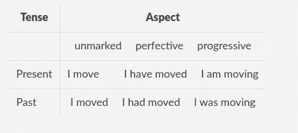

动词发生的时间:时态和体

正如我们在高中所学的，英语中的被动语态和主动语态。被动语态有进一步的语义子类，但在这篇文章中，我们将停留在高中水平的语法😉

`Mood`是表示动词表达事实(指示语气)还是条件性(虚拟语气)的语法范畴。一些例子是:

```
Sun rises at 6 o'clock here.                           indicative
It is important the manager be informed of the changes subjunctive
```

语气是语法上的，与两个语义概念相关联:情态和`illocution`。`Illocution`一个句子可以被认为是`sentence type`:

```
Go there!                                              imperative
Do you want to go there?                               interrogative
God save the queen!                                    optative
I will see it.                                         declarative
```

`Modality`是一个语义概念，与说话者对事件的可信性、强制性、合意性或现实性的看法和信念有关。英语中的情态可以通过情态动词(`will/would`、`can/could`、`may/might`、`shall/should`、`must`)、情态副词(`maybe`、 `perhaps`、`possibly`、`probably`)、一些从句包括(`wish, it’s time,possible, probable, chance, possibility`)、一些情态名词(`decree`、`demand`、`necessity`、`requirement`、`request`、 *)* 或一些情态形容词(`advisable`、`crucial`、 `imperative`、`likely`、`probable`来实现

```
I would love you if things were different                irrealis
You may go                                               permission
I may come with you too                                  possibility
I might come with you too                                possibility
I must go                                                obligation
He must be earning good money                            necessity
I can ride a bike                                        ability
I can come with you too                                  possibility
It is possible that we might see big changes around us.  possibility
It might be the truth                                    doubt
I'm sure they'll come                                    confidence
Lights are on, so he must be in the office             evidentiality
```

从现在开始，我们将看到客户用来与对话代理交互的不同语言特征，以及这些用法如何导致不同的语义。

让我们从我们的 [**Chris**](https://www.youtube.com/watch?v=Qwnjszu3exY) 开始，我们的汽车语音助手，看看汽车对话人工智能中的一些典型用户话语。

克里斯数据集包括许多祈使句:

```
navigate
navigate home
start navigation
stop navi
play Britney Spears
play music
send a message
read my messages 
```

有时话语只包含一个名词短语:

```
music
die navigation
new messages
```

粒子始终是任何语音助手对话数据集的一部分:

```
yes
no
please
yes please
```

当然，有些咒骂和侮辱也包括在内，有些是以讽刺的形式:

```
you suck
you are dumb
you are miserable
a**chloch
you are so intelligent (!)
```

Chris 是一名司机助理，所以说话简洁明了是很正常的。这不是因为粗鲁或粗鲁，只是因为一个人开车时需要说得简短。对比下面两句话，显然，如果你在开车，第一句更容易:

```
Hey Chris, drive me home
Hey Chris, shall we drive home together?
```

祈使句在 SLU 很常见，绝对没有粗鲁的意思，也与说话人的情绪无关。这里真的没什么有趣的，第一组话语有祈使语气，主动语态和无标记体的动词。没有情态动词，没有情态表达或过去式。在这种情况下，语音助手的情感最好从语音信号中计算出来。


克里斯既有礼貌又聪明

到目前为止，口语可能不是很令人兴奋，那么我们可以转向书面语，书面语允许更长的句子，因此有更多的动词形式😄我使用[女性电子商务服装评论](https://www.kaggle.com/nicapotato/womens-ecommerce-clothing-reviews)数据集来探索语言特征的使用。我将使用可爱的空间匹配器(绝对不仅仅因为我是一个贡献者😄)这一节。该数据集包括用户对电子商务网站购物的评论和评级。

在开始之前，让我们记住与动词相关的词性标记，因为我们将主要复习动词。英语动词有五种形式:基底(`VB` 、`VBP`)、-s ( `VBZ`)、-ing ( `VBG`)、过去(`VBD`)、过去分词(`VBN`)。同样，未来时间没有标记。情态动词`can`、`could`、`might`、`may`、`will`、`would`承认标记`MD`。

## 声音

先说`Voice`，被动语态的匹配模式有`is/was adverb* past-participle-verb`和`have/has/had been adverb* past-participle-verb`。对应的`Matcher`图案可以是:

```
{"TEXT": {"REGEX": "(is|was)"}}, {"POS": "ADV", "OP": "*"}, {"TAG": "VBN"}
and 
{"LEMMA": "have"}, {"TEXT":"been"}, {"POS": "ADV", "OP": "*"}, {"TAG": "VBN"}
```

第一种模式是`is/was`，后跟任意数量的副词，然后是过去分词动词。 `POS`用于 [UD POS 标签](https://universaldependencies.org/u/pos/)，而`TAG`用于扩展 POS。第二种模式类似:`have`、`has`、`had`用`lemma : have`表示。

我将首先导入空间，加载英语模型，然后将这两条规则添加到`Matcher`对象中:

```
import spacy
from spacy.matcher import Matchernlp = spacy.load("en_core_web_sm")
matcher = Matcher(nlp.vocab)

pass1 = [{"TEXT": {"REGEX": "(is|was)"}}, {"POS": "ADV", "OP": "*"}, {"TAG": "VBN"}pass2 = [{"LEMMA": "have"}, {"TEXT":"been"}, {"POS": "ADV", "OP": "*"}, {"TAG": "VBN"}]matcher.add("pass1", None, pass1)
matcher.add("pass2", None, pass2)
```

然后我对数据集运行`Matcher`，这里有一些被动语态的例子，来自正面和负面评论:

```
one wash and this was ruined!washed them according to directions and they were ruined.this could not have been returned fasteri kept it anyway because the xs has been sold out, and got it taken in a bit.it is simply stunning and indeed appears to have been designed by an artist.would buy this again in several different colors if they were offeredif these were presented in other colors, i would buy those as well
```

评论中被动语态动词的数量如何与评论评级相关联？首先，我们来看看点评的评分分布:

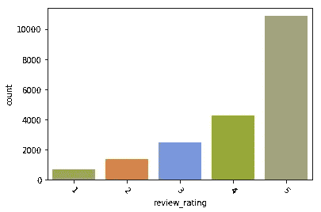

查看评级分布。显然许多顾客都很满意

接下来，我们看到评论中被动语态动词计数的分布。许多评论根本不包括被动语态，有些评论只有一个被动动词，很少有评论有一个以上的被动结构。

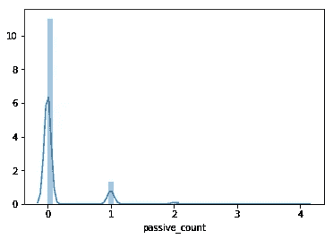

被动语态动词的数量与评论评分相关吗？从下面来看，确实没有(只看热图就足够了，它指出了根本没有相关性)。

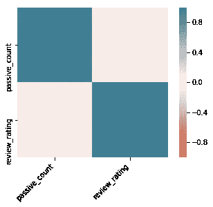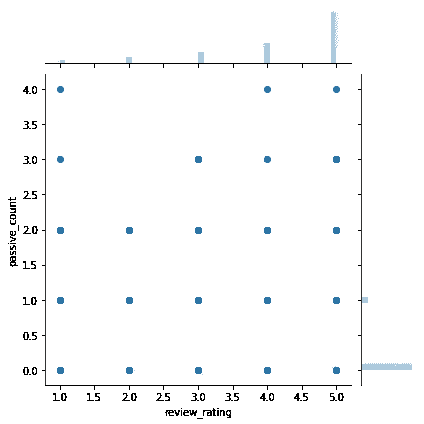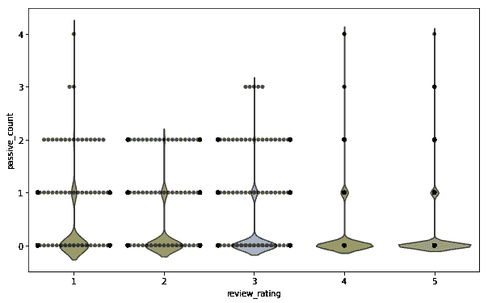

热图、jointplot 和 violin plot 用于评论评级和被动动词计数

毫不奇怪，看看语料库中的句子，被动语态可以是“由著名设计师设计的”或“它们被退回来了”。当提到衣服时，它是如何设计、裁剪和完成的，可以是正面的也可以是负面的；它被归还，毁坏，呈现可以是消极的也可以是积极的。

## 时态和体

让我们看看动词时态和体的时间如何与评论评分相关联。记住，过去时态和现在时态很容易计算(通过观察动词的词形变化)，而将来时不是真正的时态，因为没有词形变化。我们将通过计算`will`、`going to`和时间副词来计算未来时间出现的次数。

这次我们可以用`Matcher`句型再做一遍时态表:


时态和体，这次是用空间匹配模式

我还会数`present perfect progressive tense`(“一直在做”)和`past perfect progressive tense`(“一直在做”)，它们会对现在时态和过去时态的完成体和进行体计数做出贡献。

以下是评论中使用的时态和体式的一些例子:

```
I love, love, love this jumpsuit. it's fun, flirty, and fabulous! every time i wear it, i get nothing but great compliments!fits nicely! i'm 5'4, 130lb and pregnant so i bough t medium to grow into.I have been waiting for this sweater coat to ship for weeks and i was so excited for it to arrive. this coat is not true to size and made me look short and squat.I have been searching for the perfect denim jacket and this it!I had been eyeing this coat for a few weeks after it appeared in the email, and i finally decided to purchase it to treat myself.
```

未来的时间呢？既然没有形态标记，我们可以从`will`、`going to`、`plan to`、`in 2/5/10 days`、`next week/month/summer`、`the day after tomorrow` …

对应的`Matcher`图案可以是:

```
future_modal = [{"TEXT": "will", "TAG": "MD"}]future_adv = [{"TEXT": {"REGEX": "(plan(ning) to|(am|is|are) going to)"}}time_expr1 = [{"TEXT": {"REGEX": "((next|oncoming)(week|month|year|summer|winter|autumn|fall|)|the day after tomorrow)"}}]time_expr2 = [{"TEXT": "in"}, {"LIKE_NUM": True}, {"TEXT": {"REGEX":"(day|week|month|year)s"}}]
```

语料库中的例子有:

```
sadly will be returning, but i'm sure i will find something to exchange it for!I love this shirt because when i first saw it, i wasn't sure if it was a shirt or dress. since it is see-through if you wear it like a dress you will need a slip or wear it with leggings.Just ordered this in a small for me (5'6", 135, size 4) and medium for my mom (5'3", 130, size 8) and it is gorgeous - beautifully draped, all the weight/warmth i'll need for houston fall and winter, looks polished snapped or unsnapped. age-appropriate for both my mom (60's) and myself (30's). will look amazing with skinny jeans or leggings.This will be perfect for the mild fall weather in texasThere's no extra buttons to replace the old one with and i'm worried more of the coat is going to fall apart.This is going to be my go to all season.i plan to wear it out to dinner for my birthday and to a house party on new years day....i am planning to exchange this and hoping it doesn't happen againit is nice addition to my wardrobe and i am planning to wear it to the multiple occasionthis is one of those rare dresses that looks good on me now and will still look good on me in 6 months when i've got a huge belly.
```

根据下面的统计，顾客经常使用过去式。现在时也广泛使用，而未来时间在每次复习中使用一到两次。

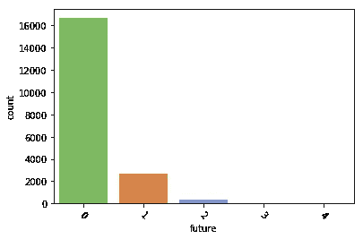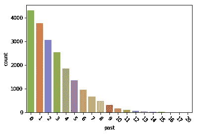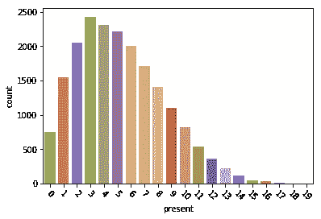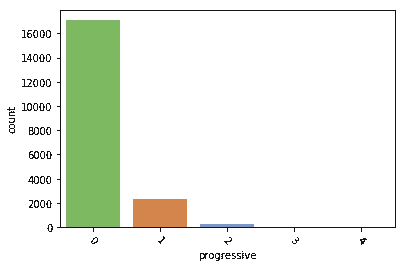

以下是相应的直方图:

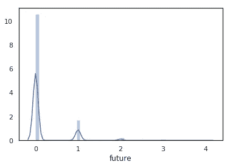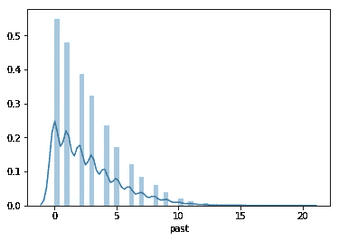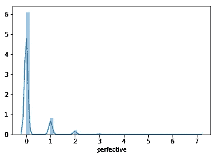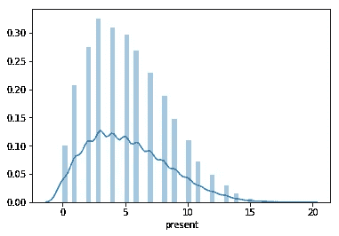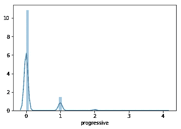

对应直方图

根据下面的热图，现在时和将来时的用法与评分并不真正相关；负面评价和正面评价都包括这两个时态动词。但是，过去式看起来有点负相关；更多地使用过去式意味着更差的评分。完美和进步方面看起来也不太好，它们也有点负相关。

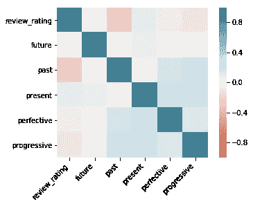

时态和体的热图

下面的脊线图显示了一些信息，更好的评论倾向于使用 0 的过去式；不快乐的顾客倾向于更流畅地使用过去式。一个可能的解释是顾客抱怨很多:“包裹来晚了”、“腰围不合适”、“我拉不上拉链”、“我不喜欢它”；而快乐的顾客则展望未来😄当我们更快乐的时候，我们都会展望未来，不是吗？😉

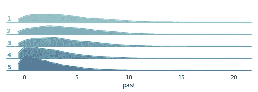

## 语气和情态

正如我们所见，情态是一个语义概念，同一个情态可以给出不同的情态。让我们看一个例子中引入的不同语义`could`:

```
i love that i could dress it up for a party, or down for work.
                                                         possibility
the straps are very pretty and it could easily be nightwear too.
                                                         possibilitythis is a light weight bra, could be a little more supportive. pretty color, with nice lines.                              irrealisI bought this and like other reviews, agree that the quality probably could be better, but i still love it enough to keep.
                                                            irrealis
got it on sale, but it still could've been cheaper.
                                                            irrealis
Bought a large, could barely pull up over my butt.
                                                             ability
```

`could`与消极和积极情绪都相关。可能性情绪看起来是积极的，而非现实情绪看起来既积极又消极。

那么`couldn't`呢？这完全是另外一个故事，下面的例子显示了`couldn't`为消极和积极情绪提供了多少语义丰富性，尽管几乎所有的例子都只包括一种类型的情态:

```
so small in fact that i could not zip it up!                 abilityi was so excited to get his dress for my wedding shower and then i couldn't wear it :(                                          abilityi really tried because the fabric is wonderful and the shirt is light and breezy for summer, i just couldn't make it work    abilityi simply couldn't resist! i could not be more pleased and regret not having bought this item earlier, since i would have enjoyed wearing it during the holidays.i could not be happier with the purchase and the keyhole in the back is a beautiful detail.                                                          
                                                 emphasizing opinioni also thought that this was very heavy for a maxi dress and could not imagine wearing it in 80 degree weather.               ability i think it's maybe a little too long (or short, i can't figure it out) but i couldn't pass up this skirt because the pattern is so pretty.                                                     ability i just wish it was more of a blue denim blue but nonetheless, i could not walk away from the store without this.           ability 
```

`would`和`wouldn't`可能感觉不同，但从统计上看，它们与`could`和`couldn't`相似:

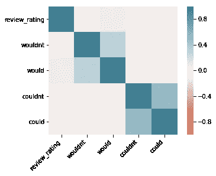

模式和审查评级相关矩阵

不真实既发生在负面评价中，也发生在正面评价中。考虑:

```
maybe if i weren't as small chested this wouldn't be an issue for me. i definitely recommend this tee.the neckline wouldn't even stay up on my upper body, it was that loose.
```

那么毫不奇怪的是,`would/wouldn’t/could/couldn’t`的出现并没有透露太多的评论情绪。

相应的`Matcher`模式将是

```
[{"TEXT": {"REGEX": "(would|could|can|might|may)"}, "TAG": "MD"}]
```

`MD`是情态动词标签，我们排除`will`。

亲爱的读者们，本文到此结束。我们和 spaCy 玩得很开心，不是吗(像往常一样)？😃我们每天都要处理大量的数据，但有时我们会忘记阅读语料库中的内容。语言不仅仅是一堆凑在一起的单词；它有许多方面，包括统计和语言学。今天我们两个都喜欢。下次我们将继续语音助手的统计讨论。直到下一次，你总是可以在[https://chris.com](https://chris.com/)拜访克里斯。你也可以随时登陆 [https://duygua.github.io](https://duygua.github.io) 来看我。同时保持快乐、安全和和谐！

## **参考文献**

帕尔默，F. (2001)，语气和情态(第二版。，剑桥语言学教科书)。剑桥:剑桥大学出版社。doi:10.1017/CBO 978113916716717