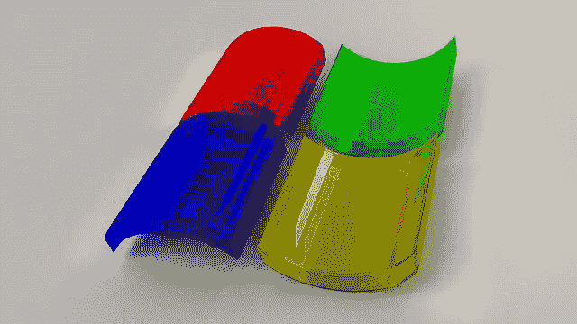
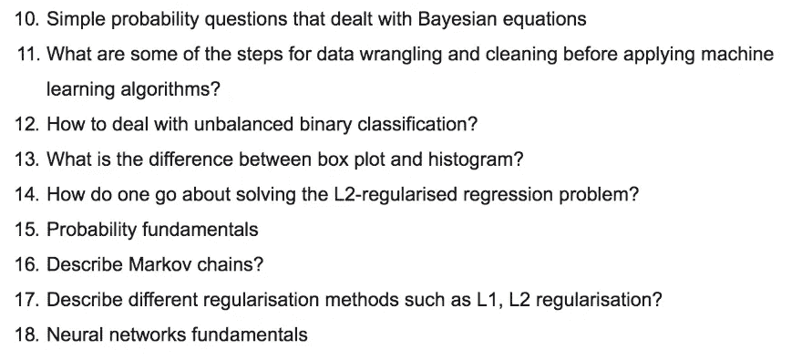
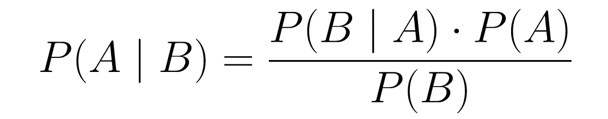
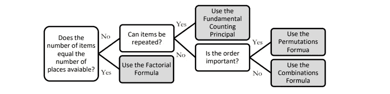
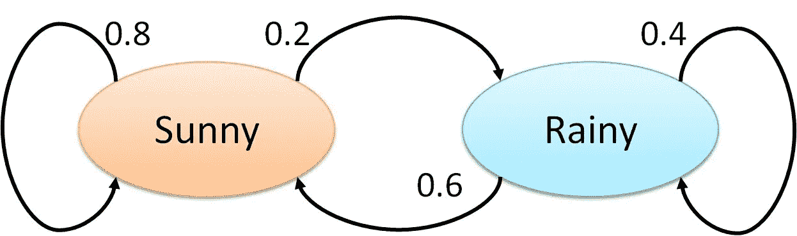
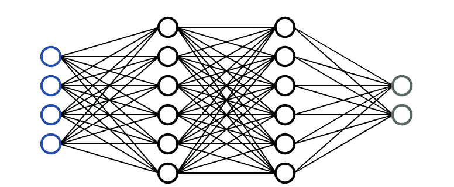

# 更多微软数据科学面试问题和答案

> 原文：<https://towardsdatascience.com/more-microsoft-data-science-interview-questions-and-answers-f9ee8337072c?source=collection_archive---------20----------------------->

## 微软面试中一些数据科学问题的另一个演练

几周前，我发表了一篇文章叫做**[**微软数据科学面试问答！**](/microsoft-data-science-interview-questions-and-answers-69ccac16bd9b)**它涵盖了我的朋友在微软一个数据科学家职位的面试中提供给我的十八个问题中的前九个。本周，我将尽我所能回答剩下的九个问题。开始了。****

# ****面试问题****

********

****来自微软数据科学面试的面试问题****

# ****问:处理贝叶斯问题的简单概率问题****

****答:我的猜测是，他们可能会问一些关于贝叶斯定理的一般性问题，并要求在给定其他变量的值的情况下，找出一个变量的值。我将通过一个例子简单介绍一下什么是贝叶斯定理。****

********

******P(A|B)** 是假设事件 B 发生时事件 A 发生的概率
**P(B|A)** 是假设事件 A 发生时事件 B 发生的概率
**P(A)** 是事件 A 发生的概率 **P(B)** 是事件 B 发生的概率****

****我将用一个例子来说明这一点:****

*   ****P(A)等于患者患有肝病的概率。过去有 10%的病人患有肝病。因此 P(A) = 0.1****
*   ****P(B)等于病人是酗酒者的概率。过去看过的病人中有 5%是酗酒者。因此 P(B) = 0.05****
*   ****你也知道 7%被诊断为肝病的患者也是酗酒者。因此 P(B|A) = 0.07****
*   ****利用贝叶斯定理，可以得出:
    **P(A | B)=(0.07 * 0.1)/0.05 = 0.14** 因此，如果患者是一个酗酒者，他们有 14%的几率患有肝病。****

****如果贝叶斯定理仍然让你困惑，3Blue1Brown 以一种视觉和直观的方式做出了令人难以置信的解释——见[这里](https://www.youtube.com/watch?v=HZGCoVF3YvM)。****

# ****问:在应用机器学习算法之前，数据争论和数据清洗的一些步骤是什么？****

****答:在数据争论和数据清理时，可以采取许多步骤。下面列出了一些最常见的步骤:****

*   ******数据剖析:**几乎每个人都是从了解自己的数据集开始的。更具体地说，您可以使用。形状和对数值变量的描述。描述()。****
*   ******数据可视化:**有时，用直方图、箱线图和散点图来可视化数据很有用，这样可以更好地理解变量之间的关系，也可以识别潜在的异常值。****
*   ******语法错误**:这包括确保没有空格，确保字母大小写一致，检查错别字。您可以使用。unique()或使用条形图。****
*   ******标准化或规范化**:根据您正在处理的数据集和您决定使用的机器学习方法，标准化或规范化您的数据可能会很有用，这样不同变量的不同尺度就不会对您的模型性能产生负面影响。****
*   ******处理空值:**有多种方法可以处理空值，包括完全删除具有空值的行，用均值/中值/众数替换空值，用新的类别(例如未知)替换空值，预测值，或者使用可以处理空值的机器学习模型。*此处阅读更多***。******
*   *******其他还有:**去除无关数据，去除重复，类型转换。*****

# *****问:如何处理不平衡的二元分类？*****

*****答:有许多方法可以处理不平衡的二进制分类(假设您想要识别少数类):*****

*   *****首先，您需要重新考虑您用来评估您的模型的**指标**。你的模型的准确性可能不是最好的衡量标准，因为我将用一个例子来解释为什么。假设 99 次银行取款不是欺诈，1 次取款是欺诈。如果你的模型只是简单地将每个实例归类为“非欺诈”，那么它的准确率将达到 99%！因此，您可能需要考虑使用精度和召回率等指标。*****
*   *****另一个改善不平衡二进制分类的方法是通过**增加**小众类的误分类成本。通过增加这样的惩罚，该模型应该更准确地对少数民族进行分类。*****
*   *****最后，你可以通过**过采样**少数类或者**欠采样**多数类来改善类的平衡。你可以在这里阅读更多关于它的信息。*****

# *****问:箱形图和直方图有什么区别？*****

**********

*****箱线图与直方图*****

*****答:虽然箱线图和直方图是用于显示数据分布的可视化工具，但它们传达信息的方式不同。*****

*****直方图是显示数值变量值的频率的条形图，用于估计给定变量的概率分布。它允许您快速了解分布的形状、变化和潜在的异常值。*****

*****箱线图表达了数据分布的不同方面。虽然您无法通过箱线图看到分布的形状，但您可以收集其他信息，如四分位数、范围和异常值。当您想要同时比较多个图表时，箱线图尤其有用，因为它们比直方图占用更少的空间。*****

**********

*****如何阅读箱线图*****

# *****问:如何着手解决 L2 正则化回归问题？*****

*****A: *不幸的是，我对岭回归的了解还不足以知道 L2 回归问题是什么，但是如果你知道，请评论你的答案，我会在这里大声喊出来！******

# *****问:概率基础*****

*****答:*为此，我打算在这里看一下八大概率法则***以及四种不同的计数方法(详见* [*这里*](https://78bbm3rv7ks4b6i8j3cuklc1-wpengine.netdna-ssl.com/wp-content/uploads/tutoring/handouts/Fundamentals-of-Probability.pdf) *)。*******

## ******概率的八大法则******

*   ******规则#1:对于任何事件 A，**0≤P(A)≤1**；*换句话说，一个事件发生的概率范围可以从 0 到 1。*******
*   ******规则 2:所有可能结果的概率总和总是等于 1。******
*   ******规则#3: **P(非 A)= 1—P(A)**；*这个规律解释了一个事件的概率和它的补事件之间的关系。补充事件是指包含 a 中没有的所有可能结果的事件*******
*   ******规则#4:如果 A 和 B 是不相交事件(互斥)，那么 **P(A 或 B)= P(A)+P(B)**；*这被称为不相交事件的添加规则*******
*   ******规则#5: **P(A 或 B) = P(A) + P(B) — P(A 和 B)**；*这就是所谓的一般加法法则。*******
*   ******规则#6:如果 A 和 B 是两个独立事件，那么 **P(A 和 B)= P(A)* P(B)**；*这叫做独立事件的乘法法则。*******
*   ******规则#7:给定事件 A，事件 B 的条件概率为 **P(B|A) = P(A 和 B) / P(A)********
*   ******规则#8:对于任意两个事件 A 和 B， **P(A 和 B)= P(A)* P(B | A)**；*这叫做一般乘法法则*******

## ******计数方法******

************

********阶乘公式:n！= n x(n-1)x(n-2)x…x 2 x 1** 当项目数等于可用位置数时使用。*例如:找出 5 个人可以坐在 5 个空座位上的总数。
= 5×4×3×2×1 = 120*******

********基本计数原理(乘法)** 当允许重复且填充空位的方式数不受先前填充的影响时，应使用此方法。有 3 种早餐、4 种午餐和 5 种甜点。组合总数= 5 x 4 x 3 = 60******

********排列:P(n，r)= n！/(n r)！
一个代码有 4 个特定顺序的数字，数字范围从 0 到 9。如果一个数字只能用一次，有多少种排列？
P(n，r) = 10！/(10–4)!=(10 x 9 x 8 x 7 x 6 x 5 x 4 x 3 x2 x 1)/(6x 5 x 4 x 3 x2 x 1)= 5040********

********组合公式:C(n，r)=(n！)/[(n r)！r！]** 当不允许替换并且项目的排列顺序不重要时使用。要赢得彩票，你必须从 1 到 52 中以任意顺序选出 5 个正确的数字。有多少种可能的组合？
C(n，r) = 52！/ (52–5)!5!= 2598960******

# ******问:描述马尔可夫链？******

************

******答:Brilliant 提供了一个很棒的马尔可夫链定义([此处](https://brilliant.org/wiki/markov-chains/)):******

> ******“马尔可夫链是一个数学系统，它根据某些[概率](https://brilliant.org/wiki/probability-rule-of-product/)规则经历从一种状态到另一种状态的转换。马尔可夫链的定义特征是，无论[过程](https://brilliant.org/wiki/stochastic-processes/)如何到达其当前状态，可能的未来状态都是固定的。换句话说，转换到任何特定状态的概率只取决于当前状态和经过的时间。”******

******马尔可夫链背后的实际数学需要线性代数和矩阵的知识，所以我会在下面留下一些链接，以防你想自己进一步探索这个主题。******

*******查看更多* [*此处*](https://www.dartmouth.edu/~chance/teaching_aids/books_articles/probability_book/Chapter11.pdf) *或* [*此处*](/brief-introduction-to-markov-chains-2c8cab9c98ab) *。*******

# ******问:描述不同的正则化方法，如 L1 和 L2 正则化？******

************

******答:L1 和 L2 正则化都是用于减少训练数据过拟合的方法。最小二乘法使残差平方和最小，这可能导致低偏差但高方差。******

******L2 正则化，也称为岭回归，最小化残差平方和**加上λ乘以斜率平方**。这个附加项被称为**岭回归惩罚**。这增加了模型的偏差，使得对训练数据的拟合更差，但是也减少了方差。******

******如果采用岭回归罚分并用斜率的**绝对值**替换它，则得到套索回归或 L1 正则化。******

******L2 不太稳健，但有一个稳定的解决方案，而且总是一个解决方案。L1 更稳健，但是具有不稳定的解，并且可能具有多个解。******

******StatQuest 有一个关于套索和山脊回归的惊人视频[这里](https://www.youtube.com/watch?v=NGf0voTMlcs)。******

# ******问:神经网络基础******

************

******答:**神经网络**是受人脑启发的多层模型。就像我们大脑中的神经元一样，上面的圆圈代表一个节点。蓝色圆圈代表**输入层，**黑色圆圈代表**隐藏层，**绿色圆圈代表**输出层。**隐藏层中的每个节点代表输入经过的功能，最终导致绿色圆圈中的输出。这些功能的正式术语称为**s 形激活功能**。******

******如果你想要一步一步的创建神经网络的例子，请点击这里查看 Victor Zhou 的文章。******

******如果你是一名视觉/音频学习者，3Blue1Brown 在 YouTube 上有一个关于神经网络和深度学习的惊人系列[这里](https://www.youtube.com/watch?v=aircAruvnKk)。******

# ******感谢你的阅读！******

******如果你喜欢我的工作并想支持我，请在我的电子邮件列表[这里](https://terenceshin.typeform.com/to/fe0gYe)注册，成为第一个听到新的独家内容的人！:)******

# ******更多相关文章******

****** [## 微软数据科学面试问答！

### 微软面试中一些数据科学问题的演练

towardsdatascience.com](/microsoft-data-science-interview-questions-and-answers-69ccac16bd9b)  [## 谷歌的数据科学面试脑筋急转弯

### 作为谷歌数据科学面试的一部分，他们喜欢问一些他们称为“解决问题”的问题…

towardsdatascience.com](/googles-data-science-interview-brain-teasers-7f3c1dc4ea7f)  [## 数据科学家的 5 个常见 SQL 面试问题

### 帮助您发展 SQL 技能，在任何面试中胜出

towardsdatascience.com](/5-common-sql-interview-problems-for-data-scientists-1bfa02d8bae6)  [## 数据科学家的 40 个统计面试问题和答案

### 为你的面试复习统计知识的资源！

towardsdatascience.com](/40-statistics-interview-problems-and-answers-for-data-scientists-6971a02b7eee)  [## 亚马逊的数据科学家面试实践问题

### 一些亚马逊面试问题的演练！

towardsdatascience.com](/amazon-data-scientist-interview-practice-problems-15b9b86e86c6)******