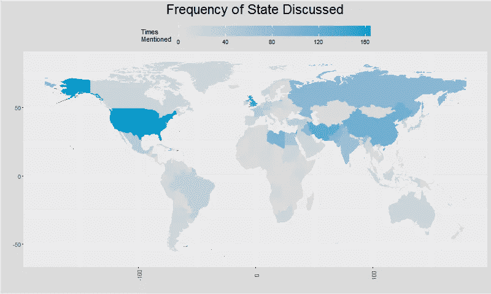
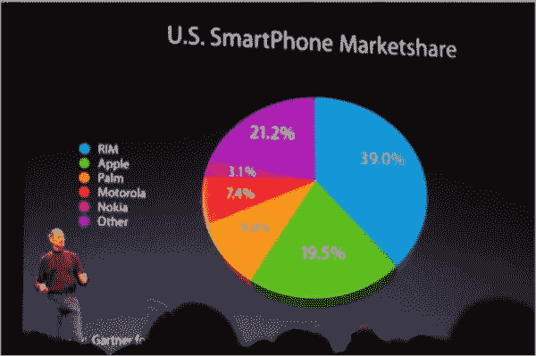

# 不仅仅是漂亮的图表

> 原文：<https://towardsdatascience.com/more-than-just-pretty-graphs-c402ac8da52a?source=collection_archive---------46----------------------->

从[托比亚斯·菲舍尔](https://unsplash.com/@tofi)在 [Unsplash](https://unsplash.com/photos/PkbZahEG2Ng)

## 大数据可视化的重要性

很多时候，局外人认为数据分析师和科学家的工作只是处理数字。我们中那些真正实践过从数据中提取洞见的科学和艺术的人知道，这项工作至少与分析一样具有创造性。数据团队在组织中的角色基本上是用数据讲述故事。那么，为什么如此多的数据团队没有使用他们可用的最强大的通信工具呢？

即使是经验丰富的数据科学家也经常将数据可视化归入数据分析的探索阶段。他们没有在数据分析过程中最重要的阶段使用 dataviz:交流他们的结果。这些数据专家忘记的是，并不是每个人都像他们一样思考。虽然数字或表格对于有丰富理解经验的人来说很有意义，但大多数人更擅长解释数据的可视化表示。

在这篇文章中，我强调了数据可视化对于帮助数据科学家和数据消费者更好地理解数据集至关重要的几个具体例子。这些例子并不全面，但是它们可以帮助你思考和理解数据可视化的价值。最后，我引用了史蒂夫·乔布斯操纵数据的一个具体例子，警告欺骗性或其他不良数据可视化的危险。

## 模式识别

你是否曾经看着一张表格，却被它弄糊涂了，只是为了可视化数据，并意识到有一个清晰的模式？有效的数据可视化表示允许我们识别当数据用数字表示时不明显的模式。模式可以是任何东西，从认识到增长是指数的(例如，与线性或随机相反)，到证明两个变量之间的相关性。

## 相对值

比较相对价值是人脑比数字更擅长直观理解图像的另一个领域。饼图和圆环图、条形图、直方图和树形图都有助于以易于理解的方式阐明事物的相对大小、价值或数量。

以这个视频为例，它试图给人一种印象，与我们宇宙中的其他物体相比，地球是多么的小。虽然创造者可以简单地列出这些物体的体积(地球是 1 万亿立方千米，而太阳是 1.409 x 1⁰ ⁸立方千米)，但他们正确地评估了为了让人们对宇宙的大小有一个真正直观的感觉，直观地显示物体的体积会更好。

## 地理空间信息

地理空间信息是一种绝对需要可视化的数据。在这个领域，我们认为图形、非表格数据是理所当然的，但重要的是要记住，表格形式的地理空间数据基本上是无用的。

摘自我的分析[“HRC 写的是哪里”](https://medium.com/@dleybzon/where-does-hrc-write-about-d38cef60bbaf)

左边是一个表示地理空间数据的最基本(也是最有效)方法的例子:地图。具体来说，这是一个 choropleth 地图，这意味着陆地被划分为区域(在这种情况下是国家)，然后根据统计数据(在这种情况下是希拉里·克林顿在她的国务院电子邮件中提到特定国家的次数)进行着色。想象一下这个数据以表格的形式出现是什么样子:一列是国家的名称，另一列是那个国家被提及的次数。这个表很长(超过 150 行)，很难破译。可视化很快告诉我们哪些国家经常被提及(中国、俄罗斯、英国、伊朗和利比亚)，哪些国家很少被提及(蒙古、撒哈拉以南非洲国家)。

## 能力越大，责任越大

不幸的是，使用数据可视化来欺骗而不是告知太容易了。对于数据分析师工具包中的其他工具也是如此，但是对于数据可视化来说，特别容易陷入欺骗的陷阱。

滥用可视化的一个著名例子；请注意 3D 饼图如何让 19.5%的苹果市场份额看起来比 21.2%的“其他”市场份额大

以史蒂夫·乔布斯在 2008 年 MacWorld 博览会上展示的 3D 饼图为例。一个不经意的观察者可能会认为苹果智能手机的市场份额大于“其他”类别的市场份额，因为绿色部分似乎大于紫色部分。然而，如果你比较切片上的数字，你可以看到“其他”类别实际上有 21.2%的市场份额，而苹果只有 19.5%的市场份额。这是否是史蒂夫·乔布斯的故意混淆视听尚有争议，但效果是显而易见的。

## 让 dataviz 再次变得伟大

正如我在[的另一篇文章](https://medium.com/nightingale/bad-data-visualization-in-the-time-of-covid-19-5a9f8198ce3e)中所写的，我最近看到了很多糟糕的数据可视化。作为数据消费者，我们必须对媒体制作者提出更多要求，让他们知道他们不能逃避草率或误导性的数据可视化。相反，作为数据传播者(数据科学家、分析师、记者)，我们必须努力使数据可视化，不仅在视觉上引人注目，而且信息丰富，不会误导。数据不仅仅是美丽的。它是一个强大的工具，可以帮助人们在从个人生活到治理的方方面面做出关键决策。让我们以最好的方式使用我们的工具。