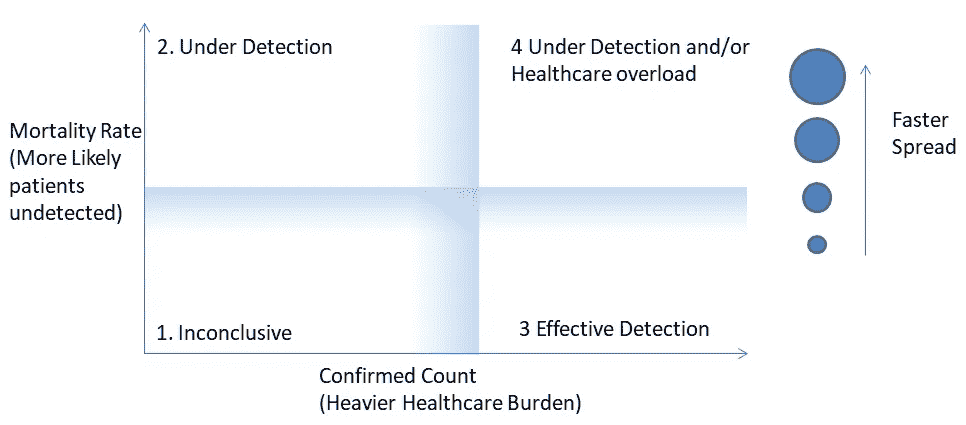
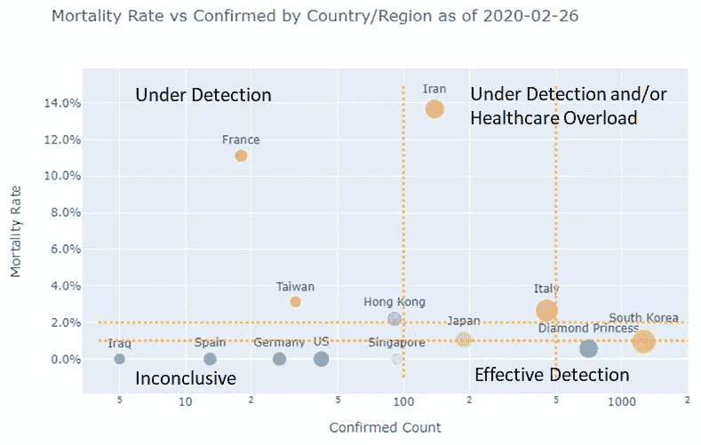
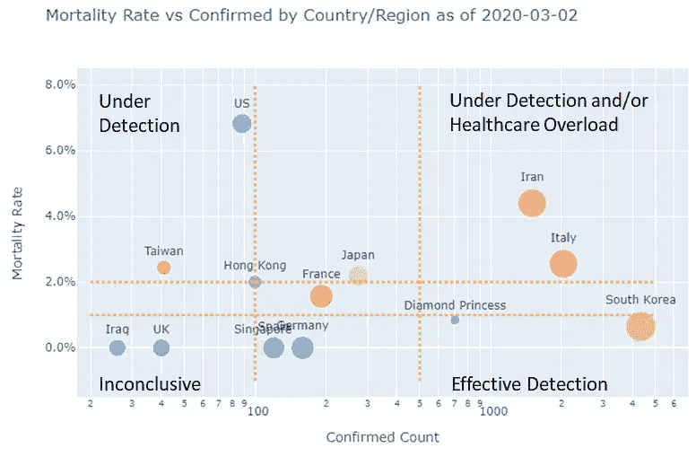

# 死亡率作为流行病爆发的指标

> 原文：<https://towardsdatascience.com/mortality-rate-as-an-indicator-of-an-epidemic-outbreak-704592f3bb39?source=collection_archive---------28----------------------->

## 我们可以从冠状病毒死亡率的不可靠估计中推断出什么？

马库斯·斯皮斯克在 [Unsplash](https://unsplash.com/s/photos/virus?utm_source=unsplash&utm_medium=referral&utm_content=creditCopyText) 上的照片

冠状病毒已经蔓延到世界上许多国家，并在许多地方引起恐慌。一个主要的讨论是关于估计死亡率。众所周知，死亡率的估计是非常不可靠的，原因有很多。举个例子，

## 死亡率估计值可能过低，因为:

*   重症患者可能会在检测前死亡
*   当地官员可能会隐瞒死亡人数
*   今天的死亡人数是由许多天前的病人造成的(关于这种“滞后”效应的更多细节在我的[上一篇文章](/behind-the-coronavirus-mortality-rate-4501ef3c0724)中讨论过)
*   ……

## 死亡率估计值可能过高，因为:

*   症状较轻的患者可能不会感到不适而寻求医疗帮助
*   患者可能不符合当地政府的检测标准，因此无法得到确认
*   由于人为错误、取样错误、疾病的早期阶段等，受感染的患者可能具有阴性测试结果
*   ……

对双方来说，这样的例子不胜枚举。并且有大量的文献根据这些影响来调整估计值。但是，我们能从这个不可靠的估计中了解到别的东西吗？

与其关注死亡率本身的值，我们不如用它来表示流行病的爆发状态。例如，我们可以使用死亡率和确诊病例数来跨越一个二维平面，并添加与新确诊病例成比例的气泡大小来指示最近的传播速度。这些可视化大致将平面分成四个区域:

如果我们假设所有国家的“真实”死亡率大致稳定(一个很大的“如果”，但仍然是一个有用的起点)，那么我们可以为每个地区推导出以下公式:

*   区域#1:不确定。该地区确诊数低，死亡率低。没有足够的统计数据来做出可靠的判断。
*   **区域#2:检测中。该地区确诊人数低，但死亡率高，这表明可能有许多未被发现的感染患者(因为症状严重的患者通常被较早发现)。**
*   **区域#3:有效检测。**该地区确诊人数高，但死亡率低。这表明已经发现了许多症状轻微的患者。所以检测被感染的病人可能是有效的。
*   区域#4:保健超负荷和/或检测不足。该地区确诊人数多，死亡率高。这表明卫生保健系统可能超负荷，和/或仍有许多病人未被发现。

这些区域的边界不是清晰的，而是逐渐的。对于死亡率，湖北省以外的中国死亡率 0.5%~2%是一个合理的基线。对于已确认的数量，大约 100~500 是开始淹没医疗系统的合理范围。

应用我们上面陈述的逻辑，我们可以使用[约翰霍普金斯大学的数据](https://github.com/CSSEGISandData/COVID-19)，为一组国家/地区绘制 2020 年 2 月 26 日和一周后 2020 年 3 月 26 日两个不同日期的死亡率与确诊人数的关系图。每个泡沫的大小与新确认计数的 3 天移动平均值的对数成正比。因此，更大的气泡意味着最近确诊了更多病例，这表明(检测到的)病毒正在更快地传播。

从以上情节中，我们可以对各个国家的疫情做出如下判断:

## 法国

它在 2020 年 2 月 26 日处于检测中区域，尽管其小气泡大小表明当时没有多少新病例。

因此，正如预期的那样，一周后的 2020 年 3 月 2 日，其确诊病例在短短一周内从 18 例激增至 191 例，将死亡率降至更典型的 1.6%。

## 伊朗

它在 2020 年 2 月 26 日处于检测中区域，其相对较大的气泡尺寸表明该病毒正在快速传播。如果这种蔓延得不到控制，将来可能会淹没医疗资源。

上述说法可以在 2020 年 3 月 2 日的图中得到证实，在那里，伊朗已经进入检测不足和/或医疗保健超载区域，泡沫尺寸甚至更大。因此，我们可以说**伊朗可能仍然有大量未被发现的病人，医疗保健系统可能开始超负荷运转。**

## 美国

截至 2020 年 2 月 26 日，它位于非决定性区域。所以相对比较安静。

然而，在 2020 年 3 月 2 日，美国明显位于检测不足区域。这与一周前法国的情况类似，但有更多的已确认数据和更大的泡沫尺寸。这表明，一周前，美国可能比法国有更多未被发现的感染者。这是一个强烈的警告信号。因为如果我们预计美国的死亡率会下降到与法国相似的 0.5~2%的水平，我们会推断出成百上千甚至上千的感染者仍然没有被发现。

另一方面，我们必须意识到，截至 2020 年 3 月 2 日，美国六分之五的死亡病例集中在华盛顿州金县的生命护理中心疗养院。众所周知，老年人群的死亡率更高。然而，King 县只有 14 例确诊病例，因此县内死亡率为 35.7%，比任何年龄组的死亡率都高几倍。因此，仍然有理由相信美国处于未被检测到的地区，有数百名患者未被检测到，尽管疗养院的调整使其没有最初显示的那么严重。

## 韩国

它位于 2020 年 2 月 26 日和 2020 年 3 月 2 日的有效探测区域。它拥有世界上最高的确诊数量(除了中国)，同时保持较低的死亡率。但是它巨大的气泡尺寸表明它的主要问题是遏制传播，而不是检测病毒。

## 意大利

在这两个日期，它的情况介于伊朗和韩国之间。

## 德国和西班牙

他们在 2020-02-26 处于非决定性区域，慢慢走向道德为零的**有效探测**区域。然而，他们相对较大的气泡尺寸表明**他们主要关心的是如何遏制病毒**。

## 日本

它一直处于有效检测区域和保健超负荷区域之间。所以他们的病毒检测可能不如德国和西班牙有效。关键是要看他们在不久的将来走向何方。

## 钻石公主

它在 2020 年 2 月 26 日处于有效探测区域。我们知道，飞船上的病毒检测确实非常严格。

在 2020 年 3 月 2 日，它仍然在有效探测区域，但是气泡尺寸减小了。这表明局势已经降温。此外，其死亡率稳定在 0.9%，非常符合 0.5~2%的基线。

# 最后的话

我们可以看到，这个图对于快速评估全球每个国家的相对情况非常有帮助。

此外，通过使用我的 [GitHub](/understanding-the-coronavirus-epidemic-data-44d2fb356ecb) 项目，制作这样一个信息丰富的情节很容易。像往常一样，Google Colab 上的一个功能齐全的 [Python 笔记本](https://github.com/jianxu305/nCov2019_analysis/blob/master/src/international_colab.ipynb)包含在回购中，供读者把玩。

# 承认

我要感谢我的朋友 David Tian，他是一名机器学习工程师，对 Google Colab 的设置提供了慷慨的帮助，并对本文提出了宝贵的建议。看看他有趣的自驾* [DeepPiCar](/deeppicar-part-1-102e03c83f2c) *博客。

参考:

1.  Komo news，3/2/2020: [华盛顿州冠状病毒:6 人死亡，12 人感染](https://komonews.com/news/coronavirus/king-county-to-issue-emergency-declaration-over-coronavirus)
2.  按年龄划分的新冠肺炎死亡率:[https://www . worldometers . info/coronavirus/coronavirus-age-sex-demographics/](https://www.worldometers.info/coronavirus/coronavirus-age-sex-demographics/)