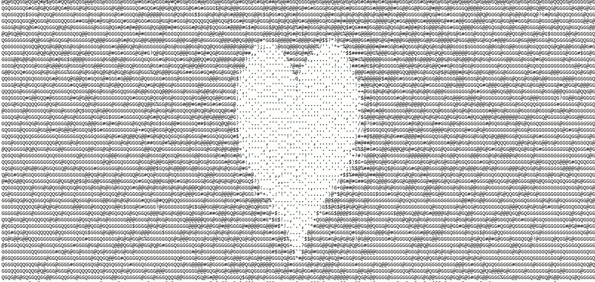
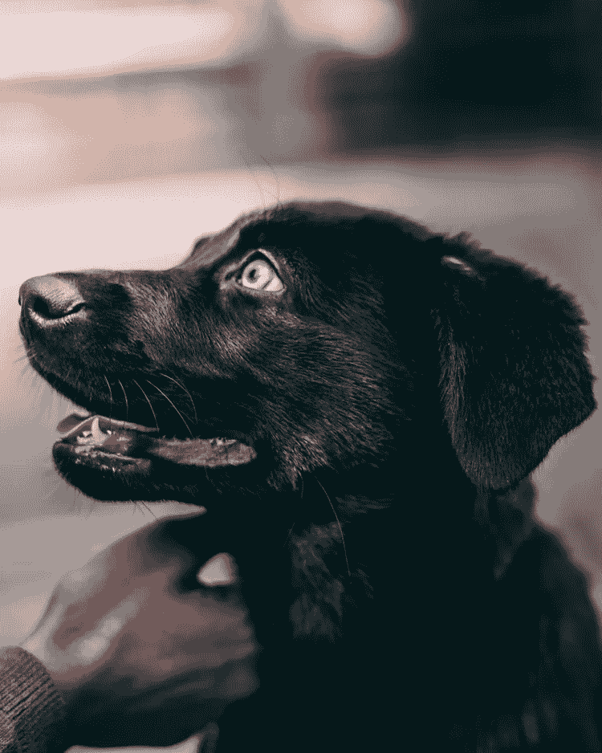
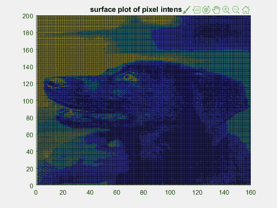
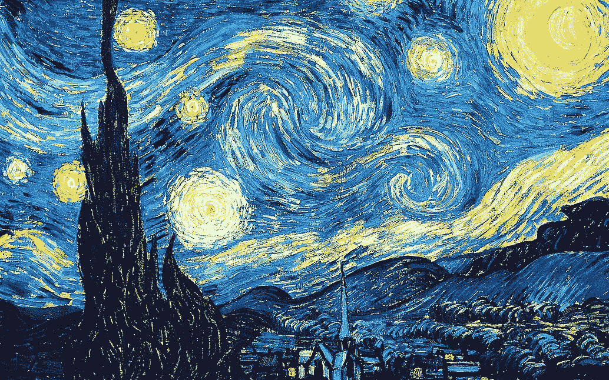
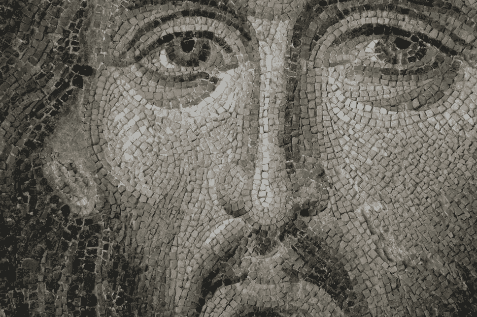
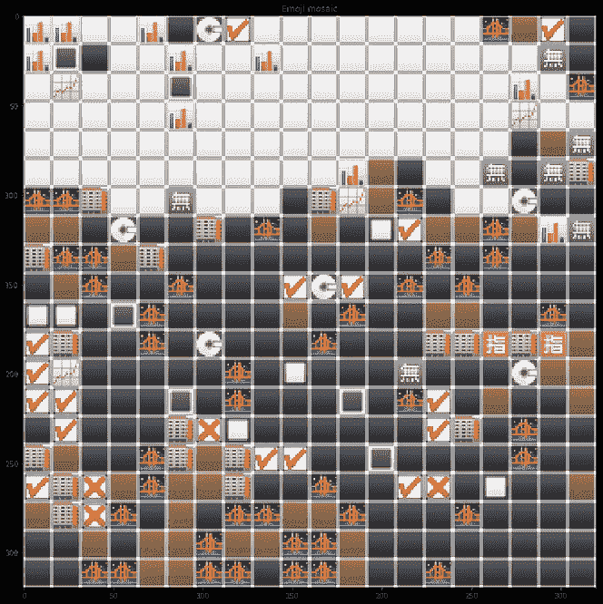
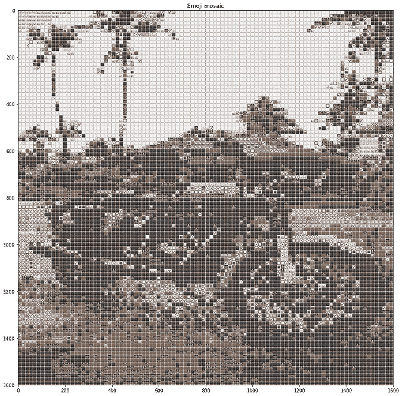
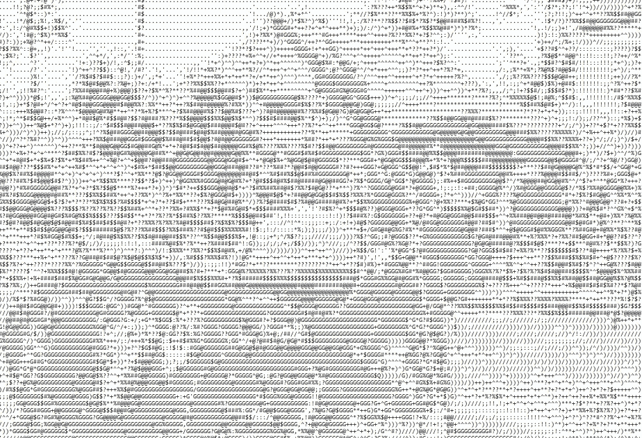
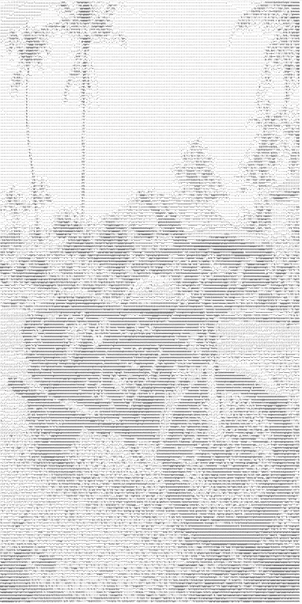
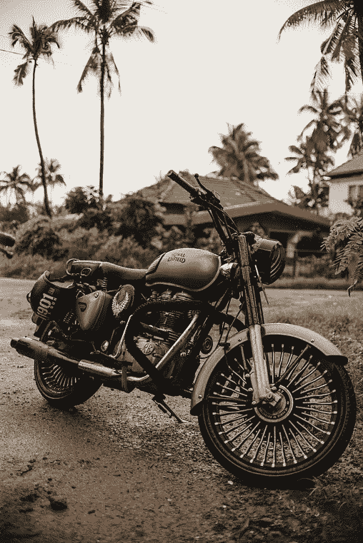

# 使用 Python 的马赛克艺术。

> 原文：<https://towardsdatascience.com/mosaic-art-using-python-422e9c5c130d?source=collection_archive---------40----------------------->

ASCII 艺术图片使用了 [Nicola Fioravanti](https://unsplash.com/@nicolafioravanti?utm_source=unsplash&utm_medium=referral&utm_content=creditCopyText) 在 [Unsplash](https://unsplash.com/s/photos/heart?utm_source=unsplash&utm_medium=referral&utm_content=creditCopyText) 上的照片

## 用表情符号和 ASCII 字符重建图像。

在我的[上一篇文章](/fourier-transforms-and-bed-sheet-view-of-images-58ba34e6808a)中，我探索了一种有趣的表示图像的格式，称为床单视图，以开发傅立叶变换背后的一些直觉。

左边是原图，右边是床单图。图中使用了由 [Unsplash](https://unsplash.com/s/photos/pup-black?utm_source=unsplash&utm_medium=referral&utm_content=creditCopyText) 上的 [Jakob Kac](https://unsplash.com/@jacobbey?utm_source=unsplash&utm_medium=referral&utm_content=creditCopyText) 拍摄的照片

这让我很好奇去探索图像的替代表现，这是当前的主题。在本文中，探索了两种使用 python 构建马赛克“艺术”的有趣方法。第一种方法使用表情符号(比如🏠,🔥,😎…)第二个使用 ASCII 字符。

马赛克传统上是用规则或不规则的小石块或瓷砖制成的图案或图像。马赛克风格的绘画被称为点彩，艺术家使用颜料滴来构建整个图像。文森特·凡高、乔治·修拉和保罗·西涅克是这一流派的几位著名艺术家。

(左)梵高的《星夜》。图片由 [Eric Perlin](https://pixabay.com/users/Perlinator-491438/?utm_source=link-attribution&utm_medium=referral&utm_campaign=image&utm_content=1093721) 从 [Pixabay](https://pixabay.com/?utm_source=link-attribution&utm_medium=referral&utm_campaign=image&utm_content=1093721) 获得。(右)来自土耳其的马赛克艺术。Nick Kwan 在 [Unsplash](https://unsplash.com/s/photos/mosaic?utm_source=unsplash&utm_medium=referral&utm_content=creditCopyText) 上拍摄的照片

图像是由像素组成的数字马赛克。因此，像素可以用其他单位代替来表示同一幅图像。比如表情符号。更具体地说，表情符号的图像。

原始图片由 [Ahmed Nishaath](https://unsplash.com/@nihthu?utm_source=unsplash&utm_medium=referral&utm_content=creditCopyText) 在 [Unsplash (](https://unsplash.com/s/photos/motorcycle?utm_source=unsplash&utm_medium=referral&utm_content=creditCopyText) 最左边)上拍摄。带有 20x20 个表情符号的表情符号马赛克(中间)。有 100x100 个表情符号的表情符号马赛克(最右边)。

这里，我拿了一个 1500 个表情符号的目录。要用表情符号代替一个像素，必须建立一个公平的比较。因此，每个表情符号通过取组成该单独表情符号的所有像素的平均值而被简化为单个 RGB 元组。类似地，评估目录中所有表情符号的平均值。现在，我们希望转换为马赛克形式的图像被加载，每个像素被替换为具有最接近 RGB 值的表情符号(最近邻居)。结果会如上图所示！

自 60 年代以来，使用 ASCII 字符转换图像的类似想法就已经存在，其中使用可打印字符代替表情符号来编写显示图像的文本文件。这里是一个致力于 [ASCII 艺术的网站](https://www.asciiart.eu/)

它曾经非常流行，因为文本处理起来要快得多。但是，技术已经赶上来了，ASCII 艺术今天对编程爱好者来说仍然只是一个遗迹。在 python 中，可以开发简洁的代码来产生以下结果。

原始图像(右)，ASCII 图像(中)，图像特写(左)

这里，图像在调整大小后首先被转换成灰度级。ASCII 字符串是按照每个字符大小的递增顺序构造的。它以实心字符如“#”开始，以较小的字符如“.”结束。图像可以用数量少得惊人的字符连贯地再现。每个像素的灰度级被转换成 256(上限)的比例。基于这个比率，每个像素被替换为我们的原始 ASCII 字符串中的一个字符。

我的 [GitHub](https://github.com/kommalapatisahil/medium/tree/master/Mosaic) 上也有所有的程序。

有趣的是，超过 1500 个表情符号被用来对原始图像进行连贯的复制。然而，第二种方法使用不超过 24 个 ASCII 字符来提供有效的可视化。这并不完全是一个公平的比较，因为与颜色相关的信息在后来丢失了。

将视频转换成 ASCII 格式也很流行，这提供了一种有趣的视觉效果，就像 90 年代后期在矩阵电影中使用的那样。

像往常一样，联系我，继续讨论其他有趣的图像格式，或者向我提供一些关于内容的反馈。