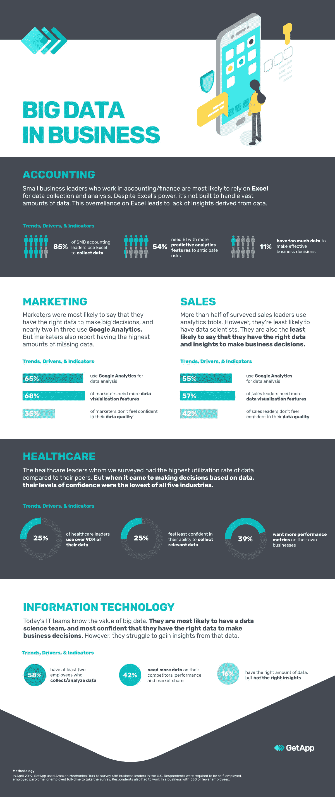

# 大多数企业没有以正确的方式使用数据[研究]

> 原文：<https://towardsdatascience.com/most-businesses-dont-use-data-the-right-way-research-e1dcc81a5627?source=collection_archive---------28----------------------->

## 没有使用数据的策略，数据就没有价值。GetApp 的研究分享了大多数企业都会犯的数据错误，以及应该怎么做。

资料来源:Teresa Meinen 为 GetApp 撰写

《哈佛商业评论》称数据科学为“21 世纪最性感的工作”LinkedIn 的联合创始人告诉 Knowledge@Wharton，数据科学[的工作岗位在过去三年里增长了 15 到 20 倍。由于对数据科学家的需求超过了供应，许多公司将支付六位数的薪酬来吸引顶级人才。](https://lab.getapp.com/hiring-data-scientist/)

但是闪光的并不都是金子:超过一半的数据科学家说他们计划在 2020 年[寻找新的角色](https://www.computerweekly.com/news/252474752/Most-data-scientists-plan-exit-in-2020-Women-in-Data-conference-hears)。

当被问及不满背后的原因时，44%的人认为是官僚主义，29%的人认为是缺乏领导的支持。这两个答案都超过了对缺乏正确的数据科学工具的抱怨，这赢得了 28%的投票。

这些结果令人难过，但并不令人惊讶。尽管对数据科学家有需求，但大多数企业仍然没有为帮助他们取得成功打下基础。

# 当今的企业如何使用大数据

去年，GetApp 调查了员工人数不超过 500 人的北美企业的近 500 名员工。我们想了解他们如何利用数据做出商业决策，以及他们在这样做时有多大的信心。我们还想了解拥有专门处理数据的工具和同事是否会增加业务决策的信心。

或许不出所料，结果因行业而异。从事会计工作的受访者最有可能使用 [Excel](https://www.getapp.com/collaboration-software/a/microsoft-excel/#q=excel%20&ac=listing) 来收集和分析数据。但是他们也最难从数据中识别观点。这是有道理的，因为会计师也报告说没有足够的数据来发现这种见解；相反，许多人表示，他们要么数据太多，要么数据太少，无法做出有影响力的选择。

与此同时，在医疗保健行业工作的受访者对可用数据的利用率最高。但在接受调查的五个行业中，医疗保健行业在做出基于数据的决策时信心水平最低。他们提到需要某些类型的数据(如客户满意度得分)来改善结果。

其他结果更普遍。[在调查的五个行业](https://www.getapp.com/resources/big-data-in-business/)中，我们发现:

*   人们对其数据决策的自信程度与他们认为数据对其业务的重要性之间存在正相关关系。
*   雇用数据科学家让企业领导者更加自信，他们拥有正确的数据和洞察力来做出业务决策。
*   有全职员工分析数据的公司也更经常使用[商业智能(BI)软件](https://www.getapp.com/business-intelligence-analytics-software/business-intelligence/)。
*   使用 BI 软件的公司认为他们做出的基于数据的决策更有影响力。

# 从这里去哪里

当我回顾这些结果时，有两件事让我印象深刻。首先，投资于收集和分析业务数据的工具和员工可以改善结果。对数据感觉最舒服的企业也是那些创造专门拥有数据的角色的企业。他们还投资软件和其他数据科学工具供员工使用。

也就是说，对企业来说，分散数据同样重要。这包括给予每个团队领导在他们的领域内使用数据的自主权。无论你管理的是销售团队还是医院，所有业务线的领导者都应该能够利用数据提升团队的业绩。

这就是[成为公民数据科学家](https://lab.getapp.com/citizen-data-scientist-vs-expert-data-scientist/)的意义所在:使用拖放模型等 BI 软件功能来解释数据与您的团队和更大企业的相关性。

与通常从别处高价招聘的数据科学家不同，公民数据科学家已经是你企业的一部分。因此，他们将对您的技术体系、战略和客户痛点的深入了解带到他们创建的每个数据可视化中。

公民数据科学家不仅仅是好的，他们也不打算取代训练有素的数据科学家。他们为您的业务带来独特的价值，并且作为数据科学家同样重要。

这一点值得重复，因为一名员工拥有所有基于数据的决策已经不够了，或者您的企业不再需要投资工具、培训和员工来将您的数据使用提升到一个新的水平。

如果你想在业务中做出更好的决策，你需要应用分析和某种形式的商业智能。如果这是你对 2020 年的承诺，你可以采取以下几个步骤:

# **1。写一份使命陈述**

用一两个书面句子阐明数据如何促进您的业务发展。你越具体越好。光说“我们公司会给所有团队提供他们需要的工具和培训来做出基于数据的决策”是不够的。

相反，可以尝试这样的方法:

> “我们的首席技术官将使所有团队领导能够访问[首选 BI/分析软件]中的数据。这将使每个人都能实现我们的共同业务目标，即在 2020 年将客户满意度得分提高 10%。”

不要给自己压力，让这份使命宣言保持不变。随着角色和业务需求的发展，您可以审查和更新它。

关键是让 it 始终专注于期望的业务成果。将数据分析连接回大图，将训练每个人更周到地使用它。

# **2。为您的数据战略制定路线图**

要成功使用数据，您需要将正确类型和数量的数据与您可以用其解决的业务问题联系起来。因此，您应该将您的策略基于支持特定业务目标的数据管理和分析实践。

一旦你写好了你的数据使命陈述，开始构建一个路线图来跟踪你实现它的进程。这个路线图将展示你为实现你的使命宣言所要采取的行动，以及你执行这项工作的计划。它还可以让您将新的数据使用请求与您当前的计划进行比较。

您的数据路线图的主要目标是在业务范围内就以下方面达成共识:

*   如何使用数据。
*   确认您将使用数据实现哪些业务目标，以及实现每个目标所需的数据类型和工具。
*   为您的整个企业提供一个框架，以了解数据现在和未来的使用情况。

像你的使命陈述一样，这个路线图不是静态的:它将随着你的业务需求和数据使用而发展。关键是用它作为北极星，了解你的企业如何根据数据做出决策。如果你和你的同事知道数据的价值，你可以用它来找到更有效的见解。

# **3。建立数据指导委员会**

通过建立数据使用指导委员会，团结组织中的所有领导者。整体业务、技术战略和特定业务线(销售、营销等)的领导者。)都应该在这个委员会有席位。它将设定数据使用的优先级，批准新 BI 工具和计划的资金，解决资源冲突，并寻找在业务中使用数据的新机会。

一个人(比如首席技术官，或者最好是首席数字/数据官)应该担任委员会主席。在这样做的时候，他们需要考虑该委员会相对于企业规模的规模。

一个更小的委员会将能够更快、更频繁地安排会议，同时更快地解决问题。但是，如果你将关键业务部门的领导排除在外，你将面临失去整个组织认同的风险。

为了缓解这种情况，承诺每个业务线都有一名领导在委员会中任职。这包括监督公司系统架构的人，以及负责为分析环境提供源系统的人。

计划每季度至少会面一次。你的目标不是为每个领导创造更多的工作，包括你自己。相反，你要向每个委员会成员展示数据对他们的工作有多么宝贵，以及这个委员会将如何改善他们的所有成果。

如今创建的数据量，再加上[BI 和分析软件](https://www.getapp.com/business-intelligence-analytics-software/business-intelligence/category-leaders/)的增长，意味着旧的分析方法将不再适用。像 Excel 这样的工具，虽然强大而有用，[并不是为了处理今天可用的大量数据而构建的](https://lab.getapp.com/business-intelligence-vs-excel/)。数据与所有业务线的相关性意味着它不再属于一个首席执行官的领域。

问题在于，成为“数据驱动型组织”的道路漫长而曲折。从投资错误的 BI 工具到不知道使用哪些数据点来解决每个问题，使用数据的风险似乎太高了。事实是，你负担不起*而不是*使用数据——做一些基础工作可以缓解很多痛点。

通过撰写使命陈述、创建路线图和建立跨职能共识，您自己的企业可以避免大多数陷阱，并利用数据保持增长。你甚至可以雇佣一个梦寐以求的数据科学家——防止他们离开。

Lauren Maffeo 在 GetApp *公司领导商业智能研究，该公司为软件购买者提供合适的工具和技术来发展他们的业务。作为一名分析师，Lauren 的兴趣领域包括语音和自然语言工具、数据挖掘技术、预测分析以及为数据科学构建商业案例。她在普林斯顿大学和哥伦比亚大学、Twitter 的旧金山总部和谷歌 DC 开发者大会等机构展示了她对人工智能偏见的研究。她还是计算机协会杰出演讲者项目的成员。*