# 机器学习中最常见的损失函数

> 原文：<https://towardsdatascience.com/most-common-loss-functions-in-machine-learning-c7212a99dae0?source=collection_archive---------17----------------------->

## 现实世界中的 DS

## 每个机器学习工程师都应该了解机器学习中这些常见的损失函数，以及何时使用它们。

> 在[数学优化](https://en.wikipedia.org/wiki/Mathematical_optimization)和[决策理论](https://en.wikipedia.org/wiki/Decision_theory)中，损失函数或成本函数是将[事件](https://en.wikipedia.org/wiki/Event_(probability_theory))或一个或多个变量的值映射到[实数](https://en.wikipedia.org/wiki/Real_number)上的函数，该实数直观地表示与该事件相关的一些“成本”。
> ——[维基百科](https://en.wikipedia.org/wiki/Loss_function)


[约什·罗斯](https://unsplash.com/@joshsrose?utm_source=medium&utm_medium=referral)在 [Unsplash](https://unsplash.com?utm_source=medium&utm_medium=referral) 上的照片

作为一个核心元素，损失函数是一种评估机器学习算法的方法，它可以很好地模拟您的特征数据集。它被定义为**衡量你的模型在预测预期结果方面有多好。**

***成本函数*** 和 ***损失函数*** 指同一上下文。成本函数是作为所有损失函数值的平均值计算的函数。然而，损失函数是针对每个样本输出与其实际值的比较来计算的。

***损失函数与你已经建立的模型的预测直接相关。因此，如果您的损失函数值较小，您的模型将提供良好的结果。损失函数，或者更确切地说，用于评估模型性能的成本函数，需要最小化以提高其性能。***

现在让我们深入研究损失函数。

广泛地说，损失函数可以根据我们在现实世界中遇到的问题类型分为两大类—[](https://en.wikipedia.org/wiki/Loss_functions_for_classification)**分类和**回归**。在分类中，任务是预测问题所处理的所有类别各自的概率。相反，在回归中，任务是预测关于学习算法的一组给定独立特征的连续值。**

```
**Assumptions:**
    n/m — Number of training samples.
    i — ith training sample in a dataset.
    y(i) — Actual value for the ith training sample.
    y_hat(i) — Predicted value for the ith training sample.
```

# **分类损失**

## **1.二元交叉熵损失/对数损失**

**这是分类问题中最常用的损失函数。交叉熵损失随着预测概率收敛到实际标签而减少。它测量分类模型的性能，该模型的预测输出是介于 0 和 1 之间的概率值。**

****当类别数为 2 时，*二元分类*****

**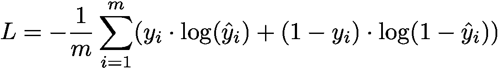**

****当类别数大于 2 时，*多类别分类*****

**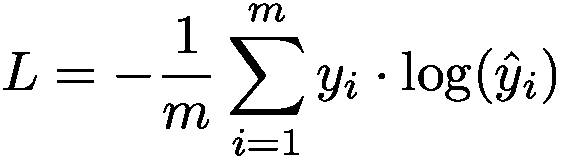****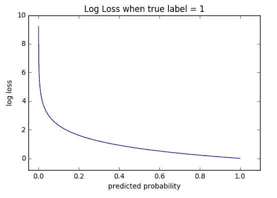**

**交叉熵损失公式是从正则似然函数中推导出来的，但是加入了对数。**

## **2.铰链损耗**

**用于分类问题的第二常见损失函数和交叉熵损失函数的替代函数是铰链损失，主要用于支持向量机(SVM)模型评估。**

**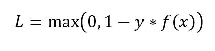****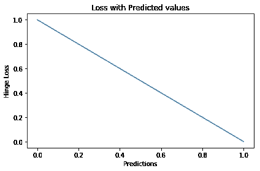**

> ***铰链损失不仅惩罚错误的预测，也惩罚不自信的正确预测。它主要用于类别标签为-1 和 1 的 SVM 分类器。确保将恶性分类标签从 0 更改为-1。***

****

**照片由 [Jen Theodore](https://unsplash.com/@jentheodore?utm_source=medium&utm_medium=referral) 在 [Unsplash](https://unsplash.com?utm_source=medium&utm_medium=referral) 上拍摄**

# **回归损失**

## **1.均方误差/二次损耗/ L2 损耗**

**MSE 损失函数被定义为实际值和预测值之间的平方差的平均值。它是最常用的回归损失函数。**

**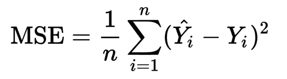****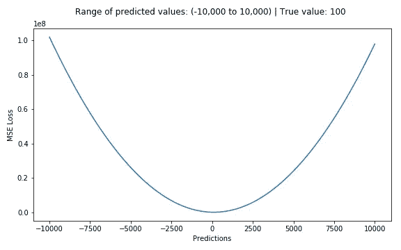**

**对应的代价函数是这些**平方误差**的**均值**。MSE 损失函数通过平方它们来惩罚产生大误差的模型，并且该属性使得 MSE 成本函数对异常值不太稳健。因此， ***如果数据容易出现很多离群值，就不应该使用。*****

## **2.平均绝对误差/ L1 损耗**

**MSE 损失函数被定义为实际值和预测值之间的绝对差值的平均值。这是第二个最常用的回归损失函数。它测量一组预测中误差的平均大小，不考虑它们的方向。**

**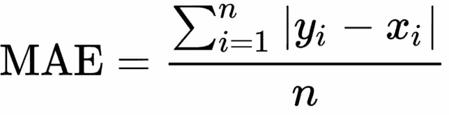****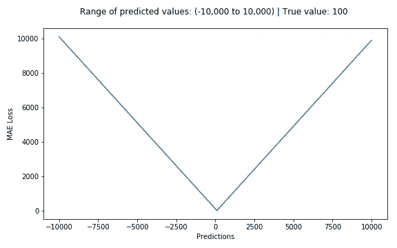**

**对应的代价函数是这些**绝对误差(MAE)** 的**均值**。与 MSE 损失函数相比，MAE 损失函数对异常值更稳健。因此， ***在数据容易出现很多离群值的情况下应该使用。*****

## **3.Huber 损失/平滑平均绝对误差**

**Huber 损失函数被定义为当𝛿 ~ 0 时 MSE 和当𝛿 ~ ∞(大数)时 MAE 接近**时 MSE 和 MAE 损失函数的组合。它是平均绝对误差，当误差很小时，它变成二次误差。使误差为二次型取决于误差有多小，这是由一个可以调节的超参数𝛿(δ)控制的。****

**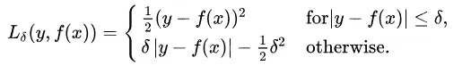****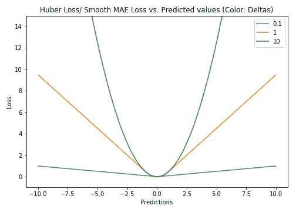**

**增量值的选择至关重要，因为它决定了您愿意将什么视为异常值。因此，取决于超参数值，与 MSE 损失函数相比，Huber 损失函数对异常值不太敏感。因此， ***如果数据容易出现异常值，可以使用它，并且*我们可能需要训练超参数 delta，这是一个迭代过程。****

## **4.对数损失**

**对数余弦损失函数被定义为预测误差的双曲余弦的对数。这是回归任务中使用的另一个函数，比 MSE 损失平滑得多。它具有 Huber 损失的所有优点，并且它在任何地方都是两次可微的，不像 Huber 损失，因为像 XGBoost 这样的一些学习算法使用牛顿法来寻找最优值，因此需要二阶导数( *Hessian* )。**

**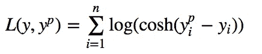****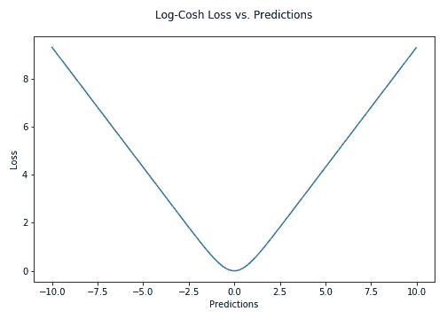**

> **`*log(cosh(x))*` *约等于* `*(x ** 2) / 2*` *为小* `*x*` *，以* `*abs(x) - log(2)*` *为大* `*x*` *。这意味着“logcosh”的工作方式很大程度上类似于均方误差，但不会受到偶尔出现的严重错误预测的强烈影响。
> —* [*Tensorflow 文档*](https://www.tensorflow.org/api_docs/python/tf/keras/losses/logcosh)**

## ****5。分位数损失****

**分位数是一个值，低于这个值，一个组中的一部分样本就会下降。机器学习模型通过最小化(或最大化)目标函数来工作。顾名思义，分位数回归损失函数用于预测分位数。对于一组预测，损失将是其平均值。**

**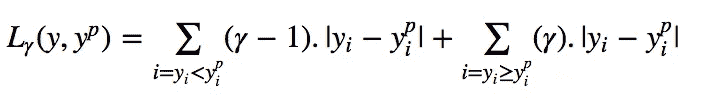****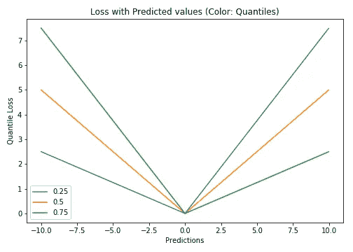**

**[分位数损失函数](/deep-quantile-regression-c85481548b5a)在我们对预测区间而不仅仅是点预测感兴趣时非常有用。**

**感谢您的阅读！希望这篇帖子有用。我感谢反馈和建设性的批评。如果你想谈论这篇文章或其他相关话题，你可以在这里或我的 [LinkedIn](https://www.linkedin.com/in/imsparsh/) 账户上给我发短信。**

**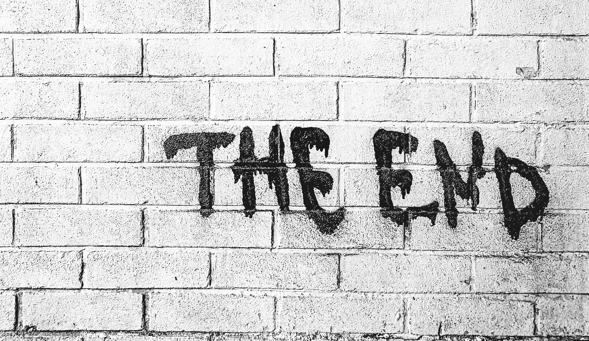**

**照片由[克劳福德乔利](https://unsplash.com/@crawford?utm_source=medium&utm_medium=referral)在 [Unsplash](https://unsplash.com?utm_source=medium&utm_medium=referral) 拍摄**