# 实现分类问题径向基函数神经网络的最有效方法

> 原文：<https://towardsdatascience.com/most-effective-way-to-implement-radial-basis-function-neural-network-for-classification-problem-33c467803319?source=collection_archive---------3----------------------->

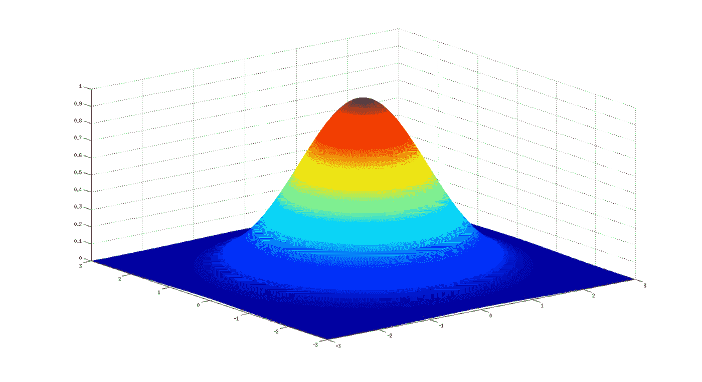

高斯径向基函数的三维可视化

## 如何使用 K-均值聚类和线性回归对图像进行分类

# 介绍

径向基函数神经网络(RBFNN)是一种不同寻常但非常快速、有效和直观的机器学习算法。三层网络可用于解决分类和回归问题。本文描述了对 [MNIST 手写数字数据集](https://www.wikiwand.com/en/MNIST_database)分类的实现，其中**获得了约 94%** 的准确率。此外，为了方便来自不同编程语言背景的人，C++和 Python 项目代码都被添加进来[3]。

# 先决条件

*   k-均值聚类算法
*   线性回归

如果您对上述任何一个主题都不熟悉，可以参考文章末尾的参考资料和参考文献[1][2] 部分给出的链接。

# 径向基函数

首先，让我们从一个简单的例子开始。想象一下，下面 2D 绘制的数据是给你的。你的任务是找到一个最接近集群位置的模式。因此，当引入未知点时，该模型可以预测它属于第一还是第二数据聚类。使用 K-Means 聚类算法可以很容易地解决这个问题。

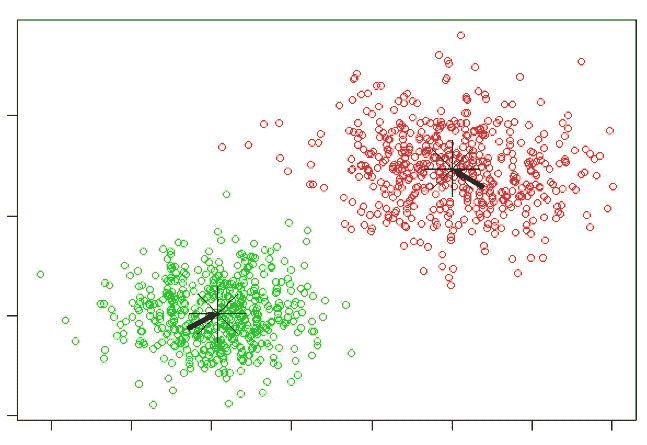

[https://haosutopia.github.io/2018/04/K-Means-01/](https://haosutopia.github.io/2018/04/K-Means-01/)

然而，RBFNN 使用不同的方法。它使用圆形对数据平面(在 2D)建模。因此，可以通过考虑聚类质心和它们的半径来预测数据所属的聚类。

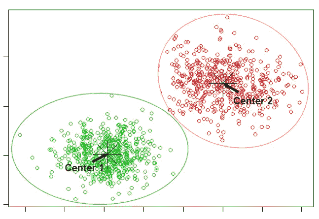

但是根据上面描述的理论，如果一个点离所有质心半径足够远，则该点有可能不属于任何一个聚类。因此，这导致了数据点类别的模糊性。

为了解决这个理论上的差距，使用径向基函数，这是 RBFNN 的最重要的部分。径向基函数(RBF)的实现使我们能够知道质心和任何数据点之间的接近率，而不管距离的范围。RBF 使用平滑过渡的圆形而不是锐截止圆来模拟数据。此外，RBF 给出了 K-means 聚类算法所不能提供的关于预测置信度的信息。

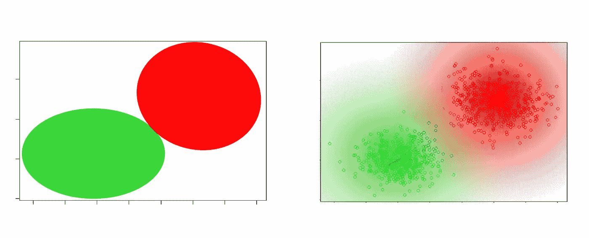

从上面的图中可以观察到，随着我们远离星团的质心，颜色的强度逐渐降低。为了具有这样的平滑过渡，可以使用距离的负幂的指数函数。通过将距离乘以标量系数*，我们可以控制函数衰减的速度。所以更高的贝塔意味着更剧烈的下跌。*

*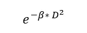**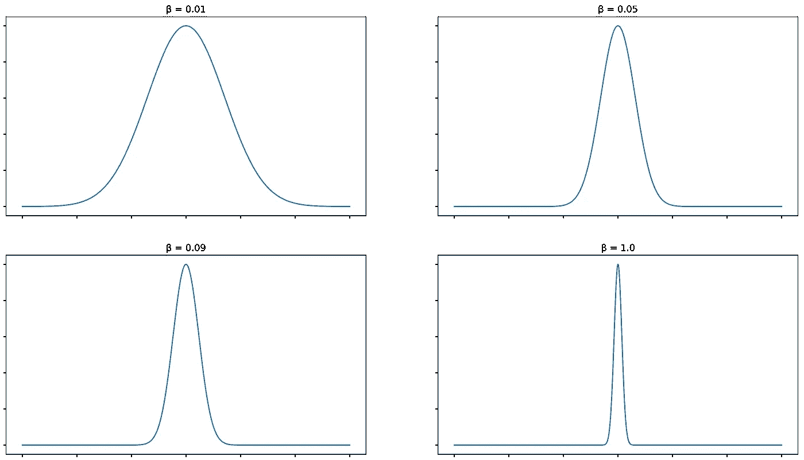*

*值得注意的是 **Beta** 是一个应该微调的超参数。但是，出于测试目的，可以尝试两种选择。*

1.  *使用集群的*标准偏差*:*

*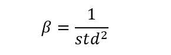*

*2.使用下面的等式:*

*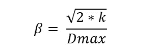*

*   ****K*** —质心的数量*
*   ****Dmax —*** 任意两个质心之间的最大距离*

*欧几里得距离 D 可以通过使用勾股定理容易地找到。*

*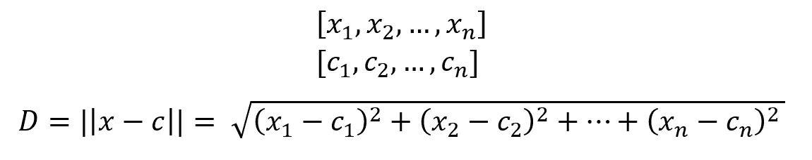*

# *从径向基函数获取输出*

*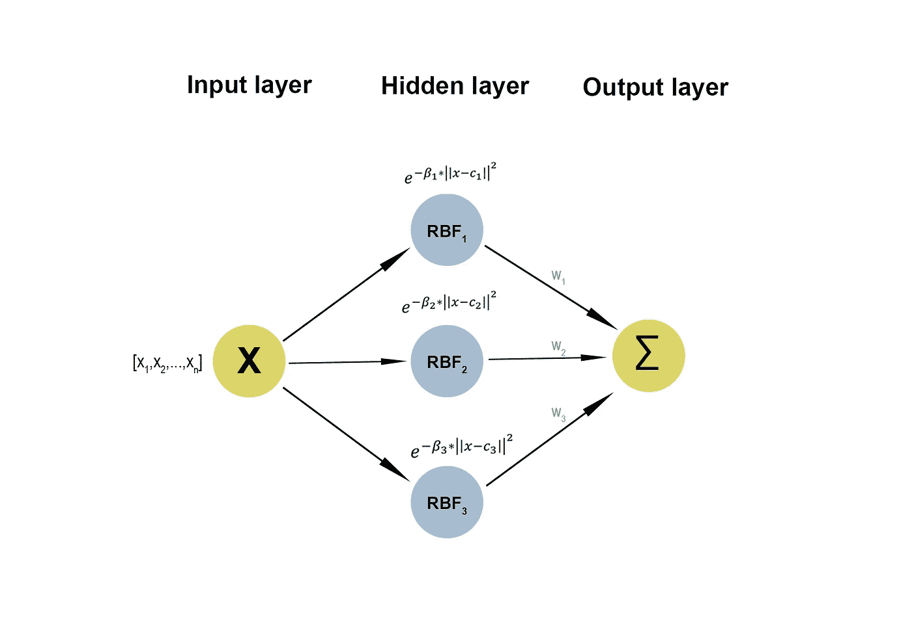*

*上面的图表显示了 RBFNN 层是如何组成的。在图中，第一层代表输入数据。第二层也称为隐藏层，是存储所有输入数据的 RBF 的地方。例如，节点 **RBF1** 是长度为 **n** 的向量，其中描述了 **X ([x1，x2，…，xn])** 和 **C1** (第一质心向量)的 RBF。径向基 F1 矢量是对*第一质心*和*数据 X* 之间的距离如何相互关联的度量。*

*现在我们有了聚类圆和数据点与聚类质心之间的距离度量。如果我们认为每个数字只有一个聚类，通过找到聚类和给定点之间的最高 RBF，我们可以预测其类别。但是，如果任何一个类有多个集群，会发生什么情况呢？*

*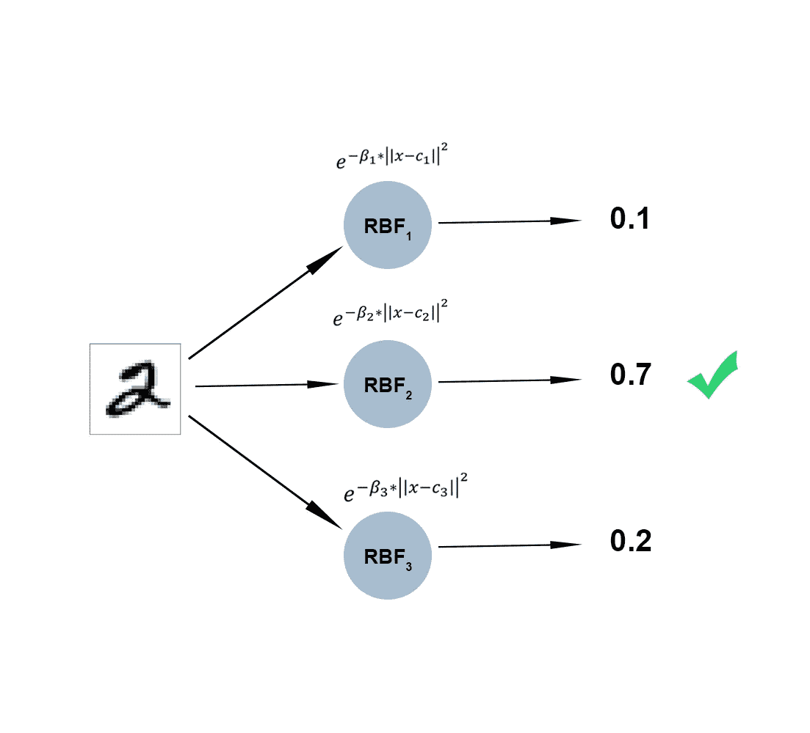*

*在下面的场景中，虽然答案是 2，但分类器得出的结果是 3。为了解决这个问题，相同类别的不同聚类以及其他聚类的效果可以线性组合。因此，生成的输出将基于所有 RBF。这里出现的困难是找到最接近 RBF 和输出之间的线性关系的**W**(【w1，w2，w3】)。*

*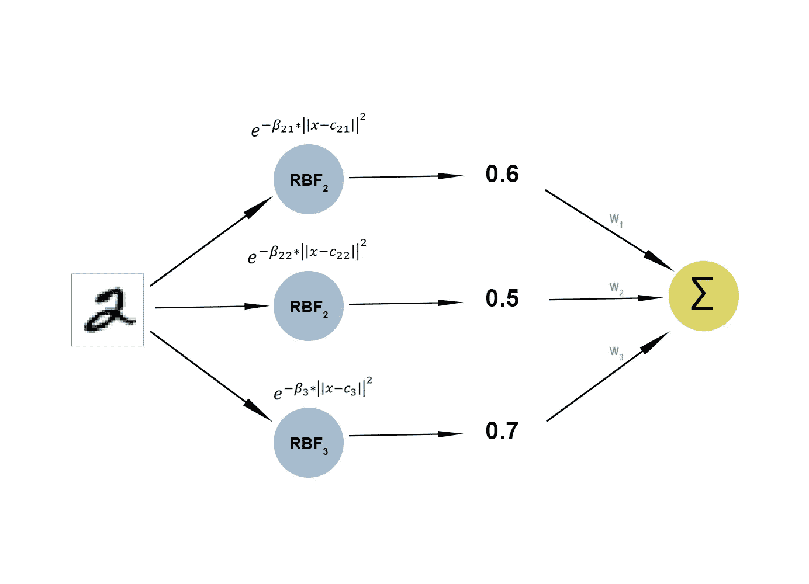*

## *优化:使用最小二乘线性回归寻找权重*

*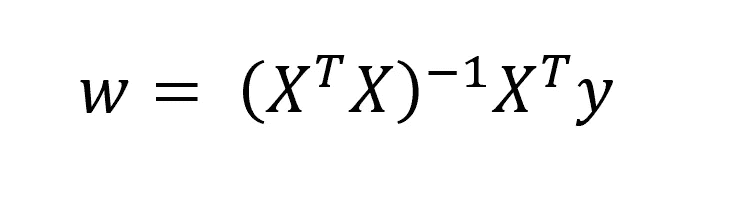*

*径向基函数神经网络的主要优点之一是利用最小二乘线性回归方程，其中获得成本函数的全局最小值相对较快且有保证。另一方面，也可以应用诸如批量梯度下降的其他优化算法来更新权重。*

*在数字分类问题中:*

*   *x 是径向基函数的二维矩阵*
*   *y 是一个热编码的二维矩阵。*

*最后，通过使用上面解释的理论，未知点的类别的预测可以如下获得:*

1.  *得到关于所有质心的未知数据点 **x** 的 **RBF** 。*
2.  *计算 **RBF** 和 **W** 的点积，选择最大值的指标*

# *用 Python 实现理论*

1.  *首先，我们必须定义将在 RBFNN 中使用的所需函数。修改后的“kmeans”函数返回聚类中心以及聚类的标准差。*

*2.为了使实现更有益，我们可以将 RBFNN 编码为一个类。*

*3.拟合函数:First lines 执行 k-means 来获得聚类的质心和标准偏差。然后，我们可以通过使用提到的等式，使算法对所有聚类质心使用相同的**β**。在接下来的几行中，我们获得输入 X 的 RBF，并应用最小二乘优化来获得适当的权重矩阵 **W** 。此外，为了测量模型的准确性，在最后几行中使用了测试数据。*

*4.将 MNIST 数据集分成训练和测试两部分，让 RBFNN 完成自己的工作。*

# *结论*

*总之，RBFNN 是分类和回归任务的强大模型之一。RBF 网络可以学习使用许多 RBF 曲线来逼近底层模式。与 **MLP** 结构化网络相比，用于优化过程的统计方程的实践使得算法更有益且更快。但是，微调超参数，如 **K —** 簇数和**β**需要工作、时间和实践。*

# *资源和参考资料*

*[1] [T. Ahadli，回归简介:用 Python 进行线性回归(2018)](https://medium.com/@tarlanahad/kickass-introduction-to-regressions-linear-regression-with-python-41d9ac86f267)*

*[2] [T. Ahadli，K-Means 聚类算法的友好介绍(2020)](https://medium.com/@tarlanahad/a-friendly-introduction-to-k-means-clustering-algorithm-b31ff7df7ef1)*

*[3] [T. Ahadli，C++/Python 使用径向基函数神经网络(2020)对 MNIST 数字数据集进行分类的代码](https://bitbucket.org/tarlanahad/myneatcodes/src/master/RBFNN/)*

*[4][g . Vachkov 教授，使用 RBF 网络模型进行近似和分类的多步建模(2016)，智能系统中的创新问题](https://www.researchgate.net/publication/295256901_Multistep_Modeling_for_Approximation_and_Classification_by_Use_of_RBF_Network_Models)*