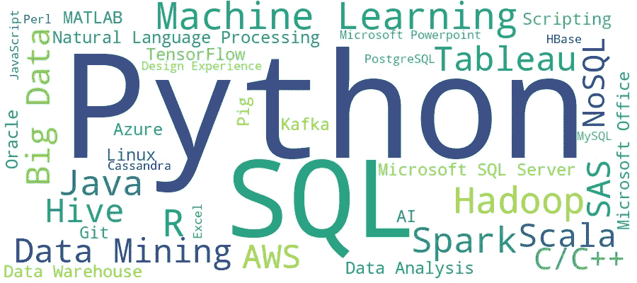
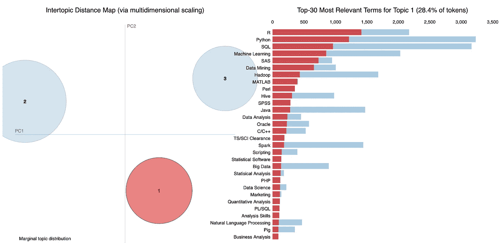
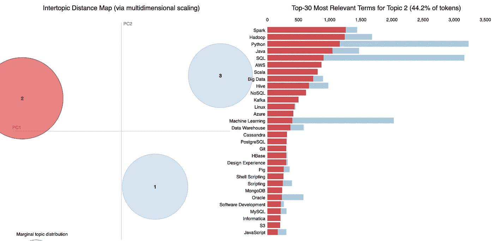
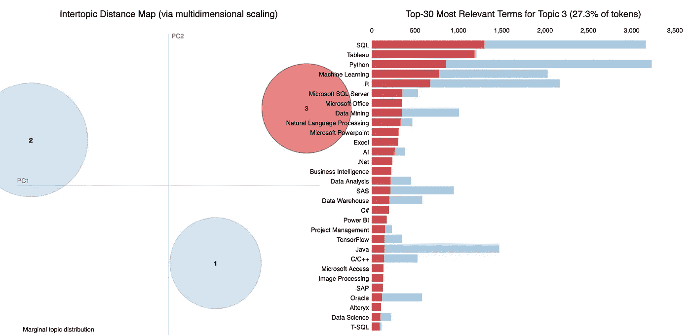
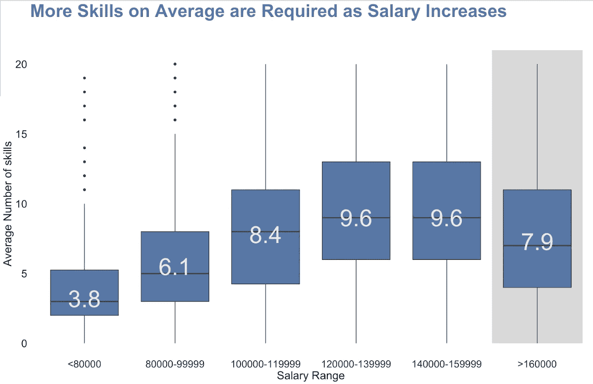
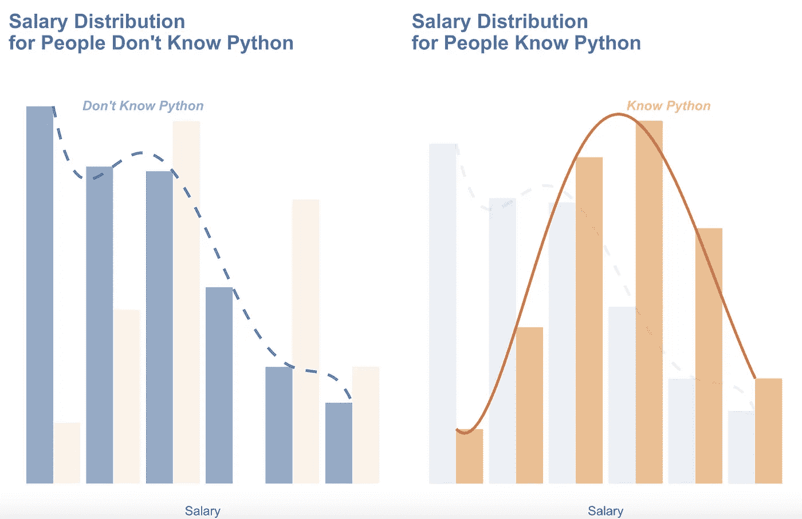

# 一个数据科学家需要多少技术技能？

> 原文：<https://towardsdatascience.com/most-essential-set-of-skills-for-the-type-of-data-scientist-job-youre-looking-for-44d5f6d23ca3?source=collection_archive---------24----------------------->

## 使用 LDA 主题建模分析数据科学家职位列表

随着数据科学家的就业市场不断扩大，许多数据科学家的工作清单实际上是在寻找不同的技术技能。对于 2019 年 Indeed.com 上所有与数据科学相关的职位发布，有 464 种不同的技能被提及。



显然，我们没有办法掌握所有这些技能，所以了解你将寻找的数据科学家工作需要哪些特定的技术技能非常重要。

为了以数据科学的方式解决这个问题，我们对实际上每个数据科学相关工作清单中提到的技术技能进行了 LDA 主题建模，以找出**哪些技术技能最有可能在工作清单**中一起被提到。我们的数据集来自这个 [Kaggle](https://www.kaggle.com/elroyggj/indeed-dataset-data-scientistanalystengineer) 数据。

```
# Data Preprocessing on the skill column
df=pd.read_csv('indeed_job_dataset.csv')
text_data=[]
for skills in df.Skill.dropna():
    lst=skills[1:-1].split(', ')
    words=[]
    for item in lst:
        words.append(item[1:-1])
    text_data.append(words)# Topic Modelling
from gensim import corpora
dictionary = corpora.Dictionary(text_data)
corpus = [dictionary.doc2bow(text) for text in text_data]
import pickle
pickle.dump(corpus, open(‘corpus.pkl’, ‘wb’))
dictionary.save(‘dictionary.gensim’)# Setting the total number of topics to be 3 here
NUM_TOPICS = 3
ldamodel = gensim.models.ldamodel.LdaModel(corpus, num_topics = NUM_TOPICS, id2word=dictionary, passes=15)
ldamodel.save(‘model5.gensim’)
topics = ldamodel.print_topics(num_words=4)
```

可视化我们的主题建模结果

```
dictionary = gensim.corpora.Dictionary.load(‘dictionary.gensim’)
corpus = pickle.load(open(‘corpus.pkl’, ‘rb’))
lda = gensim.models.ldamodel.LdaModel.load(‘model5.gensim’)
import pyLDAvis.gensim
lda_display = pyLDAvis.gensim.prepare(lda, corpus, dictionary, sort_topics=False)
pyLDAvis.display(lda_display)
```

我们可以看到，当我们将主题数量设置为 3 时，第一种工作类型是更传统的数据科学家角色，雇主正在寻找 R、Python、SQL 和机器学习方面的技能。



主题 1:更传统的数据科学家角色

与此同时，第二种工作类型所需的技能略有不同——Spark、Hadoop、AWS、Scala——这显然是一个更侧重于**大数据和云的数据科学家**角色。



主题 2:大数据和专注于云的数据科学家

最后，对于第三种工作类型，这显然是一个更为**的数据分析师**角色，专注于使用 SQL、Tableau 和 SQL Server。



主题 3:精通 SQL 和 Tableau 的数据分析师

那么，我们到底需要多少技能才能获得更高的薪水呢？越多越好！嗯，也许除了如果你进入更多的管理角色，这可能是为什么这里的最高工资等级实际上看到所需技能数量的减少。



在执行了主题建模之后，有趣的是，尽管 Python 似乎是这个行业中更占主导地位的语言，但在最近的许多数据科学家职位发布中，仍然非常需要 R。我们怀疑这可能是因为许多清单将 R 和 Python 都放在技能部分，但实际上需要 R/Python。

尽管如此，我们认为在 R 和 Python 之间做一个比较可能会很有趣，看看了解 Python 而不是 R 是否会给你带来任何薪水提升。



我们可以看到，相比于懂 R，懂 Python 确实让你在落地更高工资上更有优势。

希望这可以帮助你的求职过程一路走来更容易一点，愿我们所有的数据梦想成真✨

这是三藩市大学 MSDS 593 的一个小组项目，小组成员是刘品言和刘旭。请随意查看 GitHub [repo](https://github.com/estheryl/data_scientists_job_eda) 中我们的预处理和可视化代码。

参考:

[1]李，苏珊，Python 中的主题建模与潜在狄利克雷分配(LDA)(2018)，https://towardsdatascience . com/Topic-Modeling-and-Latent-Dirichlet-Allocation-in-Python-9bf 156893 c24