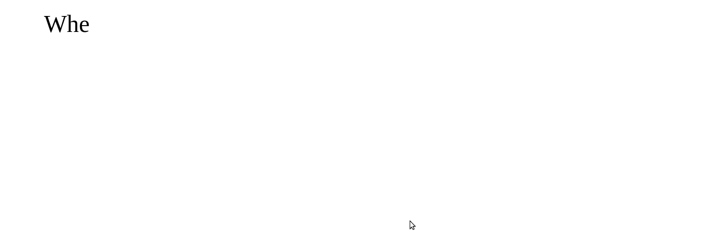

# 最重要的 IT 辅助技能，正则表达式

> 原文：<https://towardsdatascience.com/most-important-it-side-skill-regex-2226789d16d0?source=collection_archive---------44----------------------->

## 正则表达式是众所周知的 IT 技能，它可以极大地提高你在计算机上做任何事情的效率！



作者图片

当我第一次学习如何使用 Regex 搜索文本并以我以前无法想象的方式处理文本数据时，我感到非常震惊。今天，我们可以在 Python 中利用它的能力，但它在所有其他编程语言、文本编辑器和 ide 中都是一样的。我们学习基础知识的速度会比特朗普发推特还快！

# 那么什么是 Regex 呢？

Regex 是正则表达式的缩写。含义:它是一个短的字符序列，用于搜索或替换长文本中的单词。它是一种编程语言的次要形式，你可以用它来立即找到你需要的东西。我们将使用一条奇怪的小特朗普推文来学习基础知识。

我们将使用的示例推文

# 基础

让我们加载 Python，一起浏览一下基础知识。首先，我们必须加载模块 re，它处理 python 内部所有与 regex 相关的事情。让我们把文字删减一点

```
import re
text='When you see the Drug Companies taking massive  television ads against me, forget what they say (which is false), YOU KNOW THAT DRUG'
```

让我们练习一些魔法吧！我们现在可以要求 Regex 查找所有内容，直到一个单词第一次出现。

```
regex_pattern = r'.*Drug'
res = re.findall(regex_pattern,text)
print(res)
```

这将打印“‘当您看到药物时’”。

那么这是怎么回事呢？

首先，你可能会注意到我们是如何用前缀***r’***定义字符串的，这个 r 向 python 表明我们将要使用 Regex。也称为原始字符串，这不会改变字符串的类型。它主要改变了字符串的解释方式。这并不总是必要的，但它是最佳实践。

接下来的事情就是**’。*药物'**部分。这包括两个想法。首先，我们有零件。* '这向 Regex 表明，我们需要所有可能的字母或符号…… **直到我们看到药物。**

所以基本上。* '就是所谓的通配符通配符。其中' * '表示我们要将星号之前的所有内容重复 0 次或更多次。在哪里？是超级特殊的符号，告诉星星我们想要一切，包括字母、数字和空格。

**我们再试一次**

```
regex_pattern = r'W.*ss'
res = re.findall(regex_pattern,text)
print(res)
```

这将打印“‘当你看到制药公司服用大众’”。从第一次出现的“W”到第一次出现的“ss”

# 贪婪

```
regex_pattern = r' .*? '
res = re.findall(regex_pattern,text)
print(res)
```

会打印“‘你’，‘那个’，‘公司’，‘大规模’…”。正如我们所看到的，这次我们想找到两个空间之间的所有东西。我希望你的头上现在有一个大大的问号。我们把它放在那里是为了确保正则表达式以所谓的贪婪方式匹配。贪婪在这里意味着我们只匹配绝对最小值，直到下一个空格。没有了“？只有使用' *，'我们才能匹配所有内容，包括空格，因此结果将是整个 tweet(没有最后一个和第一个单词)

# 取代邪恶

```
regex_pattern = r'drug'
res = re.sub(regex_pattern,'COVID-19',text, flags=re.IGNORECASE)
print(res)
```

我将刊登“当你看到新冠肺炎公司在电视上做大量广告反对我时，忘记他们说了什么(这是假的)，你知道新冠肺炎”。

这是 Regex 最有用的部分之一，你可以用任何东西替换任何东西！呼叫响应(..)采用我们想要替换的模式，并用更合适的单词替换它。我们必须添加' flags=re。“IGNORECASE”以确保我们符合特朗普不区分大小写的推文风格；)

# 释放北海巨妖

```
regex_pattern = r'D(.*),'
res = re.sub(regex_pattern,'Kraken',text, flags=re.IGNORECASE)
print(res)
```

会印上“当你看到北海巨妖时，你就知道那是毒品。”再次说明我们所学到的。

# 匹配我们所知道的

```
regex_pattern = r'see( .*? )*?THAT'
res = re.sub(regex_pattern,'\\1',text)
print(res+"S")
```

上面印着“当你知道毒品”好了，现在我们进入了严肃的正则表达式领域。方括号“()”构成一个匹配组。这是一种引用后来在 replace 语句中发现的内容的方式。我们还嵌套了“*？”围绕着它。所以第一个”(。*?)"获取单词将" * "放在匹配**的单词周围会获取" see "和" THAT "之间的所有单词。**我们为什么要这样做？因此，我们可以在以后引用它，正如我们在 replace 语句中看到的那样' \\1 '获取第一个单词并将其放入找到的字符串中。这个例子中的第一个词是“你”这让我们“当你知道毒品。”

# 结论

这些是正则表达式的基本构建块，在你精通正则表达式的过程中，你会发现更多。这些基本技术帮助你理解什么是可能的。我希望你现在能更多地考虑正则表达式。首先，你可能需要投入一些时间。一旦你知道了，一个全新的字符串操作世界将会开启。

如果你喜欢这篇文章，我会很高兴在 [Twitter](https://twitter.com/san_sluck) 或 [LinkedIn](https://www.linkedin.com/in/sandro-luck-b9293a181/) 上联系你。

一定要看看我的 YouTube 频道，我每周都会在那里发布新视频。