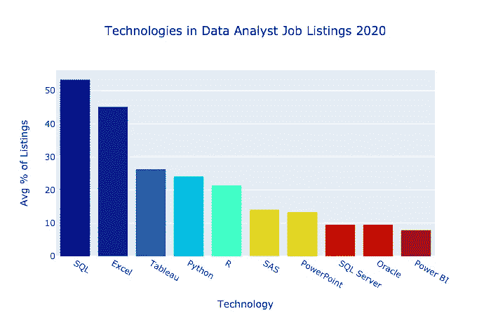
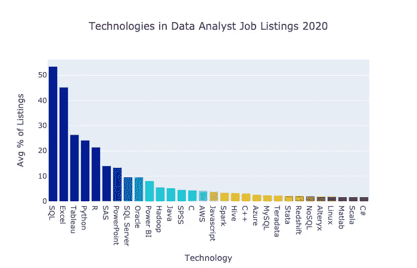
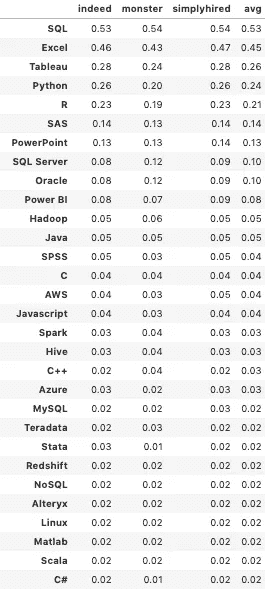
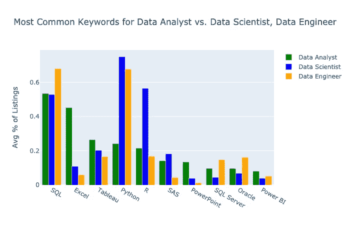

# 数据分析师最需要的技术技能

> 原文：<https://towardsdatascience.com/most-in-demand-tech-skills-for-data-analysts-26d4ea4450f8?source=collection_archive---------2----------------------->

## 雇主在数据分析师中寻找哪些技术技能？它们与数据工程师和数据科学家所需的技能相比如何？📊

我分析了 2020 年 1 月以来的在线工作清单，以寻找答案。在本文中，我将分享答案，并为有志成为数据分析师的人提供一条建议的学习路径。🚀

这是我的第三篇文章，着眼于数据密集型岗位的技术技能。参见之前关于数据科学家[这里](/the-most-in-demand-tech-skills-for-data-scientists-d716d10c191d?sk=c283bbf1c890b135c782eff5873ba7fa)和数据工程师[这里](/most-in-demand-tech-skills-for-data-engineers-58f4c1ca25ab)的文章。😀

话不多说，以下是截至 2020 年 1 月数据分析师职位列表中的 10 大技术。

## 数据分析师角色

数据分析师将数据转化为信息。它们通过为决策者提供可操作的数据来发挥重要作用。👍

数据分析师通常获取数据工程师提供的数据，对其进行分析，并提出建议。他们创建可视化效果，在仪表板和演示中显示他们的发现。📈

与数据科学家不同，数据分析师通常不会基于机器学习算法创建预测模型。

# 方法

我从[简单雇佣](https://www.simplyhired.com/)、[事实上](https://www.indeed.com/)和[怪物](https://www.monster.com/)那里搜集信息，看看在美国的工作列表中哪些关键词出现了“数据分析师”。我使用了[请求](https://requests.readthedocs.io/en/master/)和[美汤](https://www.crummy.com/software/BeautifulSoup/bs4/doc/) Python 库。

我使用了从我对[数据科学家](/the-most-in-demand-tech-skills-for-data-scientists-d716d10c191d)和[数据工程师](/most-in-demand-tech-skills-for-data-engineers-58f4c1ca25ab)工作列表的分析中收集到的相同关键词。LinkedIn 没有被搜索到，因为它之前在抓取了它的网站后将我锁定在我的账户之外。☹️

对于每个求职网站，我计算了每个关键词出现在该网站上的数据分析师职位列表总数的百分比。然后我计算了三个网站上每个关键词的平均百分比。

# 结果

这是一张展开的图表，展示了 30 种最常见的技术。

这是表格形式的相同数据。

搜索了许多其他技术关键词；这是 30 个最高分。让我们看看最常见的技术。

# 讨论

SQL 是结构化查询语言的简称。它出现在超过一半的列表中。SQL 用于处理关系数据库。SQL 有多种风格，包括 MySQL、Oracle、SQL Server、PostgreSQL 和 SQLite。每个版本共享大部分相同的核心 API。有高质量的免费产品。

Excel 几乎和 SQL 一样普遍。这是占主导地位的电子表格程序。它是[微软 Office 365](https://www.office.com/) 软件工具套件的一部分。尽管 Excel 不能像 SQL 数据库那样处理大量数据，但它非常适合快速进行分析。 [Google Sheets](https://www.google.com/sheets/about/) 是一个拥有免费版本和相似核心功能的竞争对手。

Tableau 出现在大约四分之一的列表中。拖放式商业智能软件使创建可视化和仪表板变得容易。Tableau 的可视化能力远胜于 Excel。Tableau 有一个免费的公开版本，但如果你想让数据保密，你需要支付一些钱。

Python 出现在大约四分之一的列表中。它是一种非常流行的免费开源编程语言，用于处理数据、网站和脚本。它是机器学习的主要语言。🐍

超过 20%的列表中有 R[字样。这是一种流行的免费开源统计语言，尤其是在学术界。](https://www.r-project.org/about.html)

# 与数据工程师和数据科学家的比较

在之前的文章中，我研究了[数据科学家](/the-most-in-demand-tech-skills-for-data-scientists-d716d10c191d?source=post_stats_page---------------------------)和[数据工程师](/most-in-demand-tech-skills-for-data-engineers-58f4c1ca25ab)最需要的技术技能。数据分析师的结果如何比较？

*数据分析师*的列表总数为 16，325，数据工程师*的列表总数为 12，013，数据科学家*的列表总数为 9，396。*所以数据分析师的工作相对来说很常见。😀*

下图显示了 10 种最常见的数据分析列表技术。数据科学家和数据工程师列表的分数也会针对每个关键字显示出来。

几个亮点:

*   SQL 对于这三个工作岗位都很受欢迎。
*   Excel 在数据分析师列表中的常见程度是数据科学家和数据工程师列表的四倍多。
*   Python 虽然出现在大约四分之一的数据分析师列表中，但在数据科学家和数据工程师工作列表中的受欢迎程度大约是它的三倍。
*   r 在数据分析师和数据工程师职位中比在数据科学家职位列表中更不常见。
*   PowerPoint 在数据分析师列表中更常见。

就趋势而言，我对数据科学家工作清单的[分析](/the-most-in-demand-tech-skills-for-data-scientists-d716d10c191d)显示，从 2018 年到 2019 年，R 和 sa 的受欢迎程度都大幅下降。

值得注意的是，数据工程师职位列表中提到的技术比数据分析师职位列表中提到的多得多。

# 建议

如果你想成为一名数据分析师，或者让自己更有市场，我建议你学习以下技术，按优先顺序排列。

学习 **Excel** 。拿起来比 SQL 快。我从学校和工作中知道了 Excel，但我通过学习 Microsoft Excel 认证考试更好地了解了它。如果你是一名自学者，[官方认证](https://docs.microsoft.com/en-us/learn/certifications/mos-excel-2019)或 MOOC 课程可能值得你花时间。

学习 **SQL** 。如果你不知道一种编程语言，这是一个很好的第一次学习。我那本令人难忘的 SQL 书籍在预发布版[中有售，请点击](https://memorablesql.com)。

学习 **Tableau** 。Tableau 允许你用一个拖放界面快速的制作出很棒的可视化效果。点击这里查看我的文章来学习基础知识[。](/tableau-basics-in-six-minutes-35b50ec9ae9b)

展示你可以制作一个 **PowerPoint** 演示。有很多 MOOCs 是教微软 PowerPoint 的。

如果你已经证明你可以使用上述技术来分析和沟通，你应该是许多入门级职位的体面候选人。👍

如果你知道以上技能，又想学习新的技能或者获得更多职位的资格，建议你学习 **Python** 。如果你想进入数据工程和数据科学领域，Python 是很棒的。😀

我的[令人难忘的 Python](https://memorablepython.com) 书是为初学者设计的。这本书有 Kindle 版本，也有来自亚马逊和亚马逊的印刷版。epub 和。pdf 格式[此处](https://memorablepython.com)。

一旦你知道了基本的 Python，学习 [**熊猫**](https://pandas.pydata.org/) 。Pandas 是一个处理数据的 Python 库。如果你正在寻找一份需要 Python 的数据工作，你可能也会被期望拥有熊猫技能。

我正在完成一本介绍熊猫的书，所以加入我的[数据令人敬畏的时事通讯](https://dataawesome.com)来确保你不会错过它。🚀

这听起来可能是一个很长的清单，但是一步一步来。🦶认识到这需要时间，而且会有起伏。你能做到——只要坚持！😀

我建议你学习和展示你的技能，做一些你可以放在个人文件夹里的项目。然后你就可以通过做自己喜欢的事情来学习了！你也将有一份工作向潜在雇主展示你的技能。关于建立作品集网站的快速指南，请参见本文[。](/build-a-portfolio-website-in-a-flash-9d5ec30a73a7)

# 包装

我希望这篇数据分析师最需要的技术指南对你有用。如果你有，请在你最喜欢的社交媒体上分享，这样其他人也可以找到它。👍

我撰写关于 Python、数据科学和其他技术主题的文章。如果你对此感兴趣，[在 Medium](https://medium.com/@jefhale) 上关注我，在这里阅读更多[。📊](https://medium.com/@jeffhale)

快乐分析！📈