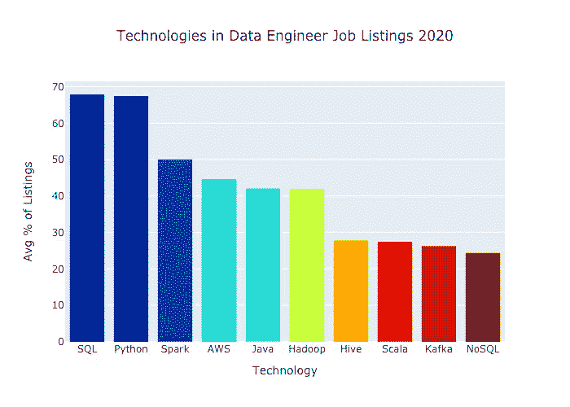
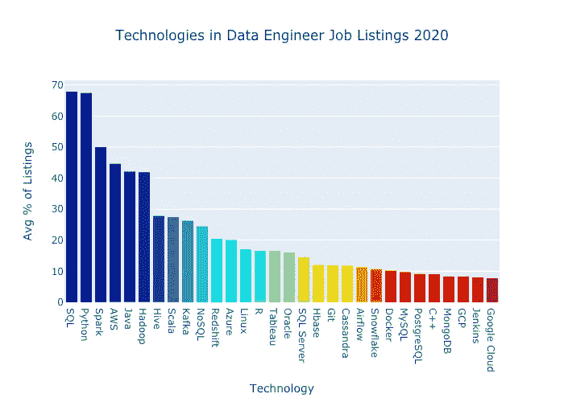
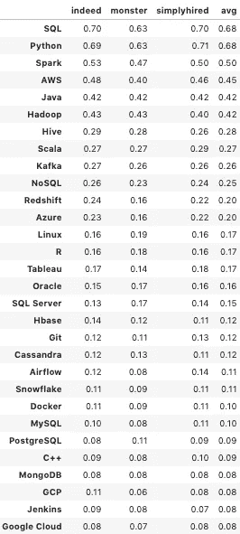
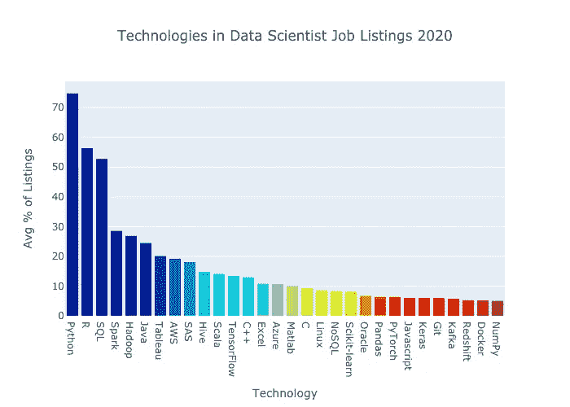
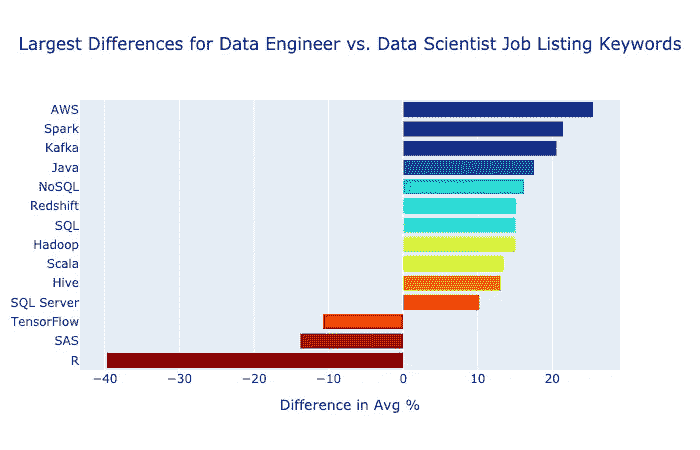
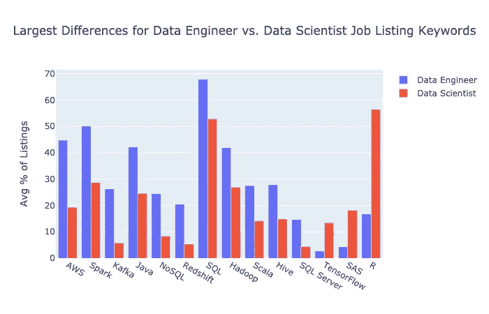
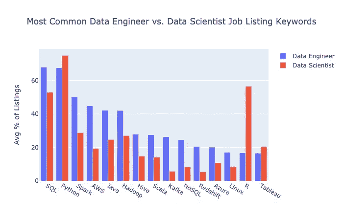

# 数据工程师最需要的技术技能

> 原文：<https://towardsdatascience.com/most-in-demand-tech-skills-for-data-engineers-58f4c1ca25ab?source=collection_archive---------1----------------------->

## 他们与数据科学家的技术技能相比如何？

根据 [2019 年的一项分析](https://insights.dice.com/2019/06/04/data-engineer-remains-top-demand-job/)，数据工程师是增长最快的职位。数据工程师通过创建和维护用于注入、转换和存储数据的管道和数据库，在组织中扮演着至关重要的角色。

数据工程师最需要哪些技术技能？它们与数据科学家最需要的技术技能相比如何？请继续阅读，寻找答案！😀

我分析了 2020 年 1 月数据工程师的工作清单，以了解哪些技术技能最受欢迎。我将结果与数据科学家的工作列表进行了比较，发现了一些有趣的差异。🔍

事不宜迟，以下是截至 2020 年 1 月数据工程师工作清单中的 10 大技术。

让我们跳进来吧！🚀

# 数据工程师角色

数据工程师在当今的组织中扮演着重要的角色。他们负责存储数据并使数据可供他人使用。

数据工程师建立管道从许多来源注入流和批处理数据。然后，管道执行提取、转换和加载(ETL)过程，以使数据更加可用。然后，这些数据可供数据科学家和数据分析师进行进一步处理。最终，数据会进入仪表盘、报告和机器学习模型。📊

我搜索数据来确定 2020 年数据工程师最需要哪些技术。

# 方法

我从[简单雇佣](https://www.simplyhired.com/)、[事实上](https://www.indeed.com/)和[怪物](https://www.monster.com/)那里搜集信息，看看在美国的工作列表中哪些关键词出现了“数据工程师”。我使用了[请求](https://requests.readthedocs.io/en/master/)和[美汤](https://www.crummy.com/software/BeautifulSoup/bs4/doc/) Python 库。

我在分析数据科学家职位列表和阅读数据工程师职位列表时加入了关键词。LinkedIn 没有被搜索到，因为之前在抓取后我被锁定在我的帐户之外。☹️

对于每个求职网站，我计算了每个关键词出现在该网站上的数据工程师职位列表的百分比。然后我计算了三个网站上每个关键词的平均百分比。

## 结果

以下是工作列表搜索结果中得分最高的 30 个数据工程师技术术语。

以下是表格形式的相同百分比数据。

我们来分析一下。🎸

# 讨论

SQL 和 Python 都出现在超过三分之二的工作列表中。它们是最值得了解的两项技术。💡

Python 是一种非常流行的处理数据、网站和脚本的编程语言。🐍

[SQL](https://en.wikipedia.org/wiki/SQL) 代表结构化查询语言。SQL 是由一系列语言实现的标准，用于从关系数据库中获取数据。它已经存在了很长时间，并显示出它的弹性。

Spark 出现在大约一半的列表中。 [Apache Spark](https://spark.apache.org/) 是“一个用于大数据处理的统一分析引擎，内置流、SQL、机器学习和图形处理模块”。它在非常大的数据集上特别受欢迎。

AWS 出现在大约 45%的列表中。AWS 是亚马逊的云计算平台。它拥有所有云平台中最大的市场份额。

接下来是 Java 和 Hadoop，各占 40%多一点。

[Java](https://www.java.com/en/) 是一种常用的、久经考验的语言，在 [Stack Overflow 的 2019 年开发者调查](https://insights.stackoverflow.com/survey/2019#most-loved-dreaded-and-wanted)中排名第十。相比之下，Python 是第二受欢迎的语言。甲骨文控制着 Java，从 2020 年 1 月起，这个网站的主页会告诉你所有你需要了解的东西。😉

就像时光机一样。

[Apache Hadoop](https://hadoop.apache.org/) 使用 MapReduce 编程模型和服务器集群来处理大数据。MapReduce 模型正在失宠。

接下来是 Hive、Scala、Kafka 和 NoSQL，它们都出现在大约四分之一的数据工程师列表中。

[Apache Hive](https://hive.apache.org/) 是一个数据仓库软件，它“使用 SQL 来方便读取、写入和管理驻留在分布式存储中的大型数据集”。

[Scala](https://www.scala-lang.org/) 是大数据流行的编程语言。Spark 是用 Scala 构建的。在 Stack Overflow 的 2019 年开发者调查结果中，Scala 是第 11 个最可怕的语言。

[Apache Kafka](https://kafka.apache.org/intro) 是一个分布式流媒体平台。它在注入流数据方面非常流行。

NoSQL 数据库站在 SQL 的对立面。NoSQL 数据库是非关系的、非结构化的，并且是水平可伸缩的。NoSQL 非常受欢迎，但是之前关于它将取代 SQL 成为主流存储模式的宣传似乎言过其实了。

# 与数据科学家术语的比较

以下是 30 大数据科学家工作列表技术术语，通过与数据工程师术语相同的方法得出。

就总列表而言，数据科学家列表比数据工程师列表多约 28%(12，013 对 9，396)。

让我们看看哪些术语在数据工程师列表中比在数据科学家列表中更常见。

## 对数据工程师来说更常见

下图显示了平均差异大于 10%且小于-10%的关键词。

AWS 的增幅最大，数据工程师的数量比数据科学家多 25%。它出现在大约 45%的数据工程师列表和大约 20%的数据科学家列表中。那是相当不同的！

这是同一数据的另一个视图，并列显示了数据工程师和数据科学家的工作列表结果:

Spark 显示了第二大增长。数据工程师经常和大数据打交道。

[卡夫卡](https://kafka.apache.org/)也增长了 20%。这大约是数据科学家列表百分比的四倍。注入数据是数据工程师的核心工作。

Java、NoSQL、Redshift、SQL 和 Hadoop 出现在数据工程师列表中的次数增加了 15%。

## 对数据工程师来说不太常见

现在让我们看看哪些技能在数据工程师工作清单中不太受欢迎。

从数据科学家到数据工程师的下降幅度最大。它出现在大约 17%的列表中，而不是大约 56%。哇哦。r 是一种受学者和统计学家欢迎的编程语言。这是堆栈溢出调查受访者的第八个最可怕的语言。

SAS 在数据工程师列表中也很少出现，大约有 14%的差异。SAS 是统计和数据的专有语言。有趣的是，我最近对[数据科学家工作列表](/the-most-in-demand-tech-skills-for-data-scientists-d716d10c191d)的分析显示，SAS 比任何其他技术都下降得多。

## 对数据工程师和数据科学家都很重要

值得注意的是，十大技术中有八项是在数据科学家和数据工程师职位列表中共享的。SQL、Python、Spark、AWS、Java、Hadoop、Hive 和 Scala 都在前 10 名之列。

以下是 15 个最常见的数据工程师术语，以及它们在数据科学家列表中的流行程度。

# 建议

如果你想成为一名数据工程师，我建议你学习以下技术，大致按优先顺序排列。

学习 SQL。我建议你学习 PostgreSQL，因为它是开源的，受欢迎的，并且还在增长。我那本令人难忘的 SQL 书向您展示了如何使用 PostgreSQL，在预发布版[这里](https://memorablesql.com)有售。

学习香草 Python。我的令人难忘的 Python 书籍是为 Python 新手设计的。该书有 Kindle 版本，也有来自[亚马逊](https://www.amazon.com/Memorable-Python-Learn-Faster-ebook/dp/B07ZXJKKSN/)和亚马逊网站的印刷版。epub 和。pdf 格式[此处](https://memorablepython.com)。

一旦你了解了基本的 Python，学习 pandas，一个用于清理和操作数据的 Python 库。如果你正在寻找一份需要 Python 的数据工作，而且大多数人都是这样，你可以期待公司也希望你有熊猫技能。我正在完成一本介绍熊猫的书，所以加入我的[数据令人敬畏的时事通讯](https://dataawesome.com)来确保你不会错过它。👍

熊猫零食

学习 AWS。如果你想成为一名数据工程师，你需要一个云平台，而 AWS 是最受欢迎的。我发现 [Linux Academy](https://linuxacademy.com/) 在线课程在学习[Google Cloud Data Engineering](/10-days-to-become-a-google-cloud-certified-professional-data-engineer-fdb6c401f8e0)技能时很有帮助，并期待它们对 AWS 有所帮助。

如果你知道所有这些技术，并希望成为更受欢迎的数据工程师，我建议你学习 Apache Spark for big data。尽管我对数据科学家职位列表的研究显示它的受欢迎程度正在下降，但它仍然占据了所有数据工程师职位列表的近一半。

火花

# 包装

我希望这篇数据工程师最需要的技术指南对你有用。如果你有，请在你最喜欢的社交媒体上分享，这样其他人也可以找到它。👍

如果您想了解这些术语与数据分析师术语相比有何不同，请点击此处查看我的文章。

我为 Python、Docker、数据科学和其他技术主题创建学习资源。如果你对此感兴趣，请关注我，在这里阅读更多。😀

数据工程快乐！🏗