# 数据专业人员最赚钱的国家

> 原文：<https://towardsdatascience.com/most-lucrative-country-to-work-in-as-a-data-professional-b2077f696ccb?source=collection_archive---------5----------------------->

## 为什么理解标准误差对避免犯影响职业生涯的错误至关重要

简·戈特维斯在 [Unsplash](https://unsplash.com?utm_source=medium&utm_medium=referral) 上的照片

数据世界也在以指数速度不断膨胀。每天都有新的工作广告，各行各业都在创造新的角色。随着越来越多的企业熟悉这个领域，对数据专业人员的需求也在不断增加。

*在完成我的数据科学学位后(像许多人一样)，我问自己下一步该去哪里？我很幸运处在一个全世界都需要工作的领域。在进行职业转移时，定性原因(如工作与生活的平衡)是必不可少的，但有一个定量原因也是决定性因素，即* ***工资*** *。这篇文章试图揭示是什么因素导致了更高的薪水，以及哪个国家为数据专业人员支付了更高的薪水。*

*然而，本文的技术目标是让读者了解* ***忽略样本量*** *的危险，以及它如何影响统计变异。*

数据专业人员是在数据分析、工程和科学领域工作的员工。本文中使用的数据收集了以下职位的专业人士的薪资信息:

1.  数据库管理员
2.  数据分析师
3.  数据科学家
4.  软件工程师/开发人员
5.  数据架构师
6.  经理
7.  系统管理员

在分析了三年来(2017、2018 和 2019 年)在 **85 个不同国家**超过**6500 名数据专业人员**的调查结果后，数据中有归因于个人工资的具体特征。

# 1.教育

> “学习不是强制性的；生存也不是”
> 
> 爱德华兹·戴明博士

拥有学位并不一定意味着高薪。我个人的信念是，学习是你在大学/工作之外学习时发生的事情。下面给出的是从数据中得出的图表，可以说它没有显示出资格和工资之间的关系。

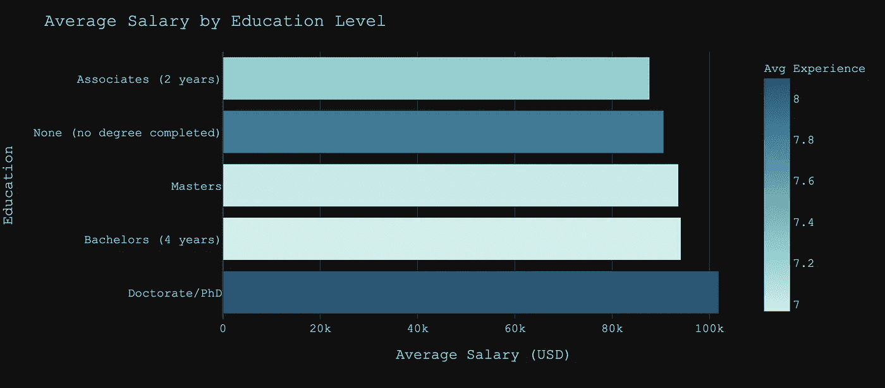

工资与资格的关系。按作者分类的图表

色标表示具有该资格的个人的平均经验年限。如图所示，拥有博士学位的数据专业人员平均薪酬最高，但需要注意的是，他们的经验也最多。在职学习对提高你的技术专长至关重要。因此，没有任何资格证书的人在平均工资方面仍然更好，因为他们倾向于积累更多的工作经验。人们可以得出这样的结论:学士学位可能会带来更高的报酬。然而，重要的是要意识到特征之间的其他几个相互作用(如公司规模、行业、位置等。).

# 2.经验

> “经验是万物之师。”
> 
> —朱利叶斯·凯撒

人们几乎很自然地认为工作经验与薪水有着积极的关系。专业人士在工作中花的时间越多，员工就会变得越熟练。随着他们与同事建立工作关系，他们可能会变得更有效率，工作质量也会提高。

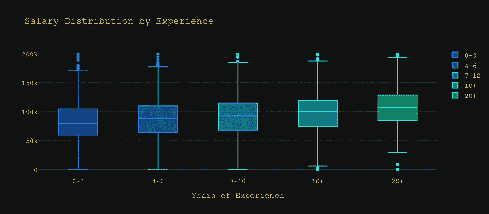

工资随经验变化的箱线图。按作者分类的图表

该图进一步支持了先前提出的假设。正如你所观察到的，平均工资随着工作年限的增加而单调增加。

> **注意:**所有工资都以美元给出，由于极端异常值，数据集仅限于 20 万美元以下的工资

# 3.曝光度(职位)

作为一名数据专业人员，我们期望每个人都能帮助他们的组织使用数据来解决三个关键挑战中的至少一个:

1.  统计模型——利用您的专业知识构建/开发和测试算法和数学模型
2.  开发管道——作为开发人员/程序员/工程师，你的工作是扩展这些模型并将其部署到生产中。
3.  业务事务专家—您的角色是了解来自 it 的数据和信息如何应用于运营。

管道的所有方面就像机器中的齿轮。每个齿轮必须彼此同步工作，系统才能正常工作。理想情况下，这个结构中的每一个成员都应该有相同的薪酬水平，因为一个人并不比另一个人更重要。不幸的是，我们的现实与理想相去甚远，取决于需求；特定的角色有额外的好处。

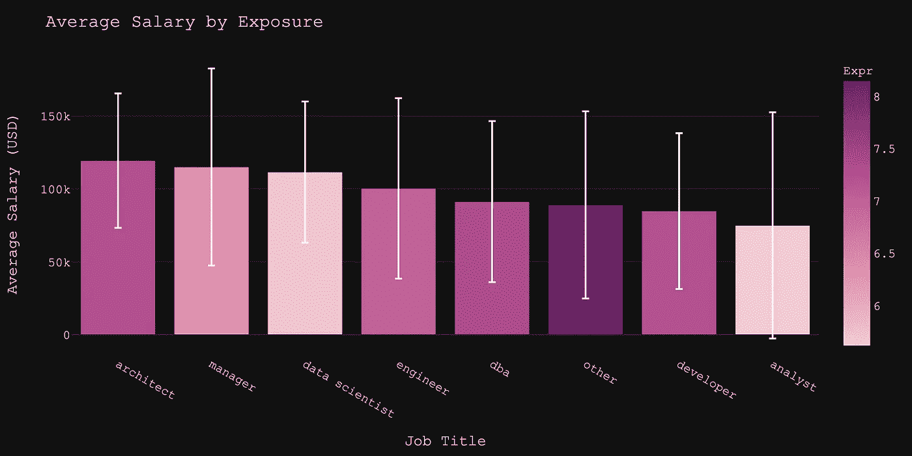

不同职位的平均工资，偏差以误差线表示。按作者分类的图表

平均工资显示数据架构师和经理是最富有的。跨数据集的分析师之间的差异是最大的。这种显著的偏差可能是因为分析师的职称定义不严格，并且适用于多个角色。色标代表了多年的经验，为我们解读结果提供了额外的视角。毫不奇怪，要成为数据架构师，您需要丰富的经验，上面的数据也表明了这一点。

不久前，数据科学家还被贴上了 21 世纪“最性感”工作的标签。从上面的结果可以明显看出这样做的好处。尽管经验较少，但他们往往比开发人员、工程师和数据库管理员做得更好。

# 4.位置

最后，分析引出了本文的主要目标— *试图揭示数据专业人员的最佳机会。*

这个问题的答案看起来很简单，类似于不同变量(教育、经验、曝光度)的薪资总和；可以对国家进行同样的分析。

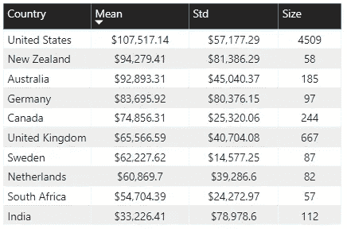

按国家显示数据专业人员平均工资的表格

上表总结了收集数据最多的前 10 个国家的信息。美国的样本量最大，为 4509 人，然后是英国的 667 人(很快就会明白为什么这一点很重要)。

从平均工资信息中，我们可以看到美国是数据专业人员薪酬最高的国家，其次是新西兰。对我来说，在澳大利亚为我的跨塔斯曼邻居工作可能会给自己带来伤害。

## 德莫维尔方程

人口的真实统计数字永远不会为人所知。从人口中的每个人那里获得准确的信息几乎是不可能的(太昂贵了)。直觉上，您收集的人口数据点越多，其结果的可信度就越高。重要的是要认识到样本大小如何影响这个置信区间，以及有时我们是如何危险地无知。

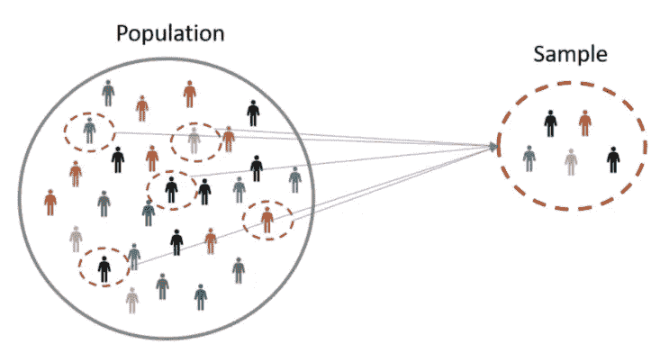

说明人口和样本大小之间的差异

当观察值回归到群体的平均值时，群体的真实值估计得最好。德·莫维尔方程为我们提供了均值的抽样分布的标准差。

简单来说，随着样本量的增加，样本内的**变异性开始向真实均值**收敛。为了说明这种影响，我随机对数据集进行了抽样，以计算每次观察的平均工资。美国和澳大利亚的结果如下。

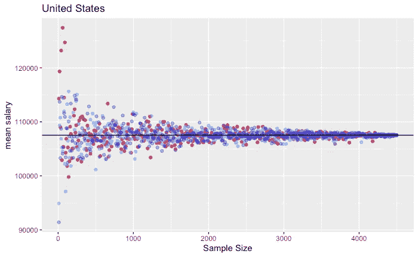

通过平均多个实现观察到的漏斗效应(美国)。按作者分类的图表

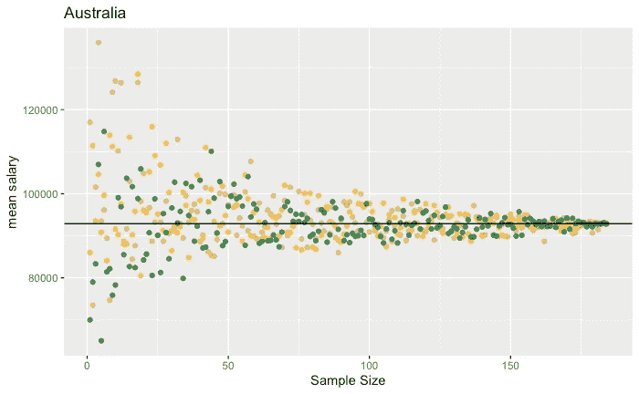

通过平均多个实现(AUS)观察到的漏斗效应。按作者分类的图表

随着样本量的增加，观察值开始回归平均值。当估计人口的统计数字时，我们必须考虑标准误差。

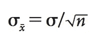

德莫维尔方程

平均值的标准误差通过将样本的标准偏差除以样本的大小来给出。

对这一等式的无知导致盖茨基金会在选定的学区花费了超过 10 亿美元来提高学术和有效的领导能力，而不是打破教室规模——实际上，这只是增加了差异。

## 说明平均值的标准误差

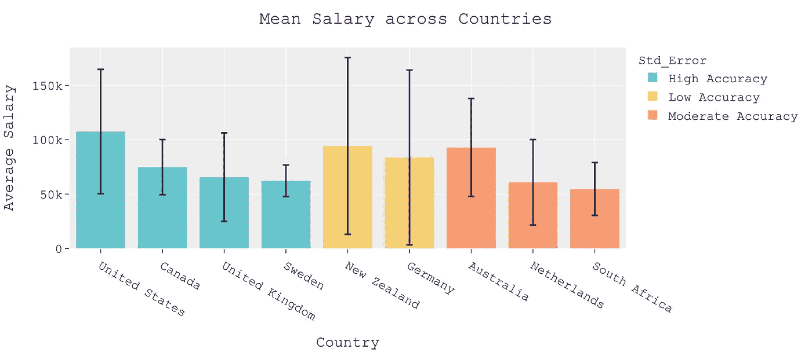

考虑标准误差的平均工资。按作者分类的图表

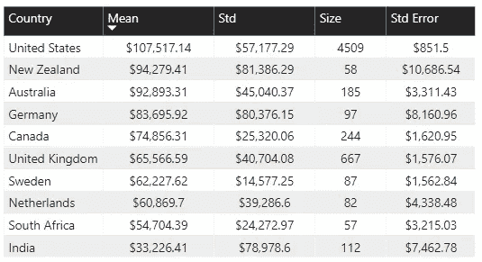

此表按国家/地区显示数据专业人员平均薪金的标准误差

有了标准误差的额外视角，判断就变得不那么明显了。

1.  例如，我可以说在美国一名数据专家的平均工资是**107，517 美元。**尽管如此，我相信人口的真实平均值会在**106，665 美元**到**108，369 美元**之间(即在其标准误差范围内)。
2.  标准误差与样本的标准偏差成正比，因此德国、新西兰和印度等国家的标准误差非常高。然而，像瑞典和加拿大这样的国家尽管样本量小，但标准误差却较低。
3.  尽管瑞典和荷兰的样本量相似，但由于数据的可变性，荷兰的标准误差要高得多。
4.  该误差与样本量成反比，因此即使美国和英国在样本中具有高标准偏差，由于样本量大，它们的标准误差相对较低。

人类没有完全理解变异的影响，尤其是差异变异，这并不是一个新的发现。回到这个问题，我问自己在澳大利亚工作比在新西兰工作好。我更愿意根据澳大利亚相对较低的标准误差做出决定，而不是新西兰较高的平均工资。从 2017 年到 2019 年收集的数据可能会显示新西兰的表现更好，但在接下来的几年里却下滑到平均水平。

# 多少数据就够了

这个问题的答案就像分析学中很多问题的答案；它**取决于**。你越想确定你的均值，你的样本就需要越大。它完全与你试图解决的问题的背景相关。

通过计算不同样本大小的标准误差，可以生成一个图来建议需要收集多少数据点。

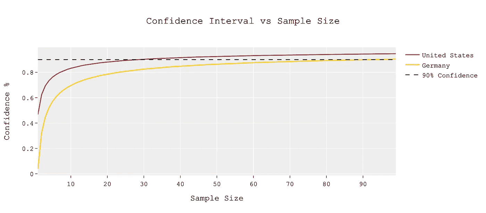

为美国和德国生成的信心图。按作者分类的图表

很明显，对于均值 90%的置信度，30 的样本量对于美国就足够了，然而，由于德国的高度可变性，我们需要将近 90 个数据点。

# 结论

个人认为，从数据中得出的最终推论并没有改变，“对数据专业人士来说，****美国是最赚钱的国家****”。然而，应用我对标准误差的理解，我并不是不知道数据集中潜在的可变性。这种见解与当前的分析环境相一致，美国在分析之旅中远远领先于大多数其他国家。它拥有资金最高的大学，大多数科技巨头都位于此。由于市场和需求如此之大，数据专业人员在那里的价值是最高的，这是显而易见的。**

# **GitHub 链接，谢谢**

**谢谢你一直读到最后。我希望这篇文章能让你在下一次统计数据呈现给你的时候质疑样本量。对于所有在这个领域寻找工作机会的人，我祝你们一切顺利！**

**请随时在 LinkedIn[上与我联系，一如既往，对此的任何反馈都将不胜感激。](http://www.linkedin.com/in/mehulnagpurkar)**

**所有的图表和代码都可以在我的 GitHub 资源库中找到，请随意下载并分析您的用例信息。**

** [## 有线服务/数据科学

### 说明 2019，2018，& 2017 数据专业薪资调查结果汇总数据库管理员有多少…

github.com](https://github.com/wiredtoserve/datascience/tree/master/DataProfessionals)** ****

**照片由[普里西拉·杜·普里兹](https://unsplash.com/@priscilladupreez?utm_source=medium&utm_medium=referral)在 [Unsplash](https://unsplash.com?utm_source=medium&utm_medium=referral) 上拍摄**