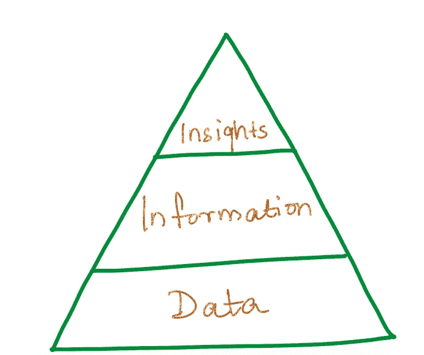

# 作为数据科学家，最常用的词是“洞察力”!

> 原文：<https://towardsdatascience.com/most-used-word-as-a-data-scientist-insights-b84b5a2966a2?source=collection_archive---------68----------------------->

## 是什么让你的数据富有洞察力？你如何给自己的见解排名？

[来源](https://unsplash.com/s/photos/moon)

听到 ***洞察*** 这个词，你脑海中浮现的第一个词是什么？作为一名数据科学家，当我从我的数据中收集一些有用的信息时，我会提到 insight 这个词。我相信数据、信息和洞察力是有秩序可循的。

将这三个词放在一起看，脑海中浮现出一个著名的层次结构:

导致洞察力的等级制度

数据是关于特定主题的原始上下文。信息是关注该主题的一种更加结构化的方式，它已经使用数据进行了过滤和聚合。洞察力基本上是在你对数据进行充分分析并得出特定结论后获得的。可操作的见解通常是那些你的团队准备好采取一些行动来帮助公司的透彻的见解。

我密切关注的步骤，以充分利用我的数据—

## 了解你的数据—

获得可操作洞察的主要步骤是您正在处理的数据的 ***质量*** 。它可以是结构化的，也可以是非结构化的。您应该经常密切关注您的目标和您正在处理的数据的一致性。您的数据应该是真实世界场景的良好近似。在开始你的数据探索之前，做一个 ***清单*** 列出你期望在你的特定问题表述中看到的所有东西。

例如:寻找不完整的数据、缺失的值、数据的分布、您期望在特征之间看到的明显和直观的相关性、数据的结构等。

## ***了解你的目标—***

必须有一个理由来解释为什么你必须处理你的数据。没有明确的目标，就不会得到明确的答案。密切关注你想要的结果，不要因此失去注意力。可能还有许多其他功能对其他任务更重要，但你需要关注的是你的 ***期望任务*** 。了解你的冲突池中的核心冲突，并计划解决它。采取额外措施解决冲突。

例如:如果你的主要关注点是基于当前形势和他们如何处理的各种州长的推文，那么更多地关注州长们基于#Covid19、#Coronavirus 的标签，而忽略其他消费者的个人推文，即使他们基于相同的标签追随特定的趋势。

如果你没有目标怎么办？如果你只是被分配了一项任务，并被要求拿出一些重要的东西来讨论呢？

有时你有数据，但你不知道如何使用它。你心中没有特定的目标。你没有想要解决的特定问题。你是如何进行的？

***I*** 通过关联各种特征、使用热图、收集关于各种特征的信息、将它们分解成片段、直观地假设目标变量列表并继续数据探索，特别注意数据中的某些趋势。如果说不通呢？我会用其他的目标变量重复这个过程。

## 知道哪些洞见已经被处理过了—

当你面前有数百万个数据点时，很容易迷失方向。因此，最好记下您的团队成员已经处理过或正在发现的其他有见地的数据。还有，不要忘记[第二点](#Know your Target Variable)到 ***避免处理不那么重要的见解*** 。

## 了解数据的背景——

如果你熟悉上下文，那么处理想要的结果会变得容易一些。凭借 ***直觉判断*** ，你可能会在数据上占据上风，而且通常情况下，你的结果会与预期结果一致。

例如:如果你根据宏观经济参数预测贷款结果，如果你知道宏观经济参数如何与贷款违约率相关联，这将是有帮助的。

## 知道如何传达这种洞察力—

如何让你的数据易于解读？大多数时候，你需要向没有数据科学/统计知识的不同团队传达你的洞察力。视觉是解读数据的最佳方式。它遵循透明性、可解释性和简单性。有一个很好的机会，你试图收集的洞察力是基于其他团队提出的问题，以帮助公司赢得客户，实现利润最大化，营销活动等。有时候，我们给出更多的信息，而不是见解。我们需要对我们最关键的观点进行排序，并传达出来。

*最后一点*，这一切都归结于你对你试图解决的问题的 ***知识*** 。它提高了你的工作质量。我想说，即使你从你的数据中发现了一个关键的见解，它也会让你的数据变得有见地。