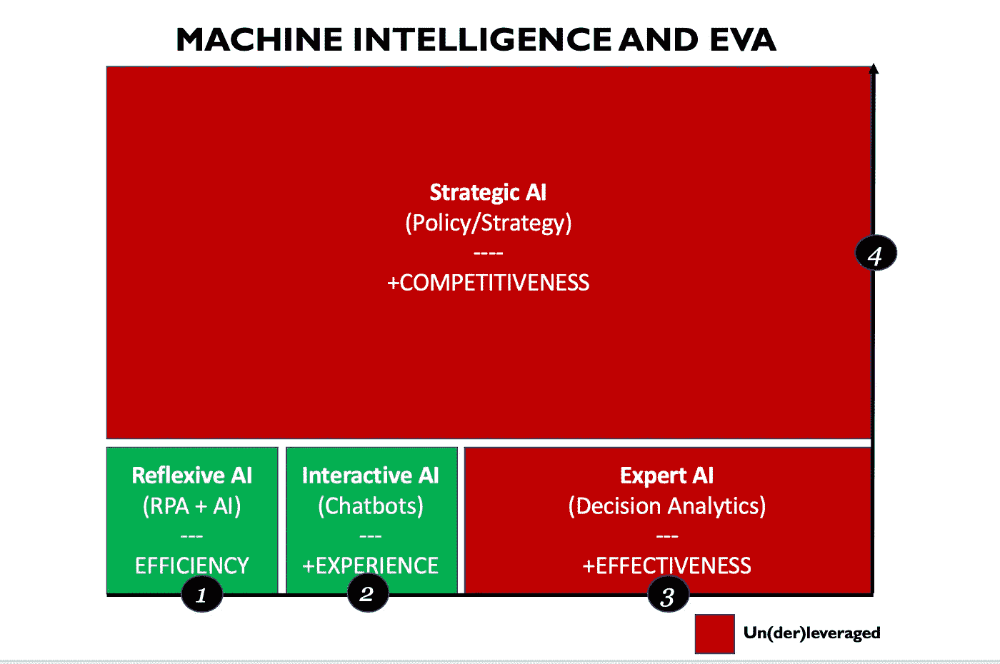
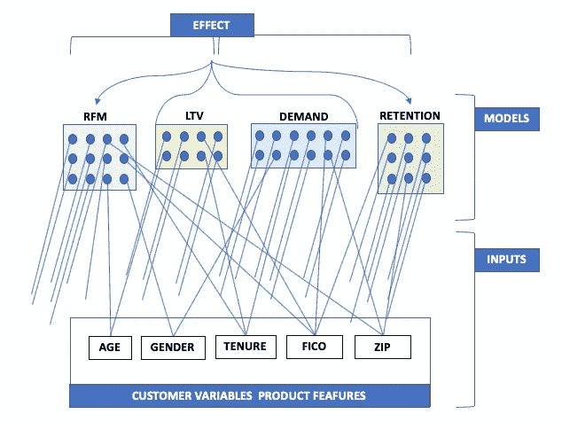
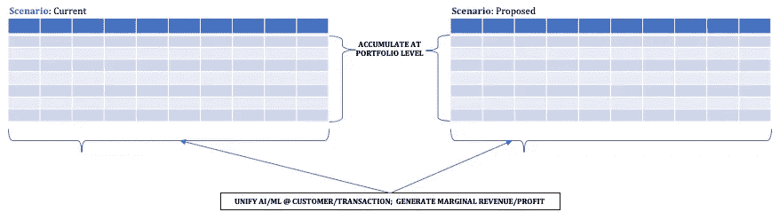
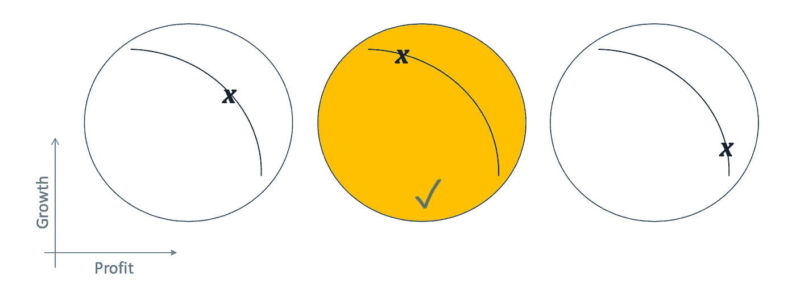

# 所有机器学习之母(MoAML)

> 原文：<https://towardsdatascience.com/mother-of-all-machine-learning-moaml-f16116248c18?source=collection_archive---------34----------------------->

## 帮助机器智能成长为与企业高度相关的产品

弗兰·霍根在 [Unsplash](https://unsplash.com/s/photos/electrical-cables?utm_source=unsplash&utm_medium=referral&utm_content=creditCopyText) 上的照片

# **阿.跋**

*   *本帖中使用的“* ***【分析】*** *，* ***AI*** *”与“* ***机器智能*** *”有重叠。“分析”指的是“大数据”前的分析，与“人工智能”或“人工智能”相比，后者在更一般的意义上使用。“机器智能”被用来代替曾经流行但令人困惑的“ML/AI”缩写。*
*   ****数据科学*** *”不能与“人工智能”互换使用，而是作为研究计算来交付新的人工智能方法或用途。**
*   ****本帖表达的所有观点*** *均为* ***个人*** *。**

# *B.背景*

*如果我们把费希尔 1922 年对回归领域的贡献看作是分析学的一个随意但方便的诞生，我们就站在几乎连续的分析学创新的世纪标记前(参见，例如， [费希尔关于回归](http://www.economics.soton.ac.uk/staff/aldrich/fisherguide/Fisher%20and%20Regression.pdf))。这一创新极大地改变了企业利用自身数据以及外部市场数据的方式，以尝试并推动改善业务成果和竞争地位。*

*最近的“大数据”革命通过 3 个相关事件的完美风暴，进一步加快了分析创新的步伐:(1) **智能 **quants anywhere** 的 web 访问**；(2)容易**可用性**有用**有用**数量**真实**数据**；(3) **基于云的** **存储和计算**能力以**超** **低成本**。***

*不幸的是，这场革命并没有让各种类型的“分析”(为了清楚起见，从这里开始称为“人工智能”)均匀受益。它给**反射式人工智能**和**交互式人工智能**(定义如下)带来了创新，这主要是由于多产的“数字原生”研究公司的敏锐关注，如**苹果**、**谷歌**、**脸书**、**亚马逊**、**易贝**等。*

*这些聪明、精力充沛、掌握数据的公司在正确的时间和地点迅速推进了这场革命。他们擅长利用其数据环境的特殊性质。他们能够利用从少量**自动化**和**一致**流程中获得的**数字**、**专有**和**集中式**数据；对于传统的实体公司来说，这是一种奢侈，也是一个梦想。*

*这种不平衡革命的结果是，通过扩展人工智能计划的类型，推动企业价值增长的绿地机会仍然存在。企业可以利用人工智能计划的完整补充，通过声称的估计以及对预期增值的热烈讨论，了解每种类型的投资和优先级。*

# *C.企业中的机器智能*

*有四(4)种主要的人工智能类型，我称之为**自反**、**互动**、**深思熟虑**和**战略**。前三(3)个是**面向事务的**和直观的，而**战略** **人工智能**支持完全不同的愿望。它帮助总经理们(从这里开始称为“GM”)**平衡增长**、**盈利能力**和**客户**、**满意度**，同时与公司目标、理念、风险偏好和其他紧急情况保持一致。*

*企业人工智能程序过度利用反射式人工智能( **RPA +人工智能**用于*后台办公自动化*)和交互式人工智能(**聊天机器人+ Q & A 机器** *实现自助服务*)计划。他们无法从深思熟虑的或战略性的人工智能中收获全部价值，即使这些有时更容易执行。我们不应该指望人工智能在这些解决方案中“冷静”,但它们肯定可以提高**决策质量**和**买入**以交付更好的业务成果。*

*今天，企业战略和政策继续主要由“直觉”和可怕的非正式过程驱动。现有流程松散地执行问责制，并且未能一致地传播关于糟糕决策及其连锁效应的知识。**由于战略人工智能对战略流程的广泛影响，与其他类型相比，战略人工智能可能对推动企业价值产生最大的影响**。*

*下面的插图提供了各种人工智能类型预期的相对贡献的概念，每美元投资的*(单个方框的大小反映了交付的相对价值，但我承认这可能不适用于所有企业)。**

****

**各种人工智能类型的预期相对贡献(Rajesh Iyer 的原始插图)**

**在这篇文章的剩余部分，我们将关注战略人工智能。使能技术很容易获得，短期的前期投资足以激活战略性人工智能计划。这一举措将帮助 GMs 研究各种战略方案和相关的财务影响，同时决定**的最佳战略策略**，以推动**利润增长**并主导其市场。**

# **D.与战略机器智能竞争**

**在我最近的文章[机器智能和企业](/machine-intelligence-and-the-enterprise-aee5f8710382?source=friends_link&sk=8cf6bbe082f7eab9698d85373231055e)中，我写了关于销售关于 ML 驱动的洞察力的价值的 GMs 的挑战。我提到了这个问题的解决方案，它基于将定制的 ML 模型捆绑到一个统一且有说服力的业务(“所有 ML 之母”)视图中。我提议建立一个“通用工作台”，作为一个平台，提供这样一个统一的视角来分析和选择制胜策略。**

**在这个 GM 工作台中，所有模型在事务级别同时运行，结果汇总为**投资组合视图**的**收入**和**利润**。此外，他们可以跟踪当前和各种提议的场景，以便于比较业务成果。我们现在回到我之前文章中的例子，使这里提出的想法更加具体。**

**我之前提到过来自**营销**的 **RFM 模型**、来自**定价**的 **LTM** 和**需求模型**以及来自**运营**的**留存模型**。如果我们想一想，我们会看到每个模型都是由一些独特的变量驱动的，以及与其他模型共享的其他公共变量。**

**例如，在金融服务领域中，**年龄**、**性别**、**地点**和**信用评分**、*以及其他*变量对于 **RFM** 、 **LTV** 、**需求**和**保留**模型是常见的。这很有用，因为它向我们展示了我们可以从一个地方为所有模型提供输入。在幕后，GM 工作台同时将变量的输入值适当地级联到每个模型。**

**我们可以稍后深入研究这种方法的分析价值。首先，我们应该停下来，认识到 GM 工作台不太明显但意义深远的好处。这将为 GMs 节省寻找和说服所有者发布其数据和相关模型的工作，以便进行例行分析和洞察，从而为数据驱动的战略和路线修正提供信息。**

**从分析的角度来看，GM 工作台的输入界面最好被认为反映了特定**产品的设计**和**相关的** **定价**。在这个隐喻下，可变输入“激活”特定的产品特征，并提供客户风险属性。这些数据与收入、成本和利润负载数据以及内部计算结合使用，以推动 LTV 和基于需求的定价。这种定价反过来在交易层面推动 RFM 和保留模型的输出。**

****

**模型的可变输入(Rajesh Iyer 的原始插图)**

**默认情况下，将向 GMs 提供**投资组合视图**的**利润**和**增长**，这是从**交易级别**上升到**投资组合**和/或**部门**级别的**ML 驱动结果的汇总。****

********

****拟议战略和行动的效果(Rajesh Iyer 原创插图)****

****"全球机制工作台"之所以得名，是因为全球机制可以利用它来尝试和比较各种可能的战略和政策情景的财务和非财务影响。更具体地说，工作台允许总经理轻松地对其职权范围内的投资组合执行“**What-if**、**模拟**和**优化**分析。****

****我们希望 GMs 创建情景，研究改变当前客户组合、细分市场特定增长焦点等的影响。，以达成将实施的“*当前正确的*”策略。****

********

****在有效边界上选择一个点(Rajesh Iyer 原创插图)****

****这些类型的练习允许总经理做出正确的选择和策略，以反映他们公司平衡利润与增长的哲学。例如，上图显示总经理优先考虑投资组合的增长而不是盈利。****

****—****

****我的团队在实现上述类型的 GM 工作台的愿景方面已经取得了很大的进步，但是我们并不孤单。我要感谢来自 **Earnix** 和 **DataRobot** 的金融服务领域和工程专家，前者是一家成熟的优化平台销售商，后者是一家受欢迎的汽车 ML 平台销售商，他们为制定通用工作台概念提供了大量帮助。****

****在我们的工作中，我们依靠 **DataRobot** 的 ML 模型构建能力，并利用 **Earnix** 在一个平台上将各种模型联系在一起，使用我团队的专业知识为金融服务公司制定实施蓝图和 GSI 服务产品。****

# ****E.结论****

****我相信是时候认真投资建立像 GM Workbench 这样的战略人工智能解决方案了。我们与 **Earnix** 和 **DataRobot** 的合作表明，随着时间的推移，我们可以构建 GM 工作台并根据个人客户的需求对其进行定制，以便他们可以利用它来主导其市场竞争。****

# ******F. Nota Bene******

****我想以明确阐述这篇文章的动机来结束这篇文章。我对推动人工智能工作感兴趣，而不是专注于任何一种类型。具体来说，我正在寻找方法，说服企业赞助严肃的人工智能投资，这些投资有可能带来巨大的企业价值。****

****如果承诺的价值，然后一些，可以交付，我们可以期待看到公司充满信心地深化他们在所有类型的人工智能的参与和投资。****