# 使用服务主体和秘密范围在 Azure 数据块中挂载和访问 ADLS Gen2

> 原文：<https://towardsdatascience.com/mounting-accessing-adls-gen2-in-azure-databricks-using-service-principal-and-secret-scopes-96e5c3d6008b?source=collection_archive---------0----------------------->

## 关于使用 Azure 密钥库支持的秘密范围和服务主体从 Python 中的数据块访问 Azure 数据湖存储 Gen2 的指南。


马库斯·温克勒在 [Unsplash](https://unsplash.com/?utm_source=medium&utm_medium=referral) 上的照片

Azure 数据湖存储和 Azure 数据块无疑是 Azure 基于云的数据分析系统的支柱。Azure 数据湖存储提供了可扩展且经济高效的存储，而 Azure Databricks 提供了在该存储上构建分析的方法。

分析过程从将存储装载到 Databricks 分布式文件系统(DBFS)开始。有几种方法可以将 Azure 数据湖存储 Gen2 挂载到 Databricks。也许最安全的方法之一是将身份和访问管理任务委托给 Azure AD。

本文着眼于如何将 Azure 数据湖存储挂载到由服务主体和 OAuth 2.0 使用 Azure Key Vault 支持的秘密范围认证的数据块。

**警告:** *Microsoft Azure 是一项付费服务，遵循本文可能会导致您或您的组织承担财务责任。*

> 在撰写本文时，Azure Key Vault 支持的 Secret Scopes 处于“公开预览”状态建议不要在生产或关键系统中使用任何“预览”功能。

*在继续阅读本文之前，请阅读我们的使用条款:*[*https://dhyanintech . medium . com/disclaimer-disclosure-disclosure-terms-of-use-fb3 BF BD 1e 0e 5*](https://dhyanintech.medium.com/disclaimer-disclosure-terms-of-use-fb3bfbd1e0e5)

# 先决条件

1.  有效的 Microsoft Azure 订阅
2.  Azure 数据湖存储第二代客户
3.  Azure Databricks 工作区(高级定价层)
4.  蓝色钥匙保险库

*如果您还没有设置先决条件，请参考我们之前的文章开始:*

[](https://medium.com/@dhyanintech/a-definitive-guide-to-turn-csv-files-into-power-bi-visuals-using-azure-4483cf406eab) [## 使用 Azure 将 CSV 文件转换为 Power BI 视觉效果的权威指南

### 使用 Microsoft Azure 产品将新冠肺炎数据转化为惊人的 Power BI 视觉效果的分步指南。

medium.com](https://medium.com/@dhyanintech/a-definitive-guide-to-turn-csv-files-into-power-bi-visuals-using-azure-4483cf406eab) 

要访问由 Azure AD 租户保护的资源(例如，存储帐户)，安全主体必须代表需要访问的实体。安全主体为 Azure AD 租户中的用户或应用程序定义访问策略和权限。**当应用被允许访问租户中的资源时(例如，在注册时)，服务主体对象被自动创建。**

*关于服务原则的进一步阅读:*

[](https://docs.microsoft.com/en-us/azure/active-directory/develop/app-objects-and-service-principals) [## Azure AD 中的应用和服务原则—微软身份平台

### 本文描述了 Azure Active Directory 中的应用程序注册、应用程序对象和服务主体…

docs.microsoft.com](https://docs.microsoft.com/en-us/azure/active-directory/develop/app-objects-and-service-principals) 

让我们首先注册一个 Azure AD 应用程序来创建一个服务主体，并将我们的应用程序身份验证密钥存储在 Azure Key Vault 实例中。

# 注册 Azure 广告应用程序

在 Azure 门户主页上找到并选择 **Azure Active Directory** 。选择**应用注册**，点击 **+新注册**。

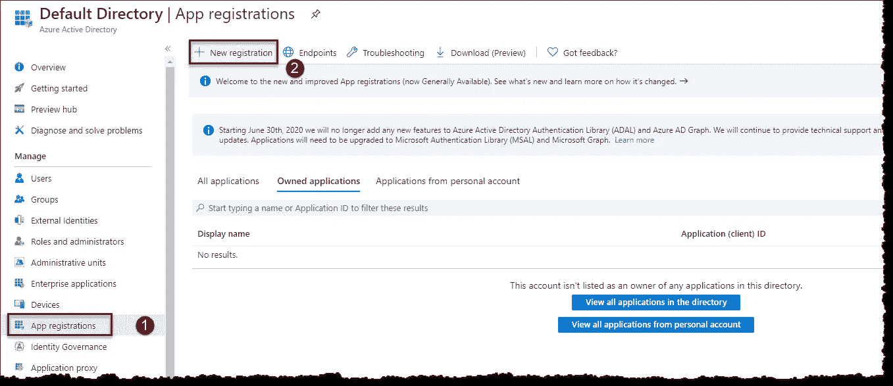

Azure 活动目录:注册一个新的应用程序(图片由作者提供)

在**注册应用**页面，输入名称*ADL access*，表示应用的用途，点击**注册**。

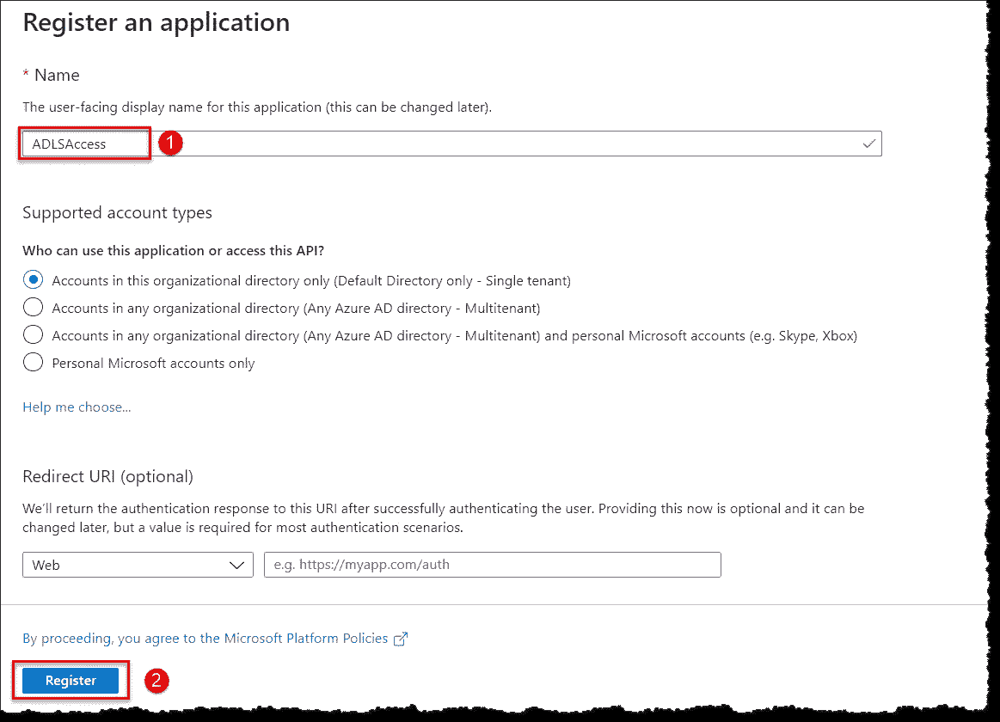

Azure 活动目录:命名和注册应用程序(图片由作者提供)

在**ADL access**屏幕中，将**应用(客户端)ID** 和**目录(租户)ID** 复制到记事本中。应用 ID 是指我们刚刚注册的 app(即 ADL access)，我们的 app ADLSAccess 注册到的 Azure AD 租户是目录 ID。

接下来，我们需要生成一个认证密钥(也称为应用程序密码或客户端密码或应用程序密码)来认证 ADLSAccess 应用程序。点击**证书和密码**，然后点击 **+新客户端密码**。在**上添加一个客户端秘密**刀片，输入描述，一年期满，完成后点击**添加**。

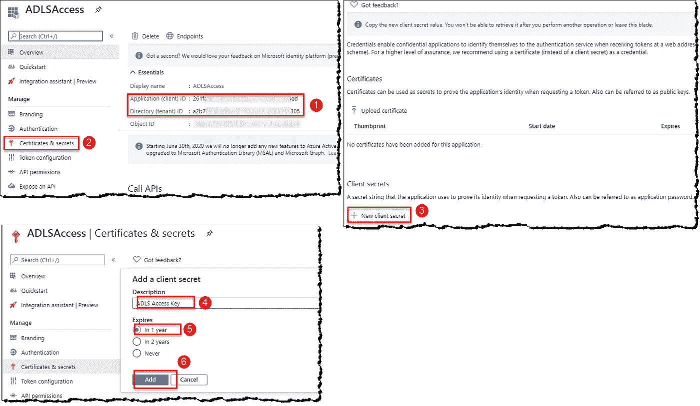

Azure Active Directory:创建客户端机密(图片由作者提供)

当您点击**添加**时，将出现客户端密码(认证密钥)，如下图所示。您只有一次机会将这个键值复制到记事本中。**如果您执行另一个操作或离开此刀片**，您将无法取回它。

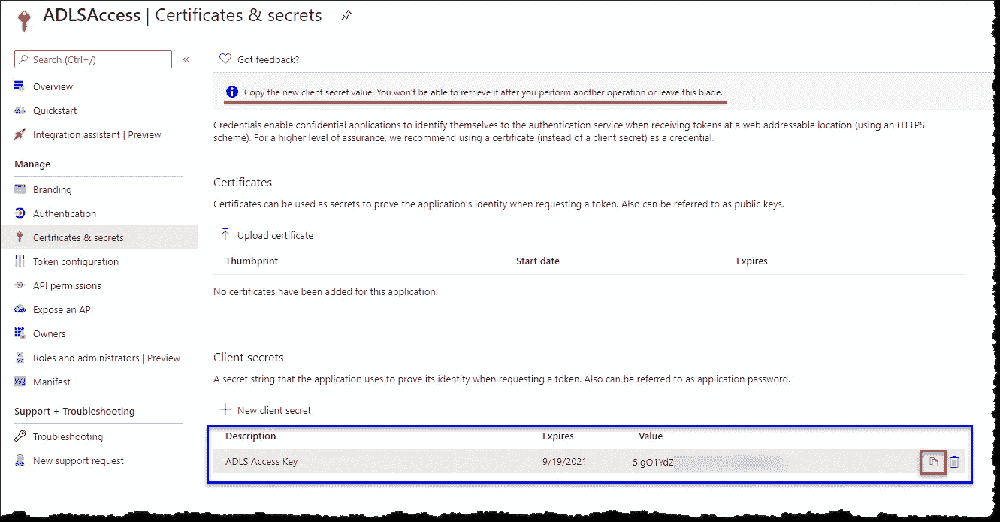

Azure 活动目录:客户端机密(图片由作者提供)

# 授予服务主体对 ADLS 帐户的访问权限

接下来，我们需要为我们的服务主体分配一个访问角色(回想一下，服务主体是在注册应用程序时自动创建的)，以访问我们的存储帐户中的数据。转到 Azure 门户主页，打开您的存储帐户所在的资源组。点击**访问控制(IAM)** ，在**访问控制(IAM)** 页面，选择 **+添加**，点击**添加角色分配**。在**添加角色分配**刀片上，将**存储 Blob 数据贡献者**角色分配给我们的服务主体(即 ADLSAccess)，如下所示。

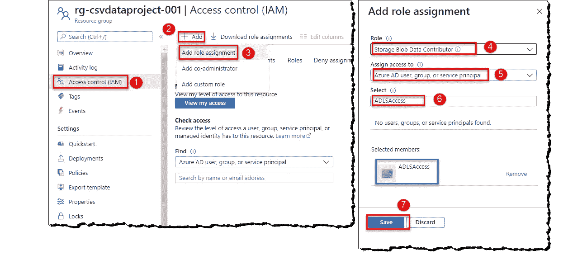

资源组:将角色分配给服务主体(按作者排序的图像)

# 将应用程序机密添加到 Azure 密钥库

转到 Azure 门户主页并打开您的密钥库。点击**秘密**添加新的秘密；选择 **+生成/导入**。在**上创造一个秘密**刃；给定一个**名称，**输入客户端机密(即，我们在上一步中复制的 **ADLS 访问密钥**)作为**值**和**内容类型**，以便于以后阅读和识别机密。重复前面复制的**应用程序(客户机)ID** 和**目录(租户)ID** 的创建过程。你的金库现在应该有三个秘密了。

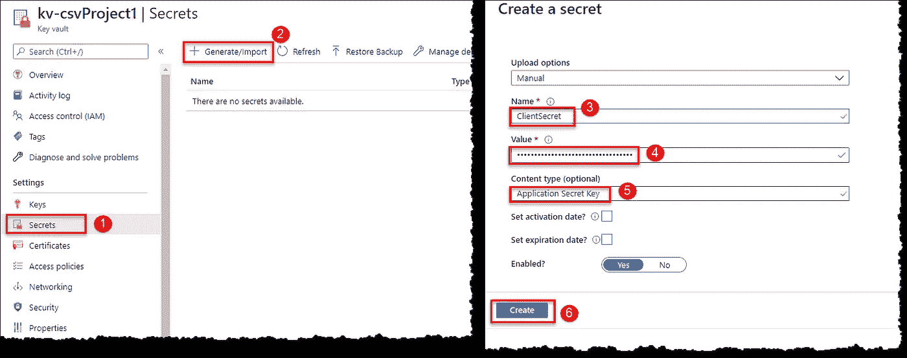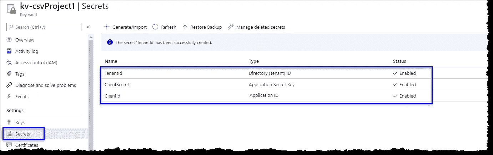

Azure Key Vault:添加新秘密(图片由作者提供)

选择**属性**，将**金库 URI** 和**资源 ID** 复制到记事本中；下一步我们将需要它们。

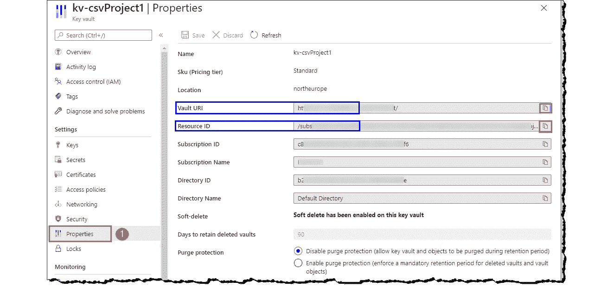

Azure 密钥库:属性(图片由作者提供)

# 在 Azure Databricks 中创建 Azure 密钥库支持的机密范围

*如果你已经阅读了我们的另一篇关于为 Azure SQL Server 凭证创建秘密范围的文章，只要你的密钥库和数据块实例保持不变，你就不必执行这个步骤。*

转到`https://<DATABRICKS-INSTANCE>#secrets/createScope`，用您实际的数据块实例 URL 替换<数据块实例>。创建一个秘密范围，如下所示。

> 此 URL 区分大小写。

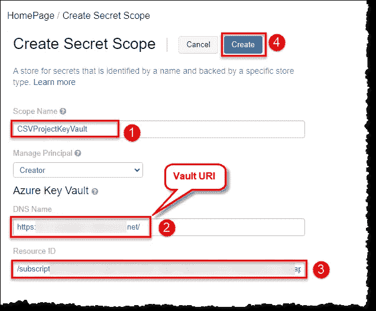

Azure Databricks:创建一个秘密范围(图片由作者提供)

# 使用秘密范围将 ADLS 安装到数据块

最后，是时候将我们的存储帐户安装到我们的 Databricks 集群上了。回到您的 Databricks 集群，打开我们之前创建的笔记本(或者任何笔记本，如果您没有遵循我们的整个系列)。

我们将定义一些变量来生成我们的连接字符串，并使用 Databricks 实用程序获取秘密。您可以将下面的代码复制粘贴到您的笔记本上，或者自己键入。我们在这个笔记本上使用 Python。使用单元格右上角给出的控件运行代码。不要忘记用你的存储细节和秘密名称**替换变量赋值**。

*关于数据块工具(dbutils)和访问机密的进一步阅读:*

 [## 数据块工具

### Databricks 实用程序(DBUtils)使执行强大的任务组合变得容易。您可以使用这些实用程序来…

docs.databricks.com](https://docs.databricks.com/dev-tools/databricks-utils.html#secrets-utilities) 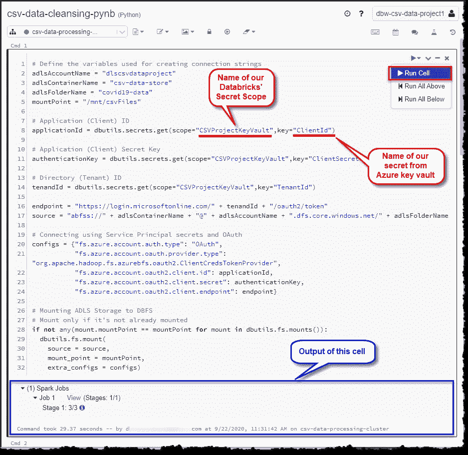

Azure Databricks:在 Python 中安装 ADLS Gen2(图片由作者提供)

*如何高效使用笔记本的进一步阅读:*

 [## 使用笔记本

### 笔记本是可运行单元(命令)的集合。当您使用笔记本电脑时，您主要是在开发和…

docs.databricks.com](https://docs.databricks.com/notebooks/notebooks-use.html) 

我们可以通过在单元格的开头指定 language magic 命令来覆盖笔记本的默认语言。支持的魔法命令有`%python`、`%r`、`%scala`和`%sql`。笔记本也支持一些额外的魔法命令，如`%fs`、`%sh`和`%md`。我们可以使用`%fs ls`来列出我们挂载的存储的内容。


Azure Databricks:魔法命令(图片由作者提供)

当您不再需要存储时，不要忘记卸载它。

```
# Unmount only if directory is mounted
if any(mount.mountPoint == mountPoint for mount in dbutils.fs.mounts()):
  dbutils.fs.unmount(mountPoint)
```

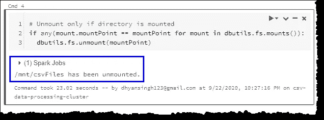

Azure Databricks:卸载 Python 中的 ADLS Gen2(图片由作者提供)

恭喜你！您已经成功地将您的存储帐户安装到 Databricks，而没有泄露和存储您的应用程序机密和访问密钥。

# 结论

我们看了如何注册一个新的 Azure AD 应用程序来创建一个服务主体，为服务主体分配访问角色，并将我们的秘密存储到 Azure Key Vault。我们在 Azure Dataricks 中创建了一个 Azure Key Vault 支持的 Secret 范围，并在 Dataricks 中安全地挂载和列出了存储在我们的 ADLS Gen2 帐户中的文件。

# 后续步骤

如果你想知道我们是如何在存储中获得这些 CSV 文件的，请阅读我们的另一篇文章，建立一个创新的 Azure 数据工厂管道，通过 HTTP 从 GitHub 存储库中复制文件。

[](https://medium.com/@dhyanintech/using-azure-data-factory-to-incrementally-copy-files-based-on-url-pattern-over-http-569476b625fc) [## 使用 Azure Data Factory 基于 HTTP 上的 URL 模式增量复制文件

### 一个创新的 Azure 数据工厂管道，通过 HTTP 从第三方网站增量复制多个文件…

medium.com](https://medium.com/@dhyanintech/using-azure-data-factory-to-incrementally-copy-files-based-on-url-pattern-over-http-569476b625fc) 

我们还有另一篇关于连接和访问来自 Datarbricks 的 Azure Synapse 分析数据仓库的激动人心的文章。看一看:

[](https://medium.com/@dhyanintech/a-credential-safe-way-to-connect-and-access-azure-synapse-analytics-in-azure-databricks-1b008839590a) [## 在 Azure Databricks 中连接和访问 Azure Synapse Analytics 的凭据安全方式

### 关于如何在 PySpark 中使用秘密作用域设置 SQL Server 防火墙和从数据块连接的指南

medium.com](https://medium.com/@dhyanintech/a-credential-safe-way-to-connect-and-access-azure-synapse-analytics-in-azure-databricks-1b008839590a) 

## 喜欢这个帖子？与 Dhyan 联系

让我们做朋友吧！你可以在 [LinkedIn](https://www.linkedin.com/in/dhyans/) 上找到我或者在 [Medium](https://dhyanintech.medium.com/membership) 上**加入**我。