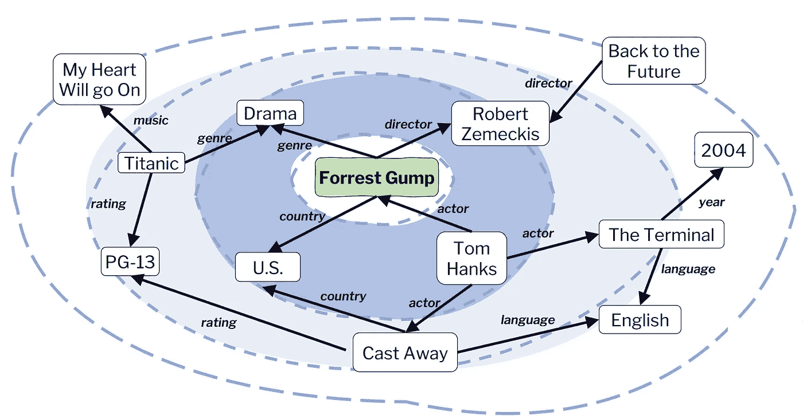
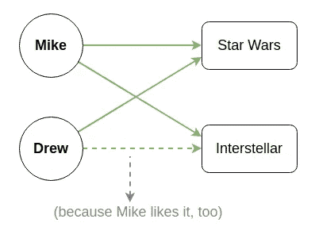
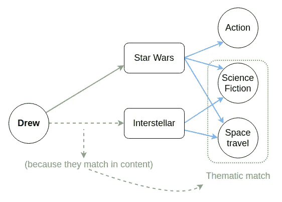
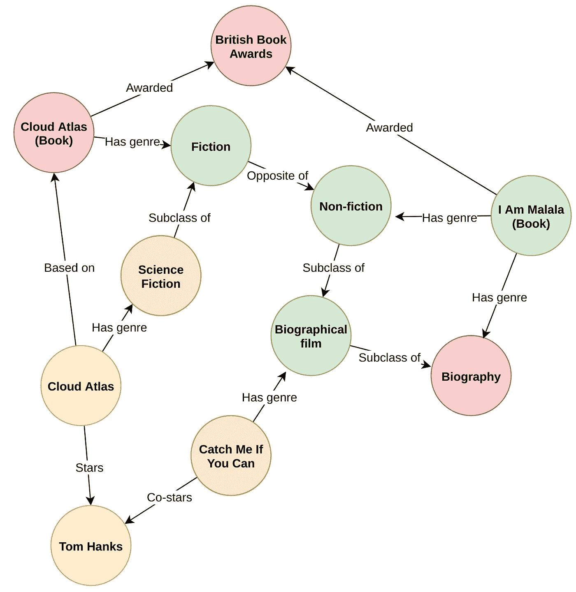
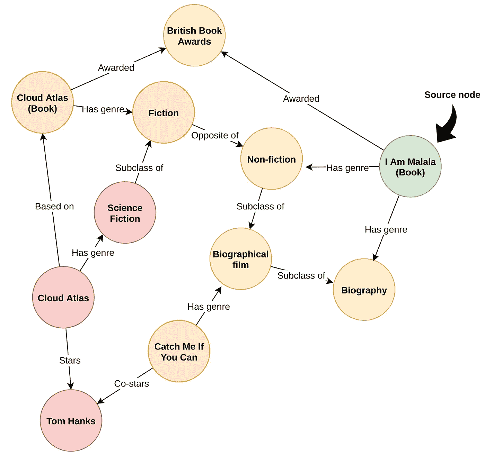
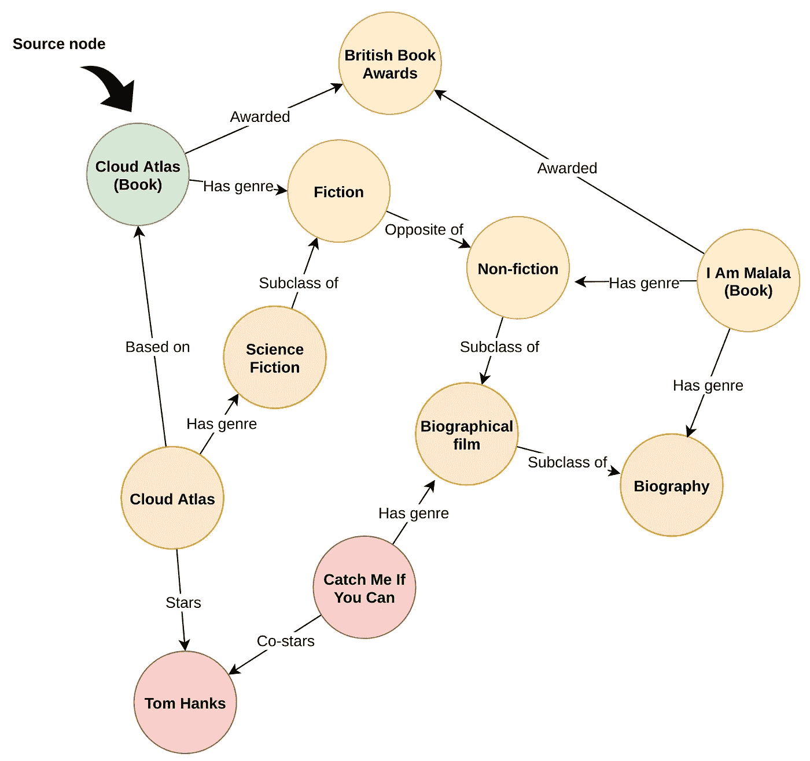
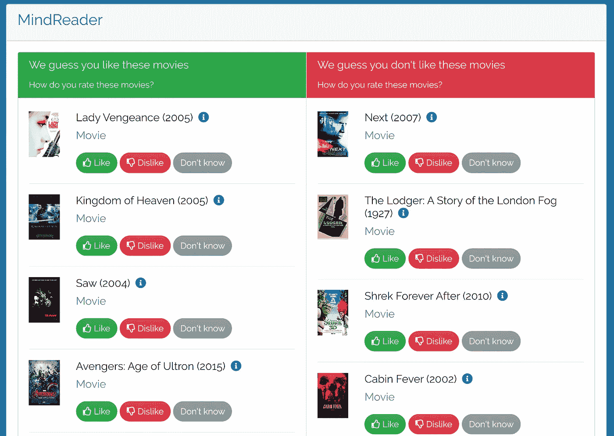
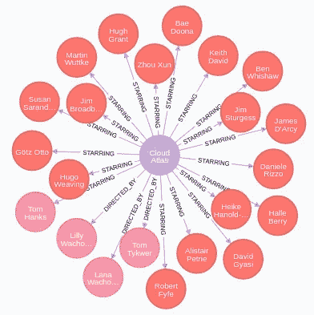

# 基于知识图和 Neo4j 的电影推荐

> 原文：<https://towardsdatascience.com/movie-recommendations-powered-by-knowledge-graphs-and-neo4j-33603a212ad0?source=collection_archive---------7----------------------->

## 直接从数据库中快速获得高质量的推荐



Lissandrini 等人的插图。艾尔

当你游览网飞时，你会看到几个可供你观看的电影列表。一些新版本，一些受其他用户欢迎，最有趣的是，一些**为你挑选的**。网飞使用一个强大的**推荐系统**来生成这份名单。根据你所观看和评价的内容，它会从类型、情节、演员等方面建立你的品味档案，并使用这个档案*来推荐符合你品味的电影*。

推荐系统或推荐器被大量平台使用，包括亚马逊、网飞、脸书和许多其他电子商务和服务提供平台。他们的目的很简单:推荐特定用户最有可能购买/观看/成为朋友的物品/电影/人物。

在本文中，我们将介绍如何仅使用 Neo4j 来构建有效的推荐系统。

虽然许多推荐系统依赖于几个相互交互的子系统(例如，机器学习集群训练和从中央数据库提取数据)，但我们将通过利用知识图的表达能力，实现一个直接在数据库本身上运行的推荐器，并且非常高效。

我们还展示了我们如何使用这项技术来构建 [MindReader](https://mindreader.tech/) ，这是一个使用图形技术的推荐系统(将在本文后面解释)，允许用户协作构建一个数据集，这不同于个性化推荐研究领域中使用的任何其他数据集。

# 推荐系统——概述

如果你是一个狂热的恐怖电影观众，网飞会发现这一点，并向你推荐更多的恐怖电影，而不是，例如，喜剧表演和儿童电影。不管一个人的业务性质如何，这都是一个期望的特征。当然，问题在于如何以简单、高效和有效的方式推断用户偏好。

一般来说，我们谈论三种实现方式:通过**协作**或**基于内容的**过滤，或者两者的组合(**混合**)。协同过滤推荐器将使用与你相似的用户的交互来确定你想要什么。

想象一下两个假设的用户，迈克和德鲁，他们都是科幻电影的粉丝，都喜欢星球大战。迈克也喜欢星际，但德鲁没看过。协同过滤推荐器会向德鲁推荐《星际穿越》,因为和德鲁有相同爱好的迈克也喜欢《星际穿越》。



作者插图

协作过滤可以是一种有效的策略，因为两个用户喜欢和不喜欢某组项目的事实可以有效地编码一些相当复杂的偏好，而我们不必担心那些偏好实际上是什么。

另一方面，基于内容的过滤推荐器将查看两部电影的内容，并确定内容的相似性是否值得推荐。也就是说，相似的商品会吸引相似偏好的用户。



作者插图

这也是一种有效的策略，并且比协同过滤更透明，因为我们通过更有形的属性如类型、演员等来理解相似性。注意，在我们的例子中，即使没有人给《星际穿越》评分，我们仍然可以推断出用户的偏好。在协同过滤中，这是不可能的。**的确，基于内容的过滤在** ***项冷启动*** **项设置**中确实能大放异彩。这是指没有用户评级的新项目被引入系统。

我们将构建一个基于内容的推荐器，使用用户信息和知识图(由 Neo4j graph 数据库提供支持)向用户推荐产品。然而，首先值得讨论的是为什么知识图和图数据库首先是必要的。

# 为什么是图表？

直观地说，为了实现基于内容的推荐器，我们应该能够将所有电影建模为 SQL 数据库中带有一系列属性(例如，类型、演员和主题)的简单对象。事实上，通过适当的关系将几个表连接起来就可以很容易地实现这一点。

一旦我们开始考虑除了`Movie→HasProperty→Property`之外的连接，图数据库的力量就变得很明显。事实上，我们想要表达一个更加丰富的模型，在这个模型中，我们表示属性之间的相互关系——有效地允许属性拥有属性。这也允许我们明确地对每种关系的性质进行建模。在这种情况下，图形模型的表达变得更加清晰:


作者插图

***以上是一个示例知识图*** 表示电影和书籍以及演员、流派和它们之间的复杂关系。在知识图中，我们不仅知道什么项目与什么属性相关，还知道它们如何相关，并且对什么可以相关以及如何相关没有任何限制。

有了这样的图形结构，我们突然有了很多新的方式来描述我们想要推荐的商品。当我们比较两个项目时，这转化为关于给定用户可能欣赏什么以及为什么欣赏的更复杂的推理。例如，如果用户喜欢《云图》(电影)，他们可能会喜欢《如果你能抓住我》，因为汤姆·汉克斯在这两部电影中都有出演。另一方面，他们可能在寻找不同于小说的东西。如果他们想买一本书，他们可能会喜欢“云图”(这本书)，如果他们也喜欢“如果你能抓住我”，他们可能会喜欢“我是马拉拉”这本书，因为它也是一本传记，并获得了与云图书类似的奖项。

虽然用标准的 SQL 技术对此建模肯定是可能的，但由于结构复杂，这通常非常困难。相反，在图形数据库中，对这种结构建模[更简单](https://neo4j.com/blog/data-modeling-basics/?ref=blog)。此外，像这样在 SQL 数据库中查询大量关系是[而不是](https://neo4j.com/whitepapers/overcoming-sql-strain-graph-databases/?ref=blog) [非常高效的](https://neo4j.com/whitepapers/overcoming-sql-strain-graph-databases/?ref=blog) [操作](https://neo4j.com/whitepapers/overcoming-sql-strain-graph-databases/?ref=blog)。更重要的是，在图形数据库中，我们可以随意扩展数据库图形的结构，并表示一个不断发展的领域。

# 提出建议

为了向用户建议物品，通常部署非常复杂的机器学习模型。在这里，我们将通过使用 ***PageRank*** *算法的变体来为我们的用户提供推荐*，从而充分利用图的力量。PageRank 算法是谷歌网页排名算法的核心。它用于根据网页的连接方式对互联网上最相关和最重要的网页进行排名。*这意味着它被用来评估一个页面的重要性。*

该算法模拟了一个随机的网上冲浪者，通过跟踪各个网页之间的链接来浏览网页。网页以节点的形式呈现，当一个页面包含到另一个页面的链接时，就创建了连接(边)。给定网站(即网络图中的节点)的 PageRank 是由用户在漫无目的地浏览网页时有多大可能最终到达特定网页来给出的。


作者插图

在图中，最重要的网页是 Wikipedia，其次是 Neo4j 和 Dev.to，然后是 Google 和 Reddit，依此类推。

在 PageRank 模型中，我们假设随机上网者可以在任何时间传送到整个网络中的任何页面。这类似于冲浪者只是在浏览器中键入不同的 URL，而不是跟随页面上的链接。在一个名为**个性化页面排名**的变体中，我们将冲浪者可以传送的目标页面限制为一组特定的图节点(这被称为偏好集或*个性化集*，因为它们代表了特定用户最喜欢的页面)。例如，如果我们通过只允许冲浪者传送到中等来“个性化”页面排名，我们会得到以下排名:


作者插图

请注意，随机冲浪者模型对图表建模的内容没有要求。最后，我们得到的是根据相关性和重要性对图中的节点进行排序，而不管这些节点代表什么。

所以，我们应该可以用我们的电影图像数据库做类似的事情，对吗？是啊！之前知识图谱的全球 PageRank 给了我们以下排名:



作者插图

这将是我们用来向新访问的用户展示产品的排名，产生前三名(1)“我是马拉拉”，“2”“云图(电影)”，和(3)“如果你能抓住我”。因此，我们建议用户阅读“我是马拉拉”。

让我们想象一下，用户接受了我们的推荐，读到了“我是马拉拉”，并且乐在其中。这给了我们什么信息？此外，建议应该如何根据这些信息进行更改？如果没有什么变化，我们会建议用户接下来观看“云图”电影，但也许他们喜欢“我是马拉拉”的事实可以得到更好的利用。一个想法可以是简单地将页面排序个性化为“我是马拉拉”。这将通过等级向上推动与“我是马拉拉”密切相关的节点。额外的好处是，这允许我们将计算限制在局部受影响的节点。

个性化 PageRank 的另一个显著优势是，我们可以通过分配用户特定的关系权重来进一步个性化排名*。例如，如果用户喜欢在不同的电影中看到相同的演员，我们可以为该用户高度权衡`Stars`和`Co-stars`关系。*

使用“我是马拉拉”作为唯一的源节点，在相同的图上运行个性化的 PageRank，我们得到以下排名:



作者插图

有了这个小小的改变，我们现在会建议用户要么看《如果你能抓住我》，要么读《云图(书)》，而不是看《云图》。

为了进一步证明个性化 PageRank 适应用户偏好的能力，让我们假设我们有一个用户已经阅读并喜欢“云图”这本书。在这种情况下，我们只需将个性化集合更改为仅包含“云图(书籍)”的集合，并获得以下排名:



作者插图

因此，在我们这边没有进一步干预的情况下，我们现在有了这个用户的个性化前三名:(1)“我是马拉拉(书)”、(2)“云图”，(3)“如果你能抓住我”。

[个性化页面排名](https://en.wikipedia.org/wiki/PageRank)已经被证明是个性化推荐背景下非常有效的排名工具( [Shams et。al 2016](https://arxiv.org/pdf/1604.03147.pdf) )，甚至被 Twitter 用来向用户提供他们可能想要关注的账户([古普塔等人)。al 2013](https://dl.acm.org/doi/10.1145/2488388.2488433) 。不幸的是，在其最基本的形式中，PageRank 不是一个可伸缩的算法，因为它需要在一个潜在的巨大的图上进行多次遍历。幸运的是，盖洛等人。al 2020 提出了一种使用粒子滤波在知识图上非常有效地近似 PageRank 的方法。我们将在后面的实现中使用这种方法。

# 读心术

如前所述，我们已经使用这种推荐方法在 [https://mindreader.tech](https://mindreader.tech/) 上构建了一个推荐系统。在幕后，MindReader 的用户正在合作建立一个数据集，它不同于任何其他数据集，甚至在推荐系统的最新研究中也使用过——你可以看看并在这里下载数据集。如果你今晚需要一些东西来看，想要并帮助研究人员提出更新更好的模型来推荐，试试看 [MindReader 是否能猜出你的电影思维](https://mindreader.tech/)！

在下文中，我们将介绍我们是如何构建 MindReader 的。但首先，一些背景:

MindReader 首先是一个用于协作构建数据集的推荐系统。让 MindReader 数据集从研究社区中其他成熟的数据集脱颖而出的是，我们不仅知道用户如何评价，例如，马特·达蒙主演的恐怖和动作电影，我们还特别知道用户对类型和演员的看法。研究人员第一次能够看到在偏好引发过程中做出的假设(例如，“德鲁喜欢科幻和喜剧，因为他喜欢《银河系漫游指南》”)是否实际成立，因为我们现在知道德鲁如何评价这些实体。此外，我们将能够尝试从更广泛的实体(如流派或主题)中正确推断用户的电影偏好——这在冷启动设置中非常有用，因为我们最初对用户一无所知。

该游戏首先从用户那里收集一些评级，范围从对电影、流派、演员和导演的评级:


[MindReader](https://mindreader.tech/) 上的反馈页面

请注意，在 Neo4j 中,“相关电影”部分的实现非常简单——只需在图中显示恰好是电影的 1 跳邻居，我们将在后面展示。在传统的 SQL 数据库中设计和要求更复杂的查询不太直观。

在收集了足够多的评分后，我们会给出两个列表:我们认为用户会**喜欢**和**不喜欢**。生成这些列表的路径出奇地短——只需运行个性化的 PageRank，将用户喜欢和不喜欢的节点分别作为源节点，按照指定的等级对节点进行排序，并选择前 10 名:



在[读心术](https://mindreader.tech/)上生成的建议

# 查询图形数据库

我们发现将 Neo4j 与我们选择的 API 语言 Python 一起使用非常简单。通过简单地安装 [Neo4j 螺栓驱动程序](https://neo4j.com/docs/api/python-driver/current/)并用数据库凭证初始化它，我们就可以查询数据库了。然而，在直接进入 Python 查询之前，我们大量使用了 Neo4j 浏览器，它允许我们查询图表并可视化结果。这使我们能够试验查询，并更好地理解我们的图形结构和 Cypher 查询语言。

例如，我们可以使用以下查询来可视化与电影《云图》相关的人(示例来自[Cypher 基础知识指南](https://neo4j.com/developer/guide-cypher-basics/)):

```
MATCH (people: Person)-[relatedTo]-(movie: Movie {name: "Cloud
   Atlas"}) 
RETURN people, movie
```



Neo4j 浏览器客户端中与云图相关的人

我们只使用两个 Cypher 查询:一个用于获取节点进行查询(例如，流派、演员和导演)，另一个用于推荐电影。两者都使用 PageRank 分数，如前所述，我们使用[粒子过滤](https://github.com/DenisGallo/Neo4j-ParticleFiltering)，一个 Neo4j 插件，比默认实现更快地逼近(个性化)PageRank。

首先，我们将当前用户喜欢的节点的 URIs 存储在`$uris`中。这些组成了我们的个性化设置-随机冲浪运动员可以传送到的源节点。我们收集对应于这些 URIs 的节点，并将它们传递给`particlefiltering`算法:

```
MATCH (n) WHERE n.uri IN $uris WITH COLLECT(n) AS nLst
CALL particlefiltering(nLst, 0, 100) YIELD nodeId, score
```

这给了我们节点的标识符`nodeId`和它们的个性化页面排名分数`score`。

当然，我们不希望返回用户已经看到的节点。一个简单的解决方法是在`$seen`变量中有一个用户看到的所有实体 URIs 的列表，我们用命令过滤掉它:

```
MATCH (n) WHERE id(n) = nodeId AND NOT n.uri IN $seen
WITH DISTINCT id(n) AS id, score, n.name AS name
```

原则上，我们可以返回这里的所有内容，但是我们注意到，如果没有相关信息，用户很难识别演员或理解主题。因此我们找到所有与实体相关的电影。在我们的图表中，只有有续集或前传的电影是相连的。因此，如果我们简单地使用`MATCH`关键字，我们将删除所有没有电影边缘的电影。为了解决这个问题，我们执行了一个`OPTIONAL MATCH`并使用`collect()`将相关电影限制为具有最高*全球*页面排名的 5 部电影。

```
OPTIONAL MATCH (r)<--(m: Movie) WHERE id(r) = id
WITH algo.asNode(id) AS r, m, score

ORDER BY m.pagerank DESC
WITH r, COLLECT(DISTINCT m)[..5] as movies, score
```

就是这样！我们现在可以返回，提取我们需要的信息:

```
RETURN r:Director AS director, r:Actor AS actor, 
       r.imdb AS imdb, r:Subject AS subject, 
       r:Movie AS movie, r:Company AS company, 
       r:Decade AS decade, r.uri AS uri, 
       r.name AS name, r:Genre AS genre,
       r:Person AS person, r:Category AS category, 
       r.image AS image, r.year AS year, 
       movies, score
```

因此，使用 Neo4j，我们能够找到相关节点并轻松提取高度相关的数据，而无需实施复杂的推荐系统。

如果我们要用更传统的 SQL 技术来做这件事，我们需要对表中的节点和边进行建模，为每个查询提取节点，包括几个连接，在一个单独的图形工具中构建一个图形，并从那里计算排名。然而，由于图形数据库的强大功能，这一切都直接发生在数据库上。

# 摘要

在本文中，我们已经描述了如何有效地利用**知识图和** **图数据库来生成** **产品** **推荐**，而不考虑应用的领域。我们还展示了我们如何使用 Neo4j 构建 [MindReader](https://mindreader.tech/) ，我们在此过程中的考虑以及我们选择的数据库管理系统如何为我们带来益处。

**我们强烈鼓励读者思考如何用图形建模一个问题，从而提供新的强大工具来非常容易地解决复杂问题**。Neo4j 允许我们非常容易地实现一个推荐系统，允许用户协作建立一个不同于任何其他的[数据集。在我们的例子中，即使考虑到我们对 SQL 的高度熟悉，用传统的数据库技术实现相同的结果也要复杂得多，并且可能不会执行得那么好。**我们现在分享这个新数据集，以推进个性化推荐方面的研究，这将开辟一系列新的研究途径。**](https://mindreader.tech/dataset)

如果你今晚需要一些东西看，你应该在我们的网站上试试 MindReader。**这样做有助于推进研究，扩展个性化推荐研究社区中最激动人心的数据集。如果你是一名研究人员或数据科学家，完整的 MindReader 数据集可供任何感兴趣的人下载。**

*(合著* [*安德斯·兰巴莱*](https://medium.com/@anderslangballejakobsen) *，* [*泰斯·詹达尔*](https://medium.com/@theisjendal) *，* [*马泰奥·利桑德里尼*](http://people.cs.aau.dk/~matteo/) *，*[T43【彼得·多洛格](https://peterdolog.wordpress.com/) *和* [*卡佳软管【*](http://people.cs.aau.dk/~khose/)