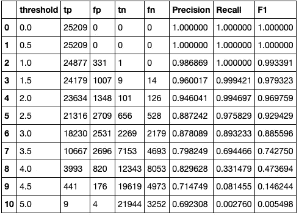
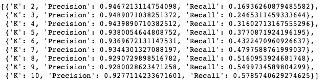
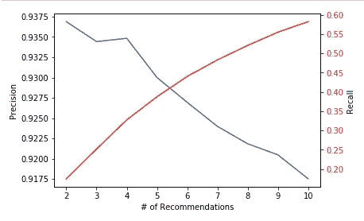
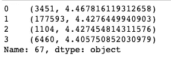
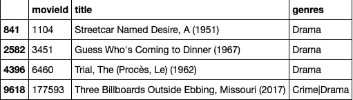
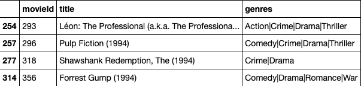

# 电影推荐系统(二)

> 原文：<https://towardsdatascience.com/movie-recommender-system-52e4651f3ae7?source=collection_archive---------14----------------------->

## 了解如何找到推荐给用户的最佳商品数量


照片由 [Unsplash](https://unsplash.com?utm_source=medium&utm_medium=referral) 上的[乔治亚·瓦格姆](https://unsplash.com/@georgiavagim?utm_source=medium&utm_medium=referral)拍摄

# ' k '建议

当在推荐系统中推荐项目时，我们非常感兴趣的是仅向用户推荐前 **K** 个项目，并且发现使用了最佳的数量召回和精确度。

## K 时的召回率和精确度

**Precision:** 尝试回答**“从字面上看，模型的肯定识别的比例是多少？”**

> 真阳性/(真阳性+假阳性)。

**回忆:**尝试回答**“模型正确知道实际阳性的比例是多少？”**

> *真阳性/(真阳性+假阴性)*

在某些情况下，我们可能会意识到我们需要关注**回忆**或**精确度。**例如，在筛查一个人是否感染了某种疾病时，召回将是可选择的。

查全率和查准率是经典的评估指标，用于评估二进制指标，因此我们必须将我们的评级(从(1–5)转换为二进制问题，其中 0 表示与**相关的**，1 表示与**无关的** **相关的**项目。

**转换为二进制**

为了进行转换，我们必须选择一个任意的****值**，根据该值，我们可以说上面的任何评级都被认为是相关的。有许多选择该值的方法，但现在，我们将选择 **3.5** 作为**阈值**，这意味着任何高于 3.5 的真实评级将被视为相关，低于 3.5 的将被视为不相关。**

****相关和推荐的定义****

****相关:**真实等级> = 3.5**

****无关:**真实评级< 3.5**

****推荐项目:**预测评分> = 3.5**

****不推荐项目:**预测等级> = 3.5**

**在我们想要获得两者混合的情况下，我们可以使用 **F1** 分数，它基本上是精确度和召回率的调和平均值。**

****F1 得分= 2 *(精度** 召回)/(精度+召回)****

**下面的函数计算精度和召回和 F1 分数，如上所述。**

```
*#Calculate TP,FP,TN,FN at every threshold level (0.0 - 5.0)*final = []**for** threshold **in** np.arange(0, 5.5, 0.5):
  tp=0
  fn=0
  fp=0
  tn=0
  temp = [] **for** uid, _, true_r, est, _ **in** predictions:
    **if**(true_r>=threshold):
      **if**(est>=threshold):
        tp = tp+1
      **else**:
        fn = fn+1
    **else**:
      **if**(est>=threshold):
        fp = fp+1
      **else**:
        tn = tn+1    **if** tp == 0:
      precision = 0
      recall = 0
      f1 = 0
    **else**:
      precision = tp / (tp + fp)
      recall = tp / (tp + fn)
      f1 = 2 * (precision * recall) / (precision + recall)    temp = [threshold, tp,fp,tn ,fn, precision, recall, f1]
  final.append(temp)results = pd.DataFrame(final)
results.rename(columns={0:'threshold', 1:'tp', 2: 'fp', 3: 'tn', 4:'fn', 5: 'Precision', 6:'Recall', 7:'F1'}, inplace=**True**)
```

****

**结果表的屏幕截图**

**根据上述结果，阈值的最佳值为 **2.5** 。**

****决定‘K’****

**在推荐系统中，我们感兴趣的是向用户显示前 N 个项目，因此最好是计算前 N 个值的精确度和召回率，而不是计算所有项目。**

**下一步是找到最佳 K 值，为了找到它，我们必须首先计算阈值为 2.5 的所有 K 值(2–10)的精度和召回率。**

**下面是计算**精度和召回@ K.** 的函数**

```
*'''Return precision and recall at k metrics for each user.'''* *# First map the predictions to each user.*
    user_est_true = defaultdict(list)
    **for** uid, _, true_r, est, _ **in** predictions:
        user_est_true[uid].append((est, true_r)) precisions = dict()
    recalls = dict()
    **for** uid, user_ratings **in** user_est_true.items(): *# Sort user ratings by estimated value*
        user_ratings.sort(key=**lambda** x: x[0], reverse=**True**) *# Number of relevant items*
        n_rel = sum((true_r >= threshold) **for** (_, true_r) **in** user_ratings) *# Number of recommended items in top k*
        n_rec_k = sum((est >= threshold) **for** (est, _) **in** user_ratings[:k]) *# Number of relevant and recommended items in top k*
        n_rel_and_rec_k = sum(((true_r >= threshold) **and** (est >= threshold))
                              **for** (est, true_r) **in** user_ratings[:k]) *# Precision@K: Proportion of recommended items that are relevant*
        precisions[uid] = n_rel_and_rec_k / n_rec_k **if** n_rec_k != 0 **else** 1 *# Recall@K: Proportion of relevant items that are recommended*
        recalls[uid] = n_rel_and_rec_k / n_rel **if** n_rel != 0 **else** 1 *#tp = n_rel_and_rec_k*
    *#fn =  n_rel - tp*
    *#fp = n_rec_k - tp*
    **return** precisions, recalls
```

**现在，让我们调用上面定义的函数，并对所有用户进行平均。**

```
results=[] **for** i **in** range(2, 11):  
   precisions, recalls = precision_recall_at_k(predictions, k=i, threshold=2.5)*# Precision and recall can then be averaged over all users* 
   prec = sum(prec **for** prec **in** precisions.values()) / len(precisions)rec = sum(rec **for** rec **in** recalls.values()) / len(recalls)           
   results.append({'K': i, 'Precision': prec, 'Recall': rec})         
   results
```

****

**让我们画出这个:**

****

**图 1**

**如图所示，精度在**‘4’，**之后显著下降，因此我们将 K 的值视为 **4** 。**

****瞧，完成了！！****

# **是时候给用户推荐电影了**

**现在我们知道了要提供的最佳推荐数量，是时候向用户提供推荐了。为此，我们必须预测用户尚未观看的电影的收视率。**

**首先，我们将在电影镜头数据集上训练一个 SVD 算法。**

```
*data = Dataset.load_builtin('ml-100k')*
trainset = data.build_full_trainset()   *#Build on entire data set*
algo = SVD(n_factors=factors, n_epochs=epochs, lr_all=lr_value, reg_all=reg_value)
algo.fit(trainset)
```

**然后预测不在训练集中的所有对(u，I)的评级。**

```
testset = trainset.build_anti_testset()*#Predicting the ratings for testset*
predictions = algo.test(testset)
```

**现在让我们对所有评级进行排序**

```
**def** get_all_predictions(predictions):

    *# First map the predictions to each user.*
    top_n = defaultdict(list)    
    **for** uid, iid, true_r, est, _ **in** predictions:
        top_n[uid].append((iid, est)) *# Then sort the predictions for each user*
    **for** uid, user_ratings **in** top_n.items():
        user_ratings.sort(key=**lambda** x: x[1], reverse=**True**) **return** top_nall_pred = get_all_predictions(predictions)
```

## **因为我们有所有预测的评级，所以我们将数据集子集化为每个用户的仅前 K 部电影(K = 4)。**

```
n = 4
**for** uid, user_ratings **in** all_pred.items():
    user_ratings.sort(key=**lambda** x: x[1], reverse=**True**)
    all_pred[uid] = user_ratings[:n]tmp = pd.DataFrame.from_dict(all_pred)
tmp_transpose = tmp.transpose()
```

**现在我们有了一个数据框，其中包含了推荐给每个用户的前 4 部电影。**

**让我们创建一个为给定用户返回推荐电影的函数:**

```
**def** get_predictions(user_id):
    results = tmp_transpose.loc[user_id]
    **return** results
```

**让我们尝试一个例子，并为用户 **67** 找到建议**

```
user_id=67
results = get_predictions(user_id)
results
```

****

**对用户的建议 _id-67**

**上图显示了用户 67 的前“4”个推荐，“电影 id 预测评级”。但是我们只需要电影而不需要收视率，所以让我们从结果中提取电影 id，然后从电影表中获取电影细节**

```
recommended_movie_ids=[]
**for** x **in** range(0, n):
    recommended_movie_ids.append(results[x][0])movies = pd.read_csv('data/movies.csv')
recommended_movies = movies[movies['movieId'].isin(recommended_movie_ids)]
```

****

**推荐电影 id 的电影详情**

**现在，我们可以将结果与用户历史进行比较，看看这些推荐有多相关。**

**以下是用户 67 评价最高的电影**

****

**用户评分最高的电影**

**由于用户的历史告诉我们，用户大多喜欢剧情电影，而我们正在推荐所有的剧情电影，这意味着我们正在向用户推荐合适的电影。**

**看起来你很喜欢这篇文章！**

*   **你刚刚学会了在 K 计算精度和召回，然后推荐 K 部电影，推荐给用户多少部电影。**
*   **[在这里](/movie-recommender-system-part-1-7f126d2f90e2?source=friends_link&sk=b28e7ae7f1cf97b0a7a59d0aa8c692ff)你可以阅读如何使用 **Surprise** 库在显式数据上构建模型。**
*   **完整的代码，你可以在这里找到 Jupyter 笔记本。**

**编码快乐！**

**如果你有任何想法或建议，请不吝赐教。你也可以通过 [LinkedIn](https://www.linkedin.com/in/divensambhwani/) 联系我。**

## **参考资料:**

**[1][https://medium . com/@ m _ n _ malaeb/recall-and-precision-at-k-for-recommender-systems-618483226 c54](https://medium.com/@m_n_malaeb/recall-and-precision-at-k-for-recommender-systems-618483226c54)**

**[2][https://towards data science . com/beyond-accuracy-precision-and-recall-3da 06 bea 9 f6c](/beyond-accuracy-precision-and-recall-3da06bea9f6c)**

**[3][https://developers . Google . com/machine-learning/crash-course/classification/precision-and-recall？hl=ru](https://developers.google.com/machine-learning/crash-course/classification/precision-and-recall?hl=ru)**

**[https://surprise.readthedocs.io/en/stable/](https://surprise.readthedocs.io/en/stable/)**