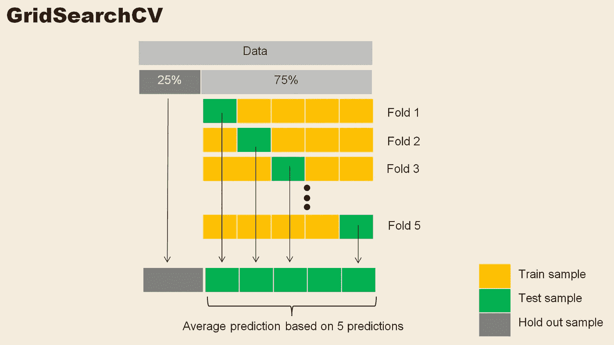
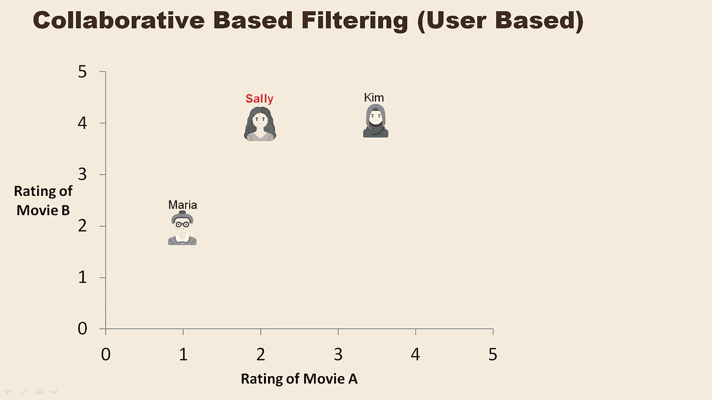
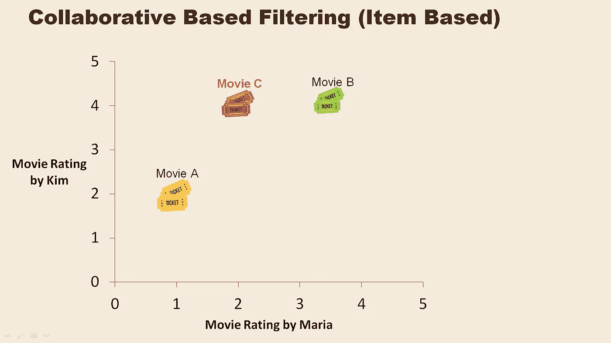
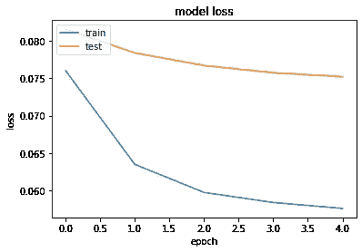
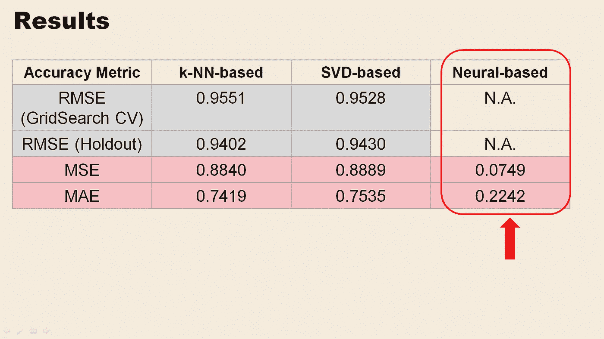
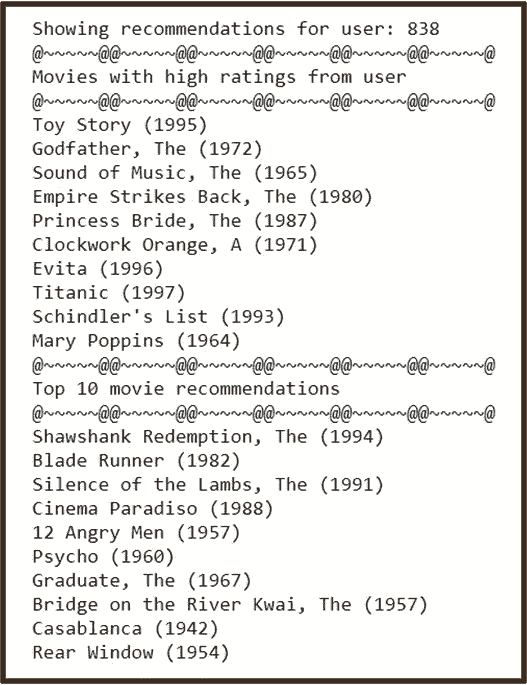

# 电影推荐系统

> 原文：<https://towardsdatascience.com/movie-recommender-system-a5dbfdb2585d?source=collection_archive---------21----------------------->

## 基于(1)基于记忆的协同过滤，(2)矩阵分解协同过滤和(3)基于神经的协同过滤的电影推荐系统的比较。

格伦·卡斯滕斯-彼得斯在 [Unsplash](https://unsplash.com/s/photos/remote-control-and-tv?utm_source=unsplash&utm_medium=referral&utm_content=creditCopyText) 上拍摄的照片

互联网的发展给我们带来了大量的在线数据和信息。像推荐系统这样的工具允许我们过滤我们想要或需要的信息。推荐系统可以在许多环境中使用，其中之一是用于视频或音乐服务的播放列表生成器。

在这个项目中，我选择了基于 K-近邻(k-NN)、矩阵分解(MF)以及基于神经网络的方法来构建电影推荐系统。我选择研究的数据是由 GroupLens Research 收集的 [MovieLens](https://grouplens.org/datasets/movielens/) 数据集。这个[数据集](https://grouplens.org/datasets/movielens/100k/)有 943 个用户对 1682 部电影给出的 100，000 个评价，每个用户至少评价了 20 部电影。等级是基于从 1 到 5 的范围。

评级构成了来自用户的显式响应，这将用于随后构建基于协作的过滤系统。

查尔斯·德鲁维奥在 [Unsplash](https://unsplash.com/s/photos/movies?utm_source=unsplash&utm_medium=referral&utm_content=creditCopyText) 上拍摄的照片

该项目分为三个阶段:

1.  数据预处理
2.  模型结构
3.  结果分析和结论

**基于 k-NN 和基于 MF 的协同过滤—数据预处理**

对于基于 k-NN 和基于 MF 的模型，使用了来自 Surprise Python sci-kit 的内置数据集 ml-100k。惊奇是一个很好的选择，开始了解推荐系统。它适用于构建和分析处理显式评级数据的推荐系统。

**基于 k-NN 的协同过滤——建模**

数据分为 75%的训练测试样本和 25%的维持样本。GridSearchCV 执行 5 次以上，用于为预测算法寻找相似性度量配置(sim_options)的最佳集合。它使用准确性度量作为基础，通过交叉验证过程找到 sim_options 的各种组合。

作者照片

在 k-NN 模型中，我选择使用余弦相似度作为相似性度量。这将计算所有用户对(或项目)之间的余弦相似性。

作者照片

上图是基于协作的过滤(基于用户)的简单说明。

它显示了三个用户 Maria、Sally 和 Kim，以及他们对电影 A 和 b 的评级。k-NN 模型试图预测 Sally 对电影 C 的评级(Sally 尚未对电影 C 进行评级)。

然而，它首先需要找到一个与 Sally 相似的用户。从电影 A 和 B 的评级来看，基于余弦相似度，玛丽亚与莎莉的相似度大于金与莎莉的相似度。

然后，该模型将根据玛丽亚对电影 C 的评级来预测莎莉对电影 C 的评级。

作者照片

上图是基于协作的过滤(基于项目)的简单说明。

它显示了用户 Maria 和 Kim 对三部电影 A、B 和 C 的评级。当 Sally 已经对电影 A 和 b 进行了分级时，k-NN 模型试图预测 Sally 对电影 C 的分级(尚未分级)

从玛丽亚和金对电影 A、B 和 C 的评级来看，基于余弦相似度，电影 A 与电影 C 的相似度大于电影 B 与电影 C 的相似度。

然后，该模型将根据 Sally 对电影 a 的评价来预测 Sally 对电影 C 的评价。

GridSearchCV 将根据均方根误差(RMSE)找出基于用户还是基于项目的结果精度最高。

这个模型使用的算法是 KNNWithMeans。这是一个基本的协同过滤算法，考虑了每个用户的平均评级。通过这种算法消除他们的偏见，个人用户偏好被考虑在内。

基于 GridSearch CV，RMSE 值为 0.9551。维持样本的 RMSE 值为 0.9402。MSE 和 MAE 值分别为 0.884 和 0.742。

**基于 MF 的协同过滤——建模**

矩阵分解根据潜在因素将用户项目矩阵压缩成低维表示。这些潜在因素提供了关于用户和项目的隐藏特征。用户与项目的交互被建模为他们潜在向量的乘积。

使用的基于 MF 的算法是奇异向量分解(SVD)。GridSearchCV 用于寻找随机梯度下降过程的迭代次数、学习速率和正则化项的最佳配置。

基于 GridSearch CV，RMSE 值为 0.9530。维持样本的 RMSE 值为 0.9430。MSE 和 MAE 值分别为 0.889 和 0.754。

**基于神经的协同过滤—数据预处理**

由用户、电影、收视率和时间戳组成的数据文件被读入 pandas 数据帧进行数据预处理。

需要枚举电影和用户来用于建模。创建包含数据中唯一用户和电影总数的变量，然后映射回电影 id 和用户 id。

找到数据中存在的最小和最大额定值。然后将评级标准化，以便于训练模型。

**基于神经的协同过滤—建模**

嵌入用于在数据中表示每个用户和每部电影。这些嵌入将具有由模型拟合的向量大小 n，以捕捉每个用户/电影的交互。

用户和电影都被嵌入到 50 维(n = 50)数组向量中，用于训练和测试数据。对 75%的数据进行训练，对 25%的数据进行测试。

为了捕捉用户-电影交互，计算用户向量和电影向量之间的点积，以获得预测的评级。

Adam 优化器用于最小化预测值和实际测试值之间的精度损失。

从训练和验证损失图可以看出，基于神经网络的模型具有很好的拟合性。训练损失曲线已经下降到一个稳定点。验证(测试)损失曲线也下降到一个稳定点，与训练损失有一个小的差距。

来自基于神经的模型的 MSE 和 MAE 值是 0.075 和 0.224。

**结果和结论**

与基于记忆的 k-NN 模型和基于矩阵分解的 SVD 模型相比，基于神经的协同过滤模型显示出最高的准确度。

上面的图像显示了用户 838 在过去评价很高的电影以及基于神经的模型推荐的电影。

这里有一个[链接](https://github.com/syleo22/SiuYin_Projects/tree/master/Project04)到我的 GitHub，在那里你可以找到我的代码和演示幻灯片。也可以通过 [LinkedIn](https://www.linkedin.com/in/syleo/) 联系我。