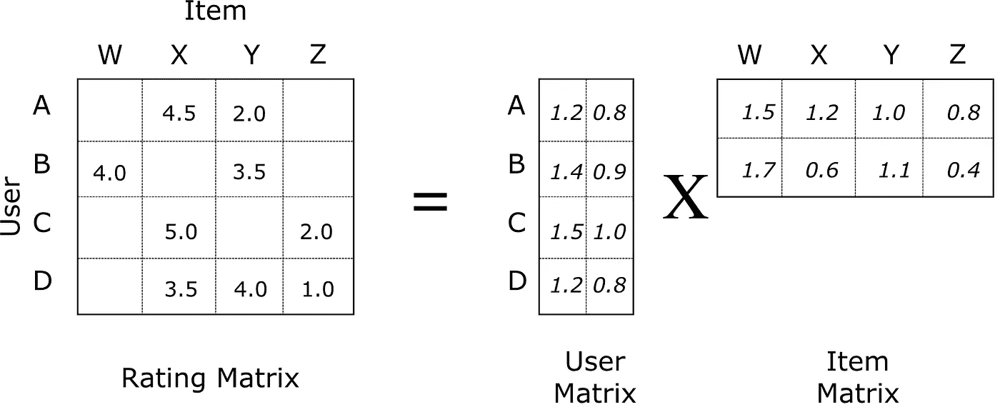
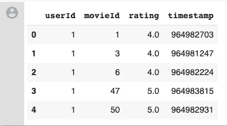
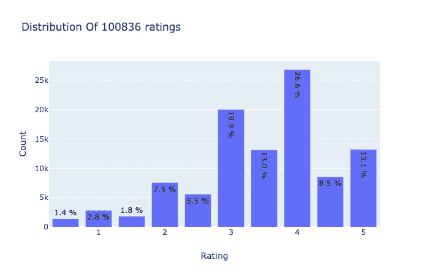
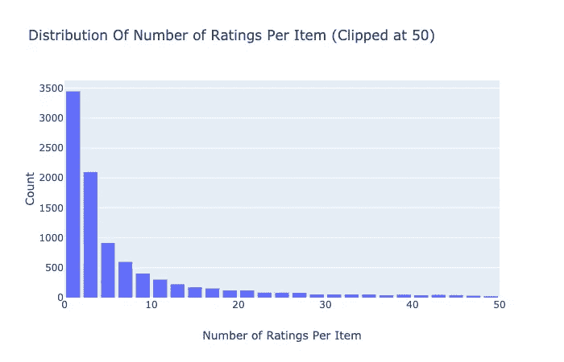
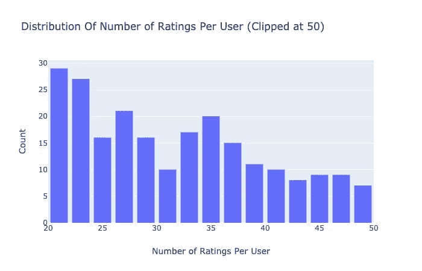
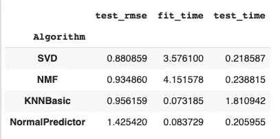
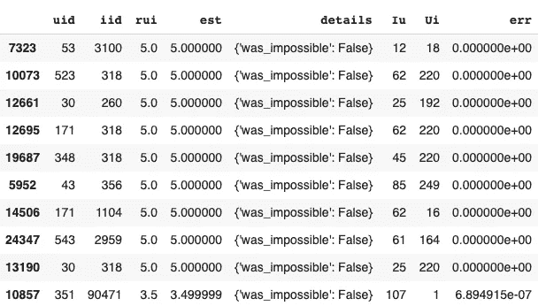
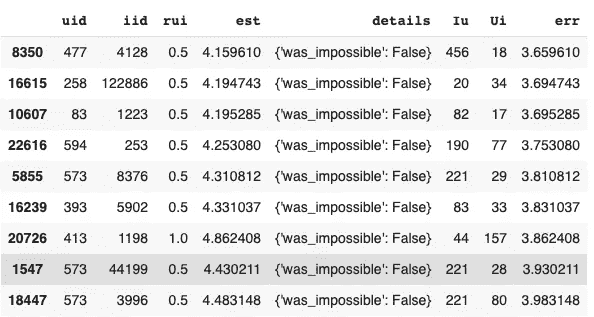
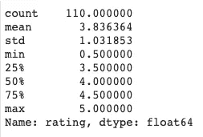
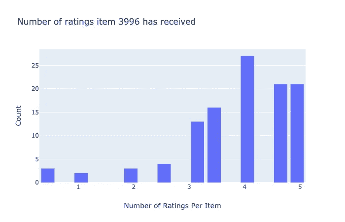

# 电影推荐系统:第一部分

> 原文：<https://towardsdatascience.com/movie-recommender-system-part-1-7f126d2f90e2?source=collection_archive---------10----------------------->

## 了解如何使用惊喜库构建推荐系统


查尔斯·德鲁维奥在 [Unsplash](https://unsplash.com?utm_source=medium&utm_medium=referral) 上拍摄的照片

# 简介:

所有的娱乐网站或网店都有几百万/几十亿的商品。对于客户来说，选择正确的产品变得非常困难。在这种情况下，推荐系统进入画面，并通过减少选项来帮助用户找到正确的项目。

**什么是推荐系统？**

它通过建议一个可能的项目列表来帮助用户选择正确的项目，因此它已经成为电子商务、电影和音乐呈现网站的一个不可或缺的部分，并且这个列表还在继续。它们正在成为近年来变得越来越重要的机器学习的最流行的应用之一。两种最受欢迎的方法是:

1- [基于内容的过滤](https://en.wikipedia.org/wiki/Recommender_system#Content-based_filtering)

2- [协同过滤](https://en.wikipedia.org/wiki/Recommender_system#Collaborative_filtering)

在这篇文章中，我们将关注**矩阵分解**，这是一种协同过滤的方法。

**矩阵分解**

在协同过滤中，**矩阵分解**是解决稀疏数据问题的最先进的解决方案，尽管它是从 [*Netflix 奖挑战赛*](https://www.netflixprize.com/) 开始广为人知的。



图片来自本[网站](https://medium.com/@connectwithghosh/simple-matrix-factorization-example-on-the-movielens-dataset-using-pyspark-9b7e3f567536)

在协同过滤的情况下，**矩阵分解**算法通过**将**用户-项目交互矩阵分解成两个**低维度矩形矩阵**的乘积来工作。一个矩阵可以被视为用户矩阵，其中行代表用户，列是潜在因素。另一个矩阵是项目矩阵，其中行是潜在因素，列代表项目。”——[维基百科](https://en.wikipedia.org/wiki/Matrix_factorization_(recommender_systems))

我们将与电影分级数据集 **MoiveLens** [数据集](https://grouplens.org/datasets/movielens/100k/)合作，使用[Surprise库“用于推荐系统的 Python scikit”开发一个推荐系统。我们开始吧！](http://surpriselib.com/)

# 数据

```
ratings = pd.read_csv('data/ratings.csv')ratings.head()
```



评分表的屏幕截图

为了从上面的 pandas 数据框加载数据集，我们将使用 **load_from_df()** 方法，我们还需要一个 **Reader 对象**，并且必须指定 **rating_scale** 参数。

数据框必须有三列，依次对应于用户 id、项目 id 和等级。

```
reader = Reader(rating_scale=(0.5, 5.0))data = Dataset.load_from_df(df[['userID', 'itemID', 'rating']], reader)
```

**评级分布**



图 1

**项目评级分布**



图 2

按用户的评分分布



图 3

# 惊喜——型号选择

[Surprise](http://surpriselib.com/) 是一个 Python scikit，用于构建和分析处理显式评级数据的推荐系统。由 Nicolas Hug 维护。

使用 pip(你需要 NumPy 和一个 C 编译器。Windows 用户可能更喜欢使用 conda):

```
!pip install numpy!pip install scikit-surprise#For Windows users
conda install -c conda-forge scikit-surprise
```

我们将使用[](https://en.wikipedia.org/wiki/Root-mean-square_deviation)****作为我们预测的准确性度量。****

****我们将比较**奇异值分解、NMF、正常预测值、KNN 基本值**，并将使用具有最小 RMSE 值的一个。****

****在我们开始应用之前对算法有一些了解。****

******1:正态预测器:**它根据训练集的分布预测一个随机的评级，假设它是正态的。这是一个基本的算法，不需要做太多的工作，但对于比较精度仍然很有用。****

******2: SVD:** 它是由西蒙·芬克在网飞奖期间推广的，是一种矩阵分解算法。如果不使用基线，它相当于 PMF。****

******3: NMF:** 基于非负矩阵分解，类似于 SVD。****

******4: KNN 基本:**这是一种基本的协同过滤算法方法。****

```
**benchmark = []# Iterate over all algorithms
for algorithm in [SVD(), NMF(), NormalPredictor(), KNNBasic()]:# Perform cross validation
results = cross_validate(algorithm, data, measures=['RMSE'], cv=3, verbose=False)# Get results & append algorithm name
tmp = pd.DataFrame.from_dict(results).mean(axis=0)tmp = tmp.append(pd.Series([str(algorithm).split(' ')[0].split('.')[-1]],index=['Algorithm']))benchmark.append(tmp)**
```

********

****结果截图****

****由于奇异值分解具有最小的 RMSE 值，我们将调整奇异值分解的超参数。****

****使用 **GridSearchCV** 调整算法参数，找到算法的最佳参数。****

****SVD 的默认值为:****

******n _ factors**—100 |**n _ epochs**—20 |**lr _ all**—0.005 |**reg _ all**—0.02****

```
**param_grid = {'n_factors': [25, 30, 35, 40, 100], 'n_epochs': [15, 20, 25], 'lr_all': [0.001, 0.003, 0.005, 0.008],               'reg_all': [0.08, 0.1, 0.15, 0.02]}gs = GridSearchCV(SVD, param_grid, measures=['rmse', 'mae'], cv=3)
gs.fit(data) algo = gs.best_estimator['rmse']print(gs.best_score['rmse']) 
print(gs.best_params['rmse'])*#Assigning values* t = gs.best_params factors = t['rmse']['n_factors']
epochs = t['rmse']['n_epochs'] 
lr_value = t['rmse']['lr_all']
reg_value = t['rmse']['reg_all']**
```

*****输出* : 0.8682 {'n_factors': 35，' n_epochs': 25，' lr_all': 0.008，' reg_all': 0.08}****

****现在，我们有了一组正确的超参数值，让我们将数据分成训练:测试和拟合模型。****

```
**trainset, testset = train_test_split(data, test_size=0.25)algo = SVD(n_factors=factors, n_epochs=epochs, lr_all=lr_value, reg_all=reg_value)predictions = algo.fit(trainset).test(testset)
accuracy.rmse(predictions)**
```

*****产量:* RMSE: 0.8662****

## ****让我们来看看我们的预测是好是坏:****

****以下函数将创建一个包含以下列的 pandas 数据框:****

******UID:** 用户标识****

******iid:** 项目 id****

******芮:**用户给出的评分****

******预计:**由模型估计的评级****

******Iu:** 用户评分的项目数****

******UI:** 对此项目评分的用户数****

******err:** abs 预测评级与实际评级之间的差异。****

```
**def get_Iu(uid):"""
args: 
uid: the id of the userreturns:
the number of items rated by the user
"""try:
    return len(trainset.ur[trainset.to_inner_uid(uid)])
except ValueError: # user was not part of the trainset
    return 0def get_Ui(iid):"""
args:
iid: the raw id of the itemreturns:
the number of users that have rated the item.
"""try:
   return len(trainset.ir[trainset.to_inner_iid(iid)])
except ValueError:
   return 0df_predictions = pd.DataFrame(predictions, columns=['uid', 'iid', 'rui', 'est', 'details'])df_predictions['Iu'] = df_predictions.uid.apply(get_Iu)df_predictions['Ui'] = df_predictions.iid.apply(get_Ui)df_predictions['err'] = abs(df_predictions.est - df_predictions.rui)**
```

****最佳预测:****

```
**best_predictions = df_predictions.sort_values(by='err')[:10]**
```

********

****最佳预测的屏幕截图****

****最坏的预测:****

```
**worst_predictions = df_predictions.sort_values(by='err')[-10:]**
```

********

****最差预测截图****

****最糟糕的预测看起来相当令人惊讶。让我们来看看“3996”项的更多细节，它的评分为 0.5，我们的 SVD 算法预测为 4.4****

********

```
**df.loc[df['itemID'] == 3996]['rating'].describe()temp = df.loc[df['itemID'] == 3996]['rating']# Create trace
trace = go.Histogram(x = temp.values, name = 'Ratings', xbins = dict(start = 0, end = 5, size=.3))# Create layout
layout = go.Layout(title = 'Number of ratings item 3996 has received', xaxis = dict(title = 'Number of Ratings Per Item'), yaxis = dict(title = 'Count'), bargap = 0.2)# Create plot
fig = go.Figure(data=[trace], layout=layout)
iplot(fig)**
```

********

****图 4****

****事实证明，该商品获得的大多数评级都在“3 到 5”之间，只有 **1%** 的用户评级为“0.5”，有一个用户的评级低于 3。似乎对于每一个预测，用户都是某种**离群值**并且这个项目被评价的次数很少。****

****看起来你很喜欢这篇文章！****

*   ****您刚刚阅读了第 1 部分，其中介绍了如何使用 Surprise library 在显式数据上构建模型。****
*   ******Part 2** 将通过计算 K 处的精度和召回率，然后推荐 K 部电影，来涵盖我们应该推荐多少部电影。****

****完整的代码，你可以在这里找到 Jupyter 笔记本。****

****如果你有任何想法或建议，请不吝赐教。你也可以通过 LinkedIn 联系我****

****编码快乐！****

## ****参考资料:****

****[1][https://surprise.readthedocs.io/en/stable/](https://surprise.readthedocs.io/en/stable/)****

****[2][https://towards data science . com/prototyping-a-recommender-system-step-by-step-part-2-alternating-least-square-als-matrix-4a 76 c 58714 a 1](/prototyping-a-recommender-system-step-by-step-part-2-alternating-least-square-als-matrix-4a76c58714a1)****

****[3][https://medium . com/@ connectwithgosh/simple-matrix-factorization-example-on-the-movie lens-dataset-using-py spark-9b 7 E3 f 567536](https://medium.com/@connectwithghosh/simple-matrix-factorization-example-on-the-movielens-dataset-using-pyspark-9b7e3f567536)****

****[4][https://en . Wikipedia . org/wiki/Matrix _ factorization _(recommender _ systems)](https://en.wikipedia.org/wiki/Matrix_factorization_(recommender_systems))****