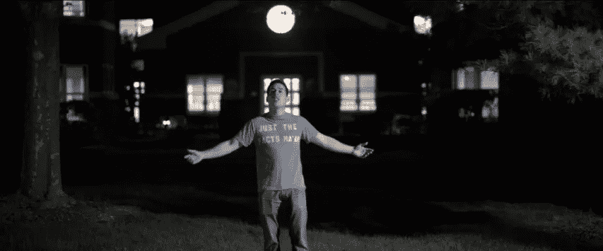
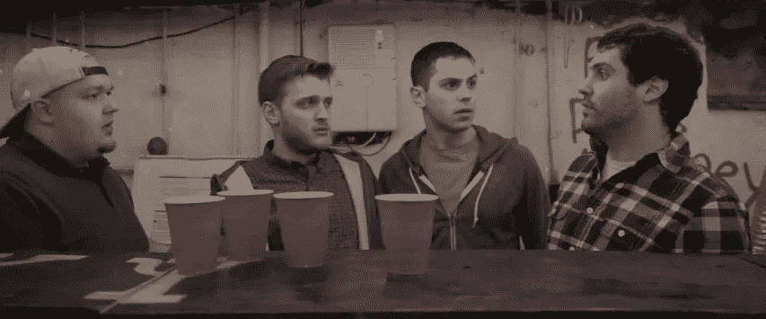

# 电影观众——通过让他们看电影来教授人工智能情感的案例

> 原文：<https://towardsdatascience.com/moviegoer-the-case-for-teaching-emotion-to-ai-by-having-them-watch-movies-b2a7682edb1d?source=collection_archive---------55----------------------->

## [电影观众](https://towardsdatascience.com/tagged/moviegoer)

每一帧都有戏剧性(图片由作者提供)

在不久的将来，我们将被行为和人类一样的人工智能实体所包围。他们将能够用完美的犹豫、俚语和抑扬顿挫来保持对话，与人区别开来。他们将能够与我们互动，准确地知道我们的感受，分析我们的面部表情、肢体语言、用词、语调和眼球运动。这就是今天存在的所有技术，但它缺乏给他们这种个人联系的关键组件。幸运的是，我们已经找到了缺失的部分。**我们将通过让机器人看电影来教会它们情感。**

[电影观众](https://github.com/JohnTheTripper/moviegoer)项目的目标是释放电影院内巨大的情感数据财富，以推进情感计算(情感人工智能)。然而，电影对于机器来说难以置信地难以理解。不管我们是否意识到，有许多电影制作惯例是我们认为理所当然的(例如，场景之间的时间推移，对话中的戏剧音乐，蒙太奇)。我们人类可以理解这些如何影响一部电影，但机器人能吗？

Moviegoer(以及任何数据科学项目)的第一步是将电影及其所有的艺术细微差别和潜规则转化为结构化数据。我已经建立了一个原型，它将电影分解成机器可以理解的组件。然后，它可以使用这些结构化数据来定位特定类型的场景，跟踪电影中角色的情绪，并识别重要的对话节奏。我稍后将进入更多细节，但让我们更多地讨论为什么电影是训练情感人工智能模型的理想选择。

**作为情感资料的电影**

每一帧都有戏剧性(图片由作者提供)

所有机器学习和人工智能模型都是通过在大量数据上接受训练来“学习”的。给一个图像识别模型展示一百万张猫的图像，和一百万张非猫的图像，它将能够看到一张新的图像并告诉你这是不是一只猫。模型准确性在很大程度上依赖于拥有大量高质量的训练数据。为了训练一个情感人工智能模型，我们需要大量的情感数据。

电影是 20 世纪最伟大的艺术形式，它通过使用情节和人物来传达心理体验和情感转化。人物是建立起来的，那些人物出了事，那些人物就变了。电影在时间上是线性的:我们可以看到情绪前因(或行为刺激)的直接因果关系。例如，如果我们看到一个角色微笑，然后两秒钟后我们看到他们皱眉，我们想知道在那两秒钟里发生了什么让他们皱眉。我们看对话，看到有人对这个角色说，“我恨你”。我们刚刚了解到这个短语对情绪有负面影响。

但是我们可以更进一步:如果我们看几十万部电影，寻找我们遇到“我恨你”的所有时间，会怎么样？该模型可以分析面部表情的变化，以了解典型人类对这句话的反应。通常是负面的，但如果角色乐在其中呢？也许接下来我们会看到台词是如何传达的，说话者微笑着，大笑着，并保持着愉快的语调？我们刚刚了解了这个短语的表达方式，它并不总是在生气的时候说出来。然后我们可以看看周围的环境，也许这是为了回应一个老掉牙的爸爸笑话。情感模型知道这些都是对“我恨你”这句话的有效应用和反应。

**人文拟态**

每一帧都有戏剧性(图片由作者提供)

如果这个论题看起来太专业了，让我们试试一个更抽象的例子。假设我们有一个拥有人类身体的机器人，它想要融入社会。要做到这一点，它可以看一堆电影，学习基本的人类习惯。走，不要跑。在交谈中进行眼神交流。别忘了眨眼。电影，即使没有情节或人物发展，也是人类习性的镜头。机器人只需要观察这些就能模仿人类的行为。

在某种程度上，这难道不是我们学会做人和参与社会的一部分吗？想想电影对你自己童年发展的影响。你有没有假装自己是电影中的某个角色，重复他们的俏皮话？想象自己从恐怖分子手中拯救世界，或者在雪花飘落时爱上一个完全陌生的人？当然，电影有助于我们对世界的理解(尽管可能没有我们希望的那么激动人心)。

**四类理解**

每一帧都有戏剧性(图片由作者提供)

电影是为人类制作的。它们不是设计来被机器观看的。也就是说，要“看电影”，计算机必须理解四种理解。

*   结构——尽管观众完全认为电影是理所当然的，但电影是由称为“场景”的精细、独立的单元组成的，这些单元通常发生在固定的地点，涉及一个或多个角色。机器必须能够识别单个场景的开始和结束。这种类型的分析可以扩展到其他单元，从形成整部电影的三个行为，一直到单个镜头。
*   角色——每个角色都有一张独特的脸和声音，可以在整部电影中追踪。这些有助于预测角色的人口统计数据(年龄、种族、性别)。为了理解角色的动机，口语对话必须归因于单个角色，以确定对他们来说什么是重要的。
*   情节和事件——一部电影由许多不同的事件和事件组成。机器人必须理解特定事件的重要性(例如，恋爱对象得到了另一半，竞争对手得到了升职，女儿受伤)以及它们如何影响角色目标。
*   风格特征——这些是艺术选择，如镜头长度或配色方案，用来引发观众的特定情绪。乐谱是最突出的例子——虽然我们知道这种音乐实际上并不存在于场景中，但它被分层放在它的上面，以使观众感到悲伤、兴奋、紧张或其他多种情绪。这使我想到…

**董事决定**

现在，你明白我在寻找非常细微的线索，知道它们对情绪反应很重要。但这些细节并不是偶然进入最终剪辑的。它们是导演最大化其电影情感反应的结果。虽然观众几乎看不到，但导演有意识地决定加入这些细节。

识别这些线索(并将它们编码到项目中)在很大程度上依赖于电影制作领域的知识。这些经验法则是从一个多世纪的风格和技术进步中发展而来的，需要对这门手艺有深刻的理解。

这篇文章中的所有电影画面都来自我制作和导演的一部完整长度的电影——10 点开始(一部 90 分钟的喜剧，你可以[免费观看](http://ridesstartat10.com))。这个项目本质上是对电影进行逆向工程的一次尝试，了解电影是如何制作的对这项工作有很大帮助。

(图片由作者提供)

现在我们已经回顾了这个项目背后的动机和方法，我们可以看看电影观众原型的运行情况。使用下面的链接浏览原型发布的三篇文章。

## 电影观众原型发布

1.  [通过让人工智能看电影来教授其情感的案例](/moviegoer-the-case-for-teaching-emotion-to-ai-by-having-them-watch-movies-b2a7682edb1d)
2.  [原型在行动:将电影转化为情感数据](/moviegoer-prototype-in-action-turning-movies-into-emotional-data-480b5a3497c8)
3.  [电影是情感和人类学知识完美数据集的 5 个理由](/moviegoer-5-reasons-why-cinema-is-the-perfect-dataset-of-emotional-and-anthropological-knowledge-db8b0aa96ff7)