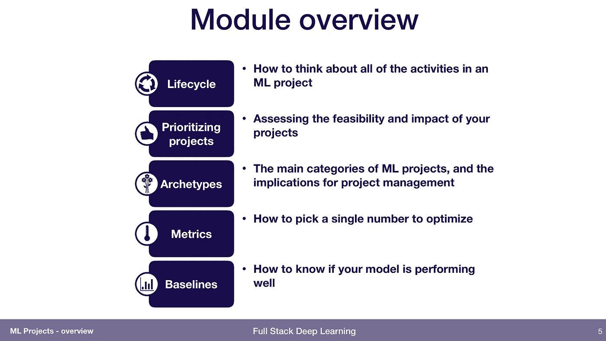
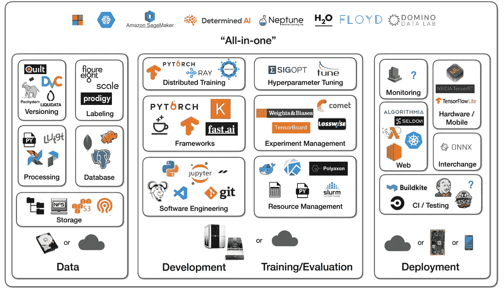
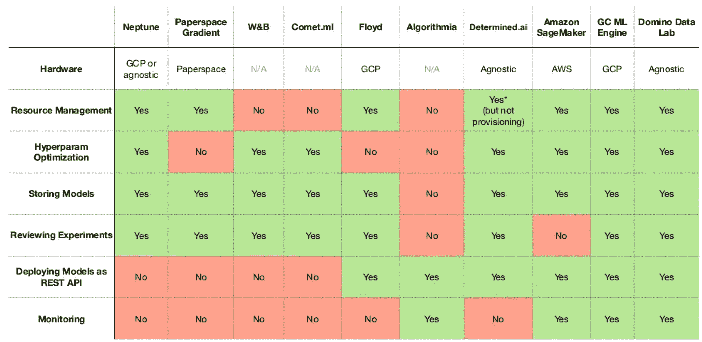
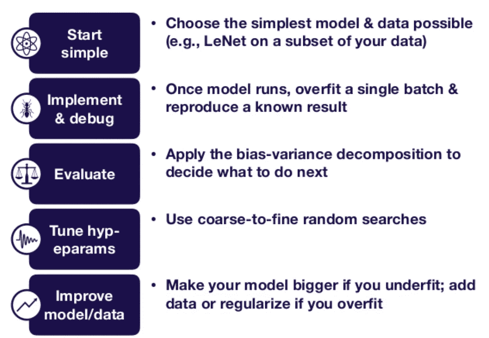
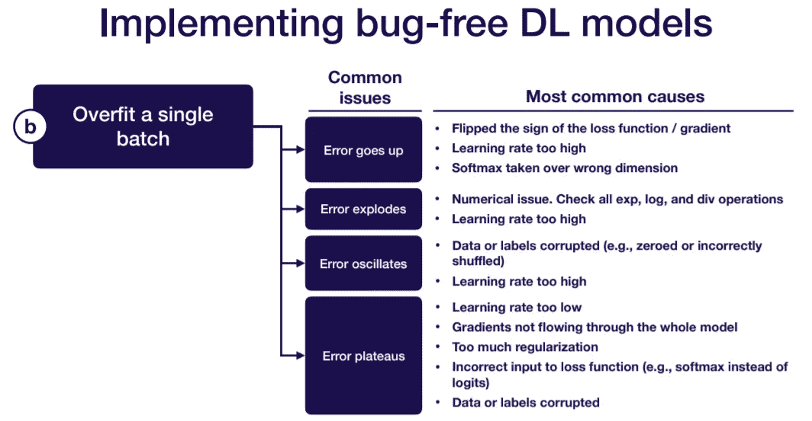
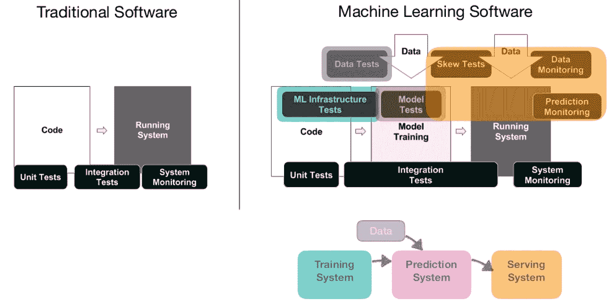
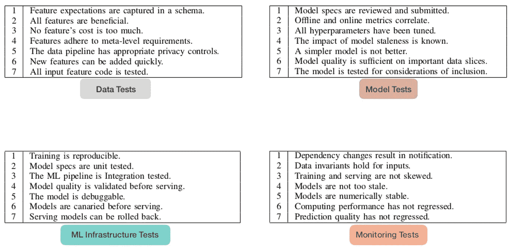
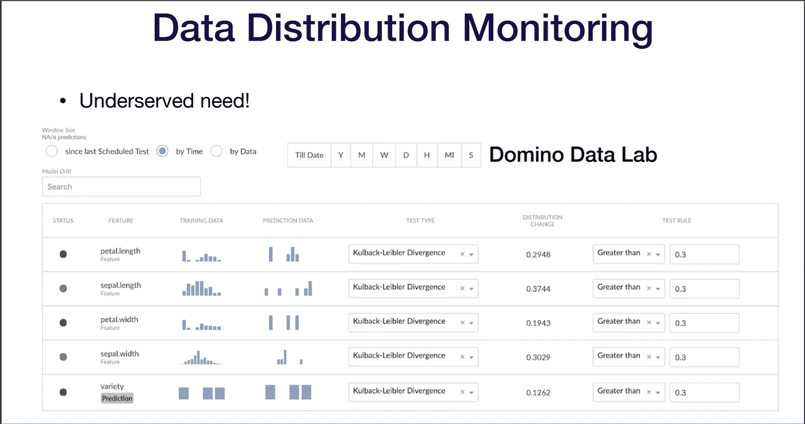

# 将人工智能移至现实世界

> 原文：<https://towardsdatascience.com/moving-ai-to-the-real-world-e5f9d4d0f8e8?source=collection_archive---------35----------------------->

## 了解人工智能应用的整个生命周期，从构思到部署。

罗伯特·北原惠子·桑塔纳在 [Unsplash](https://unsplash.com?utm_source=medium&utm_medium=referral) 上拍摄的照片

如果你符合这些条件之一，这篇文章就是为你准备的:

● **你是一名数据科学经理。**你想通过一些最佳实践来提高团队的工作效率。

● **你是数据科学家。你想知道下游发生了什么:你的模型如何变成产品。**

● **你是一名软件架构师。**您正在设计或扩展一个支持数据科学用例的平台。

我最近完成了一个在线课程，我想你应该看看。叫做[全栈深度学习](https://course.fullstackdeeplearning.com/)。它涵盖了人工智能应用的整个生命周期，从构思到部署，但不包括理论或模型拟合。如果你是一名中级数据科学家，想要从你的领域“缩小范围”，本课程将向你展示香肠是如何制作的，从一个站点到下一个站点进行跟踪。

该课程最初是 2018 年基于旧金山的昂贵训练营，但现在免费提供。一些业界重量级人物也在其中，包括特斯拉的安德烈·卡尔帕希(Andrej Karpahy)和 fast.ai 的杰瑞米·霍华德。我拿它是因为我想把我自己的做法和名人的做法进行比较。作为背景介绍，我是咨询公司 Genpact 的合伙人。我帮助客户使用人工智能改造他们的流程，有时甚至改造他们的业务。在实践中，这意味着我创建一个概念证明(POC)来展示潜在价值，然后运行实施该解决方案的团队来获取该价值。

“全栈深度学习”超出了我的预期。它分为六个内容领域，以及人工智能名人的实践实验室和客座讲座。以下是我发现的最新颖、最有用的内容:

# 1.设置 ML 项目

斯文·米克在 [Unsplash](https://unsplash.com?utm_source=medium&utm_medium=referral) 上拍摄的照片

这是一个“执行”模块，讨论人工智能项目的规划、优先排序、人员配备和时间安排。

我在这里没有发现太多新的东西，但这是一个很好的、简明的执行概述。由于该课程侧重于深度学习，而不是传统的 ML，因此它提出了三个要点:

●深度学习(DL)与更传统的机器学习不同，“仍在研究中”。你不应该计划 100%的成功率

●如果你正从“经典”ML“毕业”到 DL，计划在标签上花费比你习惯的更多的时间和金钱…

●…但是不要扔掉你的剧本。在这两种情况下，你都在寻找廉价预测将产生巨大商业影响的环境

# 2.基础设施和工具

照片由[凯尔海德](https://unsplash.com/@kyleunderscorehead?utm_source=medium&utm_medium=referral)在 [Unsplash](https://unsplash.com?utm_source=medium&utm_medium=referral) 上拍摄

这是我发现最有帮助的模块。它为开发 AI/ML 应用程序建立了一个全面的框架，从实验室到生产。在每一层或每一类别中，它都涵盖了关键功能、它如何与其他层相适应以及主要的工具选择。

让我强调一下:这门课的不同之处在于框架的全面程度。大多数公开的 AI/ML 内容都集中在模型开发上。有些资料只涉及数据管理或部署。商业供应商经常低估过程的复杂性并跳过一些步骤。如果你试图理解从阿尔法到欧米茄的 AI/ML 管道，这是我见过的最“全景”的图片。

这个课程是“自以为是的”——它有时称之为“类别赢家”，这在你下注时很有帮助。例如，它将 Kubernetes 称为“资源管理”类别的获胜者。我同意这些呼吁中的大部分，但不是全部。例如，在云提供商中，它认为 AWS 和 pans Azure 有“糟糕的用户体验”。虽然 AWS 很优秀，但我们的一些客户(正确地)选择了 Azure，尤其是那些已经拥有微软堆栈(Excel、MS SQL 等)的客户。)

在建立了总体框架之后，本模块将深入探讨发展和培训/评估。我发现三个领域特别有趣:

● **原型制作**:我一直在寻找快速简单的方法为客户创建概念证明(POCs)。我需要制作一个视觉上有吸引力的，交互式的概念验证，易于通过公共或半公共的网址访问。我的理想解决方案是给我对模型的代码级控制，而不是让我编写大量的 HTML 或 Javascript 代码。一键式部署是一个优势。我一直在使用 Shiny，但想用 Python 做类似的事情。该课程向我介绍了 [streamlit](https://www.streamlit.io/) ，我将进一步研究它。同样有意思的还有[破折号](https://plotly.com/dash/)，奇怪的是没有盖。

● **实验管理**是一个有趣的类别:它跟踪你的模型在各种配置选项(实验)下的表现。我为在 [Kaggle](https://www.kaggle.com/alonbochman) 上的比赛编写了自己的版本。我不知道这是一个有名字的类别。我将检查本课程推荐的一些工具，包括[权重和偏差](https://www.wandb.com/)。

● **一体机:**在所有可用的一体机平台之间进行了一次很好的信息比较。AWS SageMaker 和 GCP AI 看起来是目前最好的选择。如果被追问，我敢打赌其他人将被云提供商收购或抄袭。

# 3.数据管理

文斯·维拉斯在 [Unsplash](https://unsplash.com?utm_source=medium&utm_medium=referral) 上的照片

本模块讨论如何存储和管理与管道相关的数据集。我在这里没发现多少新东西。关于数据增强的材料很有趣，但主要应用于计算机视觉，这方面我做得不多。

# 4.机器学习团队

照片由 [Matteo Vistocco](https://unsplash.com/@mrsunflower94?utm_source=medium&utm_medium=referral) 在 [Unsplash](https://unsplash.com?utm_source=medium&utm_medium=referral) 上拍摄

本模块讨论项目的人力资源部分:角色、团队结构、管理项目等。在我看来，这些内容属于上面的模块 1——建立 ML 项目。

对于招聘经理和应聘者来说，如何在这个领域找到工作有一些有趣的地方。对于 ML 项目中的典型角色也有一个很好的总结:

# 5.培训和调试

史蒂文·勒勒姆在 [Unsplash](https://unsplash.com?utm_source=medium&utm_medium=referral) 拍摄的照片

本模块讨论让模型在实验室中工作的过程。它应该是每个数据科学家的必读之作，类似于我用来赢得几场 Kaggle 竞赛的工作流。您还可以在许多其他地方获得此内容，但这是一个组织良好且简洁的演示文稿:

围绕调试 DL 模型的讨论尤其精彩:让您的模型运行起来，对单个批处理进行过度拟合，并与已知结果进行比较。为了说明深度，下面是关于单批过量灌装的小节:

关于过度拟合的更多提示在文章末尾。

# 6.测试和部署

在 [Unsplash](https://unsplash.com?utm_source=medium&utm_medium=referral) 上由[路易斯·里德](https://unsplash.com/@_louisreed?utm_source=medium&utm_medium=referral)拍摄的照片

本模块讨论如何将您的模型从实验室带到现实世界。这是我上课时最初寻找的模块。我在这里找到了几个有用的金块:

测试 ML 系统与测试传统软件非常不同，因为它的行为是由数据和算法驱动的:

您需要相应地调整您的测试套件。这门课程提供了一个很好的清单，摘自现在很有名的论文[机器学习系统中隐藏的技术债务](https://papers.nips.cc/paper/5656-hidden-technical-debt-in-machine-learning-systems.pdf)。

本课程建议您检查培训时间和生产时间变量是否具有近似一致的分布(上面的监控测试 3)。这是一次关键的考验。它可以帮助您检测运行时错误，例如数据馈送中的空白。它还可以告诉您，可能是时候重新训练模型了，因为输入与您预期的不同。实现这一点的一个简单方法是逐个变量地绘制培训数据与生产时间数据。Domino 数据实验室工具可以做到这一点。

一个更好的方法是使用 [**对抗验证**](https://www.kdnuggets.com/2016/10/adversarial-validation-explained.html) :训练一个辅助模型(在生产中)，该模型试图将一个观察分类为属于训练或生产数据。如果这个模型成功地区分了这两者，你就有了一个显著的分布转移。然后，您可以检查模型，找出推动这种转变的最重要的变量。

对 Kubernetes 和 Docker 以及基于 GPU 的模型服务的介绍很好地涵盖了部署。

# 客座演讲

该课程包括来自行业重量级人物的客座演讲。质量变化很大。有些演讲者是经过打磨和准备的，其他的……就没那么多了。我印象最深的是两位客人:

●**fast . ai**的杰瑞米·霍华德 **:这个演讲在提高模型性能方面提供了很多“你可以利用的消息”。**

Fast.ai 库旨在使用更少的资源(人力和机器)来获得良好的结果。例如，[花 25 美元](https://www.fast.ai/2018/04/30/dawnbench-fastai/)在 3 小时内训练 ImageNet。这种对效率的关注非常符合我们客户的需求。

o Howard 问道“为什么人们试图让机器学习自动化？”我们的想法是一起工作可以得到更好的结果。他称之为“AugmentML”对“AutoML” [Platform.ai](https://platform.ai/) 就是一个例子。它是一种标签产品，允许贴标机与神经网络进行交互式“对话”。每次迭代都会改进标签和模型。我从来没见过这样的，而且好像很管用，至少在他分享的视频上是这样的。

o Howard 分享了一些提高模型性能的技巧，尤其是对于计算机视觉任务。我发现[测试时间增加](https://docs.fast.ai/basic_train.html#_TTA) (TTA)特别令人大开眼界。我将不得不在我的下一个项目中尝试它。

● **特斯拉的安德烈·卡帕西**:这个演讲也很有趣，尽管音频不是很好。卡帕西讨论了他的[软件 2.0](https://medium.com/@karpathy/software-2-0-a64152b37c35) 概念，即我们将越来越多地使用梯度下降等优化方法来概率地解决问题，而不是设计固定的软件规则或启发式方法来解决问题。像许多其他人一样，我发现这个心理模型很有吸引力。

# 离别的思绪

课程并不完美。很多这种材料是在 2018 年创作的，开始显示出它的年龄。三个例子:

●Salesforce.com 大学的首席科学家 Richard Socher 主张建立一个统一的 NLP 模型，叫做 decaNLP。 [BERT](https://en.wikipedia.org/wiki/BERT_(language_model)) 已经接管了这个利基市场，而 [GPT3](https://github.com/openai/gpt-3) 是一个令人兴奋的最新发展。

● [模型可解释性](https://en.wikipedia.org/wiki/Explainable_artificial_intelligence)在过去的几年中发展迅速，但是没有得到很好的体现

●如上所述，微软 Azure 一直在大步前进，在我看来并没有得到公平的对待

尽管有这些小问题，我认为这门课程在一个紧凑和组织良好的框架中包含了很多价值。价格合适，我推荐给任何有兴趣了解 AI/ML 应用程序是如何构建的人。

最后，没有特别的原因，我希望你会喜欢这个激动人心的结论: