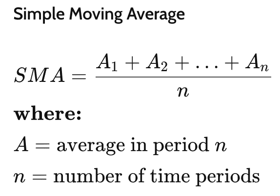
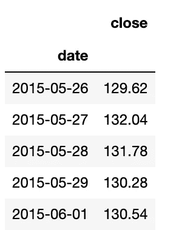
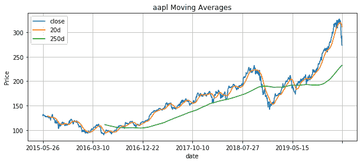

# 用 Python 进行移动平均线技术分析

> 原文：<https://towardsdatascience.com/moving-average-technical-analysis-with-python-2e77633929cb?source=collection_archive---------18----------------------->

## 使用 Python 计算和绘制移动平均值

移动平均线通常用于技术分析，以预测未来的价格趋势。在本帖中，我们将使用 Python 构建一个脚本来执行移动平均线技术分析。


克里斯·利维拉尼在 [Unsplash](https://unsplash.com/s/photos/technical-analysis?utm_source=unsplash&utm_medium=referral&utm_content=creditCopyText) 上的照片

# 什么是均线？

移动平均线是 ***n*** 最后收盘价的平均值。要选择的最后收盘价 n 的数量取决于进行分析的投资者或分析师。一种常见的方法是取 20 天，这基本上是一个月的交易天数。

天数越短，移动平均线对价格变化越敏感。也就是说，如果我们选择更大的天数，短期波动将不会反映在指标中。然而，通过选择大量的日期，我们可能会由于忽略短期波动而错过一些即将到来的价格变化。

下面我们可以看到**简单移动平均线**是如何计算的 [(source Investopedia](https://www.investopedia.com/terms/m/movingaverage.asp) )。



移动平均公式

# 如何解读均线和交叉

金融分析师和投资者可以使用移动平均线来分析价格趋势，并预测未来的趋势变化。在价格上升趋势中，价格高于移动平均线。在价格下降趋势中，价格低于移动平均线。当收盘价穿过移动平均线时，投资者可以将其视为**价格趋势的潜在变化。**

我们可以在不同的时间段使用多个移动平均线。例如，我们可能有 20 天的短期移动平均线和 250 天的长期移动平均线。当**短期移动平均线穿过长期移动平均线**时，可能是价格趋势变化的标志:

*   当**短期移动平均线穿越长期移动平均线**上方时，这可能表明一个 ***买入*** 信号。这就是所谓的黄金交叉。
*   相反，当**短期移动平均线低于长期移动平均线时，**可能是卖出的好时机。[这就是所谓的死叉。](https://www.investopedia.com/terms/d/deathcross.asp)

# 使用 Python 进行移动平均线技术分析

现在我们已经了解了如何计算和解释移动平均线，我们准备用 Python 构建这个技术分析工具。我们的目标是有一个脚本，我们将通过任何公司，我们想分析和我们的功能将:

*   首先，**从名为*financialmodeliongprep*的[免费 API 金融源下载股票价格信息](https://financialmodelingprep.com/)**。
*   第二，我们将**解析来自 API** 的结果，并将其转换为包含最近 1200 个交易日的日期和收盘价的 [Pandas DataFrame](https://pandas.pydata.org/pandas-docs/stable/reference/api/pandas.DataFrame.html) 。
*   第三，我们将**计算 20 和 250** 日移动平均线。
*   最后，我们将通过 **在 [matplotlib](https://matplotlib.org/) 图中将收盘价和均线**绘制在一起，来结束我们的**均线技术分析** **。**

我们需要做的第一件事是导入所有需要的包，创建我们的 *stockpriceanalysis* 函数，并向 [API 端点发出 http 请求，以获取过去几年的收盘价](https://financialmodelingprep.com/api/v3/historical-price-full/aapl?serietype=line)。

我们就以*苹果*为例。请注意，API 端点 url 将我们想要获取数据的公司的股票代码作为参数。在我们的例子中，它将是我们传递给函数的参数(例如 Apple 的 aapl)。

然后，我们可以解析响应，只保留最近 1200 天的价格[如果您想更详细地了解如何解析和处理 API 响应，请查看下面的文章。](https://codingandfun.com/python-for-finance-stock-price-trend-analysis/)

现在，我们在 *stockprices* 变量中有一个字典，包含 1200 个数据点以及日期和收盘价。我们使用 [*pd 将其转换成熊猫数据帧。data frame . from _ dict()*](https://pandas.pydata.org/pandas-docs/stable/reference/api/pandas.DataFrame.from_dict.html)*方法，并将*日期*设置为索引。*

```
*import requests
import pandas as pd
import matplotlib.pyplot as plt

def stockpriceanalysis(stock):
    stockprices = requests.get(f"https://financialmodelingprep.com/api/v3/historical-price-full/{stock}?serietype=line")
    stockprices = stockprices.json()

#Parse the API response and select only last 1200 days of prices
    stockprices = stockprices['historical'][-1200:]

#Convert from dict to pandas datafram

    stockprices = pd.DataFrame.from_dict(stockprices)
    stockprices = stockprices.set_index('date')*
```

*如果现在我们打印我们的股票价格数据帧，我们得到下面的响应:*

**

*苹果股票价格*

*很好，我们现在可以计算 20 天和 250 天的移动平均线了。我选择 20 天作为短期移动平均线，因为 20 个交易日或多或少代表一个月。而 250 个交易日大约代表一年。您可以随意更改分析的天数。*

*使用滚动方法并通过窗口(即天数)作为参数，使用 [Pandas 很容易计算移动平均值:](https://pandas.pydata.org/pandas-docs/stable/reference/api/pandas.DataFrame.rolling.html)*

```
*import requests
import pandas as pd
import matplotlib.pyplot as plt

def stockpriceanalysis(stock):
    stockprices = requests.get(f"https://financialmodelingprep.com/api/v3/historical-price-full/{stock}?serietype=line")
    stockprices = stockprices.json()

#Parse the API response and select only last 1200 days of prices
    stockprices = stockprices['historical'][-1200:]

#Convert from dict to pandas datafram

    stockprices = pd.DataFrame.from_dict(stockprices)
    stockprices = stockprices.set_index('date')
    #20 days to represent the 22 trading days in a month
    stockprices['20d'] = stockprices['close'].rolling(20).mean()
    stockprices['250d'] = stockprices['close'].rolling(250).mean()*
```

# *绘制移动平均线*

*现在我们已经**计算了**收盘价、 **20 日和 250 日移动平均线、**我们可以使用 ***matplotlib*** 将它们绘制在一个图表中。然后，我们添加一个标题，并使轴紧密，以加强情节布局。*

```
*import requests
import pandas as pd
import matplotlib.pyplot as plt

def stockpriceanalysis(stock):
    stockprices = requests.get(f"https://financialmodelingprep.com/api/v3/historical-price-full/{stock}?serietype=line")
    stockprices = stockprices.json()

#Parse the API response and select only last 1200 days of prices
    stockprices = stockprices['historical'][-1200:]

#Convert from dict to pandas datafram

    stockprices = pd.DataFrame.from_dict(stockprices)
    stockprices = stockprices.set_index('date')
    #20 days to represent the 22 trading days in a month
    stockprices['20d'] = stockprices['close'].rolling(20).mean()
    stockprices['250d'] = stockprices['close'].rolling(250).mean()

    stockprices[['close','20d','250d']].plot(figsize=(10,4))
    plt.grid(True)
    plt.title(stock + ' Moving Averages')
    plt.axis('tight')
    plt.ylabel('Price')*
```

*如果我们**运行股票价格分析函数**并传递 ***苹果*** 股票报价作为参数，我们将得到一个图表，其中显示了苹果过去几个月的移动平均价格和收盘价:*

```
*stockpriceanalysis('aapl')*
```

**

*通过观察图表，我们可以看到我们对苹果的移动平均线技术分析的结果。*

*我们可以观察到 20 天移动平均线和最新收盘价之间的交叉。这是一个很好的迹象，表明上升趋势已经结束，价格下降趋势正在开始。*

*应使用基本工具进行进一步分析，以证实这种潜在的价格趋势变化。在我以前的一些帖子中，你可以找到一些使用 Python 的基本金融分析工具。*

# *包扎*

*我们构建了一个非常强大的工具，使用 20 天和 250 天的移动平均线用 Python 执行简单的技术分析。该脚本可以用于为其他公司执行分析，只需将公司股票作为我们函数的参数进行传递。*

*很高兴通过我的 Twitter 账户获得您的反馈。*

*你也可以看看下面的视频教程，我一步一步地解释代码:*

**原载于 2020 年 2 月 29 日 https://codingandfun.com*[](https://codingandfun.com/moving-average-technical-analysis/)**。***