# Python 中的移动平均线

> 原文：<https://towardsdatascience.com/moving-averages-in-python-16170e20f6c?source=collection_archive---------0----------------------->

## 熊猫的简单、累积和指数移动平均线

在 [Unsplash](https://unsplash.com/?utm_source=medium&utm_medium=referral) 上由 [Austin Distel](https://unsplash.com/@austindistel) 拍摄的照片

**移动平均线**通常与**时间序列**一起使用，以平滑随机的短期变化，并突出显示数据中的其他成分(趋势、季节或周期)。移动平均值也称为**滚动平均值**，通过对 k 个时间段内的时间序列数据进行平均计算得出。**移动平均线**在**金融**中广泛用于确定市场趋势，在**环境工程**中广泛用于评估污染物浓度等环境质量标准。

在本文中，我们简单解释一下最常见的均线类型:(1)**简单均线** (SMA)，(2)**累积均线** (CMA)，(3)**指数均线** (EMA)。此外，我们展示了如何用 **Python** 来实现它们。为此，我们使用了来自**公开数据巴塞罗那**的两个数据集，包含巴塞罗那从 **1786** 到 **2019** 的**降雨量**和**气温**。

我们开始吧！💪

# 数据预处理

在本文中，我们将使用开放数据巴塞罗那中的两个数据集:(1) **巴塞罗那市自 1780 年以来的月平均气温**；以及(2) **巴塞罗那市自 1786 年以来的月累计降雨量。你可以通过以下链接轻松下载。**

 [## 巴塞罗那市自 1780 年以来的月平均气温-巴塞罗那公开数据

### 巴塞罗那市自 1780 年以来的月平均气温。温度以摄氏度(°C)为单位。

open data-a jument . Barcelona . cat](https://opendata-ajuntament.barcelona.cat/data/en/dataset/temperatures-hist-bcn)  [## 巴塞罗那市自 1786 年以来的月累积降雨量-巴塞罗那公开数据

### 巴塞罗那市自 1786 年以来的月累积降雨量。降水量以毫米为单位。

open data-a jument . Barcelona . cat](https://opendata-ajuntament.barcelona.cat/data/en/dataset/precipitacio-hist-bcn) 

从 **Open Data Barcelona** 下载两个 CSV 文件后，我们可以使用 [**pandas.read_csv**](https://pandas.pydata.org/pandas-docs/stable/reference/api/pandas.read_csv.html) 函数将它们加载到 Pandas 数据框中，并使用 [**pandas 可视化前 5 行。data frame . head**](https://pandas.pydata.org/pandas-docs/stable/reference/api/pandas.DataFrame.head.html)**方法。**

**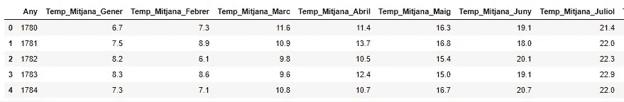****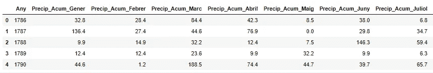**

**如上所示，两个数据集都包含月度数据。**

**数据集最常见的问题是错误的数据类型和缺失值。我们可以使用 [**熊猫轻松分析这两者。DataFrame.info**](https://pandas.pydata.org/pandas-docs/stable/reference/api/pandas.DataFrame.info.html) 方法。此方法打印数据框的简明摘要，包括列名及其数据类型、非空值的数量、数据框使用的内存量。**

**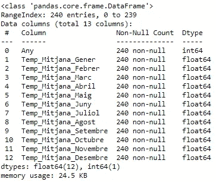****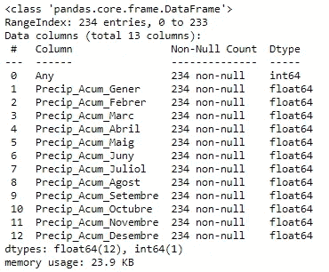**

**如上所示，数据集不包含空值，数据类型是预期的类型，因此不需要重要的清理任务；但是，它们包含月度数据，而不是年度值。我们计算年平均气温和年累积降雨量如下。**

**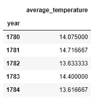****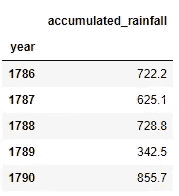**

**如您所见，我们将 year 列设置为数据框的索引。此外，我们已经删除了月度数据，因为我们将在可视化中仅使用年度值。因此，我们有两个数据框，包含(1)巴塞罗那的年平均气温和(2)年累积降雨量。**

**现在，我们用线图来显示这两个时间序列。**

*   ****巴塞罗那的年平均气温****

**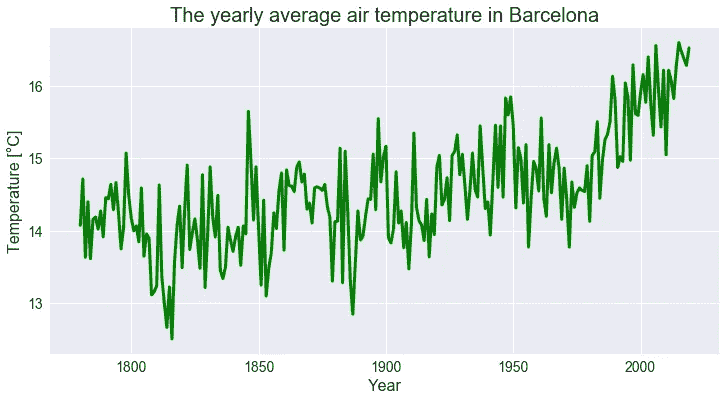**

*   ****巴塞罗那的年累积降雨量****

**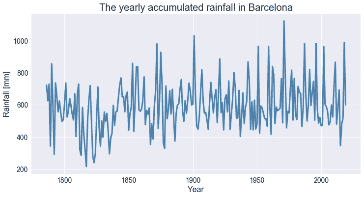**

**正如您所观察到的，可视化中有许多波动和噪声，但是我们有一个解决方案来平滑这两个时间序列:移动平均线👐**

**让我们深入了解💜**

# ****简单移动平均线****

****简单移动平均**是前 M 个数据点的**未加权平均值**。M(滑动窗口)的选择取决于所需的平滑量，因为增加 M 的值以精度为代价改善了平滑。**

**对于一系列值，我们计算时间段 t 的**简单移动平均值**如下:**

**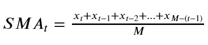**

**时间段 t 的简单移动平均线**

**计算**简单移动平均线**最简单的方法是使用 [**熊猫。**](https://pandas.pydata.org/pandas-docs/stable/reference/api/pandas.Series.rolling.html) 法连载。该方法提供了数据上的滚动窗口。在生成的窗口中，我们可以使用统计函数(在这种情况下是平均值)进行计算。窗口的大小(周期数)在参数**窗口**中指定。**

**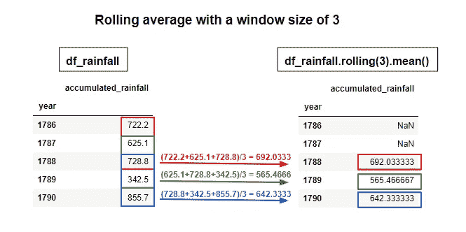**

**返回序列的第一行包含空值，因为滚动至少需要 n 个值(在 window 参数中指定的值)才能返回平均值。我们可以通过修改参数 **min_periods** 来改变这种行为，如下所示。**

**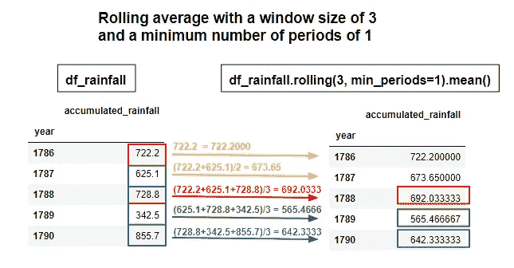**

**接下来，我们计算在 **10 年和 20 年**期间的**简单移动平均值**(窗口大小)，在所有情况下选择最小周期数 1。如下图所示，我们将移动平均值添加到现有数据帧中( **df_temperature** 和**df _ rain**)。**

**将移动平均值添加到数据帧后，我们使用线图绘制结果。以下图表显示了平均气温和累积降雨量以及 **10 年和**20 年**移动平均值**。请注意移动平均线是如何平滑数据的，让我们可以正确地看到趋势方向。**

**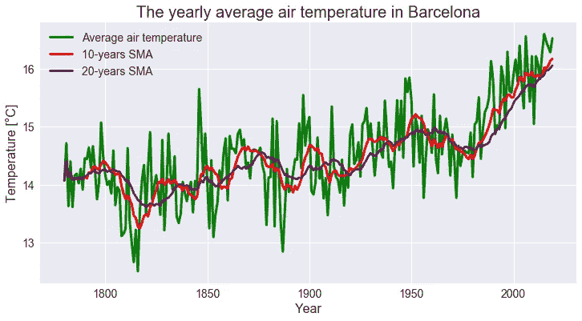****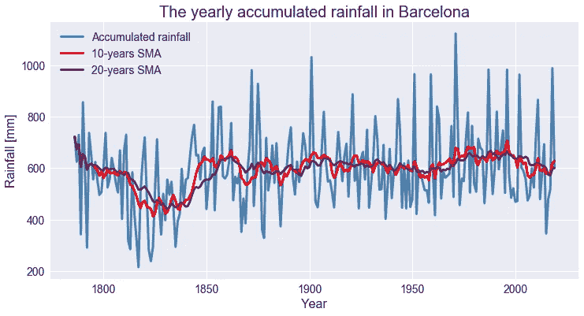**

**正如你所观察到的，气温呈现上升趋势，自 1975 年以来尤其高。相反，自 1850 年以来，累积降雨量一直保持不变。**

**最后，我想指出的是，您可以将**滚动方法**与其他**统计功能**一起使用。下表显示了您可以使用**滚动方法**来计算**滚动窗口计算**的一些函数。**

**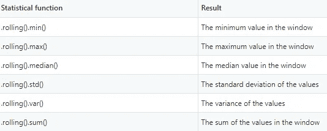**

# **累积移动平均线**

**累积移动平均值是到当前时间 t 之前的值的未加权平均值**

****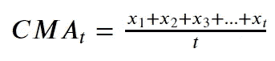****

******简单移动平均线**有一个恒定尺寸 **M** 的**滑动窗口**。相反，当计算**累积移动平均值**时，窗口大小随着时间的推移而变大。****

****我们可以使用 [**熊猫来计算 **Python** 中的累积移动平均值。**编](https://pandas.pydata.org/pandas-docs/stable/reference/api/pandas.Series.expanding.html)法。这个方法给出了聚合函数的累积值(在这个例子中是平均值)。和以前一样，我们可以用参数 **min_periods** 指定返回值所需的最小观察次数(默认值为 1)。****

**下图显示了扩展方法的工作原理。**

**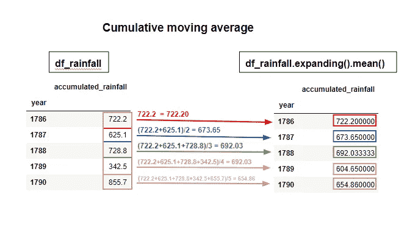**

**正如您所观察到的，扩展方法包括计算中当前行之前的所有行。**

**现在，我们用**熊猫**计算**累积移动平均值**，将结果添加到现有数据帧中。**

**下面的图显示了气温和累积降雨量的累积移动平均值。**

**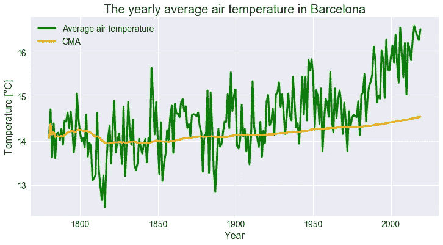****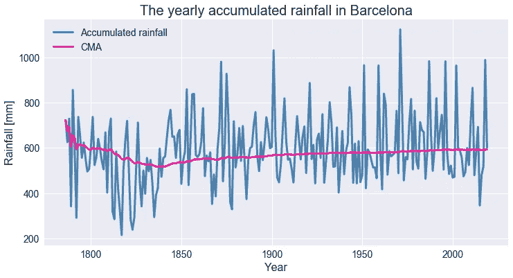**

****累积移动平均值**在计算平均值时会考虑所有之前的值。因此，它们不是分析趋势的好选择，尤其是对于长时间序列。**简单移动平均线**更适合此目的。但是，所有数据点的权重相等。为了突出显示最近的观察结果，我们可以使用**指数移动平均线**，它将更多权重应用于最近的数据点，对变化做出更快的反应。**

# **指数移动平均线**

**指数移动平均线是一种广泛使用的过滤噪音和识别趋势的方法。每个元素的权重随着时间的推移而逐渐降低，这意味着指数移动平均给予最近的数据点更大的权重。这是在最近的数据比旧数据更相关的想法下完成的。与**简单移动平均线**相比，**指数移动平均线**对变化反应更快，因为对最近的变动更敏感。**

**计算时间段 t 的**指数移动平均线**的代数公式为:**

**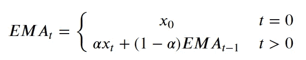**

**其中:**

*   ****xₜ** 是在时间段 **t.** 的观测值**
*   ****EMAₜ** 是时间段 **t.** 的**指数移动平均线****
*   ****α** 是**平滑因子。**平滑因子的值介于 0 和 1 之间，表示应用于最近时段的权重。**

**对于指数平滑，Pandas 提供了 [**pandas。**series . ewm](https://pandas.pydata.org/pandas-docs/stable/reference/api/pandas.Series.ewm.html)方法。我们可以在 **alpha** 参数中直接指定平滑因子。或者，我们可以用**质心**、**跨度**或**半衰期**来表示。**

**下图显示了 **ewm 方法**如何计算**指数移动平均**。在这种情况下，我们设置参数 **alpha** 等于 **0.1** ，参数 **adjust** 等于 **False** 。如您所见，计算中使用了时间段 t-1 的**均线**，这意味着在计算时间段 t 的**均线**时，包括了截至当前时间的所有数据点。但是，最早的数据点对计算的影响最小。**

**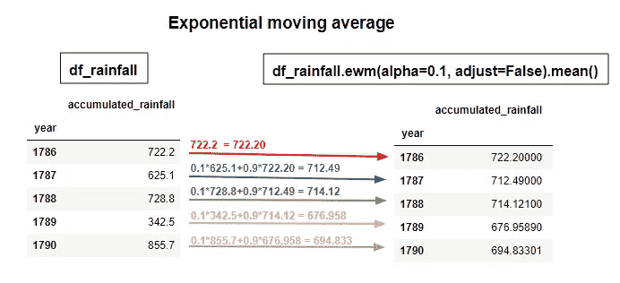**

**现在，我们用平滑因子 **0.1 和 0.3** 计算**指数移动平均线**。如前所述，我们将移动平均值添加到现有数据帧中( **df_temperature 和 df _ rain**)。**

**下图显示了平均气温和累积降雨量以及**指数移动平均值**。**

**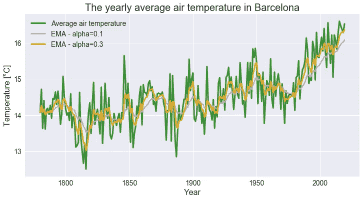****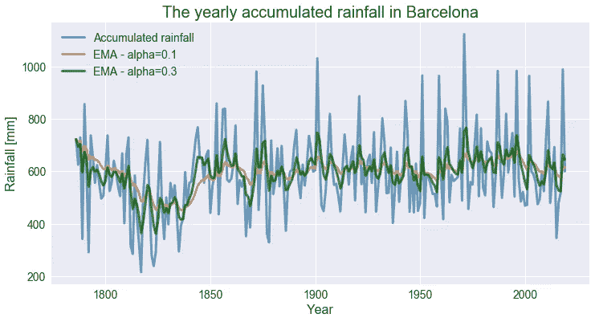**

**如上所示，小的加权因子 **α** 导致高度平滑，而较大的值提供对最近变化的更快响应。**

**下图显示了 15 个数据点的简单移动平均值和指数移动平均值的权重(alpha=0.3，adjust=False)。**

**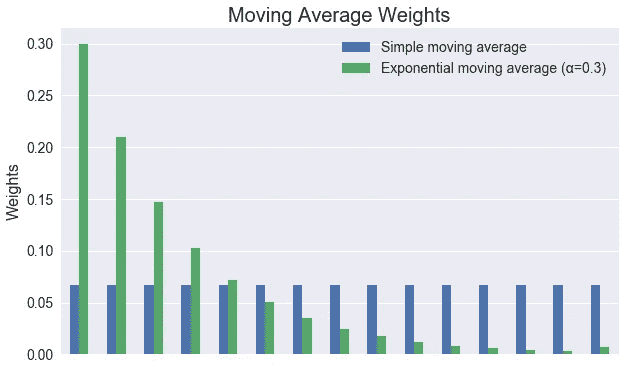**

**正如您所观察到的，简单移动平均线对所有数据点的权重相等。**

**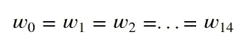**

**相反，指数移动平均线给予最近的数据点更大的权重。**

**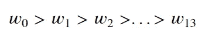**

**然而，最后一个重量 **w₁₄** 比 **w₁₃** 高。原因是用于计算最后重量的公式不同，如下所述。**

**[**熊猫。Series.ewm**](https://pandas.pydata.org/pandas-docs/stable/reference/api/pandas.Series.ewm.html) 方法提供了指数权重的两种变体。如果我们设置参数 **adjust=False** ，我们将使用代数公式计算指数移动平均线。**

****

**对于时间步长 0、1、2 和 3，我们得到以下结果:**

**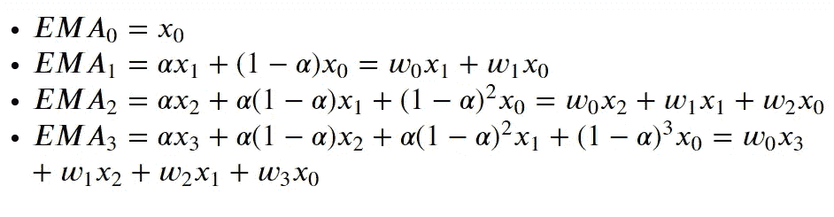**

**如上所示，这相当于使用权重:**

**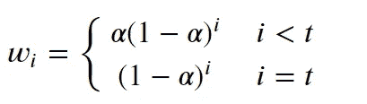**

**如您所见，最后的权重 **i=t** 是使用不同的公式计算的，其中 **(1-α)^i** 没有乘以 **α。****

**或者，如果我们设置 **adjust=True** (默认值)，我们使用权重 **wᵢ=(1-α)^i** 来计算指数移动平均，如下所示:**

**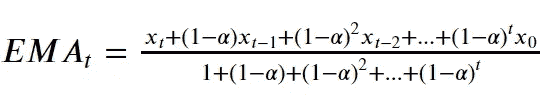**

**在这种情况下，使用相同的公式计算所有权重。**

**最后，我想指出的是，指数移动平均线不仅用于过滤噪音和识别趋势，也是处理时间序列时的一种预测方法。用于预测的最佳平滑因子 **α** 是最小化 **MSE** (均方误差)的因子。**

**如您所见， **Pandas** 提供了多个内置方法来计算**移动平均值**🙌。**滚动法**提供了数据的滚动窗口，让我们很容易获得**简单移动平均线**。我们可以使用**展开法计算**累积移动平均值**。**扩展窗口将包括计算中当前行之前的所有行。最后，我们可以用 **ewm 方法**计算**指数移动平均线**。要计算其他类型的移动平均线，我们可以只使用 Python 编程，或者使用第三方库，如 **Alpha Vantage。****

**我希望你喜欢这篇文章✋**

**阿曼达💜**