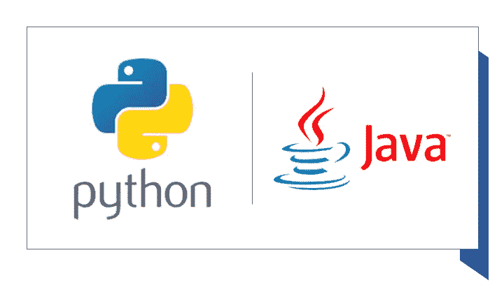

# 从 Python 迁移到 Java，将您的机器学习模型部署到生产中

> 原文：<https://towardsdatascience.com/moving-from-python-to-java-to-deploy-your-machine-learning-model-to-production-560ca7d9c870?source=collection_archive---------20----------------------->

## 当您将 Python 原型迁移到 Java 堆栈时，需要考虑的选项。

Python 是 Python 软件基金会的商标。Java 是 Oracle 和/或其附属公司的注册商标。

我们已经开发了一个系统原型，它在[Informatica Mapping Designer](https://docs.informatica.com/integration-cloud/cloud-data-integration/current-version/mappings/mappings/mapping-configuration/claire-recommendations.html)中推荐转换。现在，我们想转向生产。原型完全是用 Python 开发的，使用了 [scikit-learn](https://scikit-learn.org/) 库，这是一个用于开发机器学习模型的流行库，我们也使用了其他 Python 库进行特征提取。另一方面，我们的生产栈是基于 *Java* 的。此外，其他限制因素有:

*   我们希望快速进入生产阶段，但我们没有时间和资源来进行重大的基础设施开发
*   系统响应时间短，用户界面响应快。

文章的其余部分描述了我们已经考虑过的选项。

我们考虑的第一个选择是通过使用 [Jep](https://github.com/mrj0/jep) 或 [Jpy](https://github.com/bcdev/jpy) 将 Python 代码直接嵌入 Java。虽然 [Jython](https://www.jython.org/) 是一个流行的选项，但这对我们并不适用，因为 scikit-learn 依赖于本机 CPython 扩展，而 Jython 并不支持。此外，我们已经考虑将 Python 代码集成为 web 服务，例如使用 [Flask](https://www.fullstackpython.com/flask.html) ，但是这将需要维护两个独立的代码库，并引入额外的通信开销。

另一个选择是将模型转换成 Java 代码。模型转换文件(或 transcompile)是一个生成编程代码的过程，其行为方式与输入模型相同，通常是通过在生成的代码中捕获模型参数。我们已经考虑了 [sklearn-porter](https://github.com/nok/sklearn-porter) 和 [m2cgen](https://github.com/BayesWitnesses/m2cgen) ，它们支持多种分类算法，并且可以将 scikit-learn 模型转换成 Java 代码。然而，我们无法成功地移植我们的模型，这可能是因为它们的复杂性，所以我们没有进一步考虑这个选项。

我们考虑的第三个选择是**用 [H2O](https://www.h2o.ai/) 或 Spark 的 [MLib](https://spark.apache.org/mllib/) 重新开发** sckit-learn 模型，这些流行的机器学习库具有与 sckit-learn 相似的编程接口，并生成可以在 Python 和 Java 中使用的模型。由于 Spark 之前已经在 Informatica 中成功使用过，我们采取了那个方向，使用 Python 的 Spark 库 [PySpark](https://spark.apache.org/docs/latest/api/python/pyspark.html) 在 Python 中训练模型，然后将它们导出到 Java 中。此外，我们用 Java 重新实现了特征提取代码，并将模型和代码一起部署，然后加载模型并使用它们来提出建议。最后，我们考虑了在嵌入式模式下使用 Spark(仅使用 JAR 依赖项)或建立 Spark 集群之间的选择。我们的测试结果表明，在嵌入式模式下，我们的模型的响应时间是可以接受的，我们将继续这样做。

下表总结了所考虑的方法:

在未来，我们计划利用 Spark 集群并扩大训练环境，以便在更大的数据集上训练模型。此外，我们正在考虑建立一个服务于机器学习模型的基础设施，这可以简化新模型的交付以及现有模型的更新。

谢谢大家！