# 将我们本地的 Jupyter 笔记本电脑迁移到云上的 GPU——AWS 上的深度学习

> 原文：<https://towardsdatascience.com/moving-our-local-jupyter-notebooks-to-gpus-on-cloud-deep-learning-on-aws-cab4d8de389f?source=collection_archive---------52----------------------->

## 不再受本地系统资源的限制，将深度学习工作负载迁移到云 GPU

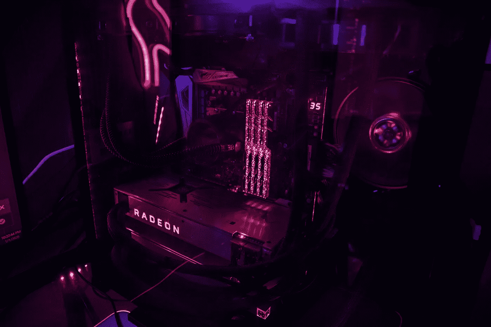

由[齐·米勒](https://unsplash.com/@anarchist?utm_source=unsplash&utm_medium=referral&utm_content=creditCopyText)在 [Unsplash](/s/photos/gpu?utm_source=unsplash&utm_medium=referral&utm_content=creditCopyText) 拍摄的照片

# 从 AWS 获取 GPU

让我们为深度学习工作负载创建一个 GPU 实例。为此，我们需要一个 AWS EC2 实例。登录 [AWS web 控制台](https://aws.amazon.com/console/)，查找 **EC2 服务**，点击**启动实例**。

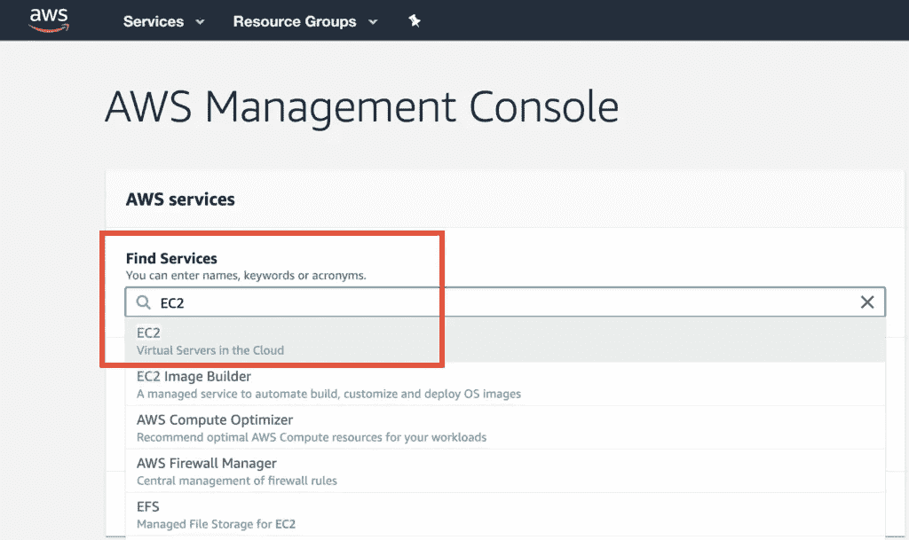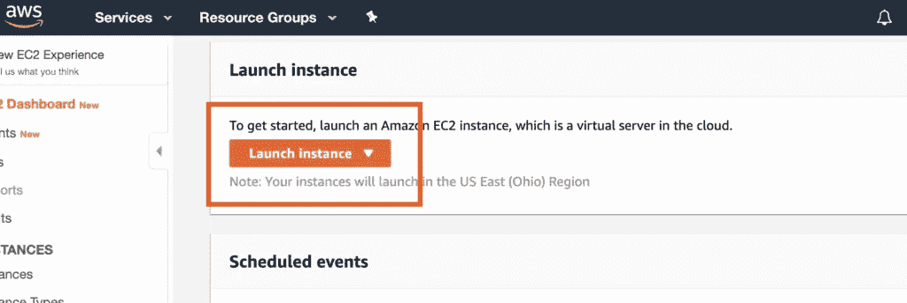

寻找**深度学习 AMI** 的。这些是更好的，因为它们预装了 Python3、Jupyter 和许多其他库。选择可能适合您的实例类型。

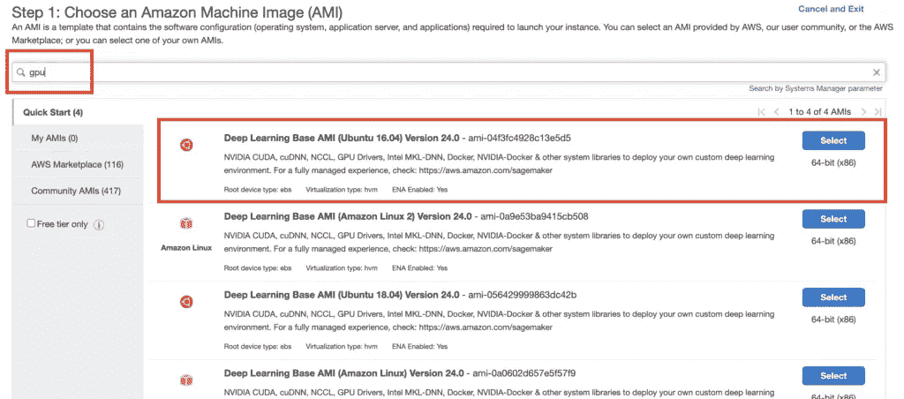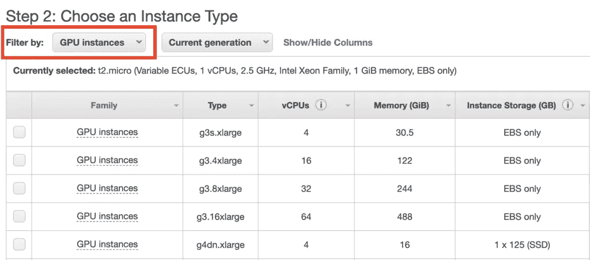

# 安全细节

Jupyter 笔记本有两种访问方式:

*   **方法 1** —隧道到 EC2 实例(推荐)
*   **方法 2** —暴露 HTTP 和 TCP 端口与 Jupyter 对话

对于方法 1，我们只需要安全组中的 SSH 配置。默认情况下，它应该存在，不需要任何更改。

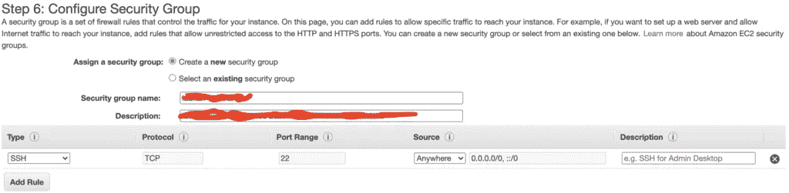

不太推荐方法 2，因为它将实例进一步开放给了互联网。然而，这可以通过 **HTTPS 端口 443 和自定义 TCP 端口 8888 来完成。**

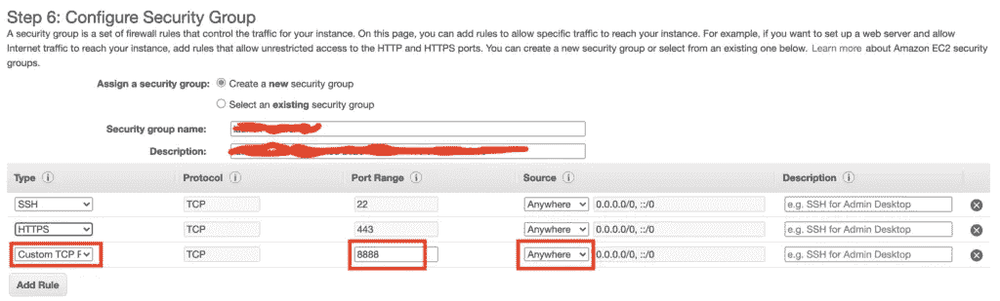

# 密钥对/ pem 文件

另一个需要注意的重要步骤是访问用于创建实例的**密钥对**。如果您没有密钥对，可以在创建时生成一个。如果您决定创建一个密钥，AWS 将为您下载该密钥。

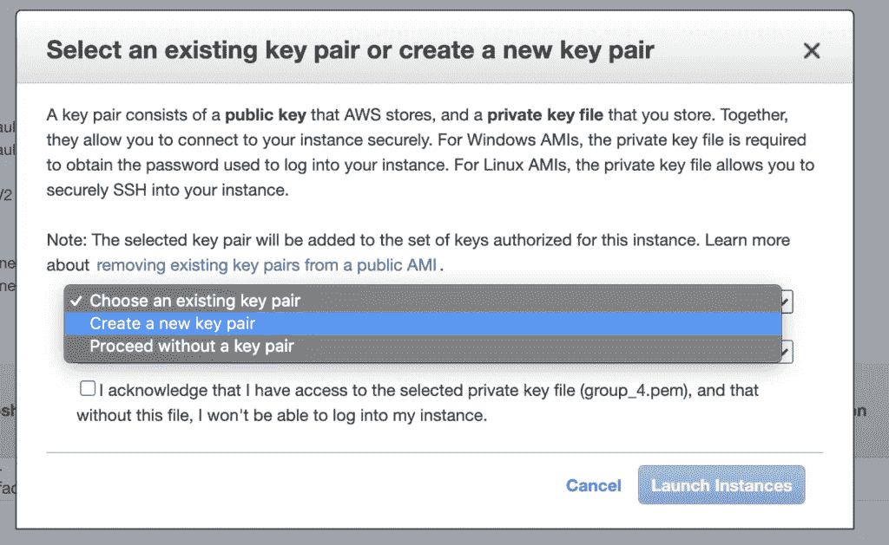

**注意:**如果有多个团队成员在这个盒子上工作，那么**通过 Last pass 或其他密码共享服务来共享密钥对(pem)文件**是非常重要的。不要使用电子邮件/ slack 来交换密码/密钥文件。

# 创建实例

以上是所有的配置，**创建实例**。这将需要 2-3 分钟。获取创建的机器的 IP 地址。

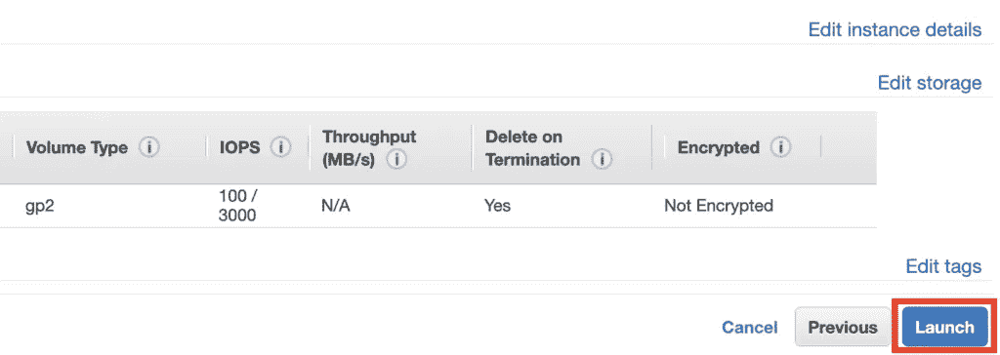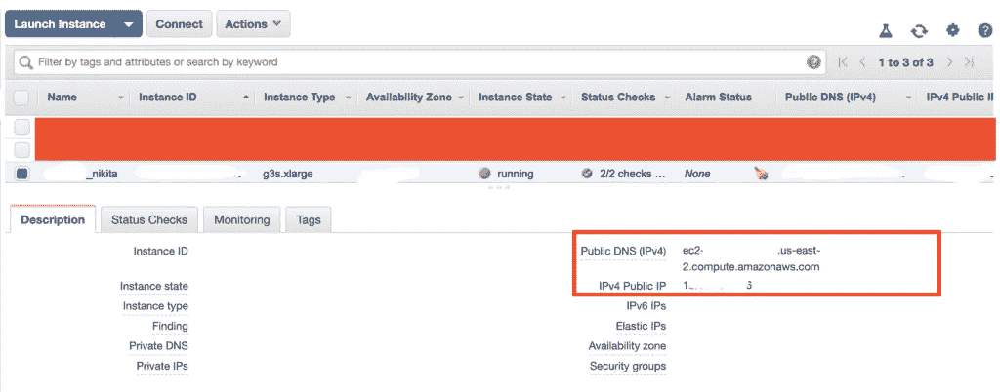

# 登录到机器

我们现在可以登录这个盒子-

```
# The downloaded key-pair (pem) file is more permissive. 
# Fix permissions. 
# chmod 400 <path to pem file> chmod 400 ~/path/to/key.pem # Get in the box 
# ssh -i <path to pem file> -L <local box:port>:<remote box:port> ubuntu@<ec2 ip address> ssh -i ~/path/to/key.pem -L localhost:9999:localhost:8888 ubuntu@11.11.11.11
```

**注意**:我建议对上面的命令`localhost:9999:localhost:8888`使用端口 9999，因为您本地安装的 Jupyter 可能会干扰这个设置。

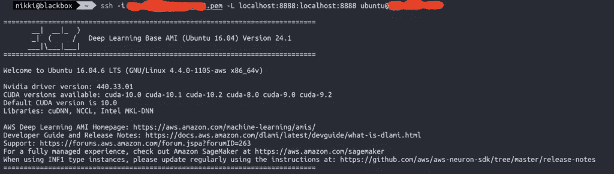

# 让 Jupyter 开始

在远程盒(EC2 盒)的端子上启动 Jupyter。建议在屏幕会话中启动 Jupyter，这样您可以关闭终端，Jupyter 服务器仍然保持活动状态。

```
# Create a new screen session 
screen -S jupyter_session # Start Jupyter 
jupyter notebook
```

这应该为我们的 Jupyter 笔记本— `[http://localhost:8888/?token=thisisalongsecrettoken](http://localhost:8888/?token=thisisalongsecrettoken.)` [提供一个 URL 和一个密码(令牌)。](http://localhost:8888/?token=thisisalongsecrettoken.)

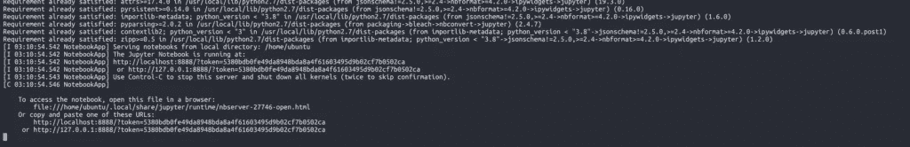

# 跑起来

你现在应该可以在你的本地机器上访问 Jupyter 了 [http://localhost:9999](http://localhost:9999)

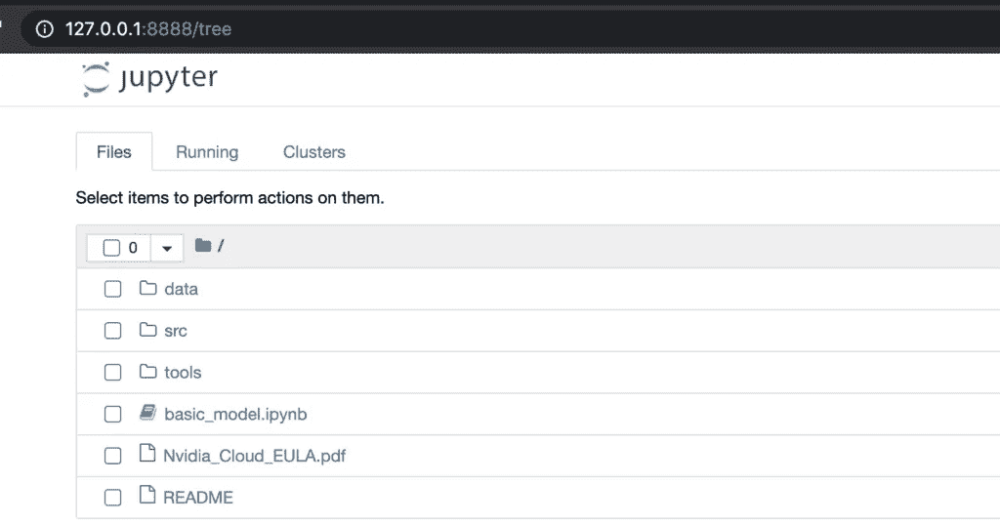

# 我的数据在哪里

你可以从你的终端或通过 python 从 S3(亚马逊推荐的存储)下载你的数据。我在 Google drive 上有我的数据，所以我正在使用这个很酷的实用程序库 **googledrivedownloader** 将我的数据放入这个盒子。您需要为这个库创建一个 sharabele 链接，链接到 G-Drive 中的数据。lib 也为我们创建子目录和解压数据。

```
! pip3 install "googledrivedownloader==0.4" from google_drive_downloader import GoogleDriveDownloader as gdd# file_id - id of the sharable link of the file 
# from Google Drive. gdd.download_file_from_google_drive(           
    file_id='1jgSl1thisisafakekeyRleIGpIO3Q', 
    dest_path='./data/Flikr8k_text.zip', 
    unzip=True)
```

# 清理很重要$$$

确保在不使用时停止/终止实例。否则亚马逊得到$$$。停止实例时，数据将保留在节点存储上，不会向您收费。请[阅读官方文件](https://docs.aws.amazon.com/AWSEC2/latest/UserGuide/Stop_Start.html)了解更多信息。

**重要提示:**您的笔记本和下载的数据将在**终止**实例时被删除，您必须再次完成上述所有步骤。

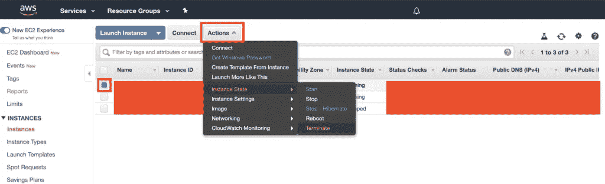

# 那是一个包裹

在未来的帖子中，我们将关注亚马逊 Sagemaker，它为数据科学笔记本提供了更加统一的体验。

这就是这篇文章的全部内容。希望对你有用。让模型运行起来。

*原载于 2020 年 6 月 13 日*[*https://confusedcoders.com*](https://confusedcoders.com/data-science/deep-learning/moving-our-local-jupyter-notebooks-to-gpus-on-cloud-deep-learning-on-aws)*。*