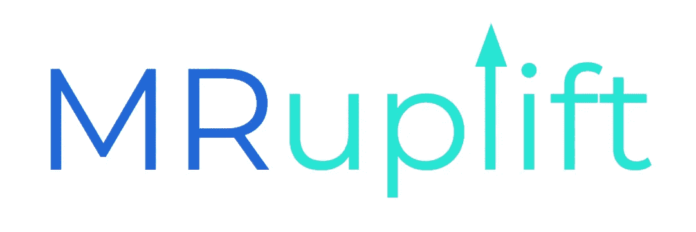
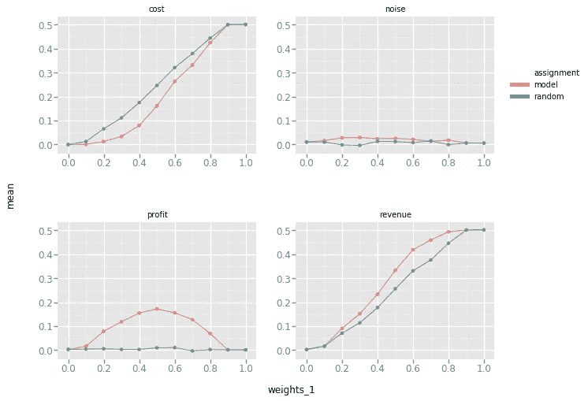

# MR-隆升:隆升模型中的多重响应

> 原文：<https://towardsdatascience.com/mr-uplift-multiple-responses-in-uplift-models-59a88de57e35?source=collection_archive---------43----------------------->

## 一个建立提升(或异质治疗效果)模型的包，该模型建立并评估多种反应的权衡



# **简介**

*原贴于* [*大楼 Ibotta*](https://medium.com/building-ibotta/the-mr-uplift-package-e9ac003ea493)

在过去几年里，我们在伊博塔建造并部署了多种提升模型。我们以前在博客中描述过一些理论基础和实践建议。在这些文章中，我们讨论了[如何评估](https://medium.com/building-ibotta/erupt-expected-response-under-proposed-treatments-ff7dd45c84b4)它们，如何使用[特定损失函数来估计](https://medium.com/building-ibotta/maximizing-the-erupt-metric-for-uplift-models-f8d7e57bfdf2)它们，以及[如何评估几个响应变量](https://medium.com/building-ibotta/estimating-and-visualizing-business-tradeoffs-in-uplift-models-80ff845a5698)之间的权衡。

有了这些来之不易的知识和评估方面的进步，我们决定开源一个 Python 包，名为[MR-upgrade](https://github.com/Ibotta/mr_uplift)。

这篇文章将介绍这个包能做什么，以及它如何成为现有包的有用补充。提供了一个示例和更多资源。

**套餐缴费**

提升建模(也称为异质或个体治疗效果)是机器学习的一个分支，它学习治疗`t`和个体`x`的特定反应`y`之间的因果关系。一个例子可以是接收特定广告的特定个人的未来活动。

虽然有几个软件包可以建立隆起模型(见[【GRF】](https://github.com/grf-labs/grf)和[因果树](https://github.com/susanathey/causalTree))，但它们通常依赖于单一处理和单一响应案例。他们通常不会给出模型在生产中表现如何的估计。此外，没有支持估计几个响应变量之间的权衡。

该软件包试图构建一个用于隆起建模的自动化解决方案，该解决方案通过以下特性来满足 Ibotta 用例的需求:

1.  MR-Uplift 允许多种治疗。这意味着用户可以在模型中输入任意数量的治疗(不仅仅是通常的二元变量)。此外，可以为每种治疗加入元特征。例如，一种特定的治疗可能与其他治疗有几个共同的特征。用户可以创建分类或连续变量的向量来表示治疗，而不是为每个治疗创建虚拟指标。以这种方式指定治疗变量允许模型考虑治疗之间的相似性。
2.  如果模型被部署到生产中，很少有当前的软件包给出关于模型的预期性能的样本外(OOS)估计。MR-Uplift 包括使用[爆发](https://medium.com/building-ibotta/erupt-expected-response-under-proposed-treatments-ff7dd45c84b4)度量来估计这一点的功能。此指标计算模型提供给普通用户时的预期反应。
3.  [支持多重响应](https://medium.com/building-ibotta/estimating-and-visualizing-business-tradeoffs-in-uplift-models-80ff845a5698)。这可能是这个包最独特的特性(也是它现在名字的原因)。该模型有能力建立一个多输出模型，而不是只有一个响应。有了这个，人们可以估计响应变量之间的权衡。我们发现这是一个有用的工具，可以确定我们有哪些可能性，以及在生产中使用哪个目标函数。

MR-Uplift 使用具有均方误差损失的多输出神经网络。虽然可以使用任何类型的多输出模型，但是我发现神经网络可以比基于树的方法更可靠地估计治疗和解释变量的交互作用。

这项工作的一个特别的缺点是它不像[因果树](https://github.com/susanathey/causalTree)那样直接测量治疗效果。扩展模型以包含更具体的损失函数可能会导致性能的提高。此外，由于目前不支持从观察数据中估计治疗效果，因此假设存在针对治疗数据的随机对照试验。

**快速示例**

如果您不熟悉提升模型，我建议浏览回购中提供的[示例。下面是一个生成数据、构建模型和评估权衡的示例。请参见](https://github.com/Ibotta/mr_uplift/tree/master/examples)[本笔记本](https://github.com/Ibotta/mr_uplift/blob/master/examples/mr_uplift_multiple_response_example.ipynb)了解这个假设示例的更多细节。

假设我们是一家企业的营销人员，希望通过广告增加用户收入(称为治疗)。该数据由随机分配的治疗变量组成，每个用户有四个响应变量:收入、成本、利润和随机噪声变量。这种处理增加了用户收入，但也付出了代价，两者都是解释变量的函数。我们感兴趣的是估计企业可用的响应变量的权衡。下面是生成数据和构建模型的代码。

`y`、`x`和`t`分别是反应、解释和处理变量。注意，每个都被假定为数字类型(分类变量需要一键编码)，但是可以是多列宽。

```
import numpy as np
import pandas as pdfrom dataset.data_simulation import get_simple_uplift_data
from mr_uplift.mr_uplift import MRUplift#Generate Data
y, x, t = get_simple_uplift_data(10000)
y = pd.DataFrame(y)
y.columns = ['revenue','cost', 'noise']
y['profit'] = y['revenue'] - y['cost']#Build / Gridsearch model
uplift_model = MRUplift()
param_grid = dict(num_nodes=[8], 
             dropout=[.1, .5], 
             activation=['relu'], 
             num_layers=[1, 2], 
             epochs=[25], 
             batch_size=[30])uplift_model.fit(x, y, t.reshape(-1,1), param_grid = param_grid, n_jobs = 1)
```

这将自动应用训练/测试分割，对所有变量应用 z 标度，并构建一个形式为`y~f(t,x)`的多输出神经网络。

为了查看模型如何执行以及业务可用的权衡，建模者可以应用`get_erupt_curves()`函数来获得样本外爆发曲线。这些方法通过将各种权重应用于每个预测响应并计算相应的预期响应来估计权衡。

例如，假设我们有一个权重`β`和目标函数`β*revenue-(1-β)*costs`。权重`β=1`对应于收入最大化，`β=0`对应于成本最小化，`β=.5`对应于利润最大化。下面显示了在`β`的各种权重下，预期响应的代码和标绘输出。

`erupt_curves, dists = uplift_model.get_erupt_curves()`



以上是在成本最小化和收益最大化之间改变目标函数的爆发曲线。随着重量`β`的增加，成本和收入也会增加。

请注意，噪声响应大约保持在零附近，这是有意义的，因为处理对其没有影响。另请注意，利润响应如预期的那样在`β=.5`出现最大值。

还有一个“随机”分配曲线。这“打乱”了最佳治疗，然后计算出爆发。比较“模型”线和“随机”线可以看出模型在个体水平上分配治疗的效果。

在实践中，我发现这些图表有助于决定应该如何权衡。涉众可能不知道在更模糊的响应度量之间应该预先进行什么样的相对权衡。这些图表向利益相关者显示了可用的选项，并设置了模型在生产中能够实现和不能实现的预期。

**入门**

要开始使用 MR-Uplift，请查看 [github 回购](https://github.com/Ibotta/mr_uplift)和示例或`pip install mr_uplift`。如果您发现任何问题，请提交。更好的是，如果你有希望实现的想法，你可以[贡献](https://github.com/Ibotta/mr_uplift/blob/master/CODE_OF_CONDUCT.md)。