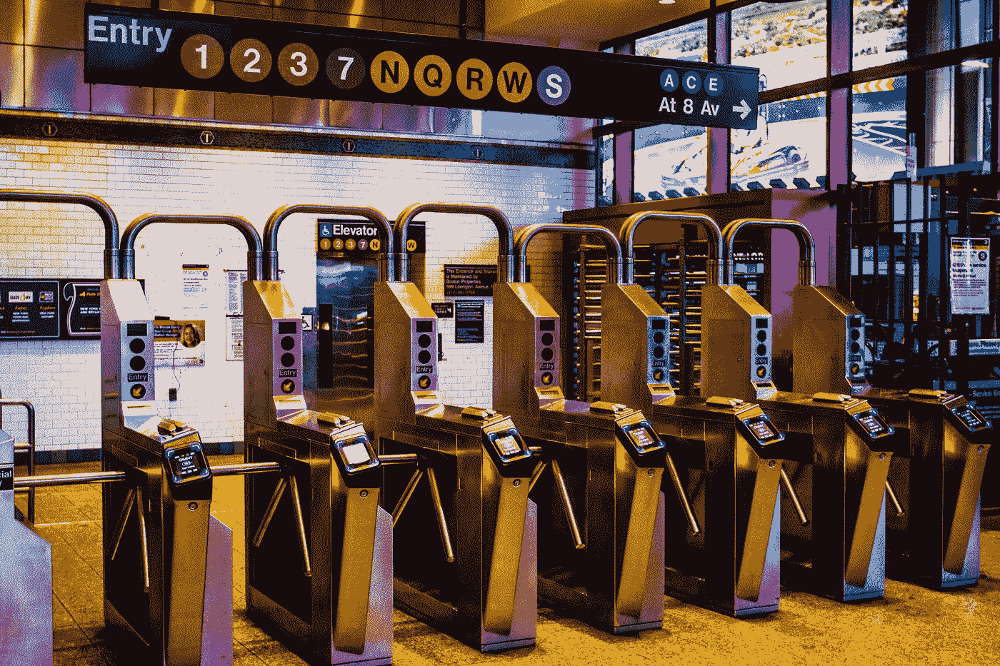
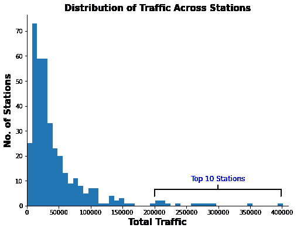
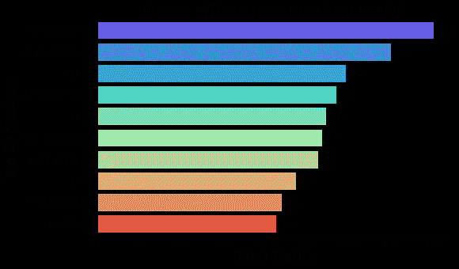
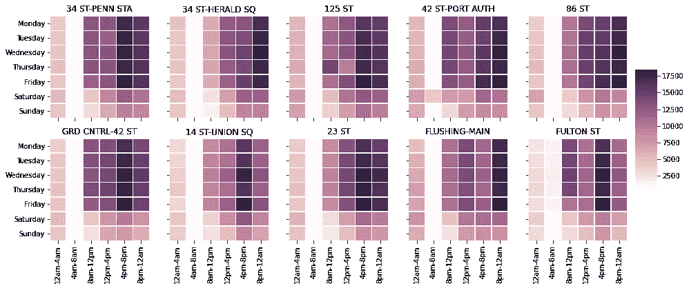
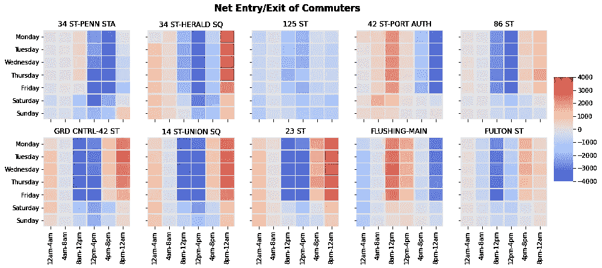

# 探索性数据分析 Data 十字转门街道交通分析

> 原文：<https://towardsdatascience.com/mta-turnstile-traffic-analysis-to-optimize-street-engagements-a7391adc4d45?source=collection_archive---------47----------------------->

## Metis 数据科学训练营的一个简单的探索性数据分析项目。

保罗·席尔瓦在 [Unsplash](https://unsplash.com/) 上的照片

在 Metis 数据科学训练营的项目 1(新加坡第 5 批)中，我们的任务是对 [MTA 十字转门数据](http://web.mta.info/developers/turnstile.html)进行探索性数据分析(EDA ),为一个虚构的非营利组织 WomenTechWomenYes (WTWY)提供关于社交活动街道团队(在纽约市地铁站入口处)最佳位置的建议。WTWY 希望邀请感兴趣的个人参加其年度晚会，以提高女性对科技的认识和参与度，街头团队的议程是收集尽可能多的电子邮件，并发放晚会的免费门票。在我的分析中，我做了以下假设:

## **假设**

*   WTWY 受到时间和人力资源的限制，因此从我的分析中得到的见解应该通过流量来识别顶级站点，以及这些站点中的高峰时段。
*   对科技感兴趣的人更有可能在科技公司办公室密集的市中心遇到。
*   WTWY 联欢晚会即将来临，一周的 MTA 十字转门数据被分析作为联欢晚会前几周的样本。

# 数据探索和清理

MTA 十字转门数据是从 2020 年 8 月 22 日到 2020 年 8 月 28 日这一周收集的。取数据的前几行，我们观察到以下数据框:

此处给出了柱特征的描述[。进一步的研究表明,“进入”和“退出”列是随着时间增加的累积序列号。此外,“时间”列的行以大约 4 小时为单位前进，每个十字转门都有一个独特的“单位”和“SCP”数字组合，如图所示。一些行也被发现是重复的，并被删除。](http://web.mta.info/developers/resources/nyct/turnstile/ts_Field_Description.txt)

为了找到进出每个十字转门的人数，我首先根据以下顺序对数据框中的列进行排序:['UNIT '，' SCP '，' DATE '，' TIME']，然后使用 diff()方法对序列进行排序，我分别对' ENTRIES '和' EXITS '取连续行之间的差值，以形成新列。新的列(命名为“入口 _ 增量”和“出口 _ 增量”)将表示在特定的 4 小时期间通过每个十字转门的入口和出口的实际数量。尽管如此，有些进/出的值要么是负数，要么是天文数字。

进一步的分析表明，这是由于数据帧中 2 个不同十字转门之间的行转换，或者特定十字转门中序列号计数器的重置。为了进行校正，这些异常值随后被替换为进/出的前一个和后一个值的平均值。这种干预是合理的，因为进入/退出可以近似为连续时间段之间的插值。

此后，通过将入口和出口值相加来计算每个时间段内每个十字转门的总交通量。我把这个专栏命名为‘ENTRY _ EXIT’。

# 结果

现在，我们已经为数据可视化做好了准备，以便为 WTWY 的街道团队的潜在布局获得洞察力！使用 Panda 的 groupby、Matplotlib 和 Seaborn，我接着绘制了一个直方图、条形图和一些热图。

绘制直方图显示纽约市所有 MTA 站的流量分布严重右偏，流量排名前 10 位的站是分布中的异常值。因此，这更清楚地表明 WTWY 可以将他们的参与努力集中在前 10 个电台。

放大，绘制前 10 个车站的条形图显示，34 St-Penn 和 34 St-Herald Square 车站的流量明显高于其他车站，应该优先考虑。

添加一天的维度，绘制一周内前 10 个车站的热图，揭示了与周末相比，人们在工作日更频繁地乘坐地铁旅行的趋势。这一趋势适用于所有 10 个站。

进一步将热图分解为每个站点的白天和时间，揭示了另一个有趣的事实——站点通常在下午晚些时候和晚上更忙，即使在工作日也是如此。这并不奇怪，因为在 Covid 疫情期间，纽约市的许多公司都采用了在家工作的安排，从而避免了早高峰人群。此外，在工作日上午雇用街道小组可能会适得其反，因为其余的重要工作人员将忙于报道工作，不太可能成功接触到他们。

使用另一幅热图，当我们分析每个车站中通勤者的净出入(红色区域表示净出入，蓝色区域表示净出入)时，我们可以确定位于更密集的住宅/酒店区域的车站-Flushing-Main 和 42 St-Port Auth 车站。这一点从他们在晚上的净出口可以看出，这意味着人们正在返回家园。由于这些车站不靠近公司办公室，对技术感兴趣的个人不太可能出现在这些通勤者中。

# 结论

从我们的分析中，我们可以得出结论，WTWY 应该将他们的街头参与工作集中在排名前 10 位的电视台，最好是在工作日的下午晚些时候到晚上。此外，如果有进一步的人力限制，可以避免 Flushing-Main 和 42 St-Port Auth 站，因为它们是潜在的住宅和旅游区，技术公司办公室不在那里。

最后，我希望我对 MTA 十字转门数据的探索性数据分析产生了有趣的见解，并期待展示 Metis 数据科学训练营即将开展的其他数据项目。敬请期待！

> 在 GitHub 的这里找到我所有的代码和这个项目的演示幻灯片！
> 
> ***支持我！***——如果你是*而不是*订阅 Medium，并且喜欢我的内容，请考虑通过我的[推荐链接](https://tanpengshi.medium.com/membership)加入 Medium 来支持我。

 [## 加入我的介绍链接媒体-谭师鹏阿尔文

### 阅读谭·师鹏·阿尔文(以及媒体上成千上万其他作家)的每一个故事。您的会员费直接…

tanpengshi.medium.com](https://tanpengshi.medium.com/membership)