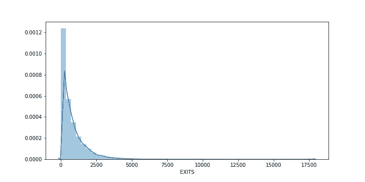

# MTA 十字转门数据:探索性数据分析

> 原文：<https://towardsdatascience.com/mta-turstile-data-my-first-taste-of-a-data-science-project-493b03f1708a?source=collection_archive---------28----------------------->


埃迪·阿吉雷在 [Unsplash](https://unsplash.com/s/photos/new-york-subway?utm_source=unsplash&utm_medium=referral&utm_content=creditCopyText) 上拍摄的照片

Metis 数据科学训练营(新加坡第四批)的第一周刚刚结束，到目前为止，这是一次有趣的经历。下面我将详细介绍我们在那段时间做的第一个项目，这是一个探索性的数据分析，使用 Python 与*熊猫*和*海牛*配对来分析 MTA 十字转门数据集。

## TL；博士:

*   准备了 2019 年**2 月和 3 月的 MTA 十字转门数据，用于**一个为夏季晚会报名的活动。
*   通过**重命名列**、**添加计算字段**、**删除错误数据**和**按站点和日期聚集来清除数据。**
*   发现**工作日有最高的流量**，但这是**一些车站**的情况较少；某些日子也有**异常交通流量**。
*   建议活动**集中在工作日客流量高而周末客流量低的车站**
*   **异常**、**一天中的时间**和**应考虑人口统计数据**的其他来源，以便进一步分析

这里是到 GitHub 库的[链接](https://github.com/KunojiLym/metis_project_1)。

# 一.背景

女性科技女性是(WTWY)每年初夏都会在纽约市举办一年一度的盛会。他们试图在这个盛会上发挥双重作用，一方面让那些热衷于增加女性在科技领域参与度的人来充实他们的活动空间，另一方面也提高人们的认识和影响力。

为此，他们在纽约地铁站的入口处安排了街头小组。街头团队收集电子邮件地址，注册的人会收到免费的晚会门票。

我们的任务是使用纽约市大都会运输管理局(MTA)的地铁数据来帮助 WTWY 优化他们街道团队的位置，以便他们可以收集最多的签名，最理想的是从那些将参加晚会并为他们的事业做出贡献的人那里收集签名。

# 二。设置

我们使用了来自 [MTA 十字转门](http://web.mta.info/developers/turnstile.html)的历史数据，决定专注于 2019 年 2 月和 3 月的数据。

*   二月(T0)、二月(T1)和三月(T2)、三月(T3)这两个月似乎是夏季来临前的充足准备时间，让人们能够将春晚安排到他们的日程表中。
*   在 2020 年的这个时候，新冠肺炎疫情正在肆虐，纽约市是世界上最大的热点之一。结果，它被封锁了，这严重扰乱了交通模式，T4 的街道空无一人。这是非常不寻常的情况。如果这是一项真实的研究，我给组织者的建议是完全避免安排街头团队，要么推迟/取消晚会，要么完全转移到网上。出于这个练习的目的，我们假设春晚将发生在 2019 年**的夏天。**

具体来说，我们从 2019 年 2 月 2 日结束的一周**到 2019 年 3 月 5 日结束的一周**的十周时间内获取数据，如以下代码片段所示:

我们还决定专注于收集每个站点每天的总流量，忽略条目的时间。可以想象，在数据分析的后续迭代中会添加时间。

# 三。准备数据

## a)列重命名

检查*MTA _ test . columns . values*，我们注意到数据集的 *EXITS* 列有一大堆尾随空格:

```
array(['C/A', 'UNIT', 'SCP', 'STATION', 'LINENAME', 'DIVISION', 'DATE', 'TIME', 'DESC', 'ENTRIES',
 'EXITS                                                               '],
      dtype=object)
```

所以为了让我们的生活更轻松，我们把它重新命名为:

```
mta_test.rename(columns={'EXITS                                                               ':'EXITS'}, inplace=True)
```

## b)添加计算字段

基于来自 MTA 的[字段描述，我们知道入口和出口分别是给定入口和出口点的累积入口和出口寄存器值。因为我们是按天而不是按时间段聚合，所以我们决定分别减去入口和出口的第一个(也就是最小的)和最后一个(也就是最大的)计数器值。](http://web.mta.info/developers/resources/nyct/turnstile/ts_Field_Description.txt)

我们还将入口和出口聚合到一个单独的列中，即 TRAFFIC，以及附加的工作日属性，以便于以后按工作日分析数据。我们的结果被放入 *mta_entries_exits* 中。

这一切的代码片段如下:

## c)删除错误数据

当我们按流量对 *mta_entries_exits* 排序时，我们发现奇怪的大值似乎会打乱数据集:

对数据的进一步分析显示，在 MTA 数据的某些行中，计数器值以无法解释的数量跳跃(如下例所示):

查看入口和出口的分布可以发现，这些值中的大多数都在 20，000 以下:


条目数量的分布



出口数量分布

因此，我们删除了所有大于 20，000 的入口和出口值:

```
mta_entries_exits = mta_entries_exits[(mta_entries_exits.ENTRIES < 20000) & (mta_entries_exits.ENTRIES < 20000)]
```

**请注意，这将删除特定十字转门一整天的数据。**出于初步分析的目的，我们认为这是可以接受的，因为车站的每个入口点都有许多十字转门，通常不止一个入口点；然而，进一步的分析需要数据移除更有针对性。

## d)按站点和日期汇总数据

最后，我们按车站和日期汇总了数据，因为我们不是在看单个的十字转门。

```
mta_bystation = mta_entries_exits.groupby(['STATION','DATE','WEEKDAY', 'WEEKDAY_INDEX']).sum().reset_index()
```

# 四。来自数据的见解

## a)关注排名前五的电视台

我们发现总流量排名前 5 的站点如下:

1.  宾州车站
2.  大中央车站
3.  先驱广场
4.  第 23 街
5.  时代广场


我们的建议是**将重点放在这 5 个车站**。

## b)关注工作日

我们发现周末的交通流量比平日少(最多是平时的一半)。总的来说是这样的:


排名前五的电视台也是如此:


我们的建议是在工作日关注**。**

## 异常情况

我们注意到并非所有的站点都遵循相同的模式。例如，第 3 至第 5 级车站的工作日交通量更接近周末交通量:


顶部 2 站已移除。注意这些车站的工作日和周末交通有多接近。

这可能是因为这些车站位于旅游区，时代广场就是一个突出的例子。退一步说，这样的短期游客不太可能参加夏季晚会。我们的建议是**关注工作日客流量高而周末客流量低的车站**。

我们还发现，在排名前五的站点中，至少有一个站点的流量出现了无法解释的下降:


请注意 2019 年 2 月 18 日至 25 日这一周中间的流量下降。

这种下降(或峰值)需要隔离和调查，因为它们可能是由于特殊情况，如公共假期或紧急情况。这也可能是由于之前的数据清理丢失了数据。

# 动词 （verb 的缩写）进一步的步骤

为了获得进一步的见解，我们可以做以下事情:

1.  包括时间栏，以便: **a)确定高峰时间**，以便 WTWY 知道何时是安排其团队的最佳时间；和 **b)通过丢弃特定时间的坏数据而不是一整天的坏数据来减少数据丢失**。
2.  纳入**人口和地理数据**以确定通勤者的构成、任何地理相关性等。

# 不及物动词外卖食品

探索性数据分析的这一练习教会了我们以下内容:

1.  检查列名值的重要性；我们花了一段时间才意识到为什么从数据集中提取出口值有困难。
2.  使用分布图和过滤器剔除数据中异常值的重要性。