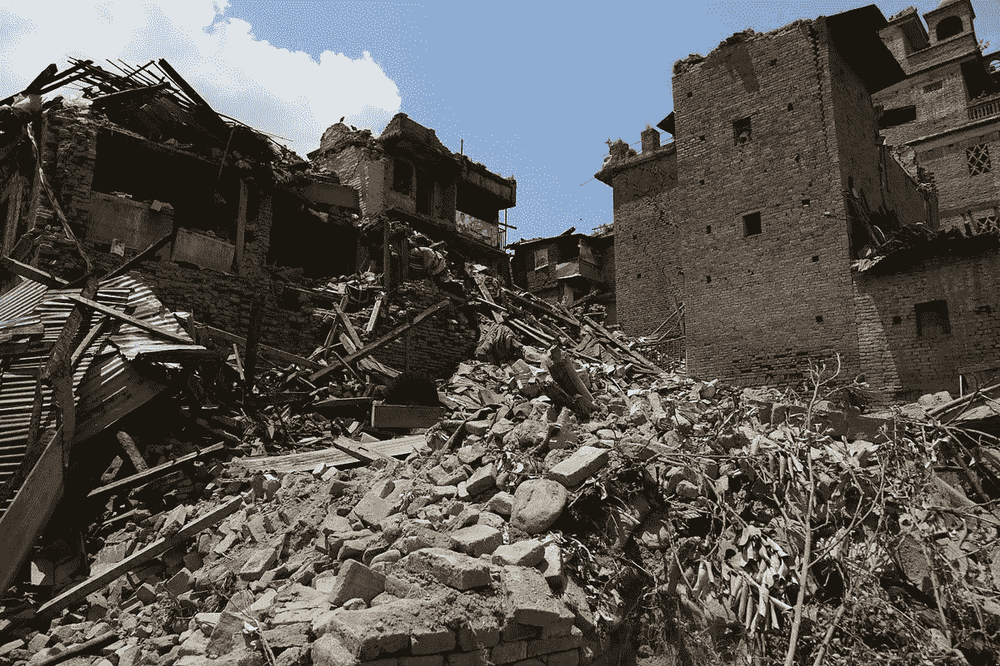
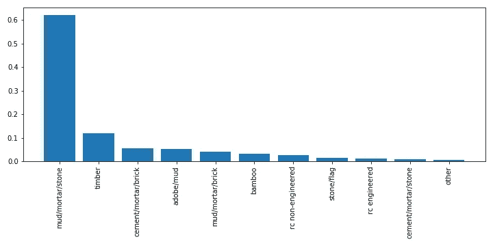

# 你还有很多要学的

> 原文：<https://towardsdatascience.com/much-to-learn-you-still-have-42d1439e6162?source=collection_archive---------67----------------------->

来源:维基百科

## 我从数据科学优秀竞争的前 5%参与者身上学到的三个教训。

本周末是 2015 年尼泊尔大地震五周年纪念日，那次地震造成约 9000 人死亡。死亡人数如此之高的部分原因是，该国近 2/3 的人住在用泥土、石头、砂浆或木材建造的房子里，而不是钢筋混凝土——这在大多数发达国家是常态。

资料来源:驱动数据，尼泊尔统计局，加德满都生活实验室

这些数字来自尼泊尔统计局和加德满都生活实验室汇编的近 30 万个家庭的数据集，显然是有史以来收集的最大的灾后数据集之一。驱动数据公司([https://www.drivendata.org/](https://www.drivendata.org/))是一家组织类似 Kaggle 的比赛的公司，致力于利用数据科学产生社会影响，该公司已经将数据集作为比赛的一部分。该任务是一个多类分类问题(评估指标= F1 分),根据几个特征(位置、结构、使用等)预测房屋的脆弱性(每栋房屋，1-3 级，3 级为完全破坏)。)

我决定在比赛中试试我的数据科学知识(到目前为止),因为地震发生时我在国外，远离遭受事故的朋友和家人，所以这样做是为了减少对当时未能提供帮助的愧疚感(如果这还不够清楚的话，我是尼泊尔人)。

这篇文章是我学到的三个关键数据科学相关课程的大杂烩，因为我最终成为了比赛中(到目前为止)前 5%的参与者。我只关注了建模部分，并使用了相当多的技术术语，假设如果你正在阅读这篇文章，你对这个行业很熟悉，知道探索性数据分析的重要性，或者例如什么是 f1 分数。

**第一课:建立基线**

当你开始做模特的时候，你做的第一件事是什么？如果你像我一样，你已经花了很多时间探索数据，创建或选择你认为重要的特征，所以你在你的模型中使用这些特征。这就是我在学校学到的，所以这就是我在比赛中所做的。

问题是，当我使用我创建的功能时，我使用 LightGBM 模型得到了 0.6832 的 F1 分数，这比 Driven Data 的基准 0.58(使用随机森林)要好，但远远低于竞争对手 0.7558 的分数。我知道我甚至不是一个优秀的数据科学家，但我甚至不在排名的前一半！

在尝试了一堆不同的特征选择方法(PCA，Chi2)之后，由于纯粹的挫败感，我干脆扔进了整个数据集(没有任何特征工程或选择)。令我惊讶的是，我的测试分数是 0.7452，使我进入了分数的前四分之一。

因此，我学到的第一课是无意中意识到，如果我简单地通过使用提供的数据集建立了一个基线模型，我将为自己节省许多无济于事的切片和切块的精神折磨。

**第二课:承认你的领域知识有限**

未篡改数据集给出的分数让我思考为什么我的特征创建和选择不起作用。我的特征不仅是不相关的，因为 LGBM 自己做特征选择，我主动加入了偏见。简单地说，我的特征积极地使分数变得更糟。

这让我开始思考为什么我投入到这些功能中的所有工作都没有带来任何结果。我了解地震吗？不。我了解建筑吗？不。那是什么让我觉得我可以创造特色呢？我被一个有锤子问题的人折磨着…

…让我解释一下。如果我给你一个包含建筑物高度和面积的数据集(大多数情况下是一个矩形)，你能创建什么特征？如果你像我一样天真，你会计算体积，因为 a)你知道它在数学上是合理的，所以你对自己说“我在组合特征，所以它一定有一些相关性”和 b)使用你所知道的感觉很好。

自然地，仅仅因为你知道某件事在数学上是正确的，它并不像变魔术般地与问题相关。数学是世界背后的基础，但控制形状的数学不一定是控制形状如何随着构造板块的运动而变化的数学(另一种数学现象)。

我学到的第二个教训是，在进入任何数据科学项目之前，一个人应该诚实地面对自己对问题领域了解多少。如果时间不是一个因素，那么我们都应该在着手解决问题之前努力去了解这个领域，如果是，在工作中不要试图把我们以前的(可能有偏见的)知识强加给这个问题，要知道结果不会像了解问题领域的人的结果那样准确。

**第三课:考虑挤出最后一滴准确性的后果**

作为数据科学家，或者更一般地说，作为人类，我们受到必须解决某些问题的时间的限制。您可能正在构建一个推荐引擎，就像您还必须准备一个客户流失模型一样。你如何决定什么样的准确度或 roc 或其他指标对你的客户流失模型来说足够好，这样你就可以转向你的推荐引擎了？

对于 Kaggle 或 Driven Data 这样的竞争，原则上，答案很简单——排名最好的那个。为了便于讨论，让我们认为那是真的。在比赛中给我最高分的过程是这样的:

*   将 3 类预测问题分成 3 个二元问题，例如，如果目标标签是 3(最高伤害),则为 1，如果不是，则为 0。
*   将每个二进制数据集划分为给定的 30 个地理区域，知道一些区域(靠近震中)在地震中总是遭受更多的破坏。因此，如果我想预测地理位置 17 中房屋 x 的潜在损害，我需要一个专门针对该地区的模型。
*   因为每个地理模型被分成 3 类，所以我有 3 * 30 = 90 个不同的模型。对于这 90 个模型中的每一个，都优化了超参数。
*   对于最终预测，我根据预测最大概率的模型选择了类。因此，对于房屋 x，如果类别 1 的模型预测相应的概率为 0%，而模型 2 预测为 30%，模型 3 预测为 70%，则选择的类别为 3。

做了这么多工作，我最终站在了这里:

来源:驱动数据个人主页

我设法以低于领先者 0.0087 的分数进入竞争对手的前 5%。将 0.0087 视为我的模型相对于 leader 模型的预期误差。由于测试集中有 86，868 个家庭，这意味着我的模型平均不到 1%的时间会出现分类错误(与领先模型相比)。

所以，我问你，这是一个好成绩吗？你可能会说是的，但我不敢苟同，原因如下:根据数据集，由于一个中等家庭至少有一个家庭住在里面，我的模型基本上会使 756 个家庭的生活面临风险！现在可以接受了吗？一百万年后也不会。

我的观点是，在这种情况下，0.0087 的分数差异会危及 756 个家庭的生命，在这种情况下，最后一点准确性非常重要。现在考虑一下，如果问题不是预测房屋，而是预测货币收益。当做出价值 86，868 美元的预测时，平均损失 756 美元可以接受吗？我会这么说。

我学到的最后一课是永远考虑追求最后一点准确性的后果。更好的是，考虑后果而不是绝对分数来定义你的模型是否好。

如果你有类似的经验想要分享，请在评论中留下。

对于感兴趣的人，这里有关于驱动数据的比赛链接:
[https://www . Driven Data . org/competitions/57/Nepal-seismic/page/134/](https://www.drivendata.org/competitions/57/nepal-earthquake/page/134/)