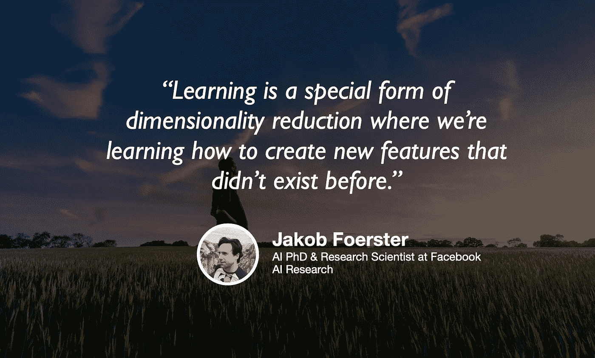

# 多智能体强化学习与人工智能的未来

> 原文：<https://towardsdatascience.com/multi-agent-reinforcement-learning-and-the-future-of-ai-524fc1b5e25?source=collection_archive---------34----------------------->

## [苹果](https://podcasts.apple.com/ca/podcast/towards-data-science/id1470952338?mt=2) | [谷歌](https://www.google.com/podcasts?feed=aHR0cHM6Ly9hbmNob3IuZm0vcy8zNmI0ODQ0L3BvZGNhc3QvcnNz) | [SPOTIFY](https://open.spotify.com/show/63diy2DtpHzQfeNVxAPZgU) | [其他](https://anchor.fm/towardsdatascience)

## 雅各布·福斯特在 [TDS 播客](https://towardsdatascience.com/podcast/home)

本杰明·戴维斯[的背景图片](https://unsplash.com/photos/JrZ1yE1PjQ0)

*编者按:迈向数据科学播客的“攀登数据科学阶梯”系列由 Jeremie Harris 主持。Jeremie 帮助运营一家名为*[*sharpes minds*](http://sharpestminds.com)*的数据科学导师初创公司。可以听下面的播客:*

强化学习最近受到了很多关注，这在很大程度上要归功于 AlphaGo 和 AlphaZero 等系统，这些系统以引人注目的方式凸显了它的巨大潜力。虽然我们开发的 RL 系统已经完成了一些令人印象深刻的壮举，但它们是以一种相当幼稚的方式完成的。具体来说，他们还没有倾向于面对多主体问题，这需要合作和竞争。但是，即使解决了多智能体问题，它们也是使用智能体来解决的，这些智能体只是假设其他智能体是环境中不可控制的一部分，而不是具有丰富内部结构的实体，可以进行推理和交流。

这一切终于改变了，多智能体 RL 领域的新研究，部分由 OpenAI、牛津大学和谷歌校友以及现任公平研究科学家 Jakob Foerster 领导。Jakob 的研究特别旨在了解强化学习代理如何学习更好地合作，并在包括其他代理的复杂环境中导航，他们试图模拟其他代理的行为。实质上，Jakob 正致力于给 RL 代理一个思维理论。

我们的谈话涵盖了一些基础和哲学话题，但这里有一些我最喜欢的话题:

*   当我问 Jakob 他对“学习”的基本定义是什么时，他回答说是样本复杂性——训练一个机器学习模型所需的样本数量。他认为，学习的真正目标是“学会如何学习”——找到最快降低样本复杂性的算法和策略。从这个意义上来说，进化出人类的进化过程是一个比人类用来理解世界和进行预测的认知过程更糟糕的“学习者”:尽管一个物种的基因组需要数百万人的死亡才能“学习”一些东西，但人脑只需要极少量的数据点(有时甚至一点也不需要)就能做到。
*   Jakob 认为，RL 代理可以从明确识别其他代理中受益，这些代理不是他们无法控制的环境的一部分，而是代理——完全具有自己的思维过程。在所有代理都相同的情况下，任何给定的代理都可以构建其伙伴代理的相当准确的模型，该模型可以作为代理组之间有效协作和协调的基础。
*   当以这种方式建模代理时，出现的一个挑战是通信。为了让代理进行交流，他们必须开发一种共同的语言，但这并不像看起来那么容易:一个代理可能会开发一种表达自己的方法，但如果另一个代理碰巧没有开发出完全相同的方法，那么交流将是徒劳的。因此，Jakob 认为，一个重要的制约因素是代理人需要一起学习语言——这样，如果他们决定尝试改善他们的沟通方法，他们就可以一起保持他们相互理解的能力。
*   当我问雅各布，他是否认为我们已经拥有的概念工具——如深度学习和强化学习——足以建立一个完全通用的人工智能时，他说不。事实上，他是我遇到的最悲观的客人之一:在他看来，这种发展可能需要一个世纪。

你也可以在这里的推特上关注[雅各布，在这里](https://twitter.com/j_foerst)关注我[。](https://twitter.com/jeremiecharris)