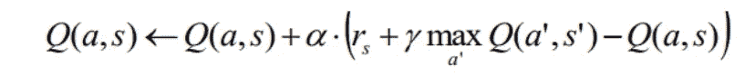

# 纳什均衡介绍:朋友还是敌人 Q 学习

> 原文：<https://towardsdatascience.com/multi-agent-rl-nash-equilibria-and-friend-or-foe-q-learning-4a0b9aae3a1e?source=collection_archive---------28----------------------->

## 让机器人打破平衡

在 [Unsplash](https://unsplash.com?utm_source=medium&utm_medium=referral) 上由 [Toa Heftiba](https://unsplash.com/@heftiba?utm_source=medium&utm_medium=referral) 拍摄的照片

不管出于什么原因，人类天生拥有合作的能力。它变得如此平常，以至于它的细微差别就在我们眼皮底下溜走了。我们如何*知道*在移动一个沉重的沙发时如何协调？我们如何*推理*在杂货店分头行动以尽量减少时间？我们如何能够*观察*他人的行动并且*理解*如何最好地*回应*？

这里有一个解释:我们达到了平衡。一个**均衡。每个人采取的行动不仅能最好地补充他人的行动，而且能最有效地完成手头的任务。这种均衡的应用在博弈论中经常出现，并扩展到多代理 RL (MARL)。在本文中，我们探索了两种算法，Nash Q-Learning 和 Friend or Foe Q-Learning，这两种算法都试图找到满足这种“平衡”思想的多主体策略。我们假设单代理公式和 Q 学习的基本知识。要了解更多关于 MARL 的背景知识和与之相关的基本原则，请查看我以前的文章:**

 [## 多主体强化学习:要点

### 好像一个机器人学习一切还不够

medium.com](https://medium.com/swlh/the-gist-multi-agent-reinforcement-learning-767b367b395f) 

埃里克·麦克林在 [Unsplash](https://unsplash.com?utm_source=medium&utm_medium=referral) 上拍摄的照片

# 什么使得一个最优的政策…最优？

多主体学习环境通常用随机博弈来表示。每个代理人的目标是找到一个政策，最大化他们自己的预期折扣奖励。总的目标是找到一个**联合**的政策，为**每个代理**聚集最多的报酬。这种联合奖励以价值函数的形式定义如下:

这个目标适用于*竞争*和*协作*两种情况。代理可以找到最好的*反*或*补充*其他策略。我们称这个最优策略为**纳什均衡。**更正式地说，它是一种具有以下属性的策略:

起初，我们似乎是在白费力气。最好的政策聚集了最多的回报，那又怎样？

在所有花哨的希腊字母和符号之下，纳什均衡告诉我们更多。它认为纳什均衡中每个代理人的策略是对其他代理人最优策略的最佳回应。没有代理人会因为任何调整带来的回报减少而改变他们的政策。换句话说，所有的代理都处于静止状态。内陆。在某种意义上被困住了。

[NeONBRAND](https://unsplash.com/@neonbrand?utm_source=medium&utm_medium=referral) 在 [Unsplash](https://unsplash.com?utm_source=medium&utm_medium=referral) 上的照片

举个例子，想象两个小机器人:C3PO 和 Wall-E 进行一场*竞技*游戏，在每一轮中，他们各自选择一个一到十的数字，谁选择的数字高谁就赢。不出所料，两个机器人每次都选择数字 10，因为两个机器人都不想冒输的风险。如果 C3PO 选择任何其他数字，他可能会输给 Wall-E 的最优策略，即总是选择 10，反之亦然。换句话说，两者处于均衡状态。

# 纳什 Q 学习

因此，我们定义了一个术语叫做**纳什 Q 值:**

与它的单代理对应物非常相似，纳什 Q 值表示当选择特定的联合行动后，*所有代理遵循联合纳什均衡政策*时，代理的预期未来累积报酬。这可以被视为一个国家行动对的“最佳情况”的奖励收益。这个定义有助于 Q 学习的多代理版本:Nash Q 学习。

乔恩·弗洛布兰特在 [Unsplash](https://unsplash.com?utm_source=medium&utm_medium=referral) 上的照片

在单代理 Q 学习中，我们使用时间差(TD)更新 Q 值，公式如下:

其中，gamma 表示折扣系数，alpha 表示学习率。下面是有点无聊的部分:Nash Q-learning 简化为 Q-learning。更明确地说，纳什 Q 学习的更新方程是:

我们通过在行动空间内最大化来计算纳什 Q 值。交换几个术语，你会得到一个几乎相同的更新方程，唯一的区别是一个联合行动空间。那么，这一切的目的是什么？

照片由 [Riho Kroll](https://unsplash.com/@rihok?utm_source=medium&utm_medium=referral) 在 [Unsplash](https://unsplash.com?utm_source=medium&utm_medium=referral) 上拍摄

要点是:我们不能总是假设单代理逻辑适用于多代理设置。换句话说，适用于 MDPs(单代理 RL)的算法并不总是适用于随机博弈(多代理 RL)。纳什 Q-Learning 恰好是一个有点特殊的案例。胡和 Wellman [1]在论文中证明了纳什 Q 学习总是收敛的。它的更新方程看起来与 Q-learning 相同的事实是直观的，但并不总是可以预先假定的。

整个纳什 Q 学习算法类似于单代理 Q 学习，如下所示:

# 朋友或敌人 Q-学习

q 值有一个自然的解释。他们代表了一个国家行动对的预期累积贴现回报，但这如何激励我们的更新方程？我们再来看一下。

这是一个加权和，其中 alpha 是学习率，是区间(0，1)中的一个值。第一项是前一时间步的 Q 值乘以某个分数。让我们剖析一下第二项，我们的学习率乘以其他两项之和。

第二项的第一部分是我们在执行一个行动后得到的奖励，而另一部分是下一个状态行动的贴现纳什 Q 值最大化。记住，这个纳什 Q 值等于给定状态*后的预期、最佳情况、累积回报。*把这两部分放在一起，我们有一个**预期回报总和**，其中我们假设在下一个状态**的*最佳情况*。**这是对当前 Q 值的另一种定义，只是一个更新的版本！更正式地说，这个总和代表实际 Q 值的更接近的估计值。缩小并查看整个更新方程，我们可以将其解释为“推动”当前 Q 值更接近这个更好的估计值。

由[哈德逊·辛慈](https://unsplash.com/@hudsonhintze?utm_source=medium&utm_medium=referral)在 [Unsplash](https://unsplash.com?utm_source=medium&utm_medium=referral) 拍摄的照片

在《非友即敌 Q-Learning 》( FFQ)中，Littman [2]使用这种解释为多智能体系统创建了一种直观的算法。与纳什 Q 学习相反，FFQ 首先让每个代理保持他们自己的 Q 函数。我们假设代理知道其他人的行动空间，但不知道其他人在任何给定时刻会选择什么行动。

此外，Littman 将系统概括为合作者和对手的组合，因此命名为朋友或敌人。我们再以 C3PO(特工 1)和 Wall-E(特工 2)为例，站在 C3PO 的角度看待事情。如果两者一起工作，C3PO 的 Nash-Q 值将替换为:

正如预期的那样，两个代理都试图最大化他们的“奖励流”,类似于之前的 Q 更新功能。然而，如果两个机器人相互竞争，C3PO 的 Nash-Q 将被替换为:

请注意，在最大化 C3PO 的动作之前，我们如何首先最小化 over Wall-E 的动作。换句话说，当 Wall-E 试图最小化 C3PO 的回报流时，C3PO 学习如何对 Wall-E 的反作用作出最佳反应，相应地更新他的 Q 值。这是一个纳什均衡显示其色彩的例子:代理人学习最佳的方式来互补。

由[帕万·特里库塔姆](https://unsplash.com/@ptrikutam?utm_source=medium&utm_medium=referral)在 [Unsplash](https://unsplash.com?utm_source=medium&utm_medium=referral) 上拍摄的照片

更一般地，这可以适用于更大的代理系统。纳什-Q 值变成如下:

其中 X 代表所有合作者的集合，而 Y 代表所有对手的集合。与 Nash Q-learning 类似，Littman[2]表明朋友或敌人 Q-learning 也会收敛。通过适当替换这些纳什 Q 值，一个*分布式*代理系统可以学习一个达到均衡的策略，如果存在的话。

# 第一步

一些人认为这些算法是进入多智能体学习场景的“第一步”。虽然这些想法相对简单，但结果却是强有力的。下一次，我们将研究更新颖的现代方法来解决复杂的多代理环境！要更深入地了解纳什 Q 学习和朋友或敌人 Q 学习，请随意看看下面列出的两篇论文。

## 参考

[1]胡军，M. Wellman，[一般和随机博弈的 Nash Q-学习](http://www.jmlr.org/papers/volume4/hu03a/hu03a.pdf) (2003)，机器学习研究杂志 4

[2] M. Littman，[普通和博弈中的敌友 Q 学习](http://citeseerx.ist.psu.edu/viewdoc/download?doi=10.1.1.589.8571&rep=rep1&type=pdf) (2001)，ICML

> 从经典到最新，这里有讨论多代理和单代理强化学习的相关文章:

 [## 解开 Stigmergic 独立强化学习及其重要性

### 因为 1+1=3

towardsdatascience.com](/stigmergic-reinforcement-learning-why-it-tells-us-1-1-3-4d50dfa9cb19)  [## 分层强化学习:封建网络

### 让电脑看到更大的画面

towardsdatascience.com](/hierarchical-reinforcement-learning-feudal-networks-44e2657526d7)