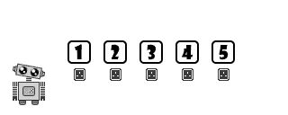
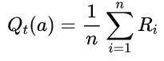
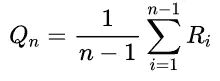
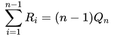
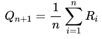
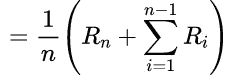
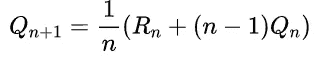

# 多种武器的强盗:第一部分

> 原文：<https://towardsdatascience.com/multi-armed-bandits-part-1-b8d33ab80697?source=collection_archive---------9----------------------->

## [入门](https://towardsdatascience.com/tagged/getting-started)，[一个婴儿机器人的强化学习指南](https://towardsdatascience.com/tagged/baby-robot-guide)

## 数学框架和术语

照片由[费伦茨·阿尔马西](https://unsplash.com/@flowforfrank?utm_source=medium&utm_medium=referral)在 [Unsplash](https://unsplash.com?utm_source=medium&utm_medium=referral) 拍摄

# **概述**

> 当面对各种选项的选择时，每个选项给你不同程度的回报，你如何找到哪个是最好的？
> 
> 这类问题通常被称为**多臂强盗**。在这一系列文章中，我们将看看用于解决这一难题的理论和算法。
> 
> **多臂土匪**问题是全面强化学习道路上的第一步。

这是一个六集系列的第一集，讲述了多种武装的强盗。要涵盖的内容相当多，因此需要将所有内容分成六个部分。即便如此，我们真的只打算看看多臂强盗的主要算法和理论。刚好够充当强化学习的垫脚石。

在第 1 部分中，我们将涵盖 Bandit 问题的所有细节，定义将在后续部分中使用的术语和基本方程。这大部分也直接适用于一般的强化学习。然而，如果你已经熟悉了基础知识，那么你可能会想要跳到真正涉及到 Bandit 算法的部分。

# 索引

本系列中关于多武装匪徒的全套文章如下:

*   [**第一部分:数学框架和术语**](/multi-armed-bandits-part-1-b8d33ab80697)——入门所需的全部基础信息
*   [**第二部分:土匪框架**](/multi-armed-bandits-part-2-5834cb7aba4b)
    *-* 代码和测试框架的描述
*   [**第三部分:土匪算法**](/bandit-algorithms-34fd7890cb18)
    *-* [*贪婪算法*](/bandit-algorithms-34fd7890cb18) *-*[*乐观-贪婪算法*](/bandit-algorithms-34fd7890cb18) *-*[*ε-贪婪算法*](/bandit-algorithms-34fd7890cb18) *-*[*后悔*](/bandit-algorithms-34fd7890cb18)
*   [**第四部分:置信上限(UCB) Bandit 算法**](/the-upper-confidence-bound-ucb-bandit-algorithm-c05c2bf4c13f)
*   [**第五部分:汤普森采样**](/thompson-sampling-fc28817eacb8)*-*[*伯努利汤普森采样*](/thompson-sampling-fc28817eacb8)
    *-*[*高斯汤普森采样*](/thompson-sampling-fc28817eacb8)
*   [**第六部分:土匪算法比较**](/a-comparison-of-bandit-algorithms-24b4adfcabb)

bandit 算法和测试框架的所有代码都可以在 github 上找到: [Multi_Armed_Bandits](https://github.com/WhatIThinkAbout/BabyRobot/tree/master/Multi_Armed_Bandits)

从前有一个婴儿机器人。一天，他和妈妈出去购物，一只机器狗跑了过去。机器人宝宝的妈妈正忙着买新的火花塞，所以没注意到他什么时候转身开始跟着狗。

他追着狗穿过拥挤的购物中心，穿过几条过道，下了自动扶梯，上了自动扶梯，最后，狗躲进了墙上的服务舱口，不见了。不仅服务舱太小，机器人宝宝进不去，而且他还意识到自己迷路了。完全迷失了。

# 电源插座问题

更糟糕的是，机器人宝宝意识到自己快没电了。如果他想再找到他的妈妈，他需要充电。而且要快。

幸运的是，正对面有一个充电站。他走过去，发现房间里有 5 个独立的电源插座。

他走到第一个电源插座前，插上电源。令人失望的是，他只收到了一股能让他运行 2 秒钟的能量。按照这种速度，他将永远无法完全充电。也许其他电源点会更好？

考虑到这一点，他移动到下一个插座，在那里他获得了 3 秒钟的充电时间。这个插座似乎并不比第一个好多少，所以他转而尝试第三个插座。这一次他获得了 6 秒的价值。这似乎是给他充电最多的电源插座，尽管完全充电仍需要很长时间，但似乎比他试过的其他插座要好。所以，决定留在这个电源点，他再次插入。这一次，他收到了少得可怜的 2 秒钟的费用。

他必须找到一种更好的方法来发现哪个是最好的，并让他以最快的速度达到最大电量，而不是沿着插座随意移动。

> **多兵种土匪问题**
> 
> 这个电源插座问题类似于标准的、多臂的、土匪问题，用来说明如何孤立地检查探索。
> 
> 在多臂强盗游戏中，你试图通过玩一组单臂强盗(也称为吃角子老虎机或水果机)赢得尽可能多的钱，每个强盗都可以给出不同的支付。你需要找到哪台机器支付的金额最大，这样你就可以在分配的时间内赚尽可能多的钱。
> 
> 机器的每一次游戏(或强盗手臂的拉动)对应一个时间段，你只能玩固定数量的时间段。

## 探索与开发的困境

婴儿机器人面临着不知道哪个电源插座给他充电最多的问题。因此他需要 ***探索*** 可能的选择，以寻找最好的一个。

然而，因为他时间紧迫，他不能花太多时间来决定哪一个是最好的，也不能测试每个电源插座来准确知道它平均会给多少电荷。他需要 ***利用*** 他获得的知识，这样他就不会浪费时间去尝试不好的电源插座，让他在最短的时间内获得最大的电量。

这是一个经典的探索-开发困境的例子，在这种情况下，你想探索可能的选项以寻找最佳选项，同时又想利用已经获得的信息，以便获得最大可能的总体回报。

# 数学框架和术语

为了帮助机器人宝宝充电，并让他回来找妈妈，我们首先需要熟悉一些强化学习中使用的常用术语和数学符号。

使用的符号很大程度上遵循萨顿和巴尔托的，来自他们的强化学习圣经，“ [*强化学习:介绍*](https://amzn.to/2RIZ9pc) ”。

***动作***

在强化学习中，在可用选项之间做出选择，并选择该选项，被称为采取 ***动作*** 。例如，在电源插座问题中，一个操作是选择一个可用的电源插座。在多臂强盗问题中，它是选择和玩一套吃角子老虎机。

在简单的电源插座和 bandit 问题中，在离散的时间步骤中采取行动。换句话说，一个动作接一个动作，在这些问题中，有固定数量的总动作。

*   在时间步' *t* '采取的行动表示为' *Aₜ*

***奖励***

每采取一个动作就获得一个 ***奖励*** 。在电源插座问题中，奖励是一定数量的电荷；然而，在强盗问题中，它是从机器中赢得的一笔钱。

采取特定行动所获得的奖励是一个随机值，从特定于该行动的潜在概率分布中提取。因此，每次采取行动时，返回的奖励可能会有不同的值。如果同一个动作重复多次，那么就可以计算出一个更准确的真实回报平均值。

采取特定行动获得奖励可能是强化学习的主要定义特征。正是这种奖励被用来指导学习，试图找到最好的行动，从而最大限度地提高总的整体奖励。这与监督学习形成对比，在监督学习中，最佳动作将作为训练数据的一部分提供。

*   在采取行动' *Aₜ* '之后，在时间步' *t* '获得的奖励表示为' *Rₜ*

***动作次数***

可用动作的数量由字母' *k* 表示。因此，在电源插座示例中，' *k* '将是可供选择的电源插座数量。因为，在这种情况下，有 5 个不同的套接字，' *k* '将是 5。在多臂土匪问题中，它是可供选择的吃角子老虎机的总数(实际上这个问题经常被称为' *k 臂土匪问题'*)。

*   可用动作的数量由字母' *k* 表示

***预期奖励***

每个可用的' *k* '动作都有一个 ***预期*** 奖励，其中术语“预期”是指如果该动作重复多次将获得的平均值。因此，例如，如果投掷一枚公平的硬币，获得正面的预期概率将是 0.5，因为平均而言，当投掷总数很大时，正面应该出现在所有硬币投掷的一半中。

*   财产的预期价值用符号'𝔼'表示

***值***

一个行动的期望回报被称为该行动的 ***值*** ，并被表示为“ *q(a)* ”，其中“ *a* ”是在时间步长“ *t* ”选择的具体行动(即 *Aₜ = a)。*

*   因此，动作' *a* '的值由下式给出:

这可以理解为:*假设在时间步长‘t’选择的行动是行动‘a’，行动‘a’的值等于预期(平均)奖励值。*

(注意:任何时候你在概率方程中看到符号“|”，就把它理解为‘给定’)。

实际上，这意味着，如果你不断重复动作' *a* '，然后对你得到的奖励值进行平均，最终，你会知道'*q(a)【T29]'的真实值，即' *a* '的平均奖励。因此，如果小机器人继续尝试同一个电源插座，他将获得该插座真实平均功率输出的越来越准确的估计，直到最终，如果他重复该动作足够长的时间，他将知道该插座输出的真实值。*

## 样本平均估计值

显然，我们不知道行为回报的真正价值。如果我们这样做了，事情就简单了。我们只是利用现有的知识，而不必做任何探索。我们只要玩最好的吃角子老虎机，赢得最多的钱，机器人宝宝就会插上充电最多的插座。

然而，事实并非如此。我们不知道真正的回报，因此必须做一些探索，从每一个可能的行动中找到回报的比较。因此，为了跟踪哪一个动作是最好的，当我们探索一组可能的动作时，我们需要估计每个动作的价值。随着时间的推移，这种估计应该会越来越准确，并向真正的回报值靠拢。

因为一个行为的真实价值是该行为的平均回报，一个简单而有效的估计可以通过取该行为迄今为止回报的平均值来计算。

因此，在时间步长*‘t’*处，动作 *a* 的估计值 *Qₜ(a)'* 由下式给出:

其中' *n'* 是在时间' *t* '之前采取行动' *a* 的次数，而' *Rᵢ* '是采取行动' *a* 时在每个时间步获得的奖励。

## 计算样本平均值

对任何行为来说，形成所有奖励总和的最简单的方法是存储每个奖励，然后在需要时添加它们。然而，从实际的角度来看，这不是很有效，无论是在存储和计算时间方面。有可能记录总的回报，但随着时间的推移，即使是这个值也会变得难以管理。

*   一个更好的解决方案是根据上一次的估计来计算新的估计奖励。

对于一个行动' *a* '，行动价值的 *n* ᵗʰ估计值' *Qₙ* '，由该行动以前获得的所有奖励的总和除以该行动被选择的次数(即，它只是平均值)得出:

因此，交换一下东西，在' *n* '之前，奖励的总和由下式给出:

当获得下一个奖励“rₙ”*时，可以通过将该奖励加到先前的奖励总和上并增加已经采取的行动的次数的计数来计算新的估计值。所以新的估计是:*

****

*由于我们已经知道如何写奖励的总和，在' *n* '之前，就最后的估计而言，我们可以简单地将它代入等式:*

**

*重新整理后，我们最终得到了新评估的可用形式，用上次评估' *Qₙ* 和新奖励' *Rₙ* '来表示:*

**

*公式 1:新的估计值，根据上次的估计值和新的奖励值计算得出。*

*虽然对某些人来说，这些等式可能有点令人生畏，但它们基本上可以归结为公式 1 中给出的最后一个等式，它让我们在给定行为的先前值和新奖励的情况下，计算行为的值。*

*这个公式很容易在代码中实现(我们将在下一部分中实现)，让我们监视在采取这些动作时，动作的估计值是如何变化的。然后，这些值可用于比较这些操作的相对性能，以找到最佳操作和选择这些操作的最佳方式。*

# *摘要*

*在这里，我们对多武器匪徒调查的第一部分，我们已经定义了描述匪徒问题所需的所有基本术语和方程。*

*然而，到目前为止，我们只给出了土匪问题的一个高层次的概述，没有真正进入问题本身。我们将在接下来的部分中纠正这一点，届时我们将全面检查一些可用于解决这一问题的主要策略。*

*更重要的是，我们将使用这些策略让机器人宝宝充电，然后回到妈妈身边！*

## *接下来:[第二部分:强盗框架](/multi-armed-bandits-part-2-5834cb7aba4b)*

# *参考*

*[1]《[*强化学习:导论*](http://www.incompleteideas.net/book/RLbook2020.pdf) 》，萨顿&巴尔托(2018)*