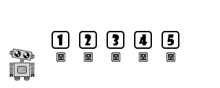
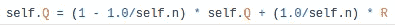
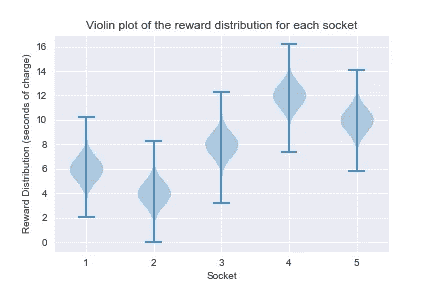
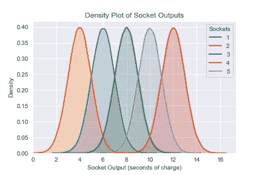

# 强盗框架

> 原文：<https://towardsdatascience.com/multi-armed-bandits-part-2-5834cb7aba4b?source=collection_archive---------9----------------------->

## [婴儿机器人强化学习指南](https://towardsdatascience.com/tagged/baby-robot-guide)

## 多种武器的强盗:第二部分


由[乔纳森·博尔巴](https://unsplash.com/@jonathanborba?utm_source=medium&utm_medium=referral)在 [Unsplash](https://unsplash.com?utm_source=medium&utm_medium=referral) 上拍摄的照片


# 概观

> 机器人宝宝在商场走失。利用强化学习，我们想帮助他找到回到妈妈身边的路。然而，在他开始寻找她之前，他需要从一组电源插座充电，每个插座的电量略有不同。
> 
> 使用多臂强盗问题中的策略，我们需要在最短的时间内找到最好的插座，让机器人宝宝充电上路。

这是第二个，在一个六部分系列，对多武装匪徒。在第 1 部分中，我们涵盖了描述 bandit 问题所需的所有基本术语和数学知识。

在这一部分中，我们将看看我们将在接下来的文章中解决的问题，确切地描述电源插座问题将如何设置。这涵盖了用于创建基本套接字模拟器和用于评估这些套接字的测试框架的所有代码。

因此，尽管我们还不能实现真正的强盗算法，但我们会做好所有必要的基础工作，这样我们就可以在随后的部分开始研究各种强盗策略。

bandit 算法和测试框架的所有代码都可以在 github 上找到: [Multi_Armed_Bandits](https://github.com/WhatIThinkAbout/BabyRobot/tree/master/Multi_Armed_Bandits)

# 概述



> 机器人宝宝进入了一个充电室，里面有 5 个不同的电源插座。每个插座返回的电荷数量略有不同。我们希望在最短的时间内给机器人宝宝充电，所以我们需要找到最好的插座，然后使用它，直到充电完成。
> 
> 这和多臂强盗问题是一样的，除了我们不是在找一个能给出最好回报的吃角子老虎机，而是在找一个能给出最多电量的电源插座。


# 测试选择策略

现在我们已经有了所有需要的符号和术语，我们可以构建一个测试系统了。这将让我们检查不同的策略在寻找和利用最佳电源插座时的表现。

## 实现电源插座

我们将测试几种不同的策略来寻找最佳电源插座，作为其中的一部分，我们需要创建几种不同类型的插座。但是，所有套接字都具有相同的基本功能，并且需要能够执行以下操作:

*   **供给一些电荷。**其中返回的费用金额取决于插座的真实奖励值。
*   **更新对插座的奖励值的估计。**主要通过计算样本平均值来完成，如第 1 部分所述。每个套接字都会记录自己的估计值和尝试的次数。它还将存储其真实的奖励值，但这只是为了实现的目的。因为这是我们试图估计的值，在套接字初始化之后，我们将假装我们实际上不知道这个值。
*   **返回公制。**这个用来评估和选择插座。默认情况下，这只是套接字奖励值的当前估计值。

下面显示了一个基本电源插座的 python 实现。它充当基类，所有其他更专业的套接字都将从这个基类派生出来。

基本电源插座跟踪以下值，这些值与我们目前看到的等式相匹配:

*   *q* =插座输出的真实平均值
*   *Q* =套接字输出的运行估计(即其回报)
*   *n* =套接字被尝试的次数

*Q* 和 *n* 在单独的 *initialize* 函数中被初始化，以允许套接字被重置，而不必创建一个全新的套接字。

当估计套接字输出时，真正的输出' *q* '是我们试图收敛的值。虽然设置套接字需要' *q* '，但是它的值没有在其他地方使用，因为这是我们试图寻找的值。

函数' *charge* '返回插座的输出奖励。这由正态(高斯)分布给出，平均值为' *q* '(设置期间提供的值)。

' *update* '函数使用新的奖励值和先前的估计值计算样本平均估计值，如第 1 部分的公式 1 所述。在代码中，这直接翻译为:



最后' *sample* '函数返回将用于选择下一个套接字的度量。在这种情况下，它只是值“Q”，当前奖励的估计值。

## 实施充电室

我们想要设置一个有 5 个插座的房间，每个插座都会返回一个平均持续时间不同于其他插座的能量脉冲。

为了简单起见，我们将对每个插座的功率输出使用固定的顺序。因此，在下面的代码中，' *socket_order* '参数定义了 socket 2 将是最差的，socket 4 将是最好的，这将在我们的整个实验中保持不变。

每个插座返回的平均电荷量的计算方法是，将其插座顺序值乘以 2，然后加上 2 以抵消该值并使其大于零。因此，按顺序，插座有以下平均奖励:6，4，8，12，10。

按照这种方式设置套接字，我们可以从每个套接字获得以下输出:



在上面的“小提琴”图中，每个套接字的线条显示了作为每个套接字的奖励而返回的值的范围。因此，1 号插座返回了大约 2 到 10 秒的充电时间。线下的阴影区域代表了每个奖励被返还的频率。对于插座 1，最常返回的奖励是 6 秒钟的充电。这是这个插座的平均奖励，也是它的真实奖励值。



在密度图中，我们可以看到每个插座的奖励概率是如何变化的。4 号插座最好，平均充电时间为 12 秒，而 2 号插座最差，充电时间仅为 4 秒。Socket 4 是我们试图寻找和利用的最佳插座。

## 插座测试仪

我们还需要一种方法，在每个时间步从一组套接字中进行采样和选择。这由 *SocketTester* 类处理，如下所示:

如前所述， *SocketTester* 类创建一组电源插座，按照提供的插座顺序。运行时，套接字测试器循环指定数量的时间步长，并在每个时间步长执行以下操作:

*   ***选择一个套接字:***
    为每个套接字调用' *sample* '函数，然后选择返回值最大的套接字。如前所述，默认情况下，返回的样本值将只是套接字对其平均回报的当前估计。
    当有多个具有最高样本值的套接字时，‘*random _ arg max*’函数(如下所示)任意选择一个具有最大值的套接字。这优先于 Numpy 的 *argmax* 函数使用，该函数在出现平局时简单地选择第一个项目。

*   ***收费和更新:*** 一旦选择了一个插座，我们就从那个插座收费以获得奖励。然后我们更新这个套接字，增加它被尝试的次数，并使用新的奖励值改进它的奖励估计值。

注意，上面显示的' *SocketTester'* '类的代码是实际类的简化版本，只显示了主要功能。在完整版的类中，套接字的属性在运行过程中被跟踪。此外，该类只执行一次运行。因为我们处理的是随机变量，所以一次运行可能不足以确定套接字选择策略的真实行为。因此，第二个类“ *SocketExperiment* ”用于设置和运行重复的套接字测试，并生成这些测试的平均结果。这两个类的完整代码可以在 [Github 库](https://github.com/WhatIThinkAbout/BabyRobot/tree/master/Multi_Armed_Bandits)的文件 [PowerSocketSystem.py](https://github.com/WhatIThinkAbout/BabyRobot/blob/master/Multi_Armed_Bandits/PowerSocketSystem.py) 中找到。


# 摘要

这部分我们看多武装匪徒根本没有真正看他们！然而，它确实涵盖了我们在后续文章中创建和评估多兵种强盗战略所需的所有基本框架。

在以后的文章中，我们将把在第 1 部分中学到的理论与这个测试框架结合起来，开始研究如何应用各种强盗策略来探索和利用电源插座集。

```
**<** [**Part 1: Multi-Armed Bandits**](/multi-armed-bandits-part-1-b8d33ab80697)            [**Part 3: Bandit Algorithms**](/bandit-algorithms-34fd7890cb18) >
```