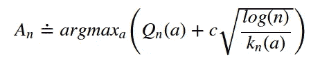
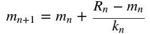
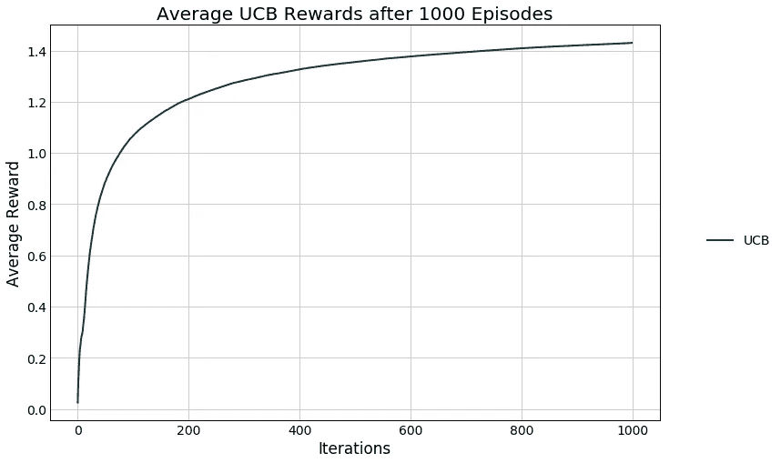
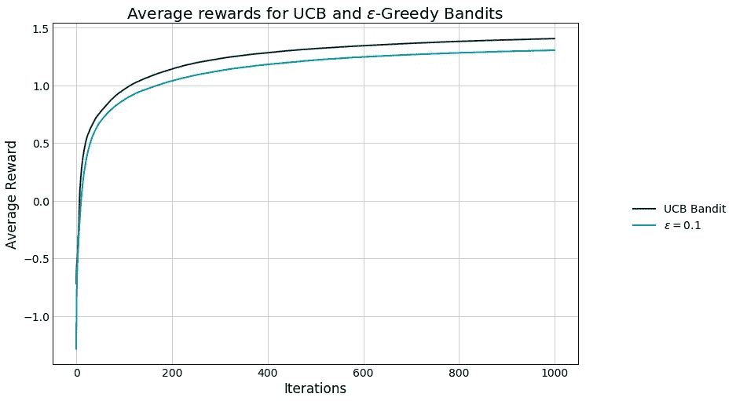
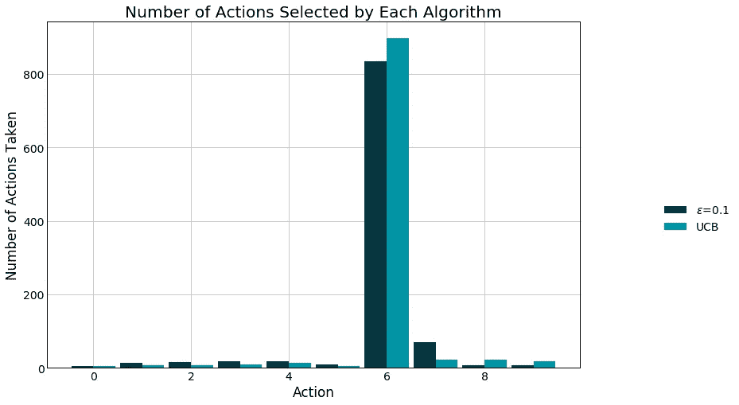
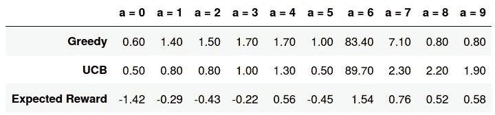

# 多武装匪徒:UCB 算法

> 原文：<https://towardsdatascience.com/multi-armed-bandits-ucb-algorithm-fa7861417d8c?source=collection_archive---------7----------------------->

## 基于置信界限优化动作


乔纳森·克洛克在 [Unsplash](https://unsplash.com?utm_source=medium&utm_medium=referral) 上拍摄的照片

想象一下，你在一个赌场，在一堆(k 个)有不同回报概率的独臂强盗(也叫吃角子老虎机)中进行选择，并且想要选择最好的一个。你使用什么策略来帮助你走出最大数量的季度？

这就是多兵种土匪问题的本质，是一个[简化强化学习](https://www.datahubbs.com/multi_armed_bandits_reinforcement_learning_1/)任务。当你在网站上寻求最大化的参与度，或者搞清楚临床试验，或者试图优化你的电脑性能时，这些都可能发生。

它们不仅仅是一个有用的框架，解决起来也很有趣！

# TL；速度三角形定位法(dead reckoning)

我们用 Python 中的例子来教授置信上限 bandit 算法，以便让您快速熟悉这种方法。

# 你的第一个策略

强盗问题需要在探索和开发之间取得平衡。因为问题始于对奖励的无先验知识，一旦缩小了选择范围，它需要探索(尝试许多吃角子老虎机)然后利用(反复拉动最佳杠杆)。

最简单的强盗采用ϵ-greedy 策略，这意味着它会选择它认为大多数时候最好的老虎机，但有一个小的ϵ%概率，它会选择随机的老虎机。这是一个简单的策略，可以产生良好的结果([如果你想看到这种方法被实施](https://www.datahubbs.com/multi_armed_bandits_reinforcement_learning_1/)，请看这篇文章)，但是我们可以做得更好。

# 置信上限 Bandit

ϵ-greedy 可能会花很长时间来决定选择合适的独臂强盗，因为这是基于小概率的探索。**置信上限** (UCB)方法有所不同，因为我们基于对给定选择的不确定性来做出选择。

我会向你展示数学，然后解释:



上述等式为我们的模型提供了选择标准。Q_n(a)是我们对给定老虎机 *a.* 的当前估计值，平方根下的值是我们尝试过的老虎机总数的对数， *n* 除以我们尝试每台老虎机的次数 *a* ( *k_n* )，而 *c* 只是一个常数。我们通过选择在每一步 *n* 中给出最大值的强盗来选择下一台吃角子老虎机。

平方根项是对每个动作*和*的方差的估计。如果我们还没有选择一个土匪，方差是无限的(我们将除以 0)，这意味着这将是我们的下一个选择。这迫使算法快速探索那些未知值。一旦它选择了它，在其他条件相同的情况下，它的价值就会下降，相对于其他选择来说，可能性变得更小。因为 log(n)在分子中，每次我们不选择一个动作，它的值变得更有可能，尽管分子增长得更慢(即对数)，所以你收集的数据越多，这种影响变得越小。最终结果是一种算法，在锁定最有利可图的机器之前，可以非常快速地采样，以减少未知的不确定性。

## 一些实际的警告

在我们深入实现之前，我们将初始化我们的值，k_n(a) = 1 而不是 0，以确保我们不会在 Python 中弹出任何`nan`值。此外，我们将模拟很多强盗拉，所以我们需要有效率地计算我们的一些值。Q_n(a)只是该动作的平均值，我们可以使用一个方便的公式来计算平均值，而不是为每个动作保留数千个值，只需为每个动作存储两条信息，即我们为该给定动作做出了多少次选择(k_n(a))和我们的当前平均值(m_n)。



其中 R_n 是我们刚刚从采取一项行动中获得的回报(为简洁起见，我省略了 a)。

# UCB 电码

```
# import modules 
import numpy as np 
import matplotlib.pyplot as plt 
import pandas as pdclass ucb_bandit:
    '''
    Upper Confidence Bound Bandit

    Inputs 
    ============================================
    k: number of arms (int)
    c:
    iters: number of steps (int)
    mu: set the average rewards for each of the k-arms.
        Set to "random" for the rewards to be selected from
        a normal distribution with mean = 0\. 
        Set to "sequence" for the means to be ordered from 
        0 to k-1.
        Pass a list or array of length = k for user-defined
        values.
    '''
    def __init__(self, k, c, iters, mu='random'):
        # Number of arms
        self.k = k
        # Exploration parameter
        self.c = c
        # Number of iterations
        self.iters = iters
        # Step count
        self.n = 1
        # Step count for each arm
        self.k_n = np.ones(k)
        # Total mean reward
        self.mean_reward = 0
        self.reward = np.zeros(iters)
        # Mean reward for each arm
        self.k_reward = np.zeros(k)

        if type(mu) == list or type(mu).__module__ == np.__name__:
            # User-defined averages            
            self.mu = np.array(mu)
        elif mu == 'random':
            # Draw means from probability distribution
            self.mu = np.random.normal(0, 1, k)
        elif mu == 'sequence':
            # Increase the mean for each arm by one
            self.mu = np.linspace(0, k-1, k)

    def pull(self):
        # Select action according to UCB Criteria
        a = np.argmax(self.k_reward + self.c * np.sqrt(
                (np.log(self.n)) / self.k_n))

        reward = np.random.normal(self.mu[a], 1)

        # Update counts
        self.n += 1
        self.k_n[a] += 1

        # Update total
        self.mean_reward = self.mean_reward + (
            reward - self.mean_reward) / self.n

        # Update results for a_k
        self.k_reward[a] = self.k_reward[a] + (
            reward - self.k_reward[a]) / self.k_n[a]

    def run(self):
        for i in range(self.iters):
            self.pull()
            self.reward[i] = self.mean_reward

    def reset(self, mu=None):
        # Resets results while keeping settings
        self.n = 1
        self.k_n = np.ones(self.k)
        self.mean_reward = 0
        self.reward = np.zeros(iters)
        self.k_reward = np.zeros(self.k)
        if mu == 'random':
            self.mu = np.random.normal(0, 1, self.k)
```

上面的代码定义了我们的`ucb_bandit`类，使我们能够模拟这个问题。运行它需要三个参数:要拉的臂数(`k`)、探索参数(`c`)和迭代次数(`iters`)。

我们可以通过设置`mu`来定义奖励(默认情况下，奖励均值来自正态分布)。我们对此运行 1000 集，并平均每集 1000 步的回报，以了解该算法的执行情况。

```
k = 10 # number of arms
iters = 1000ucb_rewards = np.zeros(iters)
# Initialize bandits
ucb = ucb_bandit(k, 2, iters)episodes = 1000
# Run experiments
for i in range(episodes): 
    ucb.reset('random')
    # Run experiments
    ucb.run()

    # Update long-term averages
    ucb_rewards = ucb_rewards + (
        ucb.reward - ucb_rewards) / (i + 1)

plt.figure(figsize=(12,8))
plt.plot(ucb_rewards, label="UCB")
plt.legend(bbox_to_anchor=(1.2, 0.5))
plt.xlabel("Iterations")
plt.ylabel("Average Reward")
plt.title("Average UCB Rewards after " 
          + str(episodes) + " Episodes")
plt.show()
```



目前看来还不错！强盗通过稳步增长的平均奖励来学习。为了了解它的工作情况，我们将它与标准的ϵ-greedy 方法进行比较([代码可以在这里找到](/multi-armed-bandits-and-reinforcement-learning-dc9001dcb8da))。

```
k = 10
iters = 1000eps_rewards = np.zeros(iters)
ucb_rewards = np.zeros(iters)# Initialize bandits
ucb = ucb_bandit(k, 2, iters)
eps_greedy = eps_bandit(k, 0.1, iters, ucb.mu.copy())episodes = 1000
# Run experiments
for i in range(episodes):
    ucb.reset()
    eps_greedy.reset()# Run experiments
    ucb.run()
    eps_greedy.run()

    # Update long-term averages
    ucb_rewards += (ucb.reward  - ucb_rewards) / (i + 1)
    eps_rewards += (eps_greedy.reward - eps_rewards) / (i + 1)

plt.figure(figsize=(12,8))
plt.plot(ucb_rewards, label='UCB Bandit')
plt.plot(eps_rewards, label="$\epsilon={}$".format(
    eps_greedy.eps))
plt.legend(bbox_to_anchor=(1.3, 0.5))
plt.xlabel("Iterations")
plt.ylabel("Average Reward")
plt.title("Average rewards for UCB and $\epsilon$-Greedy Bandits")
plt.show()
```



UCB 方法快速找到最佳动作，并在大部分剧集中利用它，而贪婪算法尽管也能相对快速地找到最佳动作，但随机性太大。我们也可以通过观察动作选择和比较每个算法选择的最优动作来观察这一点。

```
width = 0.45
bins = np.linspace(0, k-1, k) - width/2plt.figure(figsize=(12,8))
plt.bar(bins, eps_greedy.k_n,
        width=width, 
        label="$\epsilon$={}".format(eps_greedy.eps))
plt.bar(bins+0.45, ucb.k_n,
        width=width, 
        label="UCB")
plt.legend(bbox_to_anchor=(1.3, 0.5))
plt.title("Number of Actions Selected by Each Algorithm")
plt.xlabel("Action")
plt.ylabel("Number of Actions Taken")
plt.show()opt_per = np.array([eps_greedy.k_n, ucb.k_n]) / iters * 100
df = pd.DataFrame(np.vstack(
    [opt_per.round(1), 
    eps_greedy.mu.reshape(-1, 1).T.round(2)]), 
        index=["Greedy", "UCB", "Expected Reward"],
        columns=["a = " + str(x) for x in range(0, k)])
print("Percentage of actions selected:")
df
```



在这种情况下，我们的最优行动是 a=6，平均回报为 1.54。ϵ-greedy 算法选择它的概率是 83.4%，而 UCB 算法选择它的概率是 89.7%。此外，您将看到贪婪算法选择负值的频率比 UCB 算法高得多，这也是因为每次选择都有 10%的机会选择随机行动。

有几十个[其他多臂土匪方法](https://www.datahubbs.com/multi-armed-bandits-reinforcement-learning-2/)在那里学习。这是一个简单的优化框架，但是功能非常强大，玩起来也很有趣！