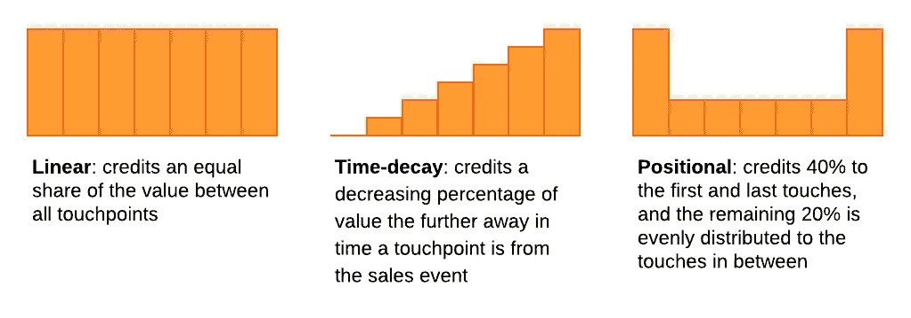
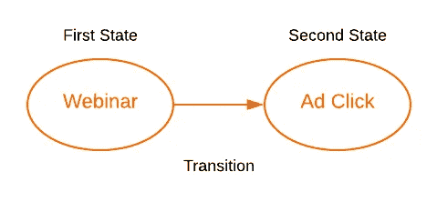
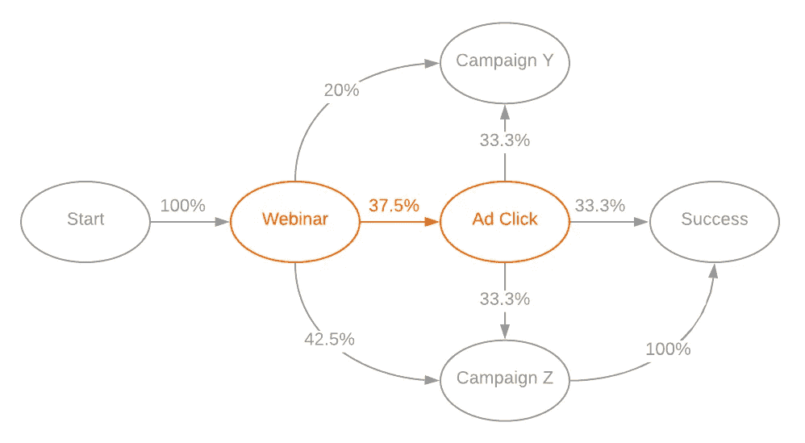
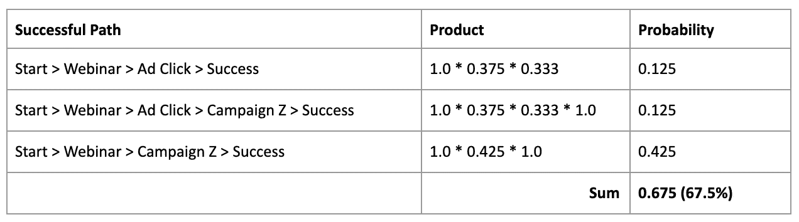
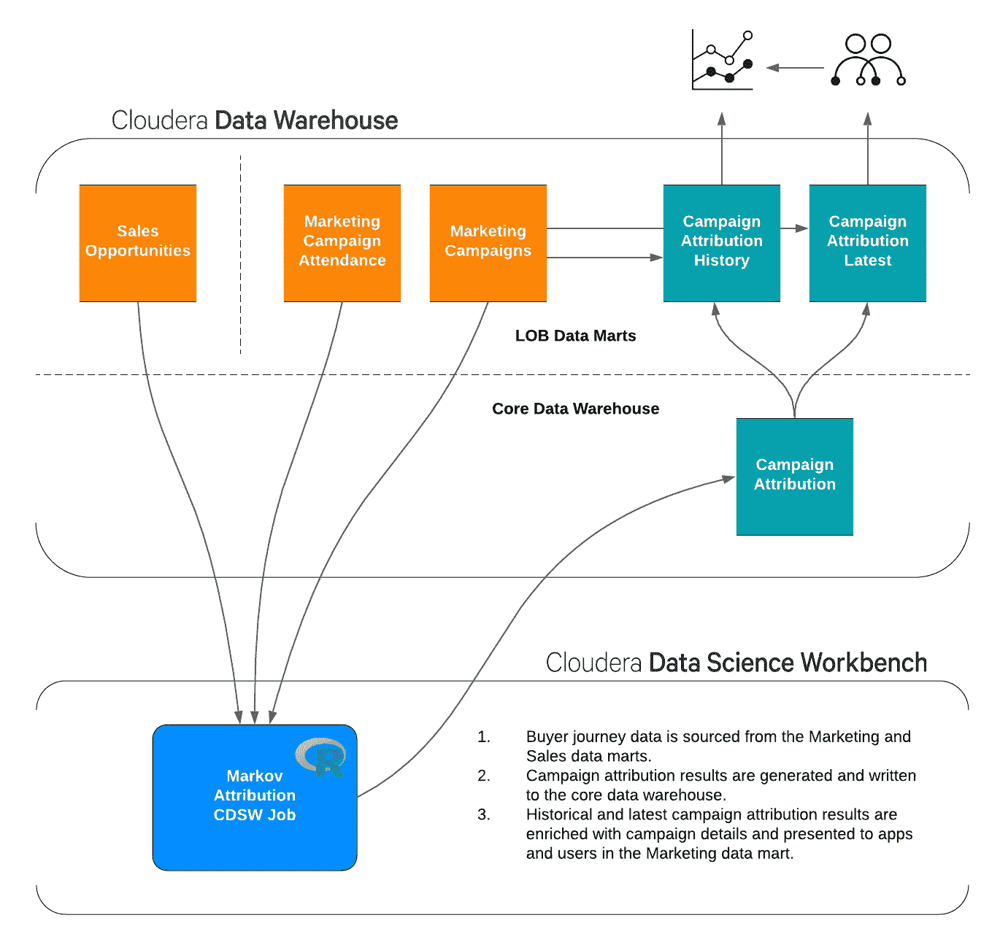

# 马尔可夫营销归因

> 原文：<https://towardsdatascience.com/multi-channel-marketing-attribution-with-markov-6b744c0b119a?source=collection_archive---------11----------------------->

## Cloudera 如何使用马尔可夫模型解决多渠道归因问题

克莱门斯·范·雷趴在[的 Unsplash](https://unsplash.com?utm_source=medium&utm_medium=referral) 上

这篇文章的编辑版本首先发表在 ClickZ: [数据驱动营销归因营销人员指南](https://www.clickz.com/marketers-guide-to-data-driven-marketing-attribution/262343/)。

营销归因是一种衡量活动和渠道对潜在客户的价值的方法。潜在客户与营销活动互动的时间点称为接触点，接触点的集合构成了购买者的旅程。营销人员使用归因模型的结果来了解哪些接触点对成功的购买者旅程影响最大，以便他们能够就如何优化未来营销资源的投资做出更明智的决策。

买家之旅很少是直截了当的，成功之路可能是漫长而曲折的。由于要考虑的接触点太多，很难区分真正的高影响互动和低影响互动，这可能导致不准确的信用划分和营销绩效的虚假表现。这就是为什么为你的企业选择最佳归因模式如此重要。

在这篇文章中，我提供了一些关于 [Cloudera](https://www.cloudera.com/) 如何使用 Cloudera 产品构建一个定制的、数据驱动的归因模型来衡量我们全球营销活动的绩效的见解。

## 传统模型的局限性

所有的归因模型都有其优点和缺点，但传统模型的一个共同缺点是它们是基于规则的。用户必须预先决定如何在接触点之间分配销售活动的积分。传统模型包括:

幸运的是，有更复杂的数据驱动方法，能够通过模拟接触点实际上如何与买家互动，以及如何相互影响预期的销售结果，来捕捉买家旅程的复杂性。数据驱动模型让营销人员能够更深入地了解营销活动和渠道的重要性，从而提高营销责任和效率。

## Cloudera 的数据驱动方法

我们评估的第一个归因模型是基于合作博弈理论的 Shapley 值。我在[之前的一篇文章](/data-driven-marketing-attribution-1a28d2e613a0)中介绍了这个模型的细节。这种流行的(获得诺贝尔奖)模型提供了比传统方法更深入的渠道绩效，但在其最基本的实现中，它不能扩展到处理我们想要包括的接触点数量。Shapley 模型在数量相对较少的渠道上表现良好，但我们的要求是对所有活动进行归因，这相当于买家旅程中的数百个接触点。

在投入时间扩展 Shapley 算法之前，我们研究了替代方法，并决定评估使用马尔可夫模型来解决归因问题。我们使用[channel attribute](http://www.channelattribution.net/)R 包进行实施，发现它产生了与 Shapley 模型类似的结果，它可以扩展到大量接触点，并且易于在 [Cloudera 数据科学工作台(CDSW)](https://www.cloudera.com/products/data-science-and-engineering/data-science-workbench.html) 中设置和使用。

## 马尔可夫归因模型

Markov 是一个概率模型，它将购买者的旅程表示为一个图形，图形的节点是接触点或“状态”，图形的连接边是观察到的这些状态之间的转换。例如，购买者观看产品**网络研讨会**(第一状态)，然后浏览 LinkedIn(过渡)，在那里他们点击同一产品的**广告**印象(第二状态)。

该模型的关键要素是转移概率(在不同状态之间移动的可能性)。购买者在两种状态之间转换的次数被转换成概率，并且完整的图可以用于测量每个状态的重要性和最可能的成功路径。

例如，在买家旅程数据样本中，我们观察到**网上研讨会**接触点出现了 8 次，买家观看网上研讨会后点击 LinkedIn **广告**仅 3 次，因此两种状态之间的转换概率为 3 / 8 = 0.375 (37.5%)。为每个转换计算一个概率以完成该图。

在我们开始计算活动归因之前，马尔可夫图可以告诉我们一些关于我们购买者旅程的有用信息。从上面的例子可以看出，成功概率最高的路径是“**开始>网络研讨会>活动 Z >成功**”，总概率为 42.5% (1.0 * 0.425 * 1.0)。

马尔可夫图也能告诉我们整体的成功率；也就是说，给定所有买家旅程的历史，买家旅程成功的可能性。成功率是整体营销绩效的基线，也是衡量任何变革有效性的指针。上面的例子马尔可夫图有 67.5%的成功率:

## 活动归因

通过计算所谓的**移除效应**，马尔可夫图可以用来衡量每个活动的重要性。一项活动的有效性是通过将其从图表中移除并模拟买家旅程来衡量没有它时成功率的变化来确定的。移除效应是权重的一个代理，它是为马尔可夫图中的每个活动计算的。

利用移除效应进行营销归因是拼图的最后一块。为了计算每个活动的属性值，我们可以使用下面的公式: ***A = V * (Rt / Rv)***

*   ***A*** =战役的属性值
*   ***V*** =要除的总值。例如，用作马尔可夫模型输入的所有成功买家旅程的总美元值
*   ***Rt*** =战役的移除效果
*   ***Rv*** =所有移除效果值之和

让我们看一个例子。假设在财年的第一季度，所有成功买家旅行的总美元价值为**100 万美元**。相同的买家旅程用于构建马尔可夫模型，它计算出我们的广告活动的移除效应为 **0.7** (即，当广告活动从马尔可夫图中移除时，买家旅程成功率下降了 70%)。我们知道输入数据中观察到的每个活动的移除效应值，对于本例，假设它们的总和为 **2.8** 。将这些数字代入公式，我们计算出我们广告活动的归属价值为 **$25 万**:

***【25 万美元= 100 万美元* (0.7 / 2.8)***

除此之外，我们还通过从归因价值中减去同期开展活动的成本来计算活动投资回报率。

关于[channel attribute](http://www.channelattribution.net/)R 包的好处在于，它为您完成了所有这些工作，甚至包括三种传统的基于规则的比较算法的实现(首次触摸、最后触摸和线性触摸)。还有一个新的 Python 实现。

## Cloudera on Cloudera

我们为我们在 Cloudera 的数据实践感到自豪。营销归因应用程序由 Cloudera 的营销和数据卓越中心业务部门开发。它建立在我们内部的[企业数据中心](https://www.cloudera.com/products/enterprise-data-hub.html)和运行在 [Cloudera 数据科学工作台(CDSW)](https://www.cloudera.com/products/data-science-and-engineering/data-science-workbench.html) 中的马尔可夫模型之上。

通过利用数据驱动的归因模型，我们消除了与传统归因机制相关的偏见。我们已经能够了解各种信息如何影响我们的潜在客户，以及地理位置和收入类型的差异。现在我们有了可靠的数据支持归因，我们有信心使用结果来通知和推动我们的营销组合战略和投资决策。当我们与销售团队合作时，我们可以依靠这些数字来推动我们的营销战略向前发展。