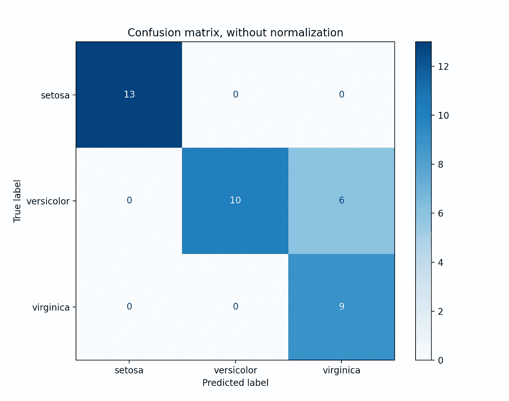
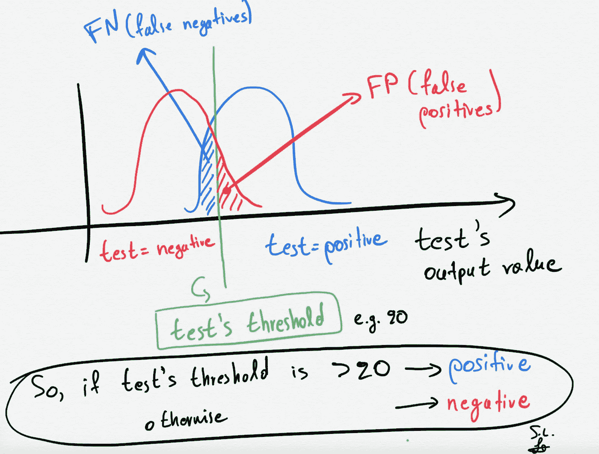
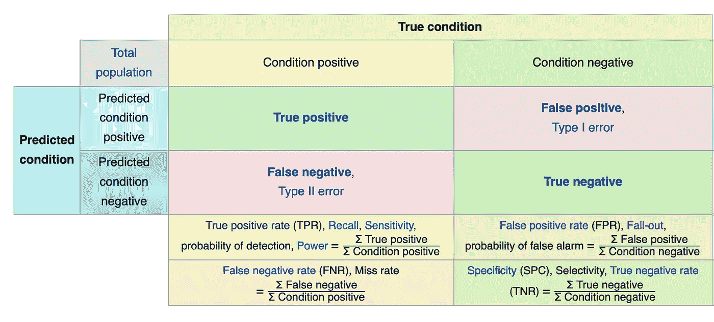
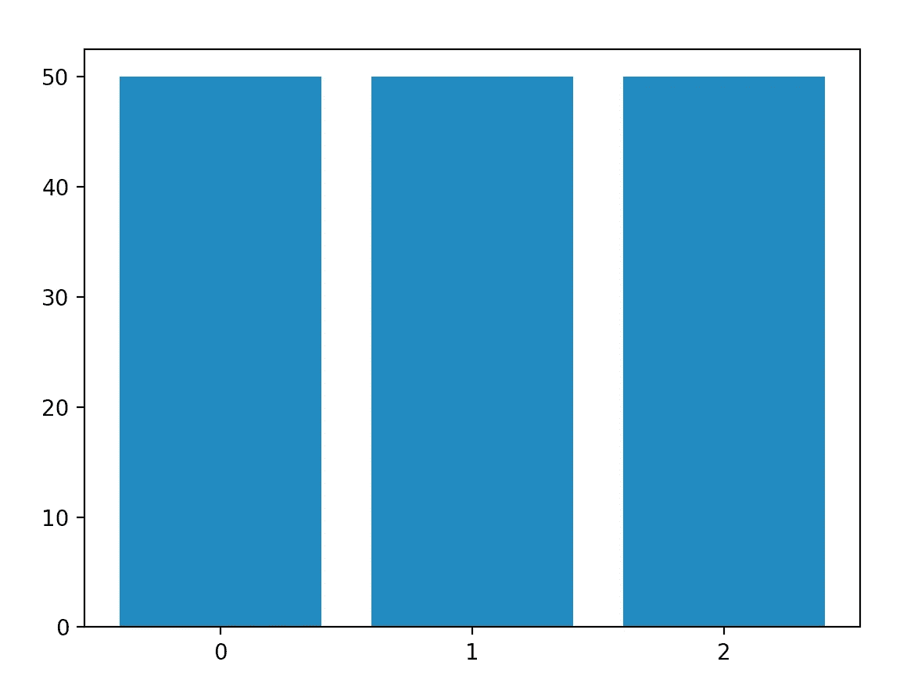
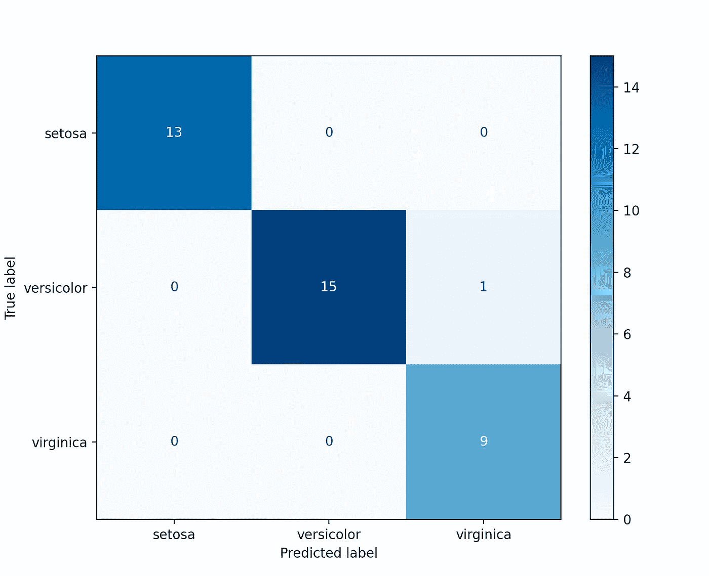
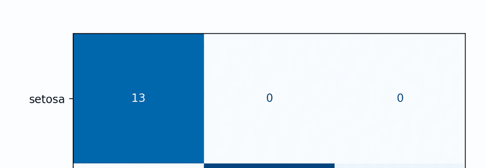
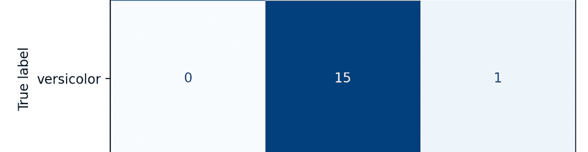
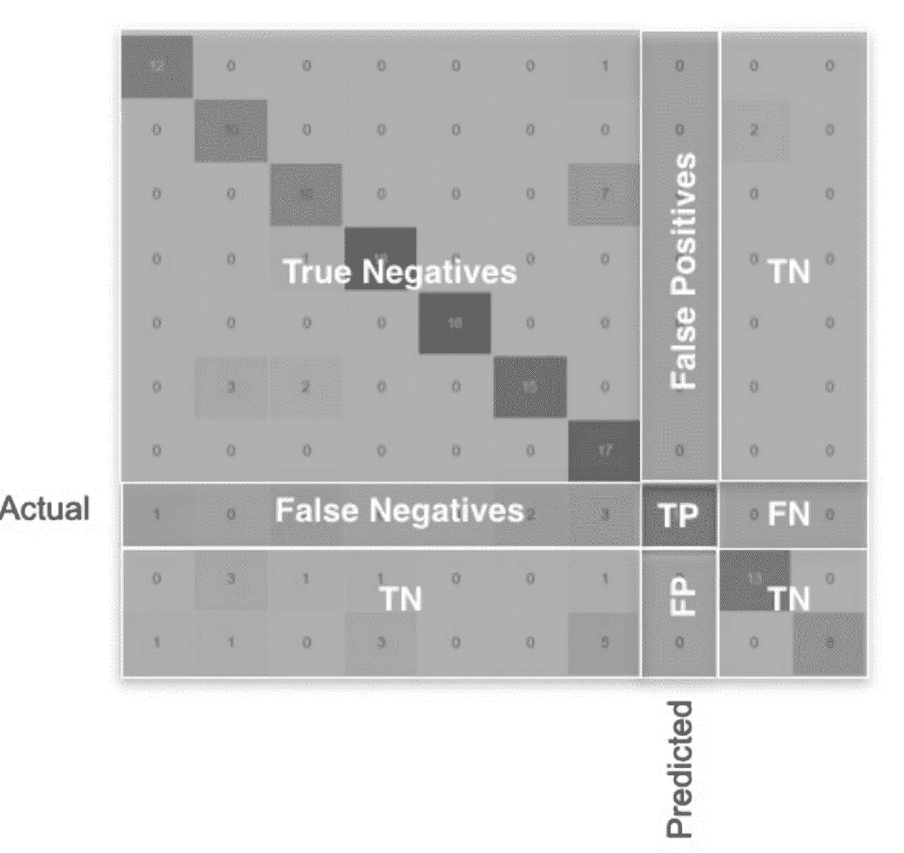

# 多类分类:从混淆矩阵中提取性能度量

> 原文：<https://towardsdatascience.com/multi-class-classification-extracting-performance-metrics-from-the-confusion-matrix-b379b427a872?source=collection_archive---------5----------------------->

## 在这篇文章中，我解释了如何阅读混淆矩阵，以及如何从混淆矩阵中提取多类分类问题的 FP、FN、TP、TN、TPR、TNR、FPR、FNR &准确度值。



使用 scikit-learn 的[文档](https://scikit-learn.org/stable/auto_examples/model_selection/plot_confusion_matrix.html)中的代码生成的图。

# 介绍

在我之前的一篇帖子中，*[*ROC 曲线用一个新冠肺炎假设的例子解释:二进制&多类分类教程*](/roc-curve-explained-using-a-covid-19-hypothetical-example-binary-multi-class-classification-bab188ea869c?source=friends_link&sk=08f3dba9c6415860f84f5195d9b0ff65) *，*我很清楚地解释了什么是 **ROC** **曲线**以及它是如何与著名的**混淆** **矩阵**联系在一起的。如果你不熟悉术语**混淆矩阵**和**真阳性**、**真阴性**等。，参考上述文章，在 6 分钟内学会所有内容**或**继续阅读，快速回顾两分钟。*

# ***2 分钟回顾:TP、TN、FP、FN 是什么意思***

*让我们想象一下，我们有一个**测试**，它能够在几秒钟内告诉我们一个人是被**病毒**感染**还是**而不是**。因此测试**的**输出可以是**正**(受影响)或**负**(不受影响)。所以，在这个假设的例子中，我们**有一个二元分类的例子。*****

**

*作者做的手工素描。假设我们真的知道真相，两个人群的例子，一个受新冠肺炎影响，另一个不受影响。此外，基于测试的输出，我们可以将一个人表示为受影响的(蓝色人群)或不受影响的(红色人群)。*

*   ***真阳性** ( **TP** ，**蓝色**分布)是真正拥有病毒的人**。***
*   ***真阴性(TN，红色**分布 **)** 是真正没有病毒的人**。***
*   ***假阳性(FP)** 是根据检测得知**确实没有生病**而是**的人，他们被**假** ( **假**)表示为**生病** ( **阳性**)。***
*   ***假阴性(FN)** 是指**确实患病**但**根据检测**判断，他们被**假** ( **假**)表示为**非** **患病** ( **阴性**)。*

> *为了存储所有这些性能指标，通常使用混淆矩阵。*

# *混乱矩阵:获得 TPR，TNR，FPR，FNR。*

> *分类器的混淆矩阵总结了我们的模型的性能的 TP、TN、FP、FN 度量。混淆矩阵可以进一步用于提取更多的性能指标，例如:TPR、TNR、FPR、FNR 和准确性。*

*使用上述所有术语，我们还可以构建由这些度量组成的著名的**混淆矩阵**，然后我们可以计算**真阳性率**和**假阳性率**，如下图所示，针对**二进制分类情况。***

**

*图来自[维基百科](https://en.wikipedia.org/wiki/Confusion_matrix)。*

*如果你想在交互式路线图和活跃的学习社区的支持下自学数据科学，看看这个资源:[https://aigents.co/learn](https://aigents.co/learn)*

# ***处理多类分类问题***

*对于任何 N 类分类问题，混淆矩阵都可以很好地定义。然而，**如果我们有 2 个以上的类(N > 2)，那么上述等式(在混淆矩阵图中)不再成立。***

> *在这篇文章中，我展示了如何对任意数量的类(N)估计所有这些度量。*

# *多类 Python 工作示例*

## *-分类模型*

*在之前的[帖子](/support-vector-machines-svm-clearly-explained-a-python-tutorial-for-classification-problems-29c539f3ad8?source=friends_link&sk=80f72ab272550d76a0cc3730d7c8af35)中，我解释了什么是 **SVC** 模型，所以这里我们将使用它作为我们的分类器。*

## *-数据集*

*在虹膜数据集中，我们有花的 **3 个类别**和 **4 个特征**。所以分类问题不再是二元的了，因为我们有了 3 个类。*

*让我们**加载** **数据**并检查每个 **类**有多少**类**和**样本** **:***

```
*import numpy as np
import matplotlib.pyplot as plt
from sklearn import svm, datasets
from sklearn.model_selection import train_test_split
from sklearn.metrics import plot_confusion_matrix
from sklearn.metrics import confusion_matrix# import some data to play with
iris = [datasets.load_iris](https://scikit-learn.org/stable/modules/generated/sklearn.datasets.load_iris.html#sklearn.datasets.load_iris)()
X = iris.data
y = iris.target
class_names = iris.target_nameslabels, counts = np.unique(y, return_counts=True)
plt.bar(labels, counts, align='center')
plt.gca().set_xticks(labels)
plt.show()*
```

**

***我们可以看到，我们有 3 个类/组(标签:0，1，2)，每个类/组中有 50 个(即条形的高度)样本(示例/观察)。***

*接下来，我们将在模型拟合之前将数据分成训练集和测试集:*

```
*# Split the data into a training set and a test set
X_train, X_test, y_train, y_test = [train_test_split](https://scikit-learn.org/stable/modules/generated/sklearn.model_selection.train_test_split.html#sklearn.model_selection.train_test_split)(X, y, random_state=0)*
```

*接下来，让我们使用**训练**集合创建分类模型(线性 SVC)和**拟合**模型**:***

```
*# Fit the classifier
classifier = [svm.SVC](https://scikit-learn.org/stable/modules/generated/sklearn.svm.SVC.html#sklearn.svm.SVC)(kernel='linear').fit(X_train, y_train)*
```

*现在，我们将**预测****测试集样本**的**标签**，并且我们将建立我们的**三级分类问题**的**混淆矩阵**:*

```
*# Predict the labels of the test set samples
predicted_labels = classifier.predict(X_test)# Build the confusion matrix of our 3-class classification problemcnf_matrix = confusion_matrix(y_test, predicted_labels)print(cnf_matrix)
#array([[13,  0,  0],
#       [ 0, 15,  1],
#       [ 0,  0,  9]])*
```

*为了更好地阅读/理解混淆矩阵，让我们用**来描绘**和**吧**:*

```
*disp = [plot_confusion_matrix](https://scikit-learn.org/stable/modules/generated/sklearn.metrics.plot_confusion_matrix.html#sklearn.metrics.plot_confusion_matrix)(classifier, X_test, y_test,
                                 display_labels=class_names,
                                 cmap=plt.cm.Blues)
plt.show()*
```

**

*使用我们的线性 SVC 模型的 3 类分类混淆矩阵。*

# *怎么读*

*   *在 **x 轴**上，我们有**预测** **标签**，在 **y 轴**上，我们有**真实** **标签**来自**测试集的样本**(记住**预测**仅使用**测试集****)。***
*   ***理想情况下，**完美的** **分类器**会导致**混淆** **矩阵**，其中我们只有对角线上的**值，也就是说，在这种情况下，我们对所有 3 个类别/组的所有测试样本进行了正确分类。*****
*   ***方框中的数值只是计数。例如，在我们的例子中，左上角的盒子里面有一个值 13，接下来的两个盒子有 0 和 0。这意味着我们能够对所有 13 个 setosa 测试样本进行正确分类。***

******

*   ***另一方面，通过查看**第二个** **行**即**所指的**到**杂色** **组**，我们可以看到我们正确地将**分类为** **15 个杂色测试样本**(在测试集中总共有 16 个)和**遗漏了** 1 个**杂色测试样本**即错误地***

**********

*****最后，这里是**魔法**。*****

*****我们将估计 FP、FN、TP、TN、TPR(灵敏度、命中率、召回率或真阳性率)、TNR(特异性或真阴性率)、PPV(精确度或阳性预测值)、NPV(阴性预测值)、FPR(脱落或假阳性率)、FNR(假阴性率)、FDR(假发现率)和 ACC(准确度)。*****

**********

*****多类混淆矩阵。*****

```
*****FP = cnf_matrix.sum(axis=0) - np.diag(cnf_matrix) 
FN = cnf_matrix.sum(axis=1) - np.diag(cnf_matrix)
TP = np.diag(cnf_matrix)
TN = cnf_matrix.sum() - (FP + FN + TP)FP = FP.astype(float)
FN = FN.astype(float)
TP = TP.astype(float)
TN = TN.astype(float)# Sensitivity, hit rate, recall, or true positive rate
TPR = TP/(TP+FN)
# Specificity or true negative rate
TNR = TN/(TN+FP) 
# Precision or positive predictive value
PPV = TP/(TP+FP)
# Negative predictive value
NPV = TN/(TN+FN)
# Fall out or false positive rate
FPR = FP/(FP+TN)
# False negative rate
FNR = FN/(TP+FN)
# False discovery rate
FDR = FP/(TP+FP)
# Overall accuracy for each class
ACC = (TP+TN)/(TP+FP+FN+TN)*****
```

*****那都是乡亲们！希望你喜欢这篇文章！*****

# *****参考*****

*****[1][https://en.wikipedia.org/wiki/Confusion_matrix](https://en.wikipedia.org/wiki/Confusion_matrix)*****

*****[2][https://sci kit-learn . org/stable/modules/generated/sk learn . metrics . confusion _ matrix . html](https://scikit-learn.org/stable/modules/generated/sklearn.metrics.confusion_matrix.html)*****

# *****敬请关注并支持这一努力*****

*****如果你喜欢这篇文章并觉得它有用，请关注我，这样你就可以看到我所有的新帖子。*****

*****有问题吗？把它们作为评论贴出来，我会尽快回复。*****

# *****最新帖子*****

*****[](/time-series-forecasting-predicting-stock-prices-using-facebooks-prophet-model-9ee1657132b5) [## 时间序列预测:用脸书的先知模型预测股票价格

### 使用可从《先知脸书》公开获得的预测模型预测股票价格

towardsdatascience.com](/time-series-forecasting-predicting-stock-prices-using-facebooks-prophet-model-9ee1657132b5) [](/roc-curve-explained-using-a-covid-19-hypothetical-example-binary-multi-class-classification-bab188ea869c) [## 用新冠肺炎假设的例子解释 ROC 曲线:二分类和多分类…

### 在这篇文章中，我清楚地解释了什么是 ROC 曲线以及如何阅读它。我用一个新冠肺炎的例子来说明我的观点，我…

towardsdatascience.com](/roc-curve-explained-using-a-covid-19-hypothetical-example-binary-multi-class-classification-bab188ea869c) [](/support-vector-machines-svm-clearly-explained-a-python-tutorial-for-classification-problems-29c539f3ad8) [## 支持向量机(SVM)解释清楚:分类问题的 python 教程…

### 在这篇文章中，我解释了支持向量机的核心，为什么以及如何使用它们。此外，我还展示了如何绘制支持…

towardsdatascience.com](/support-vector-machines-svm-clearly-explained-a-python-tutorial-for-classification-problems-29c539f3ad8) [](/pca-clearly-explained-how-when-why-to-use-it-and-feature-importance-a-guide-in-python-7c274582c37e) [## PCA 清楚地解释了——如何、何时、为什么使用它以及特性的重要性:Python 指南

### 在这篇文章中，我解释了什么是 PCA，何时以及为什么使用它，以及如何使用 scikit-learn 在 Python 中实现它。还有…

towardsdatascience.com](/pca-clearly-explained-how-when-why-to-use-it-and-feature-importance-a-guide-in-python-7c274582c37e) [](/everything-you-need-to-know-about-min-max-normalization-in-python-b79592732b79) [## 关于 Python 中的最小-最大规范化，您需要知道的一切

### 在这篇文章中，我将解释什么是最小-最大缩放，什么时候使用它，以及如何使用 scikit 在 Python 中实现它

towardsdatascience.com](/everything-you-need-to-know-about-min-max-normalization-in-python-b79592732b79) [](/how-and-why-to-standardize-your-data-996926c2c832) [## Scikit-Learn 的标准定标器如何工作

### 在这篇文章中，我将解释为什么以及如何使用 scikit-learn 应用标准化

towardsdatascience.com](/how-and-why-to-standardize-your-data-996926c2c832) 

# 和我联系

*   **LinkedIn**:【https://www.linkedin.com/in/serafeim-loukas/ 
*   https://www.researchgate.net/profile/Serafeim_Loukas**研究之门**:[](https://www.researchgate.net/profile/Serafeim_Loukas)
*   **https://people.epfl.ch/serafeim.loukas**EPFL**简介**:
*   **堆栈** **溢出**:[https://stackoverflow.com/users/5025009/seralouk](https://stackoverflow.com/users/5025009/seralouk)*****