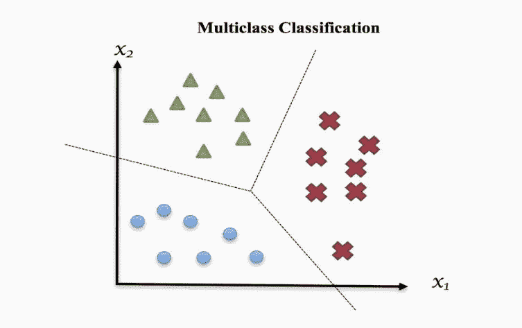
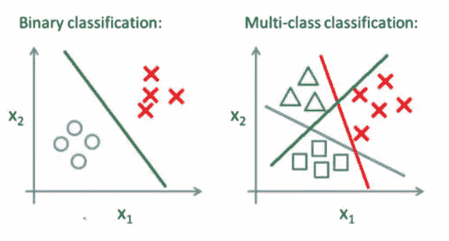
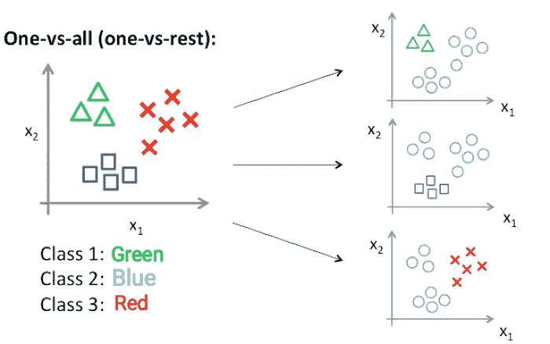
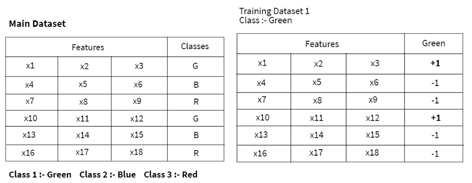
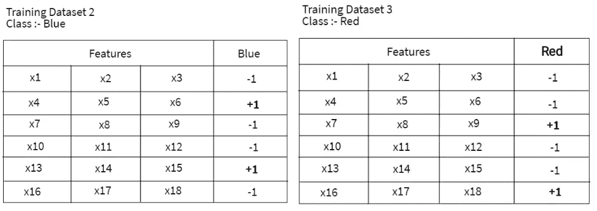
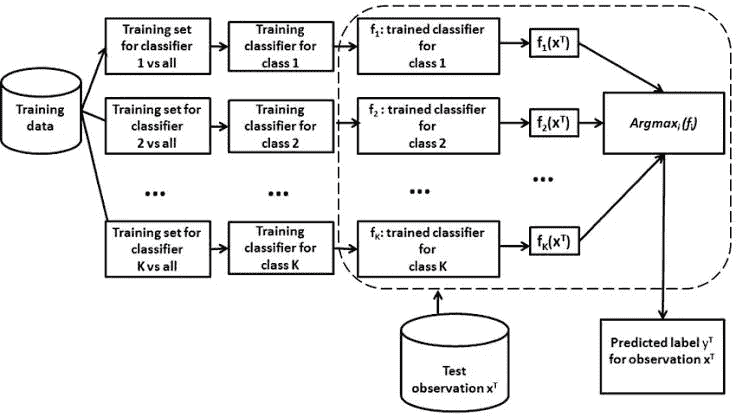
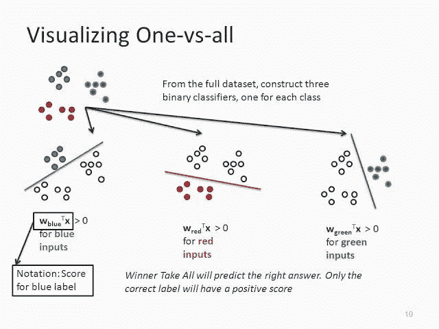
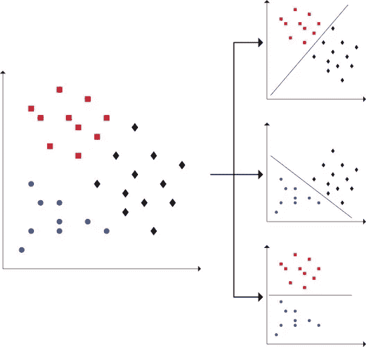

# 多类分类—一对一和一对一

> 原文：<https://towardsdatascience.com/multi-class-classification-one-vs-all-one-vs-one-94daed32a87b?source=collection_archive---------0----------------------->


图 1:通过[krishijagran.com](https://krishijagran.com/news/fruit-quality-classification-with-technological-interventions/)拍摄的照片

# 介绍

## 机器学习主要有三种类型:

*   监督
*   无人监督的
*   加强

监督机器学习分为**回归**和**分类**。我们使用回归技术来预测连续变量的目标值，就像预测雇员的工资一样。相反，我们使用分类技术来预测给定输入数据的类别标签。

在分类中，我们设计分类器模型，然后使用输入训练数据对其进行训练，然后将测试数据分类到数据集中存在的多个类别标签中。

# 目录

1.  什么是多类分类？
2.  二元分类与多类分类
3.  **一个对所有**
4.  **一对一**
5.  结论

让我们深入理解这个概念，

# 1.什么是多类分类？



图 2:通过[learn-ml.com](https://learn-ml.com/index.php/2019/06/07/multi-class-classification-step-by-step-guide-for-beginners/)拍摄的照片

当我们解决一个只有两个类别标签的分类问题时，过滤数据、应用任何分类算法、用过滤后的数据训练模型以及预测结果都变得很容易。但是，当我们在输入训练数据中有两个以上的类实例时，分析数据、训练模型和预测相对准确的结果可能会变得复杂。为了处理这些多类实例，我们使用多类分类。

多类分类是一种分类技术，它允许我们将测试数据分类到训练数据中的多个类标签中，作为模型预测。

主要有两种类型的多类分类技术

*   **一个对全部(一个对其余部分)**
*   **一对一**

# 2.二元分类与多类分类



图 3:照片经由[utkuufuk.com](https://utkuufuk.com/2018/06/03/one-vs-all-classification/)

## 二元分类

*   数据集中只有两个类实例。
*   它只需要一个分类器模型。
*   混淆矩阵易于推导和理解。
*   例如:-检查电子邮件是否是垃圾邮件，根据身高和体重预测性别。

## 多类分类

*   数据集中存在多个类标签。
*   分类器模型的数量取决于我们应用的分类技术。
*   一个对所有:- **N 类实例**然后 **N 个二元分类器模型**
*   一对一:- **N 类实例**然后 **N* (N-1)/2 二元分类器模型**
*   混淆矩阵很容易推导，但理解起来很复杂。
*   示例:-检查水果是苹果、香蕉还是橘子。

# 3.一对所有(一对其余)

在一对一分类中，对于 N 类实例数据集，我们必须生成 N-二元分类器模型。数据集中存在的类标签的数量和生成的二元分类器的数量必须相同。



图 4:cc.gatech.edu 通过[的照片](https://www.cc.gatech.edu/classes/AY2016/cs4476_fall/results/proj4/html/jnanda3/index.html)

如上图所示，假设我们有三个类，例如，类型 1 代表绿色，类型 2 代表蓝色，类型 3 代表红色。

现在，正如我之前告诉您的，我们必须生成与数据集中存在的类标签相同数量的分类器，因此我们必须在这里为三个相应的类创建三个分类器。

*   **分类器 1:-[绿色]vs[红色、蓝色]**
*   **分类器 2:-【蓝色】vs【绿色，红色】**
*   **分类器 3:-[红色]vs[蓝色，绿色]**

现在，为了训练这三个分类器，我们需要创建三个训练数据集。让我们考虑一下我们的主要数据集如下:


图 5: **主数据集**

您可以看到数据集中有三个类别标签**绿色**、**蓝色、**和**红色**。现在我们必须为每个类创建一个训练数据集。

在这里，我们通过在该特征值的类列中放置+1 来创建训练数据集，该特征值仅与特定的类对齐。对于其余特性的开销，我们在 class 列中放-1。



图 6:**绿色**类训练数据集



图 7:**蓝色**类和**红色**类的训练数据集

让我们通过一个例子来理解它，

*   考虑第一行中的主数据集；我们有 x1，x2，x3 特征值，对应的类值是 G，也就是说这些特征值属于 G 类。所以我们在绿色类型对应的类列中放入+1 值。然后，我们对 x10、x11、x12 输入序列数据应用相同的方法。
*   对于与绿色类别不一致的特征的其余值，我们在它们的类别列中放置-1。

我希望你理解了训练数据集的创建。

现在，在为每个分类器创建训练数据集之后，我们将其提供给我们的分类器模型，并通过应用算法来训练该模型。



图 8:通过[researchgate.net](https://www.researchgate.net/figure/The-considered-one-vs-all-multiclass-classification-approach_fig2_257018675)的照片

在训练模型之后，当我们将输入测试数据传递给模型时，该数据被认为是所有生成的分类器的输入。如果我们输入的测试数据有任何可能属于某个特定的类别，那么为该类别创建的分类器以 **+1** 的形式给出肯定的反应，所有其他分类器模型以 **-1** 的方式提供不良反应。类似地，二元分类器模型预测与相关类别对应的概率。

通过分析概率得分，我们预测结果为具有最大概率得分的类别索引。



图 9:SlidePlayer.com 通过[的照片](https://slideplayer.com/slide/10458039/)

*   让我们通过一个例子来理解，分别取三个测试特征值 y1、y2 和 y3。
*   我们将测试数据传递给分类器模型。我们以正面评级的形式获得了结果，该正面评级来自概率得分为( **0.9)** 的**绿色**类分类器。
*   我们再次从**蓝色**类获得了正面评级，概率分数为 **(0.4)** ，从剩余的**红色**分类器获得了****负面分类分数。****
*   ****因此，基于正面响应和决定性概率得分，我们可以说我们的测试输入属于**绿色**类。****

****看下面的例子，使用内置的 **one vs. rest (OvR)** 技术拟合多类**逻辑回归**模型。****

```
**#Import LogisticRegression() model from scikit_learn
 from sklearn.datasets import make_classification
 from sklearn.linear_model import LogisticRegression#define dataset
 X_train, y_train = make_classification(n_samples=500, n_features=8, n_informative=5, n_redundant=5, n_classes=4, random_state=1)#define classification model
 Multiclass_model = LogisticRegression(multi_class='ovr')#fit model
 Multiclass_model.fit(X_train, y_train)#make final predictions
 y_pred = model.predict(X_train)**
```

# ****4.一对一(卵)****

********

****图 10:通过[ScienceDirect.com](https://www.sciencedirect.com/science/article/abs/pii/S0950705116301459)拍摄的照片****

****在一对一分类中，对于 **N 类**实例数据集，我们需要生成 **N* (N-1)/2** 二元分类器模型。使用这种分类方法，我们将主数据集拆分为每个类的一个数据集，与每个其他类相对。****

****以上面的例子为例，我们的分类问题有三种类型:**绿色**、**蓝色**和**红色(N=3)。******

****我们把这个问题分成 **N* (N-1)/2 = 3** 二元分类器问题:****

*   ****分类器 1:绿色对蓝色****
*   ****分类器 2:绿色对红色****
*   ****分类器 3:蓝色对红色****

****每个二元分类器预测一个类别标签。当我们将测试数据输入到分类器中时，具有多数计数的模型作为结果被推断出来。****

# ****5.结论****

*   ****正如您所了解的 **One vs. All** 多类分类的工作原理，处理具有大量类实例的大型数据集是一项挑战。****
*   ****因为我们生成了那么多分类器模型并对这些模型进行训练，所以我们从主数据集创建了那么多输入训练数据集。****
*   ****在**一对一**多类分类中，我们为每对类将主数据集分割成一个二元分类数据集。****

****那都是民间的！！****

****在我的下一篇文章中再见！！****

> ****你好👋我希望你能从我的文章中获得知识。如果你愿意支持我，请随意给我买些咖啡🙏☕****
> 
> ****[**https://www.buymeacoffee.com/amey23**](https://www.buymeacoffee.com/amey23)****
> 
> ******或通过 ameypband23@gmail.com 联系我******
> 
> ******乐意为您效劳。******