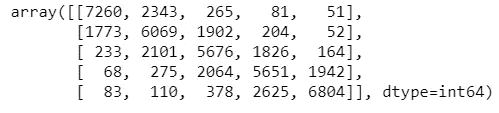

# 基于 BERT 的多类别情感分析

> 原文：<https://towardsdatascience.com/multi-class-sentiment-analysis-using-bert-86657a2af156?source=collection_archive---------5----------------------->

## 基于 BERT 的 Yelp 评论多类别文本情感分析的简单快速实现


[腾雅特](https://unsplash.com/@tengyart?utm_source=unsplash&utm_medium=referral&utm_content=creditCopyText)在 [Unsplash](https://unsplash.com/s/photos/emotions?utm_source=unsplash&utm_medium=referral&utm_content=creditCopyText) 上拍摄的照片

*在本文中，我们将使用 BERT 对 Yelp 评论进行多类文本分类。*

## 先决条件:

[变压器(BERT)双向编码器表示的直观解释](/intuitive-explanation-of-bert-bidirectional-transformers-for-nlp-cdc1efc69c1e)

从[这里](https://github.com/google-research/bert.git)克隆或下载 BERT Github 库

点击从[下载 BERT 预训练重量。](https://github.com/google-research/bert#pre-trained-models)

点击从[下载 Yelp 评论数据集](https://course.fast.ai/datasets#nlp)

## BERT 概述

BERT 是一个**深度双向表示模型，用于**通用“语言理解”**从左到右和从右到左学习信息。** BERT 是根据从图书语料库(800 万字)**和英语维基百科**(2500 万字)中提取的未标注数据进行预训练的

伯特有两种型号

1.  **BERT-base:** **12 个编码器，带 12 个双向自关注头**
2.  **BERT-large:** **24 个编码器，带 24 个双向自聚焦头**

BERT-base 和 BERT-large 都有有壳和无壳版本。

*   **BERT 不区分大小写**，其中文本在单词块标记化之前已经小写。例如，“詹姆斯·邦德”变成了“詹姆斯·邦德”。它还会删除重音标记。
*   **带大小写的**保留真实大小写和重音标记。

大多数情况下，我们将使用 BERT-Uncased，除非用例要求保留对于 NLP 任务至关重要的案例信息。

## BERT 的基本设置

我们需要 Tensorflow 版本 1.11 或更高版本来运行 BERT 代码。

下载预训练权重和数据集后，我们需要对多类分类进行一些更改。

我们克隆或下载的代码会有一个文件***run _ classifier . py***。我们需要更新 ***类 ColaProcessor*** 中的方法 ***get_labels*** ()，如下所示，用于多类文本分类

**二元分类的原始代码**

```
**def get_labels(self):
 return [“0”, “1”]**
```

**修改了多类文本分类的代码**

```
**def get_labels(self):
 return [“0”, “1”, “2”, “3”, “4”]**
```

## 为 BERT 构建数据集

**导入数据处理所需的库**

```
***import numpy as np
import pandas as pd
from sklearn.preprocessing import LabelEncoder
from sklearn.model_selection import train_test_split***
```

**读取从文件中提取的 Yelp 审查训练和测试数据**

```
***data_train= pd.read_csv(“yelp_review_full_csv\\train.csv”, header=None)******data_test= pd.read_csv("yelp_review_full_csv\\test.csv", header=None)******data_train.head(5)***
```


**查找类别标签的唯一值**

```
**data_train[0].unique()**
```


值为 1 表示差评，值为 5 表示优评。

您可能希望类标签从 0 开始，所以我们从当前标签值中减去 1。现在，值为 0 表示差评，值为 4 表示差评

```
**data_train[0] = (data_train[0] -1)
data_test[0] = (data_test[0] -1)
data_train[0].unique()**
```


**更新多类文本分类的 BERT 码**

在文件 ***run_classifier.py、*** 中修改方法***get _ labels***()***类 ColaProcessor*** 并更新标签以匹配我们在训练数据中的内容

```
**def get_labels(self):
 return [“0”, “1”, “2”, “3”, “4”]**
```

在 BERT 中处理不同 NLP 任务的类要求数据采用. tsv(制表符分隔值)文件格式的特定格式。

*   **列 0: GUID:** 该行的 ID。训练和测试数据都需要
*   **第 1 列:第**行的分类标签。该列的值应该与方法***get _ labels***(***cola processor**文件***run _ classifier . py***中指定的值相匹配。仅训练数据需要。***
*   ***列 2: alpha:** 这是用于文本分类的虚拟列，但是对于 BERT 的训练数据是需要的*
*   ***第 3 列:文本:这是要分类的文本**。训练和测试数据都需要此列*

***为培训、开发和测试构建 BERT 数据集***

*BERT 需要三个不同的数据集:用于训练的 train 和 dev 以及用于预测的 test*

```
*# Creating dataframe according to BERT data requirements by adding the required columns in the right order***df_bert = pd.DataFrame({
 ‘id’:range(len(data_train)),
 ‘label’:data_train[0],
 ‘alpha’:[‘a’]*data_train.shape[0],
 ‘text’: data_train[1].replace(r’\n’, ‘ ‘, regex=True)
})******df_bert.head()****
```

**

*符合 BERT 要求格式的数据*

*将数据分为训练和开发或评估数据集*

```
*# Splitting training data file into *train* and *test*
***df_bert_train, df_bert_dev = train_test_split(df_bert, test_size=0.01)****
```

***构建测试数据集***

*我们在测试数据集中只需要两列*

*   ***列 0: GUID:** 行的 ID。*
*   ***第 1 列:文本:**这是要分类的文本。*

```
*# Creating test dataframe according to BERT
**df_bert_test = pd.DataFrame({
 ‘id’:range(len(data_test)),
 ‘text’: data_test[1].replace(r’\n’, ‘ ‘, regex=True)
})****df_bert_test.tail()***
```

**

*根据 BERT 测试数据集*

*将数据帧保存到不带标题的. tsv 文件，用于培训和开发，但文件 test.tsv 文件需要标题*

```
*# Saving dataframes to .tsv format as required by BERT
**df_bert_train.to_csv(‘yelp_review_full_csv\\train.tsv’, sep=’\t’, index=False, header=False)****df_bert_dev.to_csv(‘yelp_review_full_csv\\dev.tsv’, sep=’\t’, index=False, header=False)****df_bert_test.to_csv(‘yelp_review_full_csv\\test.tsv’, sep=’\t’, index=False, header=True)***
```

## *训练 BERT 模型*

*我们将加载预训练的基于 BERT 的无案例模型权重，并在 Yelp 评论数据集上训练该模型。让我们了解一下我们需要为培训设置的参数。*

*我们需要训练多类文本分类，因此我们将使用 run_classifier.py 文件。*

1.  ***task_name** :这是我们计划用于培训的任务。选项有*

*   ***CoLA** :语言可接受性的**语料库是一个二元单句分类任务，是 ColaProcessor 类。目标是预测一个英语句子在语言学上是否“可接受”***
*   ***MNLI** : **多体裁自然语言推理**是一项大规模、众包的蕴涵分类任务。给定一对句子，目标是预测第二个句子相对于第一个句子是蕴涵、矛盾还是中性的*
*   ***MRPC:微软研究院释义语料库**由从在线新闻来源自动提取的句子对组成。目标是检查句子对中的句子是否语义等价*
*   ***XNLI:跨语言自然语言推理**使用了 15 种语言的跨语言句子分类。*

*2. **do_train** :设置为 True 进行训练。这将使用 train.tsv 文件进行训练*

*3. **do_eval** :设置为 True 进行评估。这将使用 dev.tsv 文件进行评估*

*4. **data_dir** :包含数据的目录。tsv 文件*

*5. **vocab_file** :指定 vocab.txt 文件。Vocab.txt 使用 BERT 提供的 Vocab 文件将单词映射到索引。词汇表有 119，547 个单词块标记*

*6. **bert_config_file** :包含 bert 模型的参数值。伯特预训练模型有这个文件*

*7. **init_checkpoint** :初始检查点，通常从预先训练好的检查点开始。如果您是从中断的地方恢复训练过程，或者训练被中断，则提到最后一个检查点文件名。*

*8. **max_seq_length** :已发布的模型使用最长 512 的序列长度进行训练，但是您可以使用更短的最大序列长度进行微调，以节省大量内存。更长的序列非常昂贵，因为注意力与序列长度成二次关系。短于指定长度的序列被填充*

*9. **train_batch_size** :训练的总批量。内存使用量也与批处理大小成正比。默认值为 32。仅为培训指定此参数。*

*10.**learning _ rate**:Adam 的初始学习速率。默认学习率为 0.00005。仅为培训指定此参数。*

*11. **num_train_epochs** :要执行的训练总次数。仅为培训指定此参数。*

*12. **output_dir** :输出目录，其中将写入模型检查点以及评估数据集的细节。您需要在为训练或推理指定该目录之前创建它。*

*13. **do_lower_case** :是否对输入文本进行小写处理。对于无套管模型应为真，对于有套管模型应为假。指定仅用于培训。*

*14. **save_checkpoints_steps** :指定保存模型检查点的频率。指定仅用于培训。*

*对于培训，请在命令提示符下使用以下命令*

```
***python run_classifier.py** 
    --**task_name=cola** 
    --**do_train=true** 
    --**do_eval=true** 
    --**data_dir=\yelp_review_full_csv\** 
    --**vocab_file=\BERT\uncased_L-12_H-768_A-12\uncased_L-12_H-768_A-12\vocab.txt** 
    --**bert_config_file=\BERT\uncased_L-12_H-768_A-12\uncased_L-12_H-768_A-12\bert_config.json**
    --**init_checkpoint=\BERT\uncased_L-12_H-768_A-12\uncased_L-12_H-768_A-12\bert_model.ckpt** 
    --**max_seq_length=64** 
    --**train_batch_size=2** 
    --**learning_rate=2e-5** 
    --**num_train_epochs=3.0** 
    --**output_dir=\BERT\bert_output\** 
    --**do_lower_case=True**
    --**save_checkpoints_steps 10000***
```

*训练完成后，您可以看到包含开发数据集摘要的检查点文件和 eval_results.txt 文件*

```
***eval_accuracy = 0.71553844
eval_loss = 1.035305
global_step = 1287000
loss = 1.0362284***
```

## *预测情绪*

*为了预测情绪，我们设置以下参数并将 **— *do_predict*** 参数设置为 True。*

1.  ***任务名称**:应该与用于训练数据集的任务名称相匹配*
2.  ***data_dir** :指定包含 test.tsv 文件中数据的目录*
3.  ***vocab_file** :指定 vocab.txt 文件。Vocab.txt 使用 BERT 提供的 Vocab 文件将单词映射到索引。*
4.  ***bert_config_file** :包含 bert 模型的参数值。伯特预训练模型有这个文件*
5.  ***init_checkpoint** :初始检查点。这是输出目录中模型检查点文件的最大数量。*
6.  ***最大序列长度**:指定最大序列长度。*
7.  ***output_dir** :将测试结果写入 test_results.tsv 文件的输出目录*

```
***python run_classifier.py** 
    **--task_name=cola 
    --do_predict=true 
    --data_dir=\yelp_review_full_csv\ 
    --vocab_file=\BERT\uncased_L-12_H-768_A-12\uncased_L-12_H-768_A-12\vocab.txt ** 
    **--bert_config_file=\BERT\uncased_L-12_H-768_A-12\uncased_L-12_H-768_A-12\bert_config.json** 
    **--init_checkpoint=\BERT\bert_output\model.ckpt-1085250 
    --max_seq_length=128 
    --output_dir=\BERT\bert_output\***
```

## *评估测试结果*

*测试结果在文件 test_results.tsv 的输出目录中，您可以将它与测试标签进行比较，并评估我们的多类文本分类的性能*

***阅读并解释结果***

*每个文本的结果在 test_results.tsv 文件中都有一行，其中包含五个标记类中每一个的概率。*

**

*我们需要找到概率最高的类，这将是 Yelp 评论的观点*

```
***import  csv
label_results=[]
pd.DataFrame()
with open('\BERT\bert_outout\test_results.tsv') as file:
    rd = csv.reader(file, delimiter="\t")
    for row in rd:
      data_1=[float(i) for i in row]
      label_results.append(data_1.index(max(data_1)))
df_results=pd.DataFrame()
df_results=pd.DataFrame(label_results)
df_results[0]***
```

*现在我们为从 0 到 4 的情感范围生成混淆矩阵*

```
***from sklearn.metrics import confusion_matrix
confusion_matrix(data_test[0], df_results[0])***
```

**

*混淆矩阵*

*我已经在一个时期训练了 BERT 模型，你可以看到对于多类文本分类来说结果看起来不错*

```
*from sklearn import metrics
print("Accuracy",metrics.accuracy_score(data_test[0], df_results[0]))
print("F1-Score",metrics.f1_score(data_test[0], df_results[0],average='weighted'))*
```

**

## *参考资料:*

*[BERT:用于语言理解的深度双向转换器的预训练](https://arxiv.org/pdf/1810.04805.pdf)*

*[](https://github.com/google-research/bert) [## 谷歌研究/bert

### 这是一个 24 个较小的 BERT 模型的版本(只有英语，未封装，用单词屏蔽训练),参考…

github.com](https://github.com/google-research/bert) 

[https://MC . ai/a-guide-to-simple-text-class ification-with-Bert/](https://mc.ai/a-guide-to-simple-text-classification-with-bert/)*